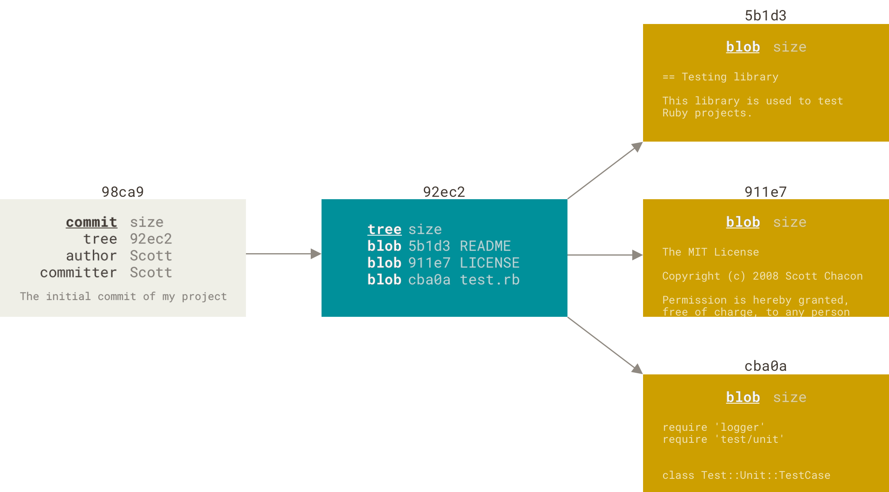
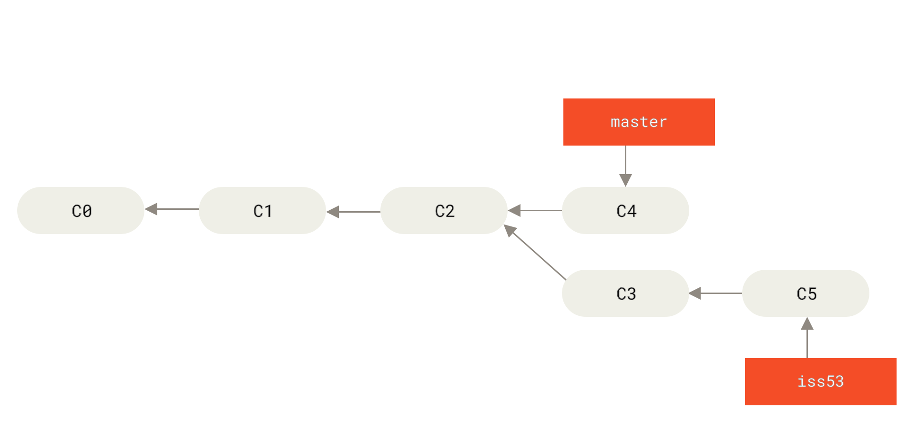
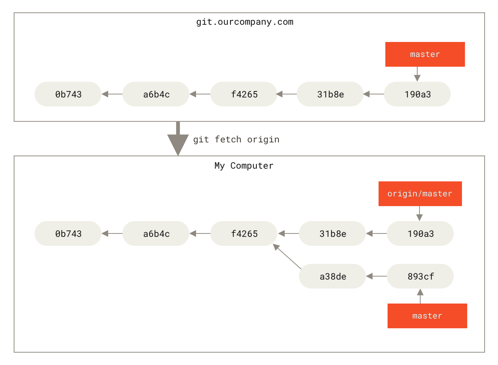


内容摘取自 [Pro Git](https://git-scm.com/book/zh/v2) 这本书。


## Git 运行前的配置
(配置的的 editor 会在直接运行 `git commit` 的时候使用)

## Git 基础
### 当前文件状态
工作目录下的文件可以分为**已跟踪** (tracked) 和**未跟踪** (untracked) 两种状态，已跟踪的文件是指那些被纳入了版本控制的文件，在上一次快照中有它们的记录，在工作一段时间后，它们的状态可能是未修改，已修改或已放入暂存区。简而言之，已跟踪的文件就是 Git 已经知道的文件。

下面这张图展示了并未被 commit 到仓库的文件的不同状态。
<div align=center>

</div>

通过 `git status` 可以查询当前工作目录下的文件状态。

### 移除文件与停止 track
假如需要在从工作目录中移除某个文件，可以使用 `rm <file_name>` + `git add <file_name>` 的操作，不过也可以直接使用 `git rm <file_name>`。相比前者，`git rm <file_name>` 会在删除前检查该文件是否处于 Modified 或者 Staged 的状态，用于防止误删尚未保存的数据。如果依然希望强制删除，则需要使用参数 `-f`。

但是如果希望文件继续留在磁盘，但仅仅是不希望 Git 继续 track，那么可以加上 `--cached` 参数，即：`git rm --cached <file_name>`；然后再将文件名写入 `.gitignore`。


使用了 `git rm --cached` 之后，之前被 Git 快照记录的内容依然存在，仅仅是之后不会再 track。


### 撤销操作
有时候 `commit` 完了才发现漏掉了几个文件没有添加，或者 `commit` 信息写错了。此时，可以运行带有 `--amend` 选项的提交命令来重新提交：`git commit --amend`，并且可以修改`commit` 的信息。

例如，提交后发现忘记了暂存某些需要的修改，可以像下面这样操作：
```bash
git commit -m 'initial commit'
git add forgotten_file
git commit --amend
```

如果往 `commit` 增加文件的同时不需要修改信息，可以使用 `git commit --amend --no-edit`。

### 远程仓库的使用
#### 查看远程仓库
如果想查看你已经配置的远程仓库服务器，可以运行 `git remote` 命令。如果你已经克隆了自己的仓库，那么至少应该能看到 `origin` —— 这是 Git 给你克隆的仓库服务器的默认名字。

也可以指定选项 `-v`，会显示需要读写远程仓库使用的 Git 保存的简写与其对应的 URL。例如 `git remote -v` 结果如下：
```
origin https://github.com/schacon/ticgit (fetch)
origin https://github.com/schacon/ticgit (push)
```

#### 添加远程仓库
运行 `git remote add <shortname> <url>` 添加一个新的远程 Git 仓库，同时指定一个方便使用的简写：
```
$ git remote
origin
$ git remote add pb https://github.com/paulboone/ticgit
$ git remote -v
origin https://github.com/schacon/ticgit (fetch)
origin https://github.com/schacon/ticgit (push)
pb https://github.com/paulboone/ticgit (fetch)
pb https://github.com/paulboone/ticgit (push)
```

现在你可以在命令行中使用字符串 `pb` 来代替整个 URL。 例如，如果你想拉取 Paul 的仓库中有但你没有的信息，可以运行 `git fetch pb`：
```
$ git fetch pb
remote: Counting objects: 43, done.
remote: Compressing objects: 100% (36/36), done.
remote: Total 43 (delta 10), reused 31 (delta 5)
Unpacking objects: 100% (43/43), done.
From https://github.com/paulboone/ticgit
* [new branch] master -> pb/master
* [new branch] ticgit -> pb/ticgit
```

#### 从远程仓库中 pull 与 fetch
在 `clone` 一个仓库后，Git 会自动添加该远程仓库并命名为 `origin`，因此可以使用 `git fetch origin` 将仓库中新增信息下载到本地仓库——不过它不会自动合并或修改你当前的工作，而是需要手动 `merge`。

如果当前分支设置了 track 远程分支，那么可以直接 `git pull` 来自动抓取并合并远程分支到当前分支。默认情况下，`git clone` 命令会自动设置本地 `master` 分支 track 克隆的远程仓库的 `master` 分支（或其它名字的默认分支）。

#### 查看某个远程仓库
可以使用 `git remote show <remote>` 命令，例如：
```
$ git remote show origin
* remote origin
  Fetch URL: https://github.com/schacon/ticgit
  Push URL: https://github.com/schacon/ticgit
  HEAD branch: master
  Remote branches:
    master tracked
    dev-branch tracked
  Local branch configured for 'git pull':
    master merges with remote master
  Local ref configured for 'git push':
    master pushes to master (up to date)
```

上述信息说明当前处于 `master` 分支，并且如果运行 `git pull`，就会抓取所有的远程引用，然后将远程 `master` 分支合并到本地 `master` 分支。

### 打标签
#### 附注标签
例如：
```bash
git tag -a v1.4 -m "my version 1.4"
```

由于没有指定 Commit ID，因此 Git 默认是给 HEAD 所在的 commit 打上标签。
* `-a` 参数表示 Annotated Tag，即这是个附注标签
* `-m` 参数和 commit message 的类似，表示后面的是对这个 tag 的说明信息。

#### 轻量标签
不需要各种参数，直接 `git tag <tag_name>` 就行。

#### 给特定的 commit 打标签
假如提交历史如下：
```
$ git log --pretty=oneline
4682c3261057305bdd616e23b64b0857d832627b added a todo file
166ae0c4d3f420721acbb115cc33848dfcc2121a started write support
9fceb02d0ae598e95dc970b74767f19372d61af8 updated rakefile
964f16d36dfccde844893cac5b347e7b3d44abbc commit the todo
8a5cbc430f1a9c3d00faaeffd07798508422908a updated readme
```

希望给 `updated rakefile` 对应的 commit 加上 `v1.2` 的标签，可以在 `git tag` 的时候指定 commit 的校验和（或部分校验和）：
```
git tag -a v1.2 9fceb02
```

## Git 分支
Git 保存的不是文件的变化或者差异，而是一系列不同时刻的**快照**；而在进行提交操作时，Git 会保存一个 commit 对象 (commit object)。commit 对象会包含一个指向暂存内容快照的指针，除此之外还包含了作者的姓名和邮箱、commit message 以及指向它的父对象的指针。

举个例子：
假设现在有一个工作目录，里面包含了三个将要被暂存和提交的文件。暂存操作会为每一个文件计算校验和（给出哈希值），然后会把当前版本的文件快照保存到 Git 仓库中 （Git 使用 blob 对象来保存它们），最终将校验和加入到暂存区域等待提交：
```bash
git add README test.rb LICENSE
git commit -m 'The initial commit of my project'
```

当使用 `git commit` 进行提交操作时，Git 会先计算每一个子目录（本例中只有项目根目录）的校验和， 然后在 Git 仓库中将这些校验和保存为 tree 对象。随后，Git 创建一个 commit 对象，它包含指向这个 tree 对象（项目根目录）的指针。
<div align=center>

</div>

做些修改后再次提交，那么这次产生的提交对象会包含一个指向上次提交对象（父对象）的指针。
<div align=center>

</div>

Git 的分支，其实本质上仅仅是指向提交对象的可变指针。Git 的默认分支名字是 master，master 分支会在每次提交时自动向前移动。
<div align=center>

</div>

### 分支的创建、切换与合并
#### 创建分支
例如创建一个 testing 分支：
```bash
git branch testing
```

该操作实际上是在当前所在的 commit 对象上创建一个指针。那么，Git 又是怎么知道当前在哪一个分支上呢？这依靠一个名为 HEAD 的特殊指针，它指向当前所在的本地分支。
<div align=center>

</div>

同时从图上可以看出，`git branch` 命令仅仅创建一个新分支，HEAD 并不会自动切换到新分支中去。

#### 切换分支
要切换到一个已存在的分支，需要使用 `git checkout` 命令。运行：
```bash
git checkout testing
```

那么有
<div align=center>

</div>

如果需要在创建分支的时候就进行切换，运行 `git checkout -b <newbranchname>` 即可。

#### 举个例子
来看一个简单的分支新建与分支合并的例子，实际工作中你可能会用到类似的工作流。 你将经历如下步骤：
1. 开发某个网站。
2. 为实现某个新的用户需求，创建一个分支。
3. 在这个分支上开展工作。

工作的情况可能是这样，你需要解决网站的 #53 问题，所以创建了一个分支：
<div align=center>

</div>

然后执行了一些工作，使得分支向前推进：
```bash
vim index.html
git commit -a -m 'added a new footer [issue 53]'
```

<div align=center>

</div>

正在此时，你突然接到一个电话说有个很严重的问题需要紧急修补。你将按照如下方式来处理：
1. 切换到你的线上分支（production branch）。
2. 为这个紧急任务新建一个分支，并在其中修复它。
3. 在测试通过之后，切换回线上分支，然后合并这个修补分支，最后将改动推送到线上分支。
4. 切换回你最初工作的分支上，继续工作。

不过在执行以上操作之前，要留意工作目录和暂存区里那些还没有被提交的修改，它可能会和你即将 checkout 的分支产生冲突从而阻止 Git 切换到该分支。所以最好切换分支之前保持好一个干净的状态；或者通过贮藏 (stashing) 修补提交 (commit amending) 绕过这个问题。现在假设修改都已经被 commit，可以切回 master 分支并进行 bug 修复：
```bash
git checkout master
git checkout -b hotfix
vim index.html
git commit -a -m 'fixed the broken email address'
```

然后状况如下：
<div align=center>

</div>

如果经过测试，发现修改是正确的，那么可以将 `hotfix` 分支合并回 `master` 分支来部署到线上：
```
$ git checkout master
$ git merge hotfix
Updating f42c576..3a0874c
Fast-forward
index.html | 2 ++
1 file changed, 2 insertions(+)
```

由于你想要合并的分支 `hotfix` 所指向的 commit `C4` 是 `HEAD` 所在的 commit `C2` 的直接后继，这种情况下的合并操作没有需要解决的分歧，因此 Git 会直接将指针向前移动。这就叫做“快进 (fast-forward)”。

现在，最新的修改已经在 `master` 分支所指向的提交快照中，你可以着手发布该修复了。
<div align=center>

</div>

关于这个紧急问题的解决方案发布之后，你准备回到被打断之前时的工作中解决 #53 问题的那个分支。不过在此之前，你应该先删除 `hotfix` 分支，因为你已经不再需要它了 —— `master` 分支已经指向了同一个位置。
```bash
git branch -d hotfix # 删除分支
git checkout iss53
vim index.html
git commit -a -m 'finished the new footer [issue 53]'
```

<div align=center>

</div>

#### 分支合并
假设你已经修正了 #53 问题，并且打算将你的工作合并入 `master` 分支。为此，你需要合并 `iss53` 分支到 `master` 分支：
```
$ git checkout master
Switched to branch 'master'
$ git merge iss53
Merge made by the 'recursive' strategy.
index.html | 1 +
1 file changed, 1 insertion(+)
```

这和之前合并 `hotfix` 分支的时候有点不一样。因为开发历史从一个更早的地方分叉开来（diverged），`master` 分支所在提交并不是 `iss53` 分支所在提交的直接祖先，Git 不得不做一些额外的工作：Git 会使用两个分支的末端所指的快照（`C4` 和 `C5`）以及这两个分支的公共祖先（`C2`），做一个简单的三方合并。
<div align=center>

</div>
并且 Git 将此次三方合并的结果做了一个新的快照，再自动创建一个新的 commit 指向它。
<div align=center>

</div>

如果 merge 发生了冲突，那么 Git 会修改冲突的文件，对冲突区域进行标记，形如：
```
 <<<<<<< HEAD:index.html
 <div id="footer">contact : email.support@github.com</div>
 =======
 <div id="footer">
   please contact us at support@github.com
 </div>
 >>>>>>> iss53:index.html
```

用户需要手动处理这些冲突区域，并且通过 `git add` 来将其标记为冲突已解决。

### 远程分支
它们以 `<remote>/<branch>` 的形式命名。例如，如果你想要看你最后一次与远程仓库 `origin` 通信时 `master` 分支的状态，你可以查看 `origin/master` 分支。

来看一个例子。假设你的网络里有一个在 git.ourcompany.com 的 Git 服务器。如果你从这里克隆：
<div align=center>

</div>

接下来你在本地的 `master` 分支做了一些工作，在同一段时间内有其他人推送提交到
git.ourcompany.com 并且更新了它的 `master` 分支，但如果不进行 `git fetch`，本地的 `origin/master` 指针就不会移动。
<div align=center>

</div>

只有运行了 `git fetch origin`，才会 更新本地数据库，移动 `origin/master` 指针到更新之后的位置。
<div align=center>

</div>

#### 推送
如果和别人一起在名为 `serverfix` 的分支上工作，可以运行
```bash
git push origin serverfix
```
Git 自动将 `serverfix` 展开为 `refs/heads/serverfix:refs/heads/serverfix`，从而将本地的 `serverfix` 推送到 `origin` 的 `serverfix` 上。如果希望推送到其他分支上，可以运行 `git push origin serverfix:awesomebranch` 来将本地的 `serverfix` 分支推送到远程仓库上的 `awesomebranch` 分支。

#### 跟踪分支
跟踪分支是与远程分支有直接关系的本地分支。 如果在一个跟踪分支上输入 `git pull`，Git 能自动地识别去哪个服务器上抓取、合并到哪个分支。

设置已有的本地分支跟踪一个刚刚拉取下来的远程分支，或者想要修改正在跟踪的上游分支，可以使用 `-u` 或 `--set-upstream-to` 选项显式地设置：
```bash
git branch -u origin/serverfix
```

就是将当前 `HEAD` 所在分支 track 到 `origin/serverfix` 分支上。或者如果希望将其他本地分支 track 到 `origin/serverfix` 上，可以运行更完整的
```bash
git branch --set-upstream-to=origin/serverfix <branch_name>
```

## Git 工具
### 子模块
#### 开始使用子模块
可以通过在 `git submodule add` 命令后面加上想要跟踪的项目的相对或绝对 URL 来添加新的子模块。 在本例中，我们将会添加一个名为 “DbConnector” 的库：
```bash
git submodule add https://github.com/chaconinc/DbConnector
```

默认情况下，子模块会将子项目放到一个与仓库同名的目录中，本例中是“DbConnector”。 如果你想要放到其他地方，那么可以在命令结尾添加一个不同的路径。

此时运行 `git status`，可以看到：
```
On branch master
Your branch is up-to-date with 'origin/master'.
Changes to be committed:
  (use "git reset HEAD <file>..." to unstage)
new file: .gitmodules
new file: DbConnector
```

首先是 `.gitmodules` 文件，该配置文件保存了项目 URL 与本地目录之间的映射：
```
[submodule "DbConnector"]
  path = DbConnector
  url = https://github.com/chaconinc/DbConnector
```

然后虽然 `DbConnector` 是工作目录中的一个子目录，但 Git 还是会将它视作一个子模块。当你不在那个目录中时，Git 并不会跟踪它的内容，而是将它看作子模块仓库中的某个具体的 commit。

#### 克隆含有子模块的项目
在克隆这样的项目时，默认会包含该子模块目录，但其中还没有任何文件。因此需要运行两个命令：`git submodule init` 用来初始化本地配置文件 `.git/config`；而 `git submodule update` 会先去子模块的远程仓库下载最新的修改，然后查看主项目里记录的 Commit ID，最后把子模块 checkout 到那个特定的 commit。

不过还有更简单一点的方式。如果给 `git clone` 命令传递 `--recurse-submodules` 参数，它就会自动初始化并更新仓库中的每一个子模块，包括可能存在的嵌套子模块。