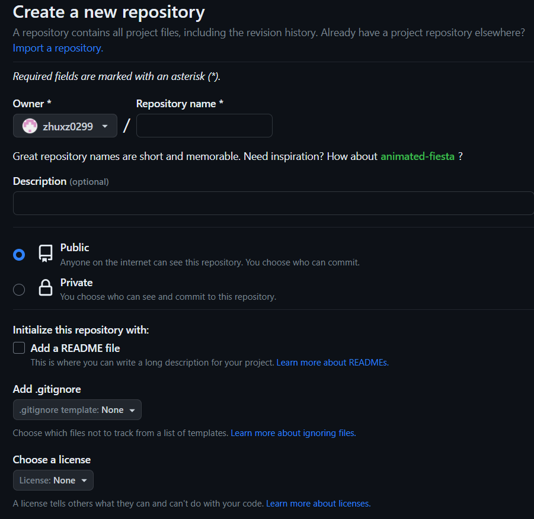
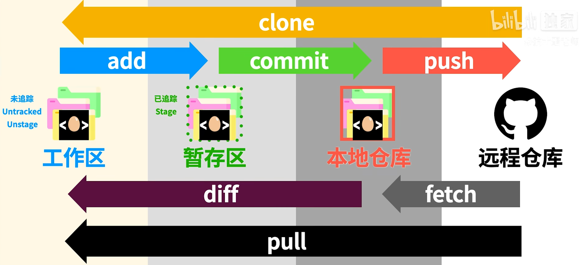


参考了[该视频](https://www.bilibili.com/video/BV1r3411F7kn/?spm_id_from=333.999.0.0&vd_source=4818ed7eb881f1eba75c12df1d2bd43c)


## GitHub项目部署
创建一个新的GitHub仓库：登录到您的GitHub账号后，在页面右上角点击加号（+）按钮，然后选择“New repository”创建一个新的仓库。

命名仓库：为仓库取一个名称，并添加可选的描述。
选择公开或私有：选择是将仓库设为公开（Public）还是私有（Private），这将决定谁可以访问您的代码。

<div align=center>

</div>

然后在本地文件执行
```bash
git init # 初始化本地仓库
git add . # 添加所有文件到暂存区
git commit -m "Initial commit" # 提交更改
git branch -M main
git remote add origin <GitHub仓库URL> # 将本地仓库与远程GitHub仓库关联
git push -u origin main # 将代码推送到GitHub
```

## git核心原理
<div align=center>

</div>

## git实操
### 初始化
首先进入文件夹，设置用户名称与邮箱
```bash
git config --global usr.name <your_name>
git config --global usr.email <your_email>
```

告诉git这个文件夹需要版本控制，所以需要git初始化
```bash
git init
```

初始化之后默认处于主分支main中。

### 暂存
对文件进行修改之后，可以通过
```bash
git add <file_name>
```

进行暂存，也就是放入暂存区。如果想要暂存所有修改，则可以使用
```bash
git add .
```

### 提交
输入
```bash
git commit
```

可以进行提交。此时界面会进入到vim(也有可能是nano)编辑器中，输入修改信息。如果修改信息比较简短，可以直接输入
```bash
git commit -m <commit_message>
```

同时暂存和提交操作也可以同时尽进行，这样就可以不用先 `add` 了。(以下两种操作都可以)
```bash
git commit -a -m <commit_message>
git commit -am <commit_message>
```

### 显示状态
```bash
git status
```

可以显示当前状态。即未暂存的工作区更改，以及未提交的暂存区更改。

```bash
git log
```

则可以显示之前的提交信息。
### 分支操作
创建新的分支
```bash
git branch <branch_name>
```

显示所有分支
```bash
git branch
```

切换分支
```bash
git checkout <branch_name>
```

删除分支，但是如果该分支未和其它分支合并，git会提醒
```bash
git branch -d <branch_name>
```

如果不想提醒，可以强制删除分支
```bash
git branch -D <branch_name>
```

创建分支并进入
```bash
git checkout -b <branch_name>
```

合并分支。此处是将某一分支与当前分支合并
```bash
git merge <branch_name>
```

### 特殊操作
假如在.gitignore文件中加入了某个文件或文件夹名称，如 `log/`，但是该文件或文件夹中的内容仍然被git追踪，此时若希望停止追踪，需要先从 git 中将该文件或文件夹移除
```bash
git rm -r --cached log
```

然后将该操作提交到仓库
```bash
git add .gitignore
git commit -m "Stop tracking log folder"
```

## 本地git与GitHub
查看本地仓库和哪些远程仓库有联系
```bash
git remote -v
```

比如会返回
```bash
origin  https://github.com/xfhelen/MMBench.git (fetch)
origin  https://github.com/xfhelen/MMBench.git (push)
```

这里的 `origin` 表示远程仓库的名字。远程仓库名字通常默认为 `origin`。这时我们 `push` 的情况就可以用 `origin` 代替URL了。

如果要将本地内容传到远程仓库，则使用
```bash
git push
```

如果想将远程仓库内容传到本地仓库，则使用
```bash
git fetch
```

