
内容来自：
* [详解硬盘的总线协议与接口](https://www.bilibili.com/video/BV1Qv411t7ZL)
* [一站式固态硬盘基础知识入门指南](https://www.bilibili.com/video/BV1XW4y187Nc)
* [固态硬盘(SSD)的原理](https://www.bilibili.com/video/BV1jDgtzEEVe)
* [固态硬盘的缓存是干什么的](https://www.bilibili.com/video/BV1aF411u7Ct)



固态硬盘基本核心部件：主控芯片、缓存（独立缓存、模拟缓存）、闪存颗粒（存储数据的地方）。

## 固态硬盘的总线、协议、接口
总线在单位时间内能够传输的数据量：总线的带宽。

* 硬盘协议：IDE（已经被淘汰）、AHCI、NVMe、SCSI（服务器）
* 传输总线：SATA，PCIe、SAS（服务器）
* 日常使用硬盘接口：SATA、mSATA、SATA Express、M.2、PCIe

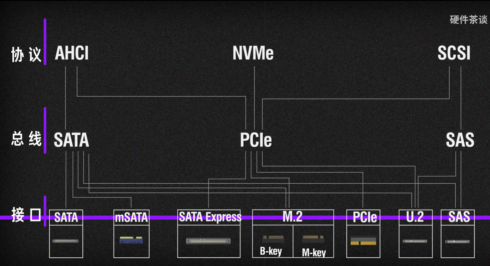

硬盘厂商通常会匹配好协议和接口，因此消费者主要需要考虑总线带宽。下表为总线带宽上限：
| 接口类型       | 版本   | 理论带宽  | 编码方式       | 通道数 | Windows内显示传输速度 |
| -------------- | ------ | --------- | -------------- | ------ | ---------------------- |
| SATA           | 3.0    | 6Gbps     | 8:10           | ×1     | 600MB/s                |
| SAS            | 3.0    | 12Gbps    | 8:10           | ×1     | 1.2GB/s                 |
| PCI Express    | 3.0    | —         | 128b/130b      | ×1     | 984.6MB/s              |
| PCI Express    | 3.0    | —         | 128b/130b      | ×4     | 3.938GB/s              |
| PCI Express    | 3.0    | —         | 128b/130b      | ×8     | 7.877GB/s              |
| PCI Express    | 3.0    | —         | 128b/130b      | ×16    | 15.754GB/s             |
| PCI Express    | 4.0    | —         | 128b/130b      | ×1     | 1.969GB/s              |
| PCI Express    | 4.0    | —         | 128b/130b      | ×4     | 7.877GB/s              |
| PCI Express    | 4.0    | —         | 128b/130b      | ×8     | 15.754GB/s             |
| PCI Express    | 4.0    | —         | 128b/130b      | ×16    | 31.508GB/s             |

下面介绍各种接口类型。

### SATA
最常见的接口，目前大多数日常使用的 3.5 寸、2.5 寸机械硬盘以及 2.5 寸固态硬盘使用的都是该接口。

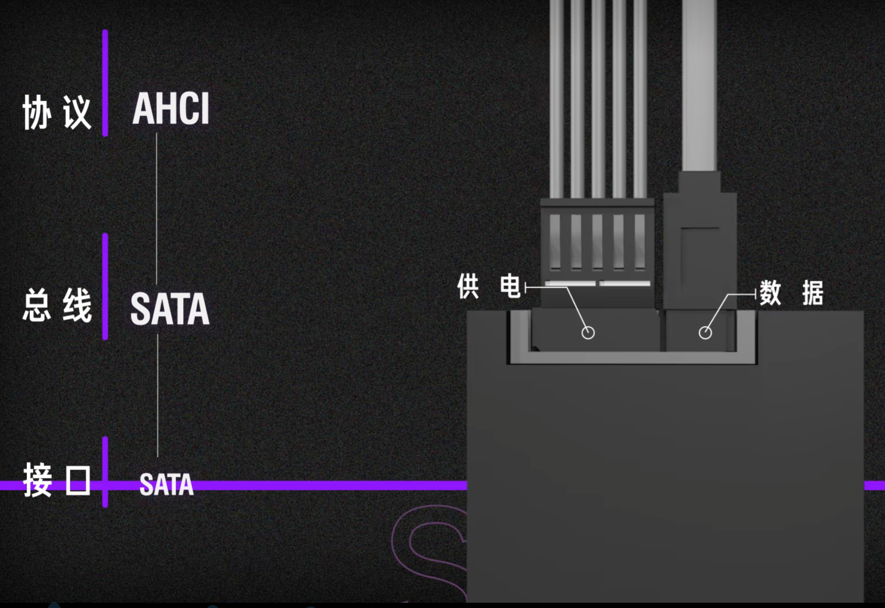

### mSATA
仅仅是为了在笔记本电脑中节约空间而出现，在 M.2 接口出现之后就被淘汰了

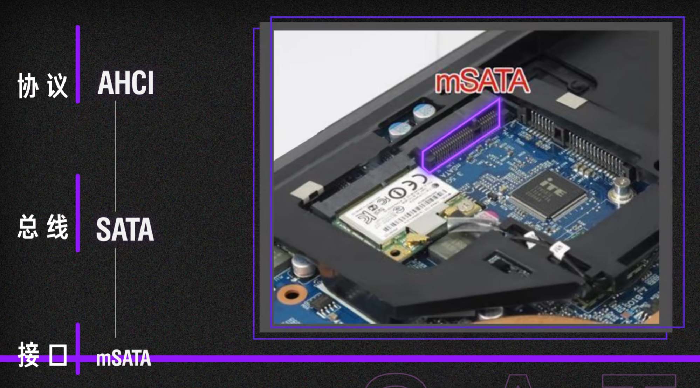

SATA Express：既可以当普通 SATA 用，也可以合并起来走 PCIe×1.0 或 PCIe×2.0。但是因为提升速率有限且接口体积过大，很快就被淘汰。

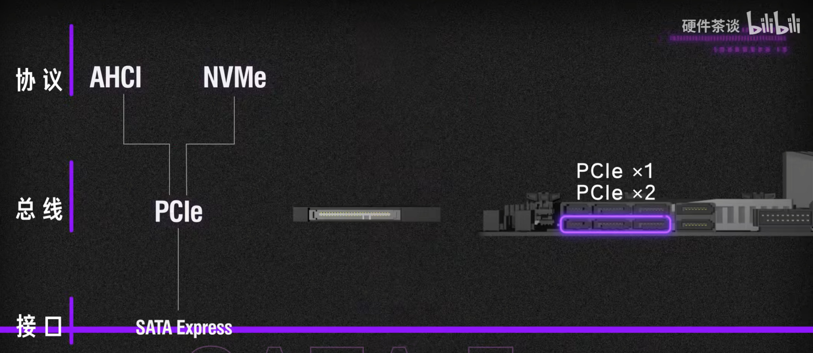

### M.2
行业规范的别名为 NGFF。该接口使用的协议不能仅仅通过外形判断，而需要参照主板说明书。

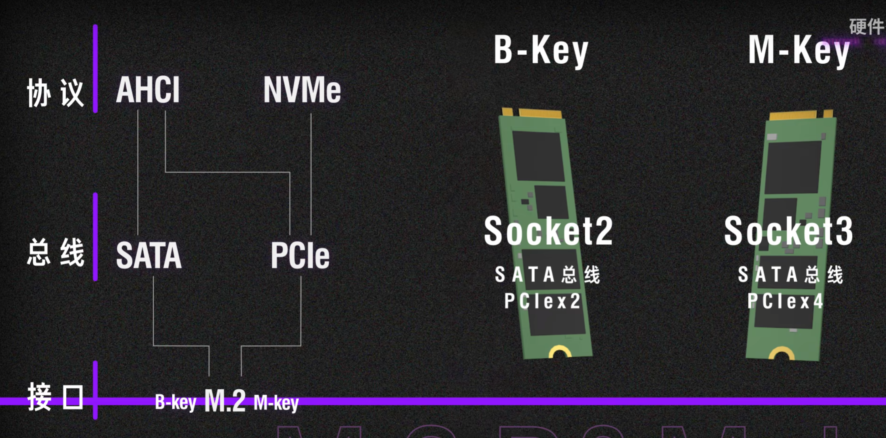

### PCIe
通常被用于超高性能等级硬盘与企业级固态硬盘。直接插在主板的 PCIe 插槽上。

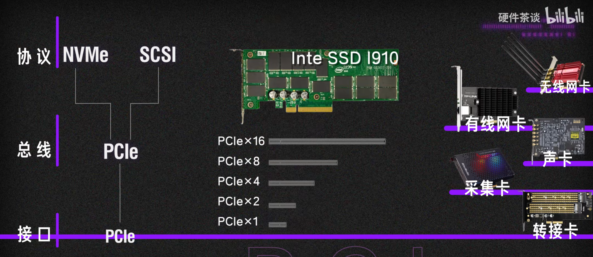

### SAS
主要用于服务器上，可以看作是强化版的 SATA 接口，增加了更多的功能，并且支持速率更高的 SAS 总线。以及支持一分多，以满足服务器硬盘柜多硬盘的需求。SAS 接口支持向下兼容 SATA 硬盘。

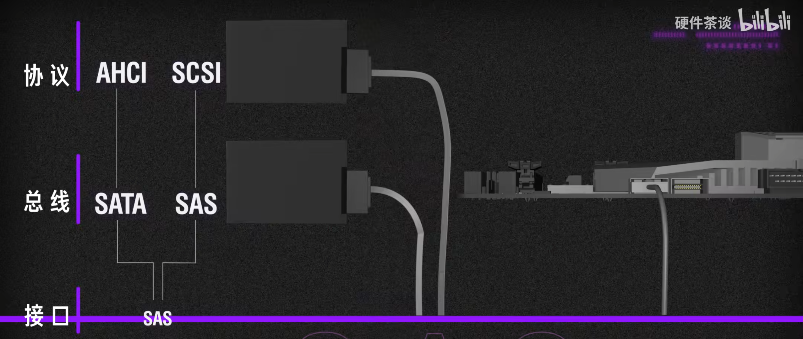

### U.2
由 SAS 改款，向下兼容 SAS 和 SATA。多用于企业级固态。

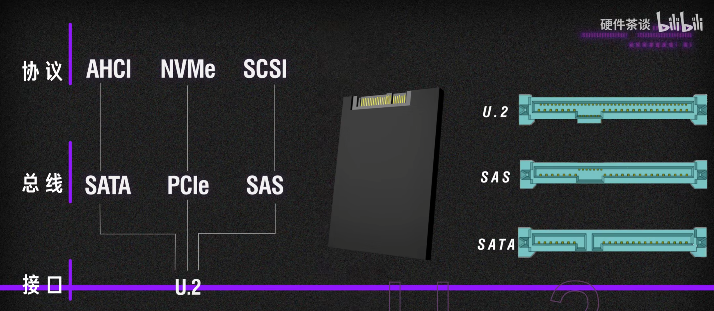

## 闪存颗粒
### 颗粒工作原理
浮栅 (Floating Gate)：内部为导体（多晶硅），外部为绝缘体。施加外电场，利用量子隧穿效应将电子移入或移除浮栅，从而作为一个存储信息的基本结构。电子在其中可以存储十年左右。

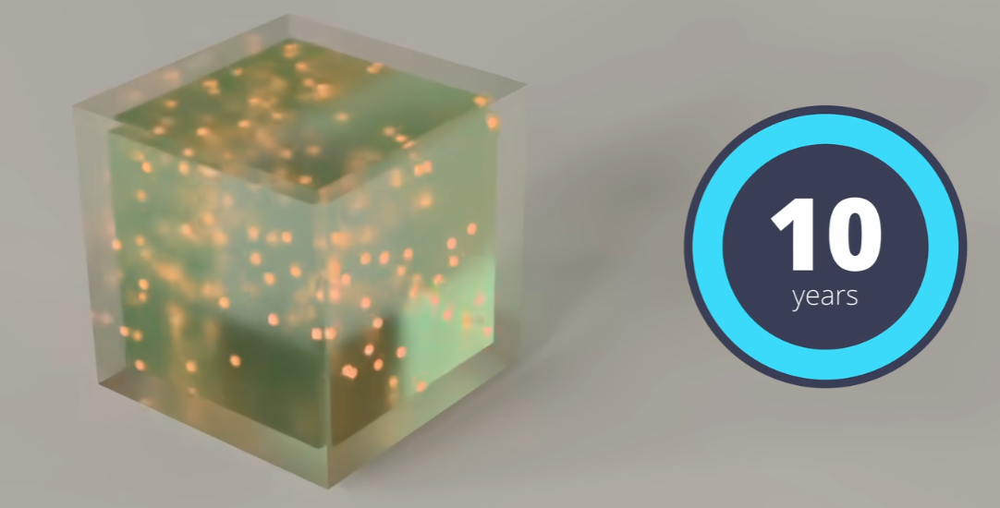

MOS 管：利用栅极 (Gate) 和衬底 (Substrate) 之间的电压控制 PN 结的通断。

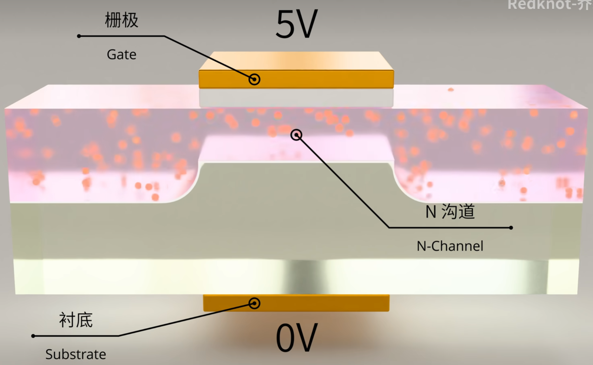

浮栅晶体管：通过施加较高电压实现数据的写入擦除；通过施加阈值电压实现数据的读取。

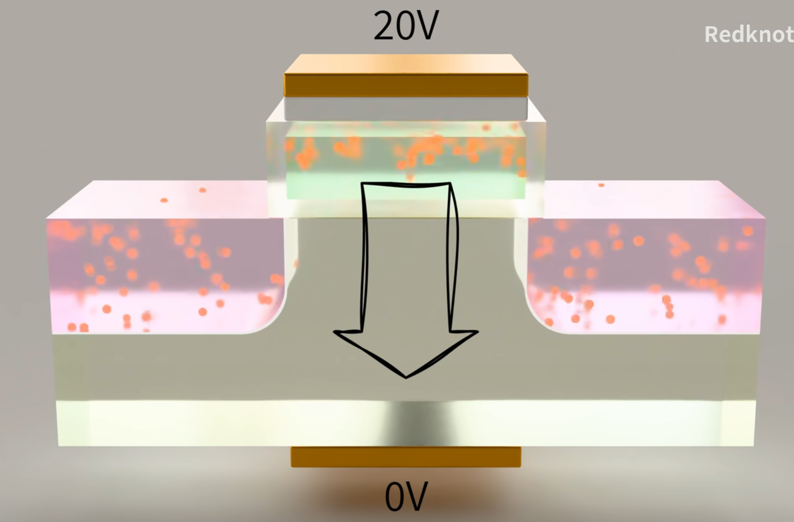

在读取时，施加一个使得原本 MOS 管恰好能导通的电压，例如为 5V。如果此时浮栅中没有电子，那么能够导通；如果有，那么由于其中电子产生的电场影响，则不能导通。由此可以读取数据。

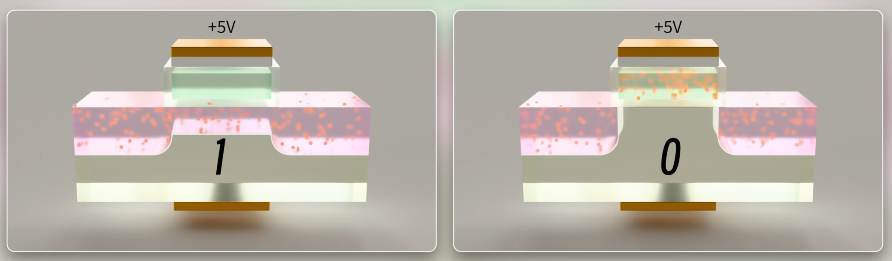

使用这种操作逻辑构建成的闪存颗粒为 SLC (Single-Level Cell)，存储数据快，可靠。但是数据密度低，成本较高。

为了降低成本，厂商推出了 MLC (Multi-Level Cell)、TLC、QLC。这种方式虽然降低了成本，但是降低了读写速度与使用寿命。
* 读取时需要使用多个阈值电压尝试，以确定此时浮栅中存储的电量。

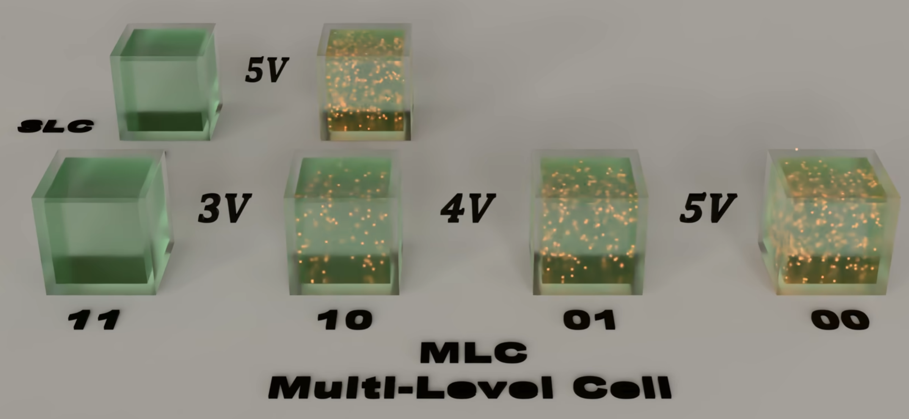

* 写入时同样需要使用多个电压多次写入：进行一次写入过后执行读取，来确定写入的量是否合适。

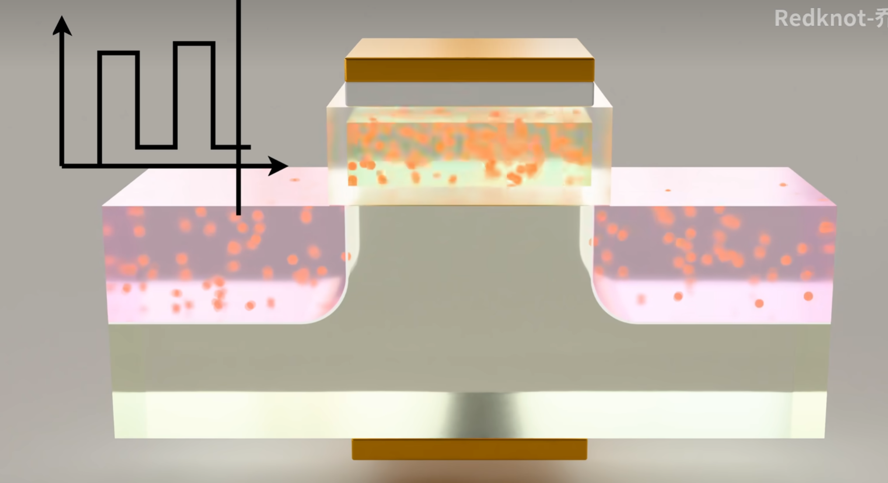

### 硬盘制造流程
首先有能力制造闪存颗粒的厂商在硅晶片上制造出闪存颗粒，并对其进行检测。通过检测的进行封装，再次检测，通过的则为原厂原封颗粒。

除此之外制造闪存的厂商还可以将制造完闪存颗粒的整块晶圆卖给没有生产能力，但是有封装检测能力的厂家，这样得到的颗粒即为原厂第三方封测颗粒。

## 主控
决定了硬盘的协议，以及硬盘读写的各种算法。主控通常决定了硬盘的档次。

能够生产制造主控的厂家可以分为原厂自研与独立主控厂家。前者本身具备生产闪存颗粒的能力，同时也生产主控；后者则只进行主控的研发。

主控厂商可以给硬盘厂商提供主控方案，有些也支持生产代工。

## 缓存
固态硬盘的缓存主要可以分为外置 DRAM 和 SLC Cache，两者的概念和用途完全不同。

写入数据时，数据通过主控处理，存放到 NAND 闪存颗粒中。读取数据时，主控从 NAND 颗粒中找到数据，通过总线发送给计算机其他硬件。

### DRAM 缓存
#### 存放 FTL 表
逻辑物理映射表 (Flash Translation Layer)，简称 FTL 表。

由于当电脑向硬盘写入数据的时候，主控会先根据情况挑选 NAND 颗粒中的一块区域，并且记录这个区域的位置，再将这个位置信息保存成文件的 FTL 表，及逻辑到物理位置的映射表。

当 DRAM 中存在 FTL 表的时候，读取数据时就可以直接到 DRAM 缓存中查找文件位置，实现快速的数据读取。

通常 1GB 的 NAND 颗粒需要 1MB 的 FTL 表缓存空间，有时为了解决成本，就会选择小缓存方案，仅仅在 DRAM 中存储部分经常用到数据的 FTL 表，完整的 FTL 表放在 NAND 颗粒中。

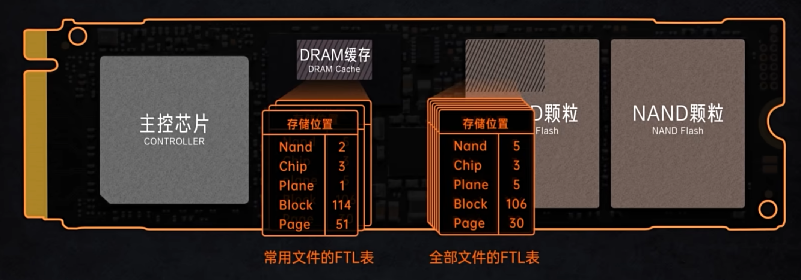

#### HMB 技术
有些硬盘没有 DRAM 缓存，如果将所有的 FTL 表都放在 NAND 中，在读写数据时主控需要花费大量的时间查表，导致无法发挥硬盘的全部性能。因此有部分硬盘会通过 PCIe 通道找内存借用一部分空间来存储 FTL 表，这就是 HMB 技术。

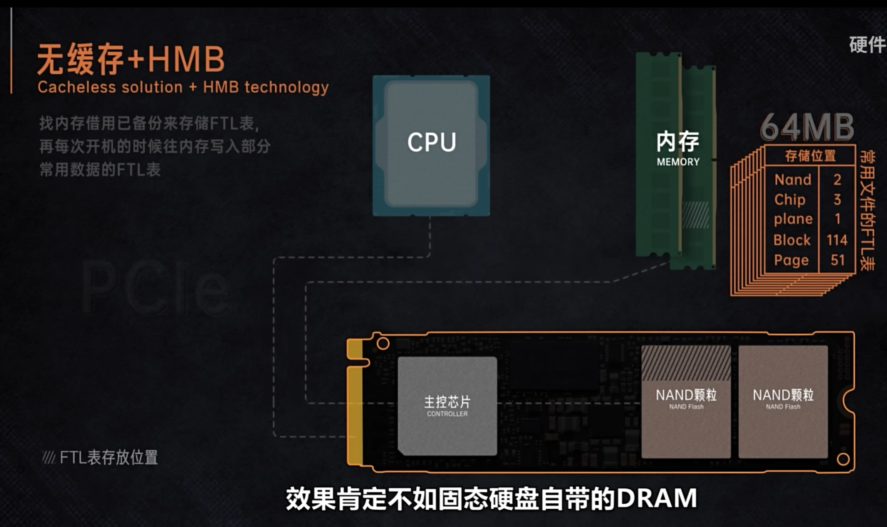

#### 缓解写放大
固态硬盘最小的写入单位为页，因此即便文件不足一页也会占据整个页。当区块中的整个页占满之后，下次要存放数据时，就要把不足一页的数据先搬出来合并。同时因为固态硬盘写入数据前需要擦除整个 block 区块，数据合并之后需要对区块进行擦除才能再次写入，这加速了硬盘的磨损。

因此部分主控会在写入新数据之前先将数据存在 DRAM 中，存够一页之后再写进 NAND 颗粒中。

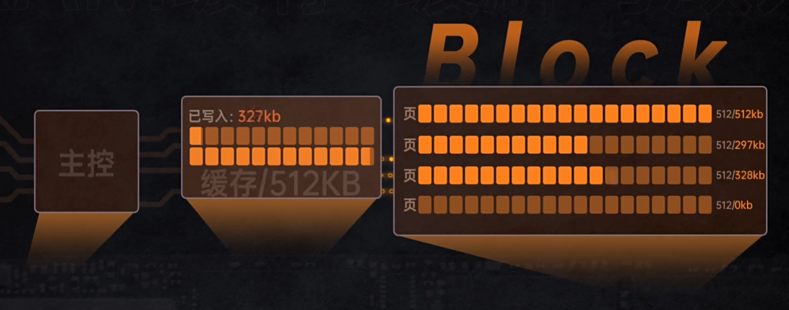

除此之外部分被删除的数据也需要释放页的空间，DRAM 缓存也可以用于做垃圾回收 (garbage collection) 以及磨损均衡。

### SLC Cache
在对固态硬盘进行大文件写入时，会发现在开始固态硬盘速度很快，但是在写入一定数据时候就会掉速。开始较高的速度通常被称为缓内速度，后面掉速的速度为缓外速度。

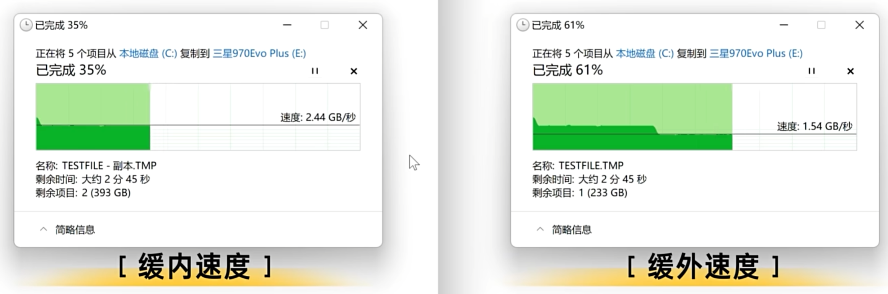

这是因为为了缓解使用 TLC 策略的硬盘写入速度慢的问题，考虑到 SLC 和 TLC 硬盘使用的都是同样结构的浮栅晶体管，因此其到底是 SLC 还是 TLC 仅仅由主控策略决定。

因此可以使用 TLC 硬盘的部分区域模拟 SLC，每次只写入 1bit 的数据，使得速度维持在较高值；当硬盘空闲下来之后，再将这部分缓存数据写入 TLC 中。用于模拟 SLC 的区域被称为 SLC Cache。

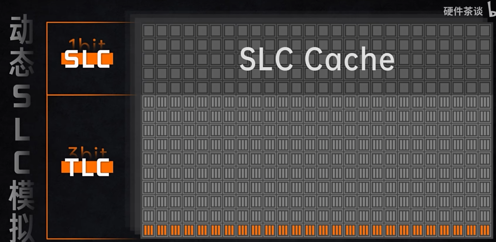

由这个结构可以看出，首先 SLC Cache 是有限的，因此当 Cache 用完之后，主控只能往 TLC 区域写入数据，此时写入速度就会下降。同时随着硬盘占用空间的增大，SLC Cache 也会减小。

SLC 模拟虽然能够提高硬盘的写入速度，但是由于 SLC Cache 的存在会提高 NAND 颗粒的擦写次数，降低固态硬盘的寿命。