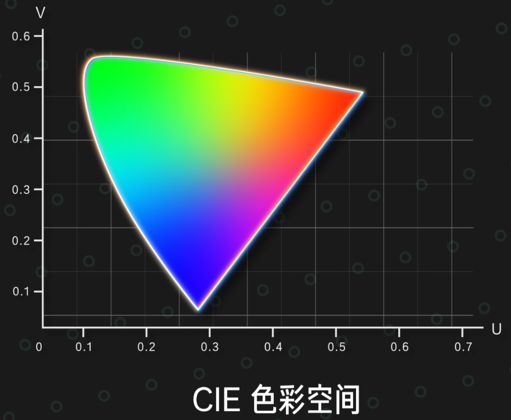
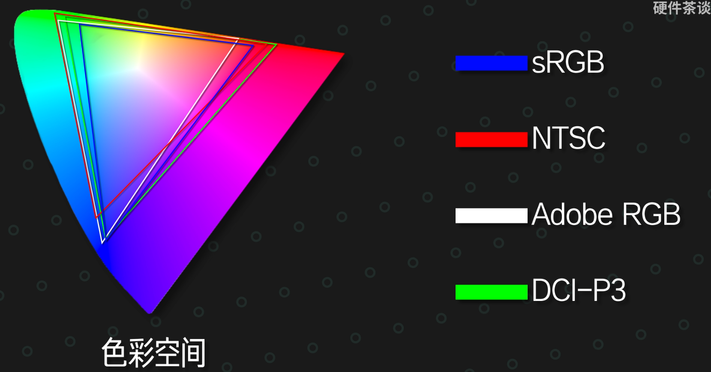
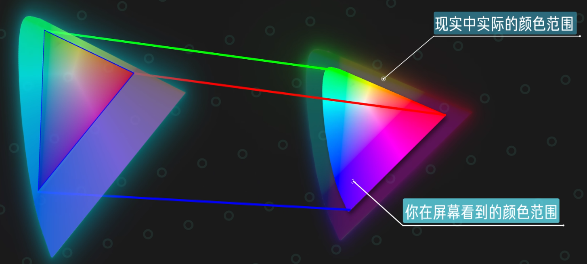
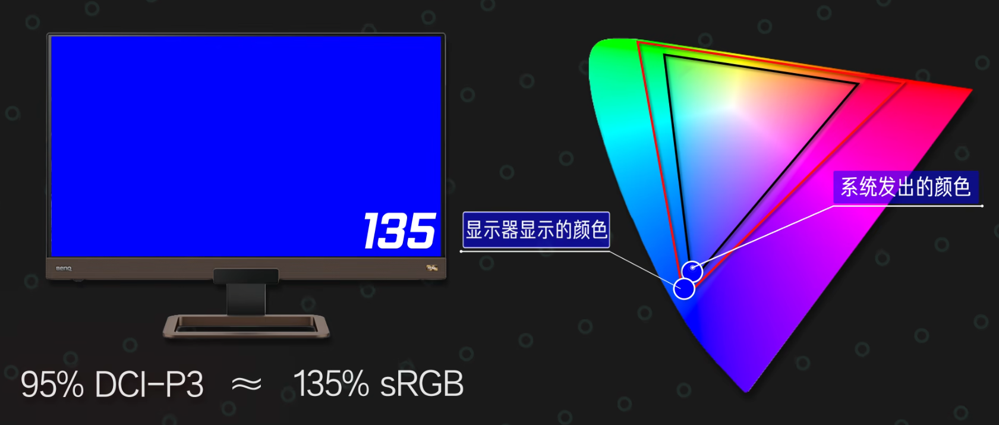
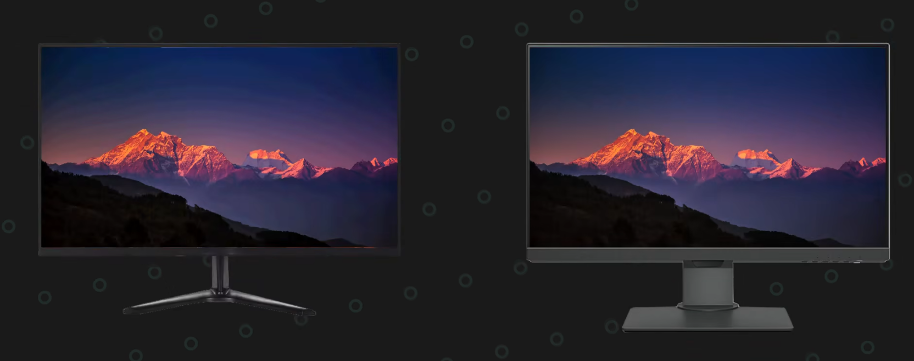

## 色域
### 色域马蹄图
人眼只能看到特定波长的光，把人眼可见的所有光的颜色信息和明度信息通过一定的数学变换映射到一个平面上，就得到了这样一个色域马蹄图。色域马蹄图就代表了人眼睛可以识别的全部颜色，这个颜色范围空间被我们称之为 CIE 色彩空间。

目前的显示器无法做到还原出 CIE 空间中所有的颜色。这是因为显示器的显示颜色依赖于红绿蓝三个子像素混合颜色，所以一台显示器显示颜色的极限就是红绿蓝各自亮度最大，而其他由红绿蓝三个颜色混合出来的颜色只可能会在他们三个点连线的内部区域当中，这个三角形就代表了这个显示器所能表现出来的全部颜色，即为显示器的**色域**。也就是说色域指的就是显示器能显示颜色丰富度的概念。

### 色彩空间
而由于每个人的显示器所能覆盖的颜色范围不同，摄影设备能存储的色彩信息也是不同，所以为了方便统一，各行各业就制定了不同的颜色标准。在 CIE 颜色覆盖范围内圈出来一定的区域作为标尺，依照该表尺储存与显示颜色，这个标尺就是**色彩空间**。常见的色彩空间有：sRGB、NTSC、Adobe RGB、DCI-P3。

显示器能够显示整张色域马蹄图的原因：显示器显示不出来的颜色就会按照一定的映射强行显示，我们在屏幕上看到的色域马蹄图已经不是真实原本应该存在的颜色了。

### 显示器色彩管理
选择显示器的时候，并非色域越广越好，使用 Windows 时 100% sRGB 是比较合适的色域。目前的 Windows10 操作系统就是以 100% sRGB 色彩空间作为标尺存储色彩信息；互联网上看到的绝大多数内容也是按照 100% sRGB 色彩空间去存储和显示。

Windows 操作系统通过显卡读取显示器驱动板的 EDID 信息来获取显示器支持的分辨率、刷新率以及型号，但是 EDID 信息里并没有存储显示器的色域覆盖的相关信息，因此 Windows10 系统默认显示器是 100% sRGB。这就导致如果使用的显示器色域较广，例如 120% sRGB，系统依旧按照 100% sRGB 的色彩空间发送颜色信息给显示器，用户最后在屏幕上看到的色彩就会过饱和。

**过饱和**的例子：比如说有一个 95% DCI-P3 色域的显示器，对应 sRGB 大概是 135% sRGB。如果此时希望显示 100% 的 sRGB 蓝色，由于 win10 默认显示器也为 100% sRGB，所以就会直接要求显示器显示最蓝的信息，那么最后屏幕显示的就是 135% sRGB 的蓝。

如果买到的显示器色域大于 100% sRGB，可以在显示器设置中将其调为 sRGB 模式，从而在 Windows 系统下正常显示颜色；或者进行校色。

苹果的系统能够较好的对自家的屏幕进行全局自动色彩管理，不会出现颜色映射错误的情况。

## 色准
**色准**指的就是显示器在色域覆盖范围内显示颜色的准确度。比如说需要显示蓝色显示器显示成青色；需要显示红色他给显示成橙色了，这个就是色准差的表现。

衡量色准的参数叫 △E 值，△E值越小代表色彩偏离越小，色准越高。△E 值一般是参考平均 △E 值和最大 △E 值。

### 不同△E值的差别
| ΔE | 色准描述 | 级别 | 感官描述 |
|---|---|---|---|
| ≤ 1.5 | 色准极好 | S级 | 物理意义上几乎不存在色偏 |
| 1.5 - 3 | 非常优秀 | A级 | 专业人士用肉眼也很难看出存在色偏 |
| 3 - 5 | 优秀 | B级 | 日常使用几乎不会有影响 |
| 5 - 8 | 普通 | C级 | 色彩敏感的人可以看出有色偏 |
| > 8 | 很差 | D级 | 大部分人都能看出些微的偏色 |

### 校色
如果本身显示器色准较差，可以通过后期使用校色仪对显示器进行色彩校准。只需要把校色仪贴在屏幕上，运行系统内的校色仪配套软件，校色软件就会让屏幕去显示一些颜色并用校色仪捕获下来，从而计算出你显示器的颜色偏离数值，最后通过一些公式和算法生成一份 ICC 校色文件。把这份 ICC 文件导入到系统当中，如果使用的软件或者游戏支持调用 ICC 文件，那显示器就能显示校准之后的颜色，部分降低 △E 值。

较色仪还可以用来进行色彩空间的管理。校色仪在校色的过程中还可以检测屏幕的色域覆盖，然后在生成的 ICC 校色文件当中为显示器做色彩映射。Windows 在输出颜色数据时会在计算完色彩输出以后，借助 ICC 文件将sRGB的颜色映射到显示器实际能显示的色彩空间当中，正确的显示出颜色。

但是 ICC 校色文件并不是所有的时候都能生效的，比如说全屏游戏就无法调用 ICC 文件，还有很多软件也不支持调用 ICC 校色文件。

## 色深
$8$ bit 色深指的就是每种颜色都有 $2^{8} = 256$ 个色阶，在色彩过渡时有 $256$ 个阶梯；$10$ bit 会有 $1024$ 个色阶。色阶越高，屏幕在显示色彩过渡的时候就能呈现的越平滑，色彩越不容易出现断层的现象；色深比较差的显示器相对而言更加容易出现和梯田一样的色彩断层。

$8$ bit 色深就是厂商宣传的 $2^{3\times 8} \thickapprox  1.68\times 10^{7}$，即 $1680$ 万色；同理，$10$ bit 色深能得到 $2^{3\times 10} \thickapprox 1.07\times 10^{10}$，即 $10.7$ 亿色。

### FRC 像素连抖动技术
假设一个屏幕只能显示深灰和浅灰，但是又希望它显示出中间那部分灰，就可以让显示器频繁的在浅灰和深灰之间来回切换。只要切换的速度足够快，借助人眼的视觉暂留效应，用户在画面上实际上看到的就是需要的中度灰。

FRC抖动只是在颜色之间切换，背光本身并不会关闭，所以不会产生频闪伤眼的现象。
但是这种抖动会产生很多的静态噪点，所以并不能做到和原生色深相匹配，只能是在一定程度上缓解色彩断层的现象。
