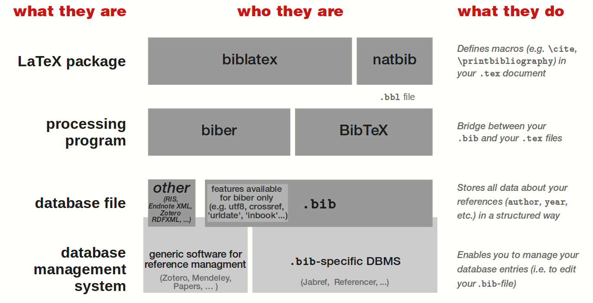


文章内容翻译并整理自 [StackExchange](https://tex.stackexchange.com/questions/25701/bibtex-vs-biber-and-biblatex-vs-natbib)。


## 总览图与处理流程
首先展示整体的关系：


biblatex 处理流程：


biber 处理流程：


## 一些术语
首先，重要的是要认识到“BibTeX”这个术语经常被用来指代各种不同的事物，这可能会导致一些混淆。例如，我们通常告诉新用户“使用 bibtex 来处理你的参考文献”，这通常只是意味着不要手动处理，而是将你的参考文献存储在一个 .bib 文件中，并使用一些自动的方法来格式化引用和参考文献。此外，我们还会谈论“bibtex 文件”（即一个 `.bib` 文件）。这两种用法实际上都相当模糊，而提出这个问题的部分原因是为了更仔细地区分它们。

因此，在这个问题中我们将使用以下术语：
* bibtex 和 biber 是处理参考文献信息的外部程序，它们（大致）充当你的 `.bib` 文件和 LaTeX 文档之间的接口。
* natbib 和 biblatex 是用于格式化引用和参考文献的 LaTeX 包； natbib 仅与 bibtex 兼容，而 biblatex （目前）与 bibtex 和 biber 都兼容。

## biblatex vs. natbib
### natbib
natbib 包已经存在了很长时间，虽然仍在维护，但可以说它不再进一步开发了。它仍然被广泛使用，并且非常可靠。

优势
* 它拥有大量已开发的 .bst 文件，这些文件符合许多科学领域的期刊和出版商的要求。
* natbib 软件包的作者编写了一个名为 custom-bib 的软件包，它提供了一个名为 makebst 的实用工具。该工具是菜单驱动的，允许您交互式地生成自定义的参考文献样式文件。使用 makebst 生成的参考文献样式文件非常稳定，并且（考虑到作者身份，这并不令人惊讶）与 natbib 的引用命令配合得非常好。
* 生成的参考文献代码可以直接粘贴到文档中（通常用于期刊投稿）。参见 Biblatex: submitting to a journal。

Disadvantages  缺点
* 因为它依赖于 bibtex ，其接口需要 .bst 文件，这些文件使用了一种对大多数人来说难以编程的后缀语言。这意味着即使对现有样式进行微小修改以满足特定的格式要求也可能相当困难。
* 它特别设计用于自然和社会科学中常见的作者-年份和（在较小程度上）数字引用样式。它无法处理传统人文学科风格的引用样式，如作者/标题或脚注风格的引用和参考文献（包括各种 ibid 跟踪）。
* 在单个文档中创建多个参考文献或分类参考文献需要额外的包。
* 通过依赖 bibtex 作为后端，它继承了其所有缺点（见下文）。


您可能想使用 natbib 如果：
* 已经为你要提交论文的特定期刊创建了一个 .bst 文件；
* 一本期刊接受 latex 投稿，并要求或期望 natbib 。此类期刊可能不接受 biblatex 作为参考文献。

### biblatex
biblatex 包正在与 biber 后端一起积极开发。

优势
* biblatex 几乎是必需的，如果你需要以下任何一项：
  * 人文科学风格的引用（作者-标题类型的方案；使用 ibid 等的引用）
  * 更广泛的 BibTeX 数据库字段（再次特别适合人文学科）。
  * Unicode 编码的 .bib 文件（可与 biber 替换 bibtex 一起使用）。
  * 使用常规的 latex 方法精细控制自己的参考文献样式。
* 作者-年份和数字引用
  * biblatex 提供了与 natbib 相同的功能，适用于自然科学和社会科学中常见的作者-年份和数字引用。因此，它可以作为 natbib 的替代品使用。
* 一般考虑（general consideration）
  * 所有引用和参考文献条目的格式都是使用常规的 LaTeX 宏来完成的。因此，常规的 LaTeX 用户能够轻松地对现有样式进行修改。 biblatex 还为大多数类型的修改提供了内置的钩子。
  * 尽管 biblatex 可以使用 bibtex 作为后端，但它不会对 .bst 文件进行格式化，而仅使用 bibtex 进行排序。
  * 直接支持多个参考文献和分类参考文献。

缺点
* 期刊和出版商可能不接受使用 biblatex 的文档，如果他们有自己的 natbib 兼容 .bst 文件的内部样式。
* 将 biblatex 创建的参考文献包含到文档中并非易事（正如许多出版商所要求的）。请参阅 [Biblatex: submitting to a journal](https://tex.stackexchange.com/q/12175/2693)。


## bibtex vs. biber
natbib 的许多缺点源于其对 bibtex 的依赖以进行格式化。这是 natbib 和 biblatex 之间的主要（巨大）区别，因为后者即使使用 bibtex 作为后端，也不将其用于格式化，仅用于排序。然而， biblatex 也被设计为使用 biber ，这是一个为 biblatex 添加更多功能的新后端。

### bibtex
优势
* 非常稳定且广泛使用
  
缺点
* 很难在不学习另一种语言的情况下修改参考文献样式（如果使用 natbib ；如果使用 biblatex 则不是问题）
* 非常差的跨语言支持和非欧洲文字支持。最好避免使用非 ASCII 字符。有关如何书写带有重音符号和变音符号的字符的指导，请参见《如何在参考文献中书写“ä”和其他变音符号及重音字母》。

### biber
优势
* 能够处理 .bib 文件中更多条目和字段类型。
* 能够处理 UTF-8 编码的 .bib 文件。
* 更好的排序控制。
  
缺点
* 仅适用于 biblatex ，不适用于 natbib 。
* 因为它比 bibtex 做得更多，所以速度要慢得多。有关讨论，请参见 Why is biber so slow?。

## vscode latex 配置中使用 biber
网上教程给的默认配置使用的都是 `bibtex`，因此这里补充一下 `biber` 的配置，和 `bibtex` 类似：
```json
"latex-workshop.latex.tools": [
  {
      "name": "biber",
      "command": "biber",
      "args": [
          "%DOCFILE%"
      ],
      "env": {}
  }
]
```