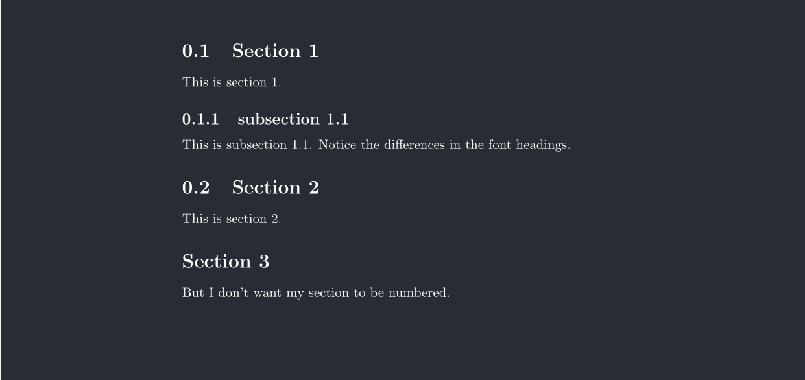

一个简单的例子
```latex
\documentclass{report}
% preamble 
\title{A starter of latex}
\date{\today}
\author{Zhu Xiaozhi}

\begin{document}
% all the information we set before(title,date,author) can only be presented when using \maketitle
\maketitle
% This is my first Latex document. More to be added. 
\section{Section 1}
This is section 1.  
\subsection{subsection 1.1}
This is subsection 1.1. Notice the differences in the font headings. 
\section{Section 2}
This is section 2. 
\section*{Section 3}
But I don't want my section to be numbered. 
\end{document}
```

编译结果如下（pdf分了两页）：




## documentclass
首先考虑第一行代码
```latex
\documentclass{report}
```
其基本格式为 `\documentclass[]{}`，大括号中表示的是文档类型，中括号中表示的是文档类选项。文档类选项不是必须的，因此可以只用 `\documentclass{}`。

文档类型
* article：排版科学期刊、 演示文档、 短报告、 程序文档、 邀请函……
* proc：一个基于 article 的会议文集类
* minimal：非常小的文档类。只设置了页面尺寸和基本字体。主要用来查错。
* report：排版多章节长报告、短篇书籍、博士论文……
* book：排版书籍。
* slides：排版幻灯片。该文档类使用大号 `sans serif` 字体。也可以选用 `FoilTEXa` 来得到相同的效果。

文档类选项
* 10pt, 11pt, 12pt：设置文档中所使用的字体的大小。如果该项没有指定，默认使用10pt 字体。
* a4paper, letterpaper, . . .：定义纸张的尺寸。缺省设置为letterpaper。此外，还可以使用a5paper, b5paper, executivepaper 以及legalpaper。
* fleqn：设置行间公式为左对齐，而不是居中对齐。
* leqno：设置行间公式的编号为左对齐，而不是右对齐。
* titlepage, notitlepage：指定是否在文档标题(document title) 后另起一页。`article` 文档类缺省设置为不开始新页，`report` 和`book` 类则相反。
* onecolumn, twocolumn：latex 以单栏(one column) 或双栏(two column) 的方式来排版文档。
* twoside, oneside：指定文档为双面或单面打印格式。`article`和`report`类为单面(single sided) 格式，`book`类缺省为双面(double sided)格式。注意该选项只是作用于文档样式， 而不会通知打印机以双面格式打印文档。
* landscape：将文档的打印输出布局设置为 landscape 模式。
* openright, openany：决定新的一章仅在奇数页开始还是在下一页开始。 在文档类型为`article`时该选项不起作用， 因为该类中没有定义“章” (chapter)。 `report`类默认在下一页开始新一章而`book`类的新一章总是在奇数页开始。

## title, date, author
对于这几行代码
```latex
\title{A starter of latex}
\date{\today}
\author{Zhu Xiaozhi}
```
就是用来写明标题、日期、作者。

`\title{}` 括号中就是要用的标题。如果想要设置副标题，一种可行的方式是
```latex
\title{A starter of latex\\{\small a subheading}}
```
这能够在标题的下一行有一个字号小一些的标题。

`\date{}` 的括号中是显示的时间。如果使用 `\today` 就是显示今天的时间。但也可以自己输入时间。

同时需要注意，想要在文章中显示以上内容，必须在 `document` 中使用 `\maketitle`
```latex
\begin{document}
\maketitle
\end{document}
```

## section
`\section{}`, `\subsection{}`,`\subsubsection{}`用于划分章节。括号中使用的是标题的名字，同时标题会自动编号。

如果不希望使用自动标号的功能，则可以使用如 `\section*{}` 的格式。