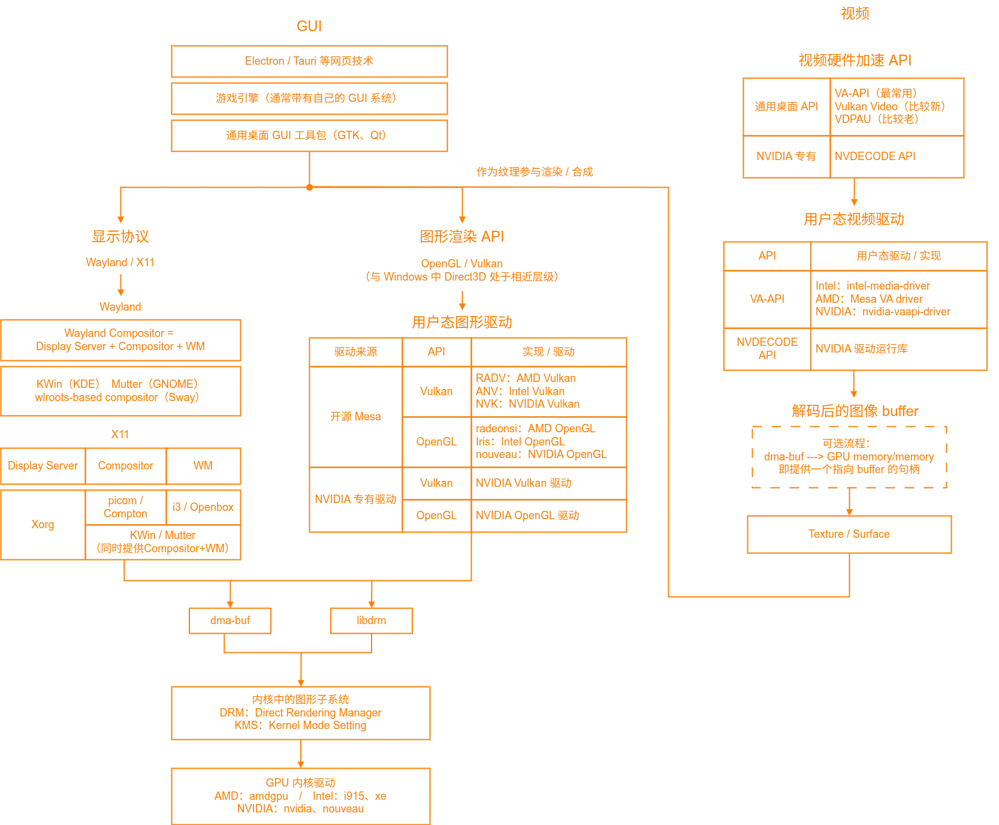

## 整体概览
首先展示整体工作流程，流程比较粗糙，不一定严谨。



## 解释说明
这里是对里面的每个部分做一些细节性的解释。

### 视频加速 API/用户态视频驱动
#### VA-API

VA 就是 Video Acceleration 的缩写。

VA-API 是 Linux 桌面最通用的视频加速接口，涵盖：
- 视频解码
- 视频编码
- 缩放、反交错、色彩转换、HDR tone mapping 等后处理
- 以硬件 surface 形式传递图像

它通过 libva 加载具体厂商驱动，例如：应用 → `libva.so` → `radeonsi_drv_video.so` → `amdgpu` → AMD VCN。
- `libva.so` 是 VA-API 的通用加载器和用户态接口
- `radeonsi_drv_video.so` 就是图中“用户态视频驱动”里 Mesa VA driver 的具体文件名
- `amdgpu` 在图中“GPU 内核驱动”里面
- AMD VCN 是更底层的硬件引擎

关于对应的 nvidia-vaapi-driver 驱动：是一个社区项目，它把 VA-API 解码请求转到 NVIDIA NVDEC 的兼容驱动；它只支持解码，不支持 VA-API 编码，而且主要针对 Firefox。普通 NVIDIA 播放器或转码程序还是建议直接使用 NVDEC。

#### Vulkan Video

Vulkan Video 把编解码变成 Vulkan 队列、资源与同步模型的一部分。它的优势是：

- 跨厂商
- 可以和 Vulkan 渲染、计算、图像处理共享资源
- 开发者能精细控制队列、内存与同步
- 适合播放器、游戏引擎和低拷贝媒体管线

代价是 API 更底层、更复杂，驱动和应用支持仍在快速演进。

#### VDPAU
- NVIDIA 发起、后来获得跨厂商实现
  - 和 VA-API 类似，有 `libvdpau.so` 作为通用加载器，可以加载各个厂商的后端
- 开放 Unix 视频解码/呈现 API
  - 也就是通常不支持编码
- 如今主要承担 NVIDIA 原生兼容和旧应用支持

#### NVDEC 和 NVENC

NVIDIA 的原生接口。严谨的说是这样：
| 名称 | 严格含义 |
|---|---|
| NVDEC | NVIDIA GPU 中的硬件视频解码引擎 |
| NVDECODE API | 访问 NVDEC 的软件编程接口 |
| NVENC | NVIDIA GPU 中的硬件视频编码引擎 |
| NVENCODE API | 访问 NVENC 的软件编程接口 |
| Video Codec SDK | 包含上述 API、头文件、示例和文档的 SDK |

同时在用户态驱动方面，因为 NVDECODE API 是 NVIDIA 专有的接口，因此不需要像 VA-API 那样弄一些插件式的后端。

#### 其它
- V4L2：主要用于 Rockchip、Allwinner、NXP、Qualcomm、树莓派等 SoC
- QSV/oneVPL：Intel 的视频接口
- AMF：AMD 的厂商接口

在普通视频播放的场景下，VA-API 已经比较好用了，所以一般没有必要用 Intel 和 AMD 的厂商接口。同时在 Windows 中，这两个接口更为常用。


### 显示协议
- Display Server：负责应用和显示系统之间的通信。管理窗口资源、输入事件、buffer 提交等。
- Compositor：合成器。把多个窗口的 buffer 合成最终桌面画面，处理透明、阴影、缩放、动画，最后提交给 DRM/KMS。
- WM/Window Manager：窗口管理器。负责窗口位置、焦点、移动、最大化、工作区、标题栏等。


### 图形渲染 API/用户态图形驱动
OpenGL 和 Vulkan 的核心工作，是让程序用一种相对统一的方式命令 GPU 完成渲染。它们处在应用/渲染引擎与具体显卡驱动之间。这个层级的 API 在不同系统为：
- Windows：Direct3D
- macOS/iOS：Metal
- Linux：主要是 Vulkan、OpenGL、OpenGL ES

这些 API 由显卡厂商或者 Mesa 开源驱动直接实现，能直接表达 GPU 的资源、流水线以及命令。

同时这些 API 画出来的结果要交给 Linux 桌面显示系统，还需要一个接入层。常用接入层包括：EGL、GLX、Vulkan WSI，它们与图形渲染 API 的对应关系为：
OpenGL
- GLX：OpenGL 连接 X11
- EGL：OpenGL/OpenGL ES 连接 Wayland/X11/GBM 等

Vulkan
- WSI (Vulkan Window System Integration)：连接 Wayland / X11 / KMS / Android 等


### GPU 内核驱动
用户态驱动和内核驱动对应关系：
```
  AMD：
    用户态图形：Mesa RADV / radeonsi
    用户态视频：Mesa VA
    内核：amdgpu

  Intel：
    用户态图形：Mesa ANV / Iris
    用户态视频：intel-media-driver / Mesa
    内核：i915 / xe

  NVIDIA 专有：
    用户态图形/视频/计算：NVIDIA userspace stack
    内核：nvidia

  NVIDIA 开源 Nouveau：
    用户态图形：Mesa NVK / nouveau
    内核：nouveau
```
