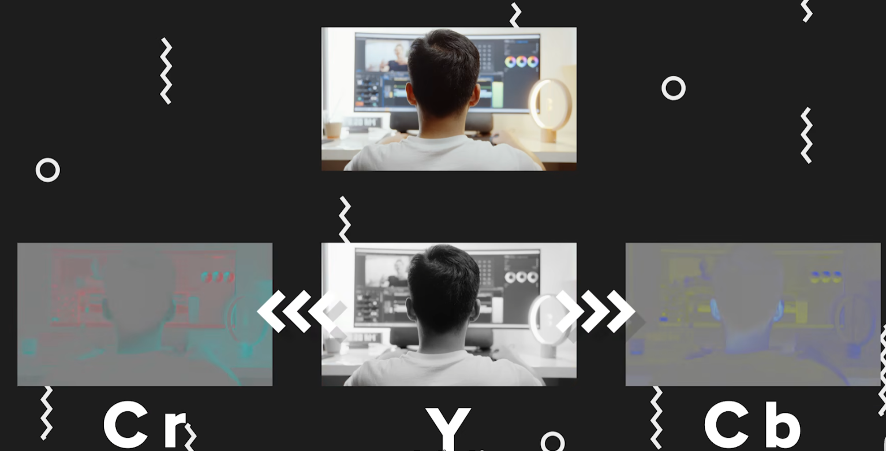
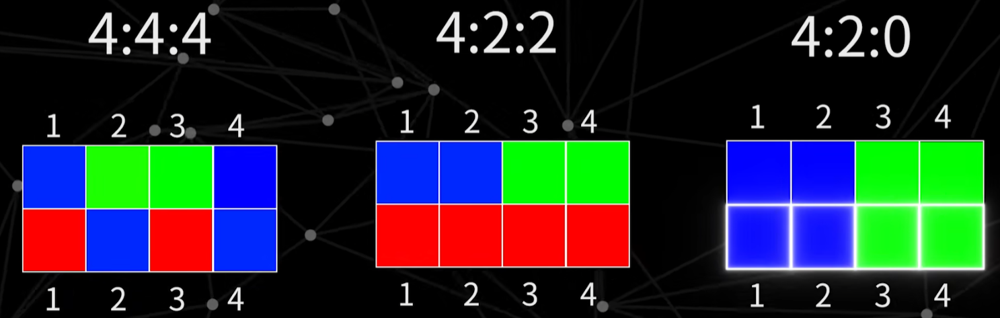
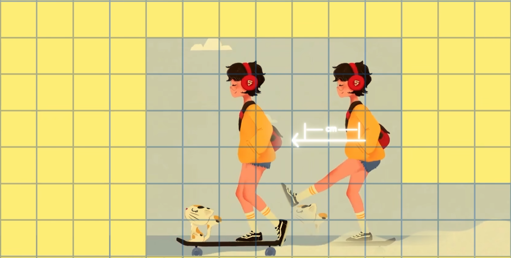


参考文章与视频：
* [少数派——视频与编码](https://sspai.com/post/59174)
* [差评君——这么多视频编码，为啥就不能统一成一种呢？](https://www.bilibili.com/video/BV19Y4113788/?spm_id_from=333.337.search-card.all.click&vd_source=4818ed7eb881f1eba75c12df1d2bd43c)
* [影视飓风——完全解析：编码与封装](https://www.bilibili.com/video/BV1Xs411Q7o1/?spm_id_from=333.337.search-card.all.click&vd_source=4818ed7eb881f1eba75c12df1d2bd43c)
* [影视飓风——422，420，10bit，8bit？这些究竟是什么](https://www.bilibili.com/video/BV1ds411T7F4/?spm_id_from=333.788.recommend_more_video.-1&vd_source=4818ed7eb881f1eba75c12df1d2bd43c)
* [极客湾——“视频”是怎么来的？H.264、码率这些词又是什么意思？](https://www.bilibili.com/video/BV1nt411Q7S6/?spm_id_from=333.337.search-card.all.click&vd_source=4818ed7eb881f1eba75c12df1d2bd43c)
* [知乎文章——令人拍案叫绝的JPEG图像压缩原理](https://zhuanlan.zhihu.com/p/521617590)
* [维基百科——视频文件格式](https://zh.wikipedia.org/wiki/%E8%A7%86%E9%A2%91%E6%96%87%E4%BB%B6%E6%A0%BC%E5%BC%8F)



## 色深、色度采样
这两个参数常见于拍摄设备。

### 色深
色深指图像或显示设备中每个像素能显示的颜色总数，通常以总位数表示。比如灰度图就是 8bit 色深，只有一个通道，共有 $2^{8} = 256$ 种灰度。

不过通常 8bit 色深指的是一个通道内的灰度数，那假如是 RGB 图像的话，总共就是 24bit。常见的色深还有 10bit，能够表示更多的信息。在面对渐变的环境，如果拍摄 8bit 视频，那么很容易遇到色彩断层；如果用 10bit，就能避免这个问题。

### 色度采样
#### 明度值与色度值
一个像素可以被认为包含两个信息：
* 明度值：表示了像素的亮度。
* 色度值：表示了像素的颜色。

研究发现，如果想要较好的显示画面，每个像素一定要保留明度信息，但是不一定要保留色度信息：多个像素可以共享一个色度值，呈现同一个颜色。这就可以在大大减少数据量的同时，使得画面看起来依然没有什么问题。

为了实现上面提到的方案，就不能使用 RGB 来呈现画面了。这是可以单独分离画面的明度，将它称之为 Y，然后分离出两个色度通道 Cr 和 Cb。再这些信息结合在一起，仍然可以获得正确的画面。所以 YCrCb 就是色度采样中最常用的色彩模式。

#### 4:4:4, 4:2:2, 4:2:0 的含义
第一个数字代表了色度采样时像素的横向数量（纵向数量为 2，即共有两行），第二个数字代表了第一行像素的色度采样值，第三个数字代表了第二行像素的采样值。

* 对于 4:4:4 而言，所有的像素都有着自己的色度信息，精度最高。这是很多电影机具有的记录能力。
* 4:2:2，即第一行和第二行都只有两个像素保留了自己的色度信息，剩下的两个像素和边上的像素共享色度信息。虽然此时丢失了 50% 的色度信息，但是画面依然不错。
* 4:2:0，此时只有第一行的两个像素具有色度信息，边上的像素沿用这两个像素的色度值，第二行直接继承第一行的色度值。某些微单和单反都会用 4:2:0 压缩数据量。在正常的拍摄环境下，即便使用 4:2:0 拍摄，依然可以获得不错的画面。但是如果需要进行抠像或者二级调色的时候，因为许多像素并没有自己的色度值。所以相比 4:4:4 色度采用的画面，想获得一个干净的抠像，则需要花上更多的时间和精力。

## 视频编码
### 什么是视频编码
严格来说我们所说的视频编码全名其实叫做视频编解码器，英文名叫 codec，是 encoder 和 decoder 的缩写，我们拍摄、剪辑、转码时候会将图像的光信号处理完成 encoder 的过程；播放时则会借助 decoder 将信号中的视频信息呈现出来。

### 视频编码的起源与原理
最早的视频编码标准诞生在1984年，它被命名为 H.120，由 ITU-T 的视频编码专家组制定。不过这个编码主要是用来保存电视内容，也没有被大规模的使用。直到 90 年代，互联网逐渐发展起来。人们有了在互联网上观看视频的需求，视频压缩编码就被重新提了出来。此时诞生了H.261。

#### 帧内压缩
由于人眼是有极限的，因此视频压缩的第一步就是去除画面中人眼不太注意得到的细节。通常使用 JPEG 压缩算法。
* 压缩技术一：颜色空间转换(RGB->YCrCb)+色彩下采样(Chroma Subsampling)
  * 用到的和[色度采样](#色度采样)中提到的方法差不多。
* 压缩技术二：DCT变换，留低频，弃高频
  * 通过大量的视觉实验，研究者人类视觉对高频信息并不那么敏感。因此可以将一幅图进行 DCT 变换，将其分成两个部分：低频部分一般存储的图像中物体的轮廓部分；而高频部分则会存储的图像的一些细节部分。在删除图像的高频部分后，再将图片给变换回来，人眼是几乎看不出什么差别。

#### 帧间压缩
为了使视频压缩再进一步，在压缩视频时可以将画面分成动和不动的两部分，不动的部分就用原来的，动的就当信息保存。

首先开发者在视频里引入了宏块的概念，这些宏块将视频的每一帧分成了数个小块，这样两帧之间重复且没有运动的区块可以沿用前一帧的画面；而产生了运动的区块则给它增加一个方向和距离的矢量，需要存储的只有少量的和前一帧完全不同的区块，这样就大大减少了连续画面的存储空间。这就是最初的视频帧分类。

和动画一样，拥有完整帧的信息，并且作为后一帧参考的帧，被称为关键帧 I 帧，I 帧可以被直接解码出来。另一类需要通过关键帧预测出来帧则被称之为预测帧 P 帧。以上这两种压缩方式相结合，就成为了现代一系列视频编码的开山鼻祖 H.261。

而在几年之后的 ISO 和 IEC 两大国际标准组织开发的 MPEG-1 编码标准，不仅大量参考了 H.261 的编码技术，而且在预测帧 P 帧的基础上，引入了双向预测 B 帧以及帧序列的概念。帧序列就是一段开头包含关键帧 I 帧基准的一系列帧，中间则包含着 P 帧和 B 帧。双向预测帧和前面的预测帧类似，只不过双向预测帧多了一个参考选项，它不仅会参考关键帧的画面，从画面中预测像素的运动，还会从后面的预测帧中补充前一次预测所缺失的画面。这样由一比预测针参考了更多的信息，双向预测针相对预测针能省下更多的空间。不过由于双向预测针的引入，视频编码解码需要的算力就更大。

关于 GOP (Group Of Picture)：
* 每一组 IPB 帧的序列包含了多少帧
* 即一个 I 帧之后要经过多少帧才会出现下一个 I 帧。

同码率下，GOP 值越大，B 帧与 P 帧越多，视频质量越高。因为压缩率高了，就会有更多的闲置码率来提高视画面量。

无论是现在最广泛的 H.264 编码还是 H.265 编码，这两者相对于几十年前的编码技术手段并无大的区别，也就是宏块划分更加智能化，运动预测模型更加完善等等。

### 常见的视频编码格式
#### H.264/AVC
无论是叫 H.264、AVC、MPEG-4 Part 10 还是 Advanced Video Coding，都是指的这一个。这是在 2003 年就由 MPEG（Moving Picture Experts Group 动态影像专家组）发布了的、至今为止已经有 17 年历史的视频编码，也是迄今为止最流行、最通用的视频编码。

H.264 的适应范围非常广，不同系统的电脑、浏览器、手机、电视、数码相机、流媒体、播放器、剪辑软件等几乎都有在使用这种编码。

#### H.265/HEVC
无论是叫 H.265、HEVC（High Efficiency Video Coding）还是 MPEG-H Part 2，指的都是这个编码。H.265 可以说是 H.264 的继任者，它主要解决了 H.264 存在的两个问题：
* 首先是效率。H.265 的效率要高很多，相同画质下 H.265 比 H.264 节省了大约一倍的带宽（1080P 下节省了 57% 左右，4K UHD 下更是能节省大约 64% 的带宽 ），这对于一众流媒体视频网站的诱惑可以说是十分巨大，因为视频网站往往有一半甚至更多的开销得花费在带宽上面；不过还是有缺点的，播放 H.265 编码的视频内容的设备需要更好的性能，因而目前很多设备往往也并不支持 H.265 视频的播放，这时候就要在服务端放两份，一份 H.264 的一份 H.265 的，然后分发给不同的客户端。
* 另一方面，目前 4K 已经比较普及，很多专业设备甚至手机都能拍摄 8K 的内容，很多 8K 电视也已经开卖。而 H.264 因为有最高只支持 4K 分辨率这个限制存在，已经不太适合更高质量视频的拍摄、制作、和播放了，H.265 支持 8K 更能满足当前的需求。

H.265 最大的坏处是收费，并且比 H.264 更贵了。

#### H.266/VVC
2020 年 7 月 7 日，德国电信通讯研究所 Fraunhofer HHI（弗劳恩霍夫协会）正式宣布 与 Apple、Intel、华为、微软合作推出新一代视频编码标准 H.266/VCC。

据介绍，相比上一代视频编码标准（H.265/HEVC），H.266/VCC 的视频压缩效率提高了 50%，一部 10GB 的 H.265/HEVC 高清视频，在 H.266/VCC 下只需要 5GB 即可，大幅节省传输带宽，更加适合 4K、8K 的超高清流媒体视频传输。

#### VP9
上面提到无论是 H.264 还是 H.265 都有一个非常大的问题就是收费，并且非常昂贵。不管是硬件解码还是软件解码，都得获得相应视频编码的解码授权。因此一些在线影片租赁或者收费观看平台，比如 iTunes 电影租赁、Netflix、Hulu+ 等等，都需要按用户量支付专利费用。

于是 2009 年 Google 花了 106.5 万美元收购了视频编码公司 On2 并很快推出了免费的 VP8 视频编码。不过彼时天下早已经是 H.264 的了，VP8 本身的编码效率也不够好，除了 YouTube 和少数几家浏览器支持外并没有被特别大规模地使用过。

所以 2010 年 Google 又进一步推出了 VP9，目标直指 H.265，这一次不仅有 YouTube、Netflix 等视频网站巨头的相继支持，除了 Safari 以外的主流浏览器也纷纷加入，另外，这也是你的 Safari 看 YouTube 没有 1080p 以上选项的根本原因。

根据 Netflix 分享过的对比测试，VP9 相比较 H.265 在 1080P 往上分辨率的视频流播中有着不小的优势。

#### AV1
虽然 Google 的 VP9 效果还不错，但仍有几家巨头不怎么愿意使用，比如 Apple 就始终未支持 VP9/VP8，很多买了 Apple TV 的朋友也因此无法观看 4K 分辨率的 YouTube。

所以 Apple、亚马逊、思科、 Google、英特尔、 微软、Mozilla 以及 Netflix 等厂商又共同组建了 Alliance for Open Media（开放媒体联盟）并在 2018 年推出了对抗 H.265 的新视频编码 AV1（AOMedia Video 1）。对于该编码格式，Google 也贡献出了自己的 VP9 作为基础，AV1 比起 VP9 又能节省约 20% 的带宽，同时依然免收版权费。

而且最重要的一点，这个联盟拥有非常强大的号召力，Netflix、YouTube 这些大家常见的视频平台也因此陆续开始分发 AV1 编码的视频了。

#### Apple ProRes
与上述几种帧间编码的视频编码不同，多用于专业相机拍摄的编码 Apple ProRes 属于帧内编码。根据「帧内压缩只参考本帧数据，压缩率小；帧间压缩要参考其他帧数据，压缩率大」 这个原理，Apple ProRes 这种帧内编码的视频编码的体积会比帧间编码的大很多，一般的数码相机、微单也很少使用这种编码。

不过 Apple ProRes 这种帧内编码的好处也是有的，这种编码往往会使用更大的体积保存更多的信息；因为是帧内编码不需要计算出其它帧，剪辑的时候对性能的要求也要低很多，即使用低配置的电脑剪辑高分辨率的视频也会很流畅。

此外很多专业级别的拍摄设备也会开发 Apple ProRes 这样的自有编码，甚至有些会记录「无损」的数据方便后期处理。这些专业拍摄设备一般用户不会接触到，网络视频传播基本也不会使用帧内编码，正如上面所说，采用这类编码的视频体积实在太大了，既烧钱又不利于传播。

## 视频封装格式

| 视频档 | 简介 | 扩展名 |
|---|---|---|
| Flash Video | 由Adobe Flash延伸出来的的一种流行网络视频封装格式。此格式作为早期网络视频载体而曾非常普及，但已于2020年被替换性淘汰。 | flv |
| AVI （Audio Video Interleave） | 比较早的AVI是微软开发的。其含义是Audio Video Interactive，就是把视频和音频编码混合在一起存储。AVI也是最长寿的格式，首次发布于 1992 年，虽然发布过改版（V2.0于1996年发布），但已显老态。AVI格式上限制比较多，只能有一个视频轨道和一个音频轨道（现在有非标准插件可加入最多两个音频轨道），还可以有一些附加轨道，如文字等。AVI格式不提供任何控制功能。 | avi |
| WMV （Windows Media Video） | 同样是微软开发的一组数字视频编解码格式的通称，ASF（Advanced Systems Format）是其封装格式。ASF封装的WMV档具有“数字版权保护”功能。 | wmv/asf   wmvhd |
| MPEG （Moving Picture Experts Group） | 是一个国际标准化组织（ISO）认可的媒体封装形式，受到大部分机器的支持。其存储方式多样，可以适应不同的应用环境。MPEG-4档的档容器格式在Part 1（mux）、14（asp）、15（avc）等中规定。MPEG的控制功能丰富，可以有多个视频（即角度）、音轨、字幕（位图字幕）等等。MPEG的一个简化版本3GP还广泛的用于准3G手机上。 |mpg/mpeg mp4 3gp/3g2（手机） |
| Matroska | 是一种新的多媒体封装格式，这个封装格式可把多种不同编码的视频及16条或以上不同格式的音频和语言不同的字幕封装到一个Matroska Media档内。它也是其中一种开放源代码的多媒体封装格式。Matroska同时还可以提供非常好的交互功能，而且比MPEG更方便、强大。 | mkv |
| Real Media（RM） | 是由RealNetworks开发的一种档容器。它通常只能容纳Real Video和Real Audio编码的媒体。该档带有一定的交互功能，允许编写脚本以控制播放。RM，尤其是可变比特率的RMVB格式，没有复杂的Profile/Level，制作起来较H.264视频格式简单，非常受到网络上传者的欢迎。此外很多人仍有RMVB体积小高质量的错误认知，这个不太正确的观念也导致很多人倾向使用rmvb，事实上在相同码率下，rmvb编码和H.264这个高度压缩的视频编码相比，体积会较大。 | rm/rmvb |
| QuickTime File Format | 是由苹果公司开发的容器。1998年2月11日，国际标准化组织（ISO）认可QuickTime文件格式作为MPEG-4标准的基础。QuickTime可存储的内容相当丰富，除了视频、音频以外还可支持图片、文字（文本字幕）等。 | mov qt |
| Ogg | Media是一个完全开放性的多媒体系统项目，OGM（Ogg Media File）是其容器格式。OGM可以支持多视频、音频、字幕（文本字幕）等多种轨道。 | ogg/ogv/oga |
