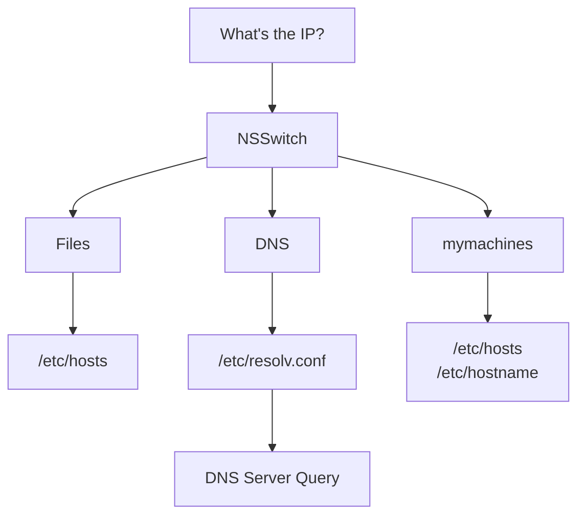

## 问题修复
* 好消息：问题解决了
* 坏消息：不知道问题出在哪里

排查的时候发现
* 在服务器上 `ping github.com` 能连通
* `nslookup github.com` 报错
* 测试 `nslookup api.githubcopilot.com 8.8.8.8`，能够连通

从后两者推断应该是 DNS 的问题，但是 `ping github.com` 又偏偏能走通。最后改了 `/etc/systemd/resolv.conf` 中的 DNS 设置解决了问题，但是还是不清楚原理。

## Linux DNS 服务器设置


参考：[Anatomy of a Linux DNS Lookup](https://zwischenzugs.com/2018/06/08/anatomy-of-a-linux-dns-lookup-part-i/#comments)


### Linux 中不存在明确的“DNS 查找”调用
首先要理解的是，在 Linux 上完成 DNS 查询并没有单一的方法。即：Linux 中不具有清晰接口的核心系统调用。以两个简单的标准程序为例： `ping` 和 `host` ：
```bash
ping -c1 bbc.co.uk | head -1
# PING bbc.co.uk (151.101.192.81) 56(84) bytes of data.
host bbc.co.uk | head -1
# bbc.co.uk has address 151.101.192.81
```

两者虽然得到了同一个 ip 地址，但是它们的查询路径并不同。这里继续引用参考文章的测试结果：
```bash
strace -e trace=open -f ping -c1 google.com
# open("/etc/ld.so.cache", O_RDONLY|O_CLOEXEC) = 3
# open("/lib/x86_64-linux-gnu/libcap.so.2", O_RDONLY|O_CLOEXEC) = 3
# open("/lib/x86_64-linux-gnu/libc.so.6", O_RDONLY|O_CLOEXEC) = 3
# open("/etc/resolv.conf", O_RDONLY|O_CLOEXEC) = 4
# open("/etc/resolv.conf", O_RDONLY|O_CLOEXEC) = 4
# open("/etc/nsswitch.conf", O_RDONLY|O_CLOEXEC) = 4
# open("/etc/ld.so.cache", O_RDONLY|O_CLOEXEC) = 4
# open("/lib/x86_64-linux-gnu/libnss_files.so.2", O_RDONLY|O_CLOEXEC) = 4
# open("/etc/host.conf", O_RDONLY|O_CLOEXEC) = 4
# open("/etc/hosts", O_RDONLY|O_CLOEXEC)  = 4
# open("/etc/ld.so.cache", O_RDONLY|O_CLOEXEC) = 4
# open("/lib/x86_64-linux-gnu/libnss_dns.so.2", O_RDONLY|O_CLOEXEC) = 4
# open("/lib/x86_64-linux-gnu/libresolv.so.2", O_RDONLY|O_CLOEXEC) = 4
# PING google.com (216.58.204.46) 56(84) bytes of data.
# open("/etc/hosts", O_RDONLY|O_CLOEXEC)  = 4
# 64 bytes from lhr25s12-in-f14.1e100.net (216.58.204.46): icmp_seq=1 ttl=63 time=13.0 ms
# [...]
```

```bash
strace -e trace=open -f host google.com
# [...]
# [pid  9869] open("/usr/share/locale/en_US.UTF-8/LC_MESSAGES/libdst.cat", O_RDONLY) = -1 ENOENT (No such file or directory)
# [pid  9869] open("/usr/share/locale/en/libdst.cat", O_RDONLY) = -1 ENOENT (No such file or directory)
# [pid  9869] open("/usr/share/locale/en/LC_MESSAGES/libdst.cat", O_RDONLY) = -1 ENOENT (No such file or directory)
# [pid  9869] open("/usr/lib/ssl/openssl.cnf", O_RDONLY) = 6
# [pid  9869] open("/usr/lib/x86_64-linux-gnu/openssl-1.0.0/engines/libgost.so", O_RDONLY|O_CLOEXEC) = 6[pid  9869] open("/etc/resolv.conf", O_RDONLY) = 6
# google.com has address 216.58.204.46
# [...]
```

可以看到，虽然 `ping` 访问了 `nsswitch.conf` ，但 `host` 却没有。而它们都访问了 `/etc/resolv.conf`。

### NSSwitch 与 `/etc/nsswitch.conf`
由上一个章节可以知道，应用程序在决定使用哪个 DNS 服务器时，可以按照自己的意愿行事。许多应用程序（如上述的 `ping` ）可以通过其配置文件 `/etc/nsswitch.conf` （还需要取决于 `ping` 具体实现）来引用 NSSwitch。

NSSwitch 不仅用于 DNS 查询，比如说它还能用于密码和 user lookup information（用户查找信息）的查询。NSSwitch 最初作为 Solaris 操作系统的一部分被创建，是为了让应用程序通过访问 NSSwitch 中的配置而非硬编码就能够查找这些信息的文件或服务。

输出 `/etc/nsswitch.conf` 的内容，形如：
```
# /etc/nsswitch.conf
#
# Example configuration of GNU Name Service Switch functionality.
# If you have the `glibc-doc-reference' and `info' packages installed, try:
# `info libc "Name Service Switch"' for information about this file.

passwd:         files systemd
group:          files systemd
shadow:         files
gshadow:        files

hosts:          files mdns4_minimal [NOTFOUND=return] dns mymachines
networks:       files

protocols:      db files
services:       db files
ethers:         db files
rpc:            db files

netgroup:       nis
```

现在关注是 `hosts` 这一行，看看它如何影响 `ping`。

#### 将 `hosts` 设置为 `hosts: files`
那么现在对 google.com 的 `ping` 请求将会失败：
```bash
ping -c1 google.com
# ping: unknown host google.com
```

但是不影响对于 `localhost` 的 `ping` 请求
```bash
ping -c1 localhost
# PING localhost (127.0.0.1) 56(84) bytes of data.
# 64 bytes from localhost (127.0.0.1): icmp_seq=1 ttl=64 time=0.039 ms
```

由于 `host` 命令不访问 NSSwitch，因此不受影响
```bash
host google.com
# google.com has address 216.58.206.110
```

#### 将 `hosts` 设置为 `hosts: dns`
此时对 google.com 的 `ping` 查询现在将成功
```bash
ping -c1 google.com
# PING google.com (216.58.198.174) 56(84) bytes of data.
# 64 bytes from lhr25s10-in-f174.1e100.net (216.58.198.174): icmp_seq=1 ttl=63 time=8.01 ms
```

但这次没有找到 localhost 
```bash
ping -c1 localhost
# ping: unknown host localhost
```

以下是默认情况下 NSSwitch 处理 `hosts` 查找的示意图：


### systemd-resolved 服务
从上一节的讨论中我们知道 `/etc/resolv.conf` 是 Linux 系统获取 DNS 的一个重要文件。而目前广泛使用的 systemd-resolved 服务又会对 `/etc/resolv.conf` 产生影响。


本节参考内容：[ArchWiki: systemd-resolved](https://wiki.archlinux.org/title/Systemd-resolved)


systemd-resolved 是一个 systemd 服务，它通过 D-Bus 接口、 resolve NSS 服务以及 127.0.0.53 上的本地 DNS 存根监听器 (stub listener)，为本地应用程序提供网络名称解析功能。有关使用方法请参阅 [systemd-resolved(8)](https://man.archlinux.org/man/systemd-resolved.8)。

为了向直接读取 `/etc/resolv.conf` 的软件（如网页浏览器、Go 和 GnuPG）提供域名解析服务，systemd-resolved 提供了四种不同的处理文件模式——存根模式 (stub)、静态模式 (static)、上行链路模式 (uplink) 和外部模式 (foreign)。在此，我们将仅关注系统推荐的模式，即使用 `/run/systemd/resolve/stub-resolv.conf` 的存根模式，此时 `/etc/resolv.conf` 被链接到 `/run/systemd/resolve/stub-resolv.conf` 上。

`/run/systemd/resolve/stub-resolv.conf` 这个文件的作用是将所有 DNS 请求引导到本机的 存根服务器（地址 127.0.0.53）进行处理，并且它包含了一组用于域名补全的搜索域列表。其内容通常为：
* `nameserver 127.0.0.53`: 这是文件中最关键的一行。它指定系统的唯一 DNS 服务器是本机环回地址 127.0.0.53 上的服务。这个地址就是 systemd-resolved 守护进程监听的 DNS 存根解析器。
* `search ...` 或 `domain ...`: 该文件还包含一行或多行，定义了“搜索域”列表。当你尝试解析一个不完整的域名（如 server 而不是 server.example.com）时，系统会自动尝试将这个域名依次与列表中的搜索域拼接（如 server.example.com, server.domain2 等）进行解析。

#### 设置 DNS 服务器
在存根和静态模式下，可以在 [resolved.conf(5)](https://man.archlinux.org/man/resolved.conf.5) 文件中设置自定义 DNS 服务器。通常是在 `/etc/systemd/resolved.conf` 文件下，或者 `/etc/systemd/resolved.conf.d/` 文件夹中设置。

设置内容如下：
```
[Resolve]
DNS=8.8.8.8 114.114.115.115
FallbackDNS=8.8.4.4
#Domains=
#LLMNR=no
#MulticastDNS=no
#DNSSEC=no
#DNSOverTLS=no
#Cache=no-negative
#DNSStubListener=yes
#ReadEtcHosts=yes
```

systemd-resolved 默认会同时向所有配置的主 DNS 服务器（`DNS=` 列表中的服务器）发送查询请求。如果访问失败，则会尝试 `FallbackDNS=` 中的内容。

## VSCode 插件（拓展）运行逻辑

参考：[VSCode: Extension Host](https://wiki.archlinux.org/title/Systemd-resolved)


### Extension Host configurations
**Extension Host**（拓展主机）是用于运行插件的 host。

根据 VS Code 的配置，会有多个 extension host 在不同的位置运行，且使用不同的运行时环境。
* 本地 (local) – 一个在本地运行的 Node.js extension host，与用户界面位于同一台机器上。
* web – 一个在浏览器或本地运行的 web extension host，与用户界面位于同一台机器上。
* remote – 在容器或远程位置运行的 Node.js extension host.

下表展示了在不同配置的 VS Code 中可用的 extension host：

| Configuration | local extension host | web extension host | remote extension host |
|---------------|----------------------|--------------------|-----------------------|
| VS Code on the desktop | ✔️ | ✔️ |  |
| VS Code with remote (Container, SSH, WSL, GitHub Codespace, Tunnel) | ✔️ | ✔️ | ✔️ |
| VS Code for the Web (vscode.dev, github.dev) |  | ✔️ |  |
| VS Code for the Web with Codespaces |  | ✔️ | ✔️ |

### 首选插件位置
插件运行的 extension host 取决于：
* 由 VS Code 配置提供的可用 extension host。
* 插件的功能：它能否在 Node.js 和/或 Web 中运行，或者如果未指明，它提供了哪些功能？
* 插件安装位置：在本地机器、远程机器，或两者兼有。
* 插件的首选位置： `extensionKind` 属性

`extensionKind` 是 extension list 中的一个属性。它允许插件指定首选运行位置 (workspace / ui)。如果扩展可以在两者上运行，则可以指定优先顺序。
* `"extensionKind": ["workspace"]` — 表示该插件需要访问工作区内容，因此需要在工作区所在的位置运行。这可以是本地机器、远程机器或 Codespace。大多数扩展都属于这一类别。
* `"extensionKind": ["ui"]` — 表示该扩展必须靠近用户界面运行，因为它需要访问本地资源、设备或功能，或者需要低延迟。在 VS Code for the Web 与 Codespaces 结合使用的情况下，由于没有本地扩展主机可用，此类扩展无法加载，除非它同时也是一个 Web 扩展。此时，它将在 Web 扩展主机中加载，但存在一个限制，即它无法实例化 Web Worker。
* `"extensionKind": ["ui", "workspace"]`：优先 ui
* `"extensionKind": ["workspace", "ui"]`：优先 workspace

### 如何在无法连接公网的服务器上使用 copilot
在配置文件中加入
```json
"remote.extensionKind": {
        "GitHub.copilot": ["ui"],
        "GitHub.copilot-chat": ["ui"],
    },
```

来源：https://linux.do/t/topic/60231
