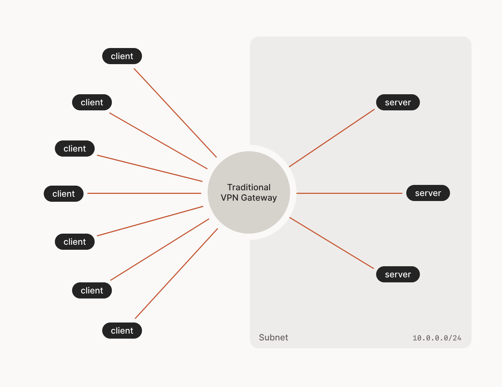
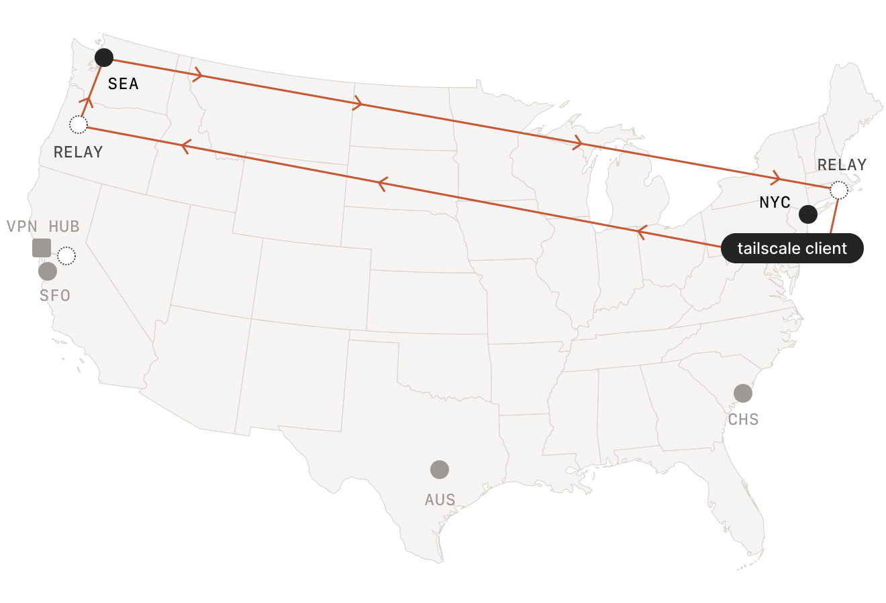
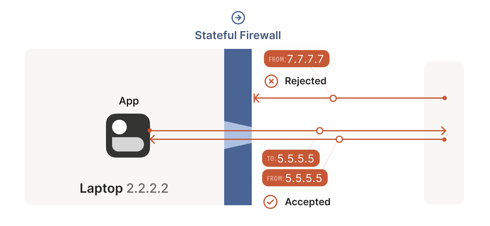
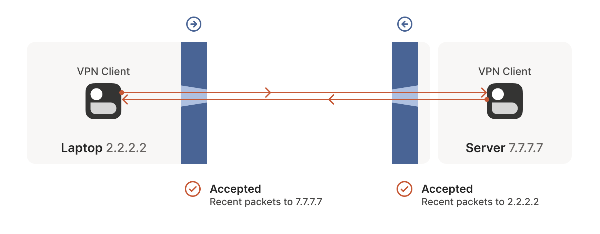
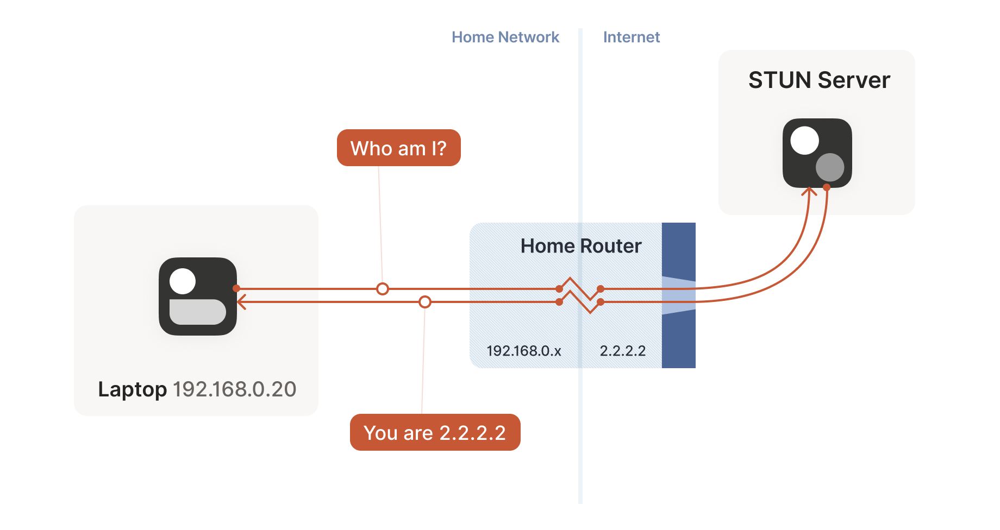

## Tailscale 的工作原理

内容来自 Tailscale 官网博客 [How Tailscale works](https://tailscale.com/blog/how-tailscale-works)


### 数据平面：WireGuard
Tailscale 的基础层是 WireGuard 包。WireGuard 能在用户的计算机、虚拟机或容器（WireGuard 称之为“端点(endpoint)”，Tailscale 称之为“节点(node)”）与网络中任何其他节点之间建立一套极其轻量级的加密隧道。

下面讨论一下数据平面组织的拓扑结构

#### 星型网络 (hub-and-spoke networks)

* 中心节点 (hub node) 通常拥有静态 IP 地址，并在防火墙上开放端口，便于所有节点访问。随后它可以接收来自其他 IP 地址节点的传入连接——即使这些节点本身位于防火墙之后——这种方式与客户端-服务器互联网协议的常规工作原理一致。
* 优点：需要连接的节点对比较少，并且由于中心节点有静态 IP、开放防火墙特定端口，因此便于实现节点间通信。
* 缺点：这种传统配置难以扩展。首先，远程用户与 VPN 集中器的距离可能较远；若距离过远，连接时将产生高延迟。其次，他们需要访问的数据中心可能也远离 VPN 集中器；若距离遥远，则再次产生高延迟。

#### 网状网络 (mesh networks) 

* WireGuard 隧道非常轻量级，可以支持构建这样的网络。
* 优点：节点直接之间通信比较优雅。
* 缺点：
  * 需要配置非常多密钥对：这个问题由下一节的登录认证解决。
  * 用户设备通常没有静态 IP 地址，可能随时移动（IP 地址变化），并且防火墙不是随时都方便打开的：这个问题由 NAT 穿透与 DERP 解决。

### 控制平面：密钥交换与协调
简而言之，有一个协调服务器（就是登录 Tailscale 的网站 login.tailscale.com）充当用于公钥交换的共享投递箱：
1. 每个节点会为自己生成一对随机的公钥/私钥，并将公钥与其身份标识相关联（详见下文登录部分）。
2. 节点联系协调服务器，留下其公钥以及关于该节点当前可被找到的位置及其所属域的记录。
3. 节点下载其域内的公钥和地址列表，这些信息由其他节点留在协调服务器上。
4. 节点使用适当的公钥集配置其 WireGuard 实例。

#### 登录与双重认证（2FA）
公钥的管理与 ssh 类似：用户无需对自己的 ssh 公钥保密，但选择将哪些公钥放入 `authorized_keys` 文件中很重要。因此协调服务器将哪些公钥发送给哪些节点这件事情需要身份认证，Tailscale 将身份验证的工作外包给 OAuth2、OIDC（OpenID Connect）或 SAML 提供商。身份提供商维护着用户账户下的用户列表、密码、双因素认证（2FA）设置等信息。

#### NAT 穿透

这里仅进行简单解释，详细信息在后面的 NAT 穿透的工作原理部分。


由于通常用户没有静态 IP 地址（就是在 NAT）后面，并且不太可能为 WireGuard 流量开放防火墙端口。为此，Tailscale 采用了基于互联网 STUN 和 ICE 标准的多种先进技术，使得用户在 NAT 阻隔的情况下也能实现 p2p 连接，并且避免了防火墙额外配置开放端口的需求。

#### 加密的 TCP 中继（DERP）
某些特别严苛的网络会完全封锁 UDP 协议，以至于单纯依靠 STUN 和 ICE 技术无法实现穿透。为此，Tailscale 部署了名为 DERP（数据包专用加密中继）的服务器网络，简而言之就是穿透失败的话就让流量走中转服务器。

## NAT 穿透的工作原理

内容来自 Tailscale 官网博客 [How NAT traversal works](https://tailscale.com/blog/how-nat-traversal-works)


实现 NAT 穿透有两个基本条件：
* 协议应基于 UDP（利用了 UDP 不需要握手的性质，从而让 NAT 背后的两台设备有同时开放 UDP 端口的机会）
* 用户需要直接控制用于发送和接收网络数据包的网络套接字（和后面 STUN 协议相关）
  * 套接字就是“IP地址 + 端口号 + 协议（TCP/UDP）”的组合，如果向 STUN 服务器发送请求用的套接字和后续向另一个节点通信用的套接字不同，那么在公网上就不能得到一个稳定的 `ip:port`。

然后需要解决两大障碍：有状态防火墙和 NAT 设备。

用户设备的“有状态防火墙”其实通常包含两层：
* NAT 设备（通常是路由器）本身具备流量过滤功能
* 电脑上安装的 Windows Defender 防火墙、Ubuntu 的 ufw（使用 iptables/nftables）、BSD 的 pf（macOS 也采用）以及 AWS 的安全组之类的软件。

### 状态防火墙的工作原理

这一部分暂时先不考虑 NAT，先直接认为两个节点在公网上都有一个 `ip:port` 对。


电脑上的防火墙都具有高度可配置性，但最常见的配置是允许所有"出站"连接并阻止所有"入站"连接。状态防火墙能够记住之前见过的数据包，并利用这些信息来决定如何处理新到达的数据包。

对于 UDP，规则为：防火墙在遇到一个入站的 UDP 数据包时，会检查这个数据包是否能对应上之前的某个出站数据包，如果能对应上，则允许该入站数据包进入。例如，如果笔记本从 `2.2.2.2:1234` 端口发送了一个 UDP 数据包到 `5.5.5.5:5678` 端口，这个通信过程会被记录；后续如果遇到来自 `5.5.5.5:5678` 并且发向 `2.2.2.2:1234` 的数据包，则允许传入。

#### 防火墙启动

标题的原文叫做“Firewall face-off”，其中 face-off 在这里可以理解成冰球比赛的开球。这个标题想表达的意思是：两个设备分别在自己的防火墙后面时，如何开启 UDP 通信？


利用前面讲到的防火墙对 UDP 的规则，已经可以实现一个 hub-and-spoke 的网络：作为 hub 的服务器有公网 IP，并且在防火墙上开放了对应端口，因此其他的 Client 能否方便地和 hub 建立连接，从而通过这个中转实现通信。

但是问题在于 Tailscale 希望构建任意两个 Client 都能 p2p 互联的网络，但是这个时候就遇到了问题：两个设备都不知道对方的 IP 以及在防火墙上对应的端口，因此不知道应该如何启动这个 UDP 通信过程。

#### 巧妙应对棘手的防火墙
为了让对等节点提前知晓对方使用的 `ip:port`，Tailscale 可以继续利用协调服务器：协调服务器可以用来给各个设备之间交换密钥，那么也可以用来交换 `ip:port` 信息。

接下来需要构架两个节点之间的 UDP 连接：对等节点开始互相发送 UDP 数据包，并且可以预料到部分数据包会丢失，不过这些数据包也不用携带重要信息。

假设两个节点分别为笔记本电脑和工作站，具体的构建流程为：
1. 笔记本电脑发出的首个数据包，从 `2.2.2.2:1234` 发往 `7.7.7.7:5678`，经过 Windows Defender 防火墙并传输至互联网。另一端的公司防火墙因无 `7.7.7.7:5678` 与 `2.2.2.2:1234` 通信记录而拦截该数据包。但此刻 Windows Defender 已记住：需预期并允许来自 `7.7.7.7:5678` 发往 `2.2.2.2:1234` 的响应数据包。
  
2. 接下来，工作站的第一个数据包从 `7.7.7.7:5678` 发送至 `2.2.2.2:1234` 通过企业防火墙并穿越互联网。当它到达笔记本电脑时，Windows Defender 认为“啊，这是对我之前看到的那个出站请求的响应”，于是放行该数据包。此外，企业防火墙现在会记住，它应该期待从 `2.2.2.2:1234` 到 `7.7.7.7:5678` 的响应，并且这些数据包也是允许通过的。
  
3. 收到来自工作站的包后，笔记本电脑受到激励，发送另一个包返回。它穿过 Windows Defender 防火墙，经过企业防火墙（因为这是对先前发送包的“响应”），最终抵达工作站。双向连接成功建立。
  

#### 创建连接注意事项
上述连接想要建立，需要两个端点必须大致在同一时间尝试通信，以便在双方仍在线时所有中间防火墙都能开放。一种方法是让对等方持续重试，但这很浪费资源，因此希望双方都知道在同一时间开始建立连接。

在 Tailscale 中，协调服务器与 DERP（Detour Encrypted Routing Protocol，迂回加密路由协议）服务器共同构成旁路信道系统，用于帮助两个节点同时尝试通信。

除此之外，状态防火墙的内存有限，如果一段时间内未检测到数据包（UDP 的常见超时值为 30 秒），防火墙会忘记该会话。这意味着节点之间需要定期通信以保持连接活跃，比如使用计时器定期发送数据包，或者通过某种带外方式按需重新启动连接。

### NAT 的本质
可以将 NAT（Network Address Translator，网络地址转换）设备视为带有额外烦人功能的状态防火墙：除了所有状态防火墙的功能外，它们还会在数据包通过时修改其内容。

#### 穿越 NAT 网络
NAT 被用来解决私有 IP 无法在互联网访问数据的问题：比如用户的笔记本希望从 `192.168.0.20:1234` 发送数据到 `7.7.7.7:5678`，由于前者是私有 IP，因此提供 NAT 的机器会从其公网 IP 地址中选取一个未使用的 UDP 端口（以 `2.2.2.2:4242` 为例），并创建 NAT 映射来建立对应关系：局域网侧的 `192.168.0.20:1234` 等同于互联网侧的 `2.2.2.2:4242`。

#### STUN 协议研究
如果两个对等节点都在 NAT 背后，那么面临的问题比仅仅有状态防火墙更麻烦：在对方发送数据包之前，根本不存在 `ip:port` 映射，因为 NAT 映射仅在向互联网发送出站流量时才会创建。这就导致双方都需要先发送数据，但彼此都不知道该向谁发送，且必须等到对方先发送数据才能确定目标。

这个时候可以利用 STUN 协议来帮助解决这个问题。STUN 协议的工作是：用户设备向 STUN 服务器发送一个“从你的视角看，我的终端地址是什么？”的请求，服务器则回复“这是我看到你的 UDP 数据包来源的 `ip:port`”。这样就获得了双方设备在公网上的 `ip:port` 对。

#### 不同的 NAT 设备
前面在借助 STUN 协议的时候其实用到了一个假设：当 STUN 服务器告诉节点其 `ip:port` 为 `2.2.2.2:4242` 时，整个互联网都会将节点视为 `2.2.2.2:4242`。从这一角度来看，任何人都可以通过 `2.2.2.2:4242` 访问 NAT 后的节点。

但是某些 NAT 比较复杂，当通信目标不同时，它们会创建不同的 NAT 映射，导致前面的假设失效。如下图所示

不同的 NAT 可以依据防火墙和 NAT 映射策略分成如下几类：

| | Endpoint-Independent NAT mapping | Endpoint-Dependent NAT mapping (all types) |
| :--- | :--- | :--- |
| **Endpoint-Independent firewall** | 全锥型 NAT  (Full Cone NAT) | N/A* |
| **Endpoint-Dependent firewall** (dest. IP only) | 受限锥型 NAT  (Restricted Cone NAT) | N/A* |
| **Endpoint-Dependent firewall** (dest. IP+port) | 端口受限圆锥型 NAT  (Port-Restricted Cone NAT) |  对称型 NAT  (Symmetric NAT) |

\* *理论上可能存在，但在实际中不会出现*

不过对于 NAT 穿透的难度来说，实际上只用关心 NAT 的映射策略。因此只有对称性 NAT 会对 NAT 穿透产生巨大的难度。
