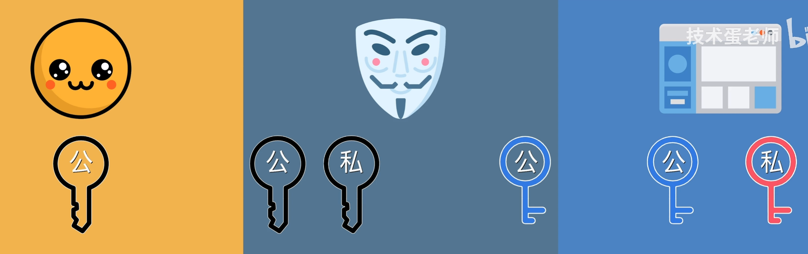
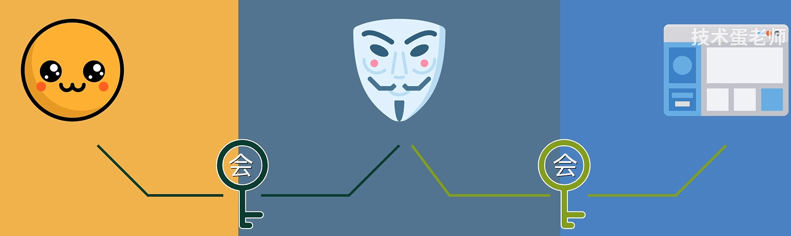
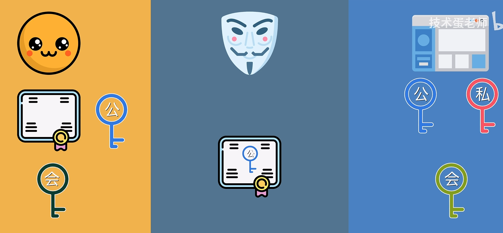
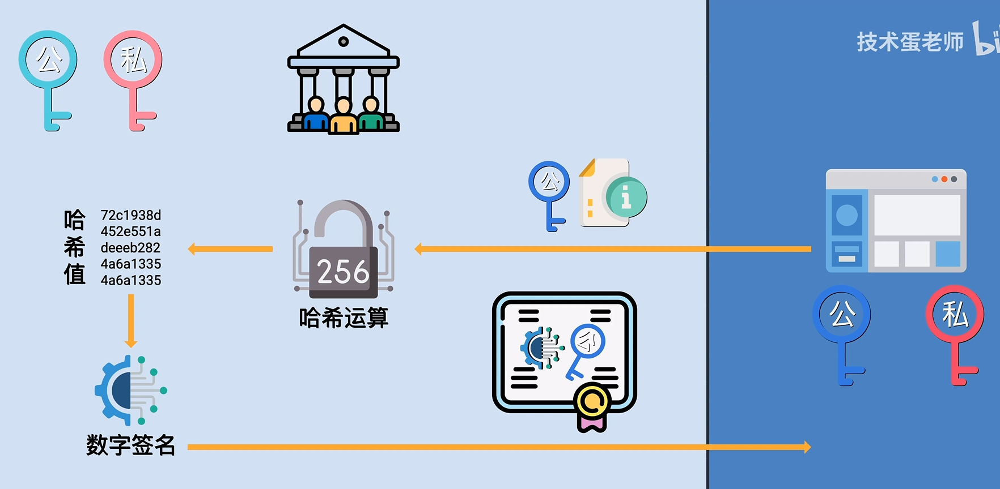
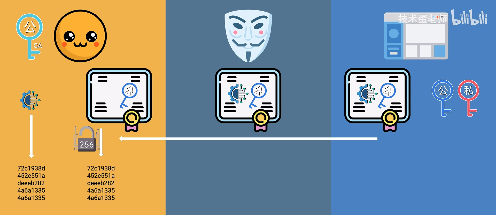
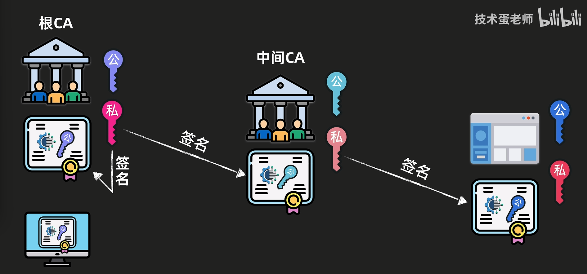
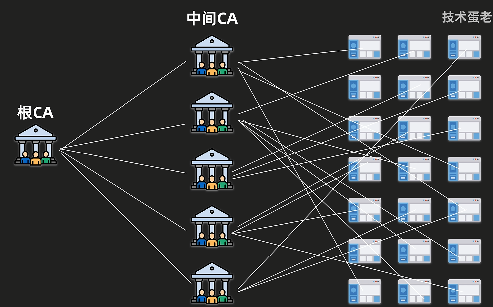
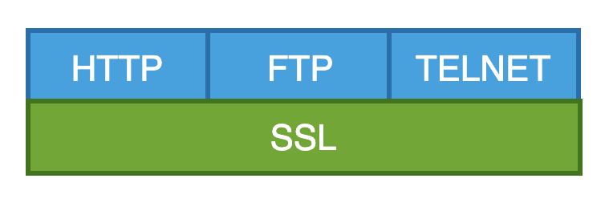
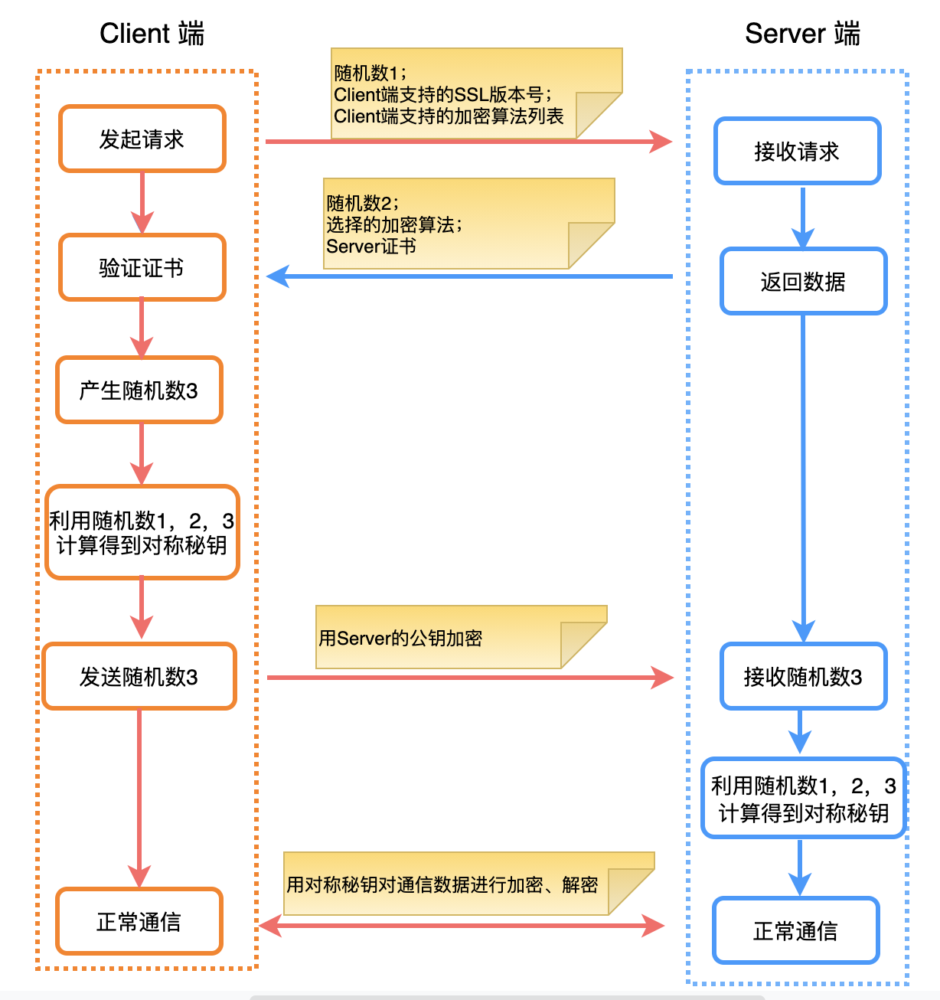
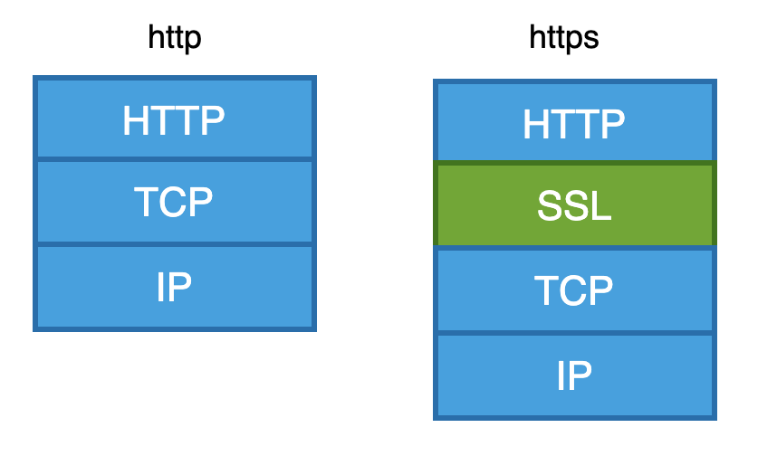


内容来自：
* [数字签名和CA数字证书的核心原理和作用](https://www.bilibili.com/video/BV1mj421d7VE)
* [关于加密、证书的那些事](https://www.cnblogs.com/sewain/p/14250884.html#ssltls)


## 数据加密
如果访问以 http 开头的网站，浏览器通常会提示网站不安全。这是因为仅仅使用 http，相当于和浏览器客户端和网站服务器之间使用明文传输数据，如果中间有人刻意记录收发的网络信息，用户的的账号密码等信息就会暴露给中间人。这就是没有 https 的第一个缺点：保证不了数据的机密性。此时一个比较直接的解决方法就是对数据进行加密。

### 对称加密
具体而言，就是用户和网站之间需要有一模一样的私钥。这把私钥可以理解为某种数学运算，利用私钥对字符串进行加密得到密文，中间人即使截获了信息也无法理解，而接受方接收到密文之后重新用私钥解密得到明文，就能实现信息的加密沟通。除此之外，私钥也是有使用期限的，用户和网站之间的每一次会话都会生成一把新的私钥（这里把这样有期限的私钥统称为会话密钥）。现在中间人要破解所有会话就更困难了。

但是对称加密的问题在于，既然用户和网站之间需要不能公开的会话密钥，那么两者之间通过非网络的方式约定密钥（否则密钥也可能被窃取），这显然是不现实的。

### 非对称加密
在非对称加密中有两把不同的钥匙，一把对信息进行加密，另一把能对信息进行解密。这两把钥匙利用算法同时生成。那么网站就可以生成一把公钥和一把私钥，并且把公钥发给用户。用户利用公钥加密信息，发送给网站，网站再利用私钥进行解密。中间人虽然可以截获公钥内容以及加密后的数据，但是由于没有私钥，也无法破解出明文。这就解决了用户与网站之间发送与协商会话密钥的问题。（协商完成之后使用对称加密，是因为对称加密效率更高。）

但是假如当网站把公钥用户时，中间人截获了公钥，并且生成了自己的一对公钥和私钥，然后把自己的公钥再发送给用户。用户利用中间人的公钥加密信息，发送给网站，中间人再次截获，并且用自己的私钥解密，成功获取用户信息。之后中间人篡改用户信息，再将其利用网站私钥加密，并且发送给网站，网站利用自己的私钥解密得到的就是被篡改的信息。

在这种情况下会生成两把不同的会话密钥，一边是用户和中间人的，另一边是中间人和网站的。用户和网站之间的通信完全被中间人截获，并且可以篡改。

## 数字证书
可以看出问题出在公钥上，用户无法知道公钥是否来自网站。此时就需要一个第三方来解决公钥的信任问题，这个第三方即为证书颁发机构 (Certificate Authority)，简称 CA。

此时网站会先把公钥放到大家都信任的第三方 CA，CA 再根据这把公钥以及其他信息生成了数字证书，数字证书用于向用户证明公钥属于用户访问的目标网站。于是网站在与用户进行加密协商之前将数字证书发送给用户，用户看到数字证书属于信任的 CA，于是从数字证书中取出公钥，后续生成会话密钥。

接下来需要确认的问题是：数字证书是否真的是由信任的 CA 颁发而非中间人伪造。

### 数字签名
数字签名用于验证数字证书确实来自 CA。CA 在接收到来自网站的信息以及公钥之后，会首先对其进行哈希运算。之后 CA 生成一对专门用于数字证书的公钥和私钥，然后用私钥加密哈希字符，得到数字签名。CA 把含有数字签名的证书发送给网站，如果证书的内容或者公钥后续被修改，那么就会无法与数字签名匹配。

用户访问网站时从网站得到含有 CA 签名的数字证书，为了证明没有中间人更改过公钥，那么可以利用 CA 签名时生成的公钥对签名进行解密，得到哈希值；然后再对证书内容进行哈希运算，再得到一个哈希值。如果两个哈希值相等，那么说明数字证书没有被篡改。

### 证书链
按照前面的流程，网站生成的公钥和私钥保证了能够可靠地生成会话密钥；CA 利用私钥给证书签名保证了网站证书以及其中公钥的真实性。但是 CA 还需要将公钥交给用户，CA 公钥的真实性同样需要保证。这个时候同样也需要另一个 CA 颁发数字证书并且签名，这就是证书链。证书链的最后一个 CA 称为根 CA。

而根 CA 的公钥也需要证书和签名，这个工作由根 CA 自己完成。用户的操作系统和浏览器中会预先安装根 CA 的证书，这样也保证了根 CA 证书的真实性。

这种根 CA - 中间 CA - 网站的结构是为了更好的可靠性。这样即使其中有一家中间 CA 的私钥被破解了，也不至于影响到全局。

## SSL/TSL
SSL 全称是 Secure Socket Layer (安全套阶层协议)，它是一个安全协议，目的是用来为互联网提供安全的数据传输。SSL 协议有 1，2，3 这个三个版本，TLS (Transport Layer Security) 是 SSL V3 标准化之后的产物。TLS 由互联网工程任务组 (Internet Engineering Task Force, IETF) 提出，协议的第一个版本于 1999 年发布。最新版本是 TLS 1.3，发布于 2018 年。

SSL/TSL 在工作过程中，就利用了前面描述的概念：对称加密、非对称加密、证书等。并且 SSL/TSL 协议最大的优点就是与应用层无关，在上层可以运行一些高层应用协议，例如：HTTP, FTP, TELNET...，也就是说这些高层协议可以透明的建立在SSL协议层之上。

### SSL/TSL 握手流程
握手就是指客户端与服务端在通信的开始阶段进行鉴权和协商，最终目的是：
* 确认对方是合法的通信对象;
* 与对方协商得到对称加密秘钥。

前面关于加密与证书的内容其实已经包含了一部分握手流程，这里将其形式化表达。

1. Client 向 Server 发送：
   * 随机数 1；
   * Client 端支持的 SSL/TSL 版本号；
   * Client 端支持的加密算法列表。
2. Server 分析接收到的信息，返回如下信息给 Client:
   * 随机数 2；
   * 选择的加密算法；
   * Server 证书
3. Client 端验证 Server 发来的证书是否有效。
   * 如果验证失败，通信结束；
   * 如果验证通过，就产生随机数 3，并使用刚才的随机数 1、随机数 2，然后用选择的算法生成一个对称加密秘钥，这个秘钥就用于后面正常的数据通信中。
   * 然后发送如下信息给 Server:
     * 随机数 3，并且用 Server 证书中的公钥进行加密；
     * 此时，Client 端的握手流程结束，因为已经达到了握手的最终目的：确认 Server 合法，得到对称加密秘钥。
4. Server 端在接收到加密后的随机数 3 时，用自己的私钥进行解密，然后和之前的随机数 1、随机数 2 一起，使用相同的算法生成对称加密秘钥。

至此，Server端的握手过程也就结束，下面就可以用对称加密秘钥来对数据进行加密了。


上面描述的握手过程中是单向认证，也就是 Client 端验证 Server 是否合法的。如果需要双向认证，那么客户端也应该把自己的证书发送给 Server，然后 Server 来验证这个证书是否合法，确认证书合法之后才继续执行后面面的握手流程。


### HTTPS 与 SSL 的关系
HTTPS 拆开来就是：HTTP+SSL，就是在 HTTP 的下面增加了 SSL/TSL 安全传输协议层。在浏览器连接到服务器之后，就执行上面描述的 SSL 握手过程。握手结束之后，双方得到对称加密秘钥，在 HTTP 协议看来是明文传输数据，下面的 SSL/TSL 层对数据进行加密和解密。

