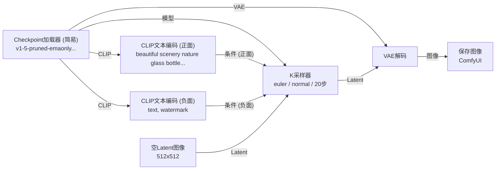

## AI 绘图的底层逻辑

要理解 ComfyUI 中的每一个节点，首先需要了解 Stable Diffusion 的工作原理。

### 扩散模型：从噪声到图像

Stable Diffusion 属于**潜空间扩散模型（Latent Diffusion Model，LDM）**。它的核心思想来自扩散过程：
1. **正向扩散（加噪）**：训练阶段，对一张真实图像反复添加高斯噪声，直到图像变成纯噪声。模型通过学习这个过程的逆操作来掌握"如何去噪"。
2. **反向扩散（去噪/推理）**：推理阶段，从一张随机噪声图出发，模型通过若干步骤逐步预测并去除噪声，最终还原出一张清晰图像。

之所以称为"潜空间"扩散，是因为整个去噪过程并不在像素空间进行，而是在一个维度更低的**潜变量空间（Latent Space）** 中完成，这大幅降低了计算量。最终再通过 VAE 解码器将潜变量映射回像素图像。

```
随机噪声 (Latent)
     │
  [U-Net 去噪，共 N 步]  ← 由 CLIP 文本编码的条件引导
     │
 干净的潜变量 (Latent)
     │
  [VAE 解码]
     │
  最终图像 (像素空间)
```

### 文本如何引导图像生成？

模型在去噪时并不是"盲目"操作的，它需要一个**条件信号**来决定生成什么内容。这个条件信号就来自 **CLIP 文本编码器**。

CLIP（Contrastive Language-Image Pre-Training）是 OpenAI 提出的多模态模型，它能将文字和图像映射到同一个语义空间中。文本编码器将提示词（Prompt）转换为一个高维向量序列，U-Net 在每一步去噪时通过 **Cross-Attention** 机制参考这个向量，从而让去噪的方向朝着"符合描述"的图像收拢。

### CFG：无分类器引导

在推理时，模型实际上会同时进行两次预测：
- 一次依据提示词（有条件）
- 一次不依据提示词（无条件，即负面提示词方向）

最终的去噪方向由以下公式加权合并：

$$
\tilde{\epsilon} = \epsilon_{\text{uncond}} + w \cdot (\epsilon_{\text{cond}} - \epsilon_{\text{uncond}})
$$

其中 $w$ 就是 **CFG Scale**（即 K 采样器中的 `cfg` 参数）。$w$ 越大，生成结果越贴近提示词，但也可能出现过饱和或失真；$w$ 越小，图像越自由、发散。


## 最简单的工作流解析

下图展示了 ComfyUI 中最基础的文生图（txt2img）工作流：



整个流程由 6 个节点构成，数据从左到右流动。下面逐一拆解每个节点的职责。

### Checkpoint 加载器

```
模型文件：v1-5-pruned-emaonly-fp16.safetensors
输出：模型 / CLIP / VAE
```

**Checkpoint** 是整个生成系统的核心，它是一个"大模型包"，内部集成了三个子模块：

| 子模块 | 作用 |
|--------|------|
| **U-Net** | 去噪网络，负责在潜空间中执行每一步去噪 |
| **CLIP 文本编码器** | 将提示词转换为语义向量 |
| **VAE** | 在像素空间与潜空间之间进行编解码 |

Checkpoint 加载后会将这三者分别输出，供后续节点使用。文件名中的 `fp16` 表示使用半精度浮点数存储，节省显存；`pruned` 表示裁剪了训练相关权重，仅保留推理权重；`ema` 是 Exponential Moving Average 权重，推理质量更好。

> Checkpoint 文件通常较大（2 GB～7 GB），存放于 `models/checkpoints/` 目录。

### CLIP 文本编码（正向 & 负向）

```
正向提示词：beautiful scenery nature glass bottle landscape, purple galaxy bottle,
负向提示词：text, watermark
输出：条件向量（Conditioning）
```

工作流中有两个 CLIP 文本编码节点，分别对应**正向提示词**和**负向提示词**，两者都从 Checkpoint 的 CLIP 端口获取编码器。

- **正向提示词（Positive Prompt）**：描述你希望图像中出现的内容。
- **负向提示词（Negative Prompt）**：描述你**不希望**出现的内容。借助前面提到的 CFG 机制，负向提示词将作为无条件方向，引导生成结果远离这些描述。

两个节点的输出（条件向量）分别接入 K 采样器的"正面条件"与"负面条件"端口。

### 空 Latent 图像

```
宽度：512   高度：512   批量大小：1
输出：Latent 张量
```

这个节点创建一块**随机初始化的噪声潜变量**，作为去噪的起点。尺寸设置的是潜空间中的尺寸，实际对应的像素分辨率需要乘以 VAE 的压缩倍率（SD 1.x 中为 8 倍），因此 `512×512` 的 Latent 对应最终 `512×512` 的像素图像（潜空间为 `64×64`）。

批量大小（Batch Size）控制一次生成几张图。

### K 采样器（KSampler）

```
种子：156680208700286    步数：20
cfg：8.0                采样器：euler
调度器：normal          降噪：1.00
```

K 采样器是整个工作流的**核心执行引擎**，它将所有输入汇聚在一起，驱动去噪过程：

| 参数 | 含义 |
|------|------|
| **种子（Seed）** | 随机数种子，相同种子在其他条件不变时可复现结果 |
| **步数（Steps）** | 去噪迭代次数。步数越多细节越丰富，但耗时增加；通常 20～30 步足够 |
| **CFG Scale** | 文本引导强度，见上文公式。常用范围 6～12 |
| **采样器（Sampler）** | 去噪算法，如 `euler`、`dpm++2m`、`ddim` 等，影响图像风格与收敛速度 |
| **调度器（Scheduler）** | 控制每步噪声衰减的曲线，如 `normal`、`karras`，与采样器配合使用 |
| **降噪（Denoise）** | 去噪强度，`1.0` 表示从纯噪声开始（txt2img）；图像精修（img2img）时可设为 0.5～0.8 |

K 采样器完成后输出一个"干净"的潜变量，传递给 VAE 解码器。

### VAE 解码

```
输入：Latent + VAE
输出：像素图像
```

**VAE（Variational Autoencoder，变分自编码器）** 承担空间转换的职责：

- **VAE 编码器（Encoder）**：将像素图像压缩为潜变量（用于 img2img 场景）。
- **VAE 解码器（Decoder）**：将潜变量还原为像素图像（本工作流使用此步骤）。

SD 1.x 中 VAE 将图像压缩为原来的 $\frac{1}{8}$，即 `512×512` 像素 → `64×64` 潜变量。解码时，VAE 会补全潜变量中没有表达的高频细节，因此 VAE 的质量直接影响图像的色彩准确性和细节锐度。

> Checkpoint 内置了 VAE，但也可以单独加载外部 VAE 文件（存放于 `models/vae/`）来替换，以改善某些模型默认 VAE 色彩偏灰的问题。

### 保存图像

将解码后的像素图像写入磁盘，文件名前缀默认为 `ComfyUI`。


## ComfyUI 模型文件目录结构

ComfyUI 将不同类型的模型文件按功能分类存放在 `models/` 目录的各个子文件夹中。

| 文件夹名称 | 中文简称 / 对应模型 | 详细作用与存放的文件说明 |
| :--- | :--- | :--- |
| **audio_encoders** | 音频编码器 | 存放处理音频输入的模型（如 Whisper 等），常用于音频驱动动画或嘴型同步等特殊工作流。 |
| **checkpoints** | 主模型 / 大模型 | 存放完整的生成模型（通常打包了 UNet、VAE 和 CLIP）。常见后缀为 `.safetensors` 或 `.ckpt`（如 SD 1.5, SDXL 的主模型）。 |
| **clip** | CLIP 文本编码器 | 存放独立的 CLIP 文本编码模型。用于将你的提示词（Prompt）翻译成 AI 能理解的特征向量。 |
| **clip_vision** | CLIP 视觉编码器 | 存放图像特征提取模型。常用于 IP-Adapter 工作流，让 AI 能够“看懂”你提供的参考图并提取其风格或特征。 |
| **configs** | 配置文件 | 存放 YAML 格式的模型结构配置文件。加载某些特殊架构或老版本模型时需要用到。 |
| **controlnet** | 控制网模型 | 存放 ControlNet 模型（如深度图、Canny 线稿、OpenPose 骨架控制等），用于对生成的构图和姿势进行精确引导。 |
| **diffusers** | Diffusers 格式模型 | 存放以 Hugging Face Diffusers 文件夹结构（包含多个子文件夹和 `model_index.json`）保存的模型，而不是单文件模型。 |
| **diffusion_models** | 独立扩散模型 | 存放纯粹的扩散核心网络（如纯 UNet 或 DiT），不包含 VAE 和文本编码器。在最新的 Flux 或 SD3 工作流中经常用到。 |
| **embeddings** | 文本反转 / 嵌入模型 | 存放 Textual Inversion 模型（通常称为 TI 或 embeddings）。体积很小（KB 级别），常用于特定画风、人物特征或负面提示词（如 `EasyNegative`）。 |
| **gligen** | GLIGEN 模型 | 存放 GLIGEN 权重文件，用于基于边界框（Bounding Box）进行高度精准的局部物体位置控制生成。 |
| **hypernetworks** | 超网络模型 | 早期的一种微调模型格式，类似于 LoRA 的前身。目前已被 LoRA 大量取代，较少使用。 |
| **latent_upscale_models** | 潜空间放大模型 | 存放专门在 Latent（潜空间）层面进行分辨率放大的算法模型。 |
| **loras** | LoRA 微调模型 | 存放低秩适应模型。体积通常在几百 MB，用于在主模型基础上叠加特定的人物脸型、画风、服装或概念。 |
| **model_patches** | 模型补丁 | 存放用于修补或动态修改底层模型网络结构的文件（较为少见的高级用法）。 |
| **onnx** | ONNX 格式模型 | 存放转换为 ONNX 格式的模型，通常配合特定节点用于 TensorRT 硬件加速计算。 |
| **photomaker** | PhotoMaker 模型 | 存放专用于 PhotoMaker 节点的模型，常用于高质量的人物 ID 保持和换脸/面部定制工作流。 |
| **sams** | SAM 分割模型 | 存放 Segment Anything Model 模型，用于在图像中进行极为精确的自动抠图和蒙版（Mask）生成。 |
| **style_models** | 风格模型 | 存放专门的风格迁移模型（如特定的 Style Adapter 等），用于提取和应用参考图的艺术风格。 |
| **text_encoders** | 文本编码器 | 类似于 `clip` 文件夹，但通常用于存放体积更庞大的独立文本模型（例如 SD3 或 Flux 使用的 `t5xxl` 模型文件）。 |
| **ultralytics** | 目标检测模型 | 存放基于 YOLO 等架构的检测模型，常用于自动检测人脸、手部（配合类似于 ADetailer 的局部重绘工作流使用）。 |
| **unet** | UNet 模型 | 作用与 `diffusion_models` 类似，专门用于存放提取出来的单文件 UNet 结构模型。 |
| **upscale_models** | 像素级放大模型 | 存放常规的高清放大算法模型（如 ESRGAN, SwinIR, RealESRGAN 等）。它们直接作用于最终生成的像素图像。 |
| **vae** | 变分自编码器 | 存放单独的 VAE 模型。它的作用像翻译官，负责在 AI 计算的“潜空间（Latent）”和你肉眼能看到的“像素图像”之间进行转换（解码/编码）。 |
| **vae_approx** | 近似 VAE 模型 | 极轻量级的 VAE 模型。主要配合某些节点，让你在生图的过程中能快速预览潜空间中正在生成的模糊图像。 |


## 小结

通过最简单的 txt2img 工作流，可以梳理出 Stable Diffusion 的完整推理链路：

$$
\text{文本提示词} \xrightarrow{\text{CLIP}} \text{条件向量} \xrightarrow{\text{K采样器 (U-Net × N步)}} \text{干净 Latent} \xrightarrow{\text{VAE 解码}} \text{像素图像}
$$

ComfyUI 以节点图的形式将这条链路完全暴露出来，每个节点对应一个明确的计算模块。理解了各模块的职责，就能在此基础上灵活组合更复杂的工作流，例如加入 ControlNet 控制构图、使用 LoRA 调整风格、或通过 img2img 对已有图像进行精修。
