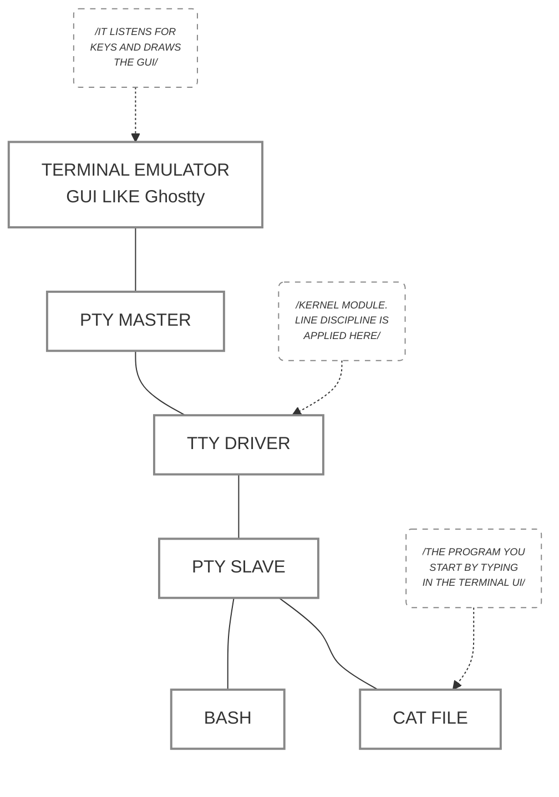


内容翻译自 [Linux terminals, tty, pty and shell](https://dev.to/napicella/linux-terminals-tty-pty-and-shell-192e)，有一定修改。


## 什么是终端（terminal）
历史上，终端是一种相对简单的机电设备，具备输入接口（如键盘）和输出接口（如显示器或纸张）。它通过两个逻辑通道连接到另一个设备（如计算机），其唯一功能是：
* 将按键发送至第一行
* 从第二行开始读取并在纸上打印出来

这类设备的商业名称是电传打字机（Teletypewriter，其中最著名的品牌为 Teletype，以至于可以将两者等价），其简称为 TTY。这些机器为早期的大型机和小型计算机提供用户界面，将键入的数据发送至计算机并打印出响应。

要理解现代终端的工作原理，就需要先简单了解过去电传打字机的工作方式。每台机器通过两根信号线连接到电脑：一根用于向计算机发送指令，另一根用于接收计算机的输出。这两根信号线被汇聚到一根串口线中，并插入计算机的通用异步收发器（UART）接口。

计算机中运行着 UART 驱动程序，负责从硬件设备读取数据。读取到的字符序列会被传递给 TTY 驱动程序，由该驱动应用“线路规程（Line discipline）”。线路规程负责转换特殊字符（例如换行符、退格键），并将接收到的字符回显（Echoing）给终端（teletype），以便用户能看到自己刚才输入了什么。

此外，线路规程还负责对这些字符进行缓冲（Buffer）。当用户按下回车键时，缓冲区内的数据会被传递给当前 TTY 关联会话的前台进程（Foreground process）。作为用户，你可以同时并行执行多个进程，但同一时刻只能与其中一个进行交互，并让其他进程在后台运行（或等待）。上述定义的这一整套技术栈，统称为一个 TTY 设备（TTY device）。

接收这些数据的前台进程，通常是一个名为 Shell 的计算机程序。


提示（Gotcha）：在日常交流中，“终端”和“TTY 设备”这两个词基本是可以互换使用的，因为它们指代的其实是同一个东西。


## 什么是 shell
Shell 属于用户态（User space）应用程序，它们调用内核 API 的方式与其他普通应用程序完全相同。

Shell 通过提示用户进行输入、解析这些输入，并处理来自底层操作系统的输出来管理用户与系统之间的交互（这非常类似于“读取-求值-输出”循环，即 REPL）。

例如，如果你输入了 `cat file | grep hello`，Bash 会解析这条指令，判断出它需要运行 `cat` 程序并将 `file` 作为参数传递给它，然后将输出结果通过管道（`pipe`）传递给 `grep`。

Shell 还可以控制程序的执行（这项功能被称为作业控制，Job control）：它可以终止程序（`Ctrl + C`）、挂起程序（`Ctrl + Z`），以及将程序设置为在前台（`fg`）或后台（`bg`）运行。

此外，Shell 也可以在非交互模式下运行，即通过执行包含一连串命令的脚本（script）来工作。Bash、Zsh、Fish 和 sh 都是不同流派（或风格）的 Shell。

## 什么是终端模拟器（terminal emulator）
让我们把目光转向离现在更近的时代。计算机开始变得越来越小，所有的组件都被塞进了一个单一的机箱里。

这是终端首次不再是通过 UART 连接到计算机的物理设备。终端变成了一段软件程序，它在软件层面上模拟物理终端设备的行为，因此得名“终端模拟器”。请注意，尽管它们是模拟出来的，但在过去和现在，它们在系统中仍被称为 Teletypes（TTY）。

第一代的终端模拟器是直接运行在系统内核中的。 这个内核程序会直接将字符发送给 TTY 驱动，并从驱动中读取字符打印到屏幕上。


别被“模拟器”这个词给骗了，这种内核级的终端模拟器和过去的物理终端一样“笨”，它只是监听来自硬件键盘的事件，并将其向下发送给驱动程序。唯一的区别在于，这里不再有物理设备或线缆连接到 TTY 驱动上了。


那么如何才能看到一个由内核模拟的 TTY 呢？如果你的机器上运行着 Linux 操作系统，请按下 `Ctrl+Alt+F4`。你就会看到一个由内核模拟出来的纯文本 TTY！你可以通过按下 `Ctrl+Alt` 配合功能键（`F3` 到 `F6`）来切换到其他的 TTY。按下 `Ctrl+Alt+F1`，你就能回到图形用户界面。


上面关于调出内核模拟的 TTY 的使用按键与原文不同。通过在现代 Linux 电脑上测试，发现 Ctrl+Alt+(F1/F2) 通常分配给了图形界面会话；后面几个按键（如 F3~F6）才会进入纯文本的 TTY 虚拟控制台。


让我们来回顾一下到目前为止的核心概念：
* 终端（Terminal）和 TTY 这两个词可以互换使用。
* 电传打字机（Teletype/TTY）原本是为电报设计的物理机电设备，后来被改造用于向大型机发送输入并获取输出。
* 终端模拟器泛指一切用软件模拟物理终端的程序。早期它作为一个模块运行在内核中（虚拟控制台），而现代则演变成了运行在图形界面上的应用程序。

## 什么是伪终端（PTY）
随着图形界面的普及，我们不再满足于只对着全屏的黑底白字敲命令。这就催生了现代的用户态终端模拟器（例如我们在桌面环境下常用的 iTerm2、Ghostty 或 Windows Terminal）。

但是，底层的命令行程序（如 Bash、Vim）非常“死板”，它们只认传统的 TTY 设备，不知道如何直接与这些现代桌面软件沟通。为了在这两者之间搭桥，操作系统引入了伪终端（PTY）的通信机制。PTY 本质上是内核提供的一对虚拟设备接口（包含主控端 Master 和从设备端 Slave）。它本身并不是那个带图形界面的桌面程序，而是一条专门为桌面程序准备的“数据管道”。

将其与早期（内核模拟的）TTY 进行比较，两者的核心架构发生了本质变化：
* 在过去，内核既要负责底层的线路规程，又要负责直接控制显卡在屏幕上画出字符；
* 而在现代 PTY 架构中，终端界面的渲染和按键捕获被彻底移出了内核。内核现在只负责维护 PTY 这根“通信管道”和原有的 TTY 逻辑（如会话管理），而真正与用户交互、画出窗口的，变成了普通的用户态程序。

为什么要做这种架构迁移？因为运行在内核中的程序拥有极高的特权。如果早期的内核终端驱动出了 Bug，整个系统都可能直接崩溃（Kernel Panic）；但在 PTY 架构下，如果你的终端软件（比如 Ghostty）卡死了，它只会影响这个软件本身。内核和底层的通信管道依然安全，最坏的情况下，你只需 kill 掉卡死的软件重新打开即可。

毫无疑问，这是一个极其优雅的设计。PTY 的存在，使得终端模拟器可以放心地向用户态迁移并发展出千变万化的形态（多标签页、GPU 加速渲染），同时又完美欺骗了底层的 Shell，让它们依然以为自己连接着一台老式的物理电传打字机。

## 它是如何运作的？（宏观架构）
终端模拟器（或任何其他程序）可以向系统内核申请一对字符设备文件，分别称为 PTY Master（主控端） 和 PTY Slave（从设备端）。在这条管道的一头（Master 端）连接着终端模拟器，而在另一头（Slave 端）连接着 Shell。在 Master 和 Slave 之间，横跨着底层的 TTY 驱动程序（包含线路规程、会话管理等功能），它负责在 PTY 的两端之间双向拷贝数据。

### 当我们敲击键盘时，到底发生了什么？
平时我们总说“我打开了一个终端”或“我开了一个 Bash”，但在用户态的终端模拟器（如 Ghostty 等应用程序）中，底层的真实执行顺序如下：

1. 界面启动与申请管道：一个模拟终端的图形界面（GUI）程序启动（如 Ghostty）。它在屏幕上画出 UI，并向操作系统申请一对 PTY。
2. 启动底层后备进程：它将 bash 作为一个子进程启动。
3. 绑定输入输出：这个 bash 进程的标准输入（stdin）、标准输出（stdout）和标准错误（stderr），全都会被重定向并绑定到那个 PTY Slave 端口上。
4. 监听按键：Ghostty 监听你的键盘事件，并将敲击的字符发送给 PTY Master。
5. 内核拦截与回显：内核中的线路规程（Line discipline）截获这些字符并将它们放入缓冲区。只有当你按下回车键时，它才会把字符真正拷贝给 Slave 端。同时，线路规程还会把接收到的字符原样写回给 Master 端（回显，Echoing）。
   
   记住，终端模拟器本身是很“笨”的，它只在屏幕上显示从 PTY Master 传来的东西。因此，是线路规程把字符“回显”了回来，终端模拟器才会在屏幕上把它画出来，让你看到自己刚敲了什么字。
   
6. 提交数据：当你按下回车键时，TTY 驱动程序（一个内核模块）负责将缓冲区里的数据正式拷贝给 PTY Slave。
7. Shell 读取与解析：一直在标准输入上等待的 bash，终于读取到了这些字符（比如 `ls -la`）。再说一遍，此时 bash 的标准输入就是 PTY Slave。bash 解析这些字符，明白它需要去执行 `ls` 命令。
8. 进程分叉（Fork）与继承：bash `fork` 出一个新进程并在其中运行 `ls`。这个被 `fork` 出来的新进程会完美继承 bash 的输入/输出通道——没错，依然是那个 PTY Slave。
9.  命令执行与输出：`ls` 程序运行，并将结果打印到它的标准输出（再一次，数据被写进了 PTY Slave）。
10. 数据回传：TTY 驱动将这些字符拷贝回 PTY Master。
11. 重新渲染：Ghostty 在一个无限循环中，从 PTY Master 不断读取这些返回的字节，并重新在屏幕上画出 UI，于是你就看到了命令的输出结果。



作为一个实验，在一个新开的终端实例中运行 `ps` 命令。如果你还没有运行任何其他程序，你会看到与该终端关联的程序只有 `ps` 和 `bash`。
ps 是我们刚刚启动的程序，而 `bash` 是由终端自动启动的。你在结果中看到的 `pts/0` 就是我们之前讨论过的 PTY Slave（从设备端）。

```bash
ps
```

```
  PID TTY          TIME CMD
26113 pts/0    00:00:00 ps
30985 pts/0    00:00:00 bash
```

让我们看看，当你启动一个从终端模拟器的标准输入（Standard Input）读取数据的程序时会发生什么。
这个程序可以很简单，仅仅是从标准输入读取内容并将其写到标准输出，如下面的 Go 代码所示：

```go
package main
import (
    "bufio"
    "fmt"
    "os"
)
func main() {
  reader := bufio.NewReader(os.Stdin)
  fmt.Print("Enter text: ")
  text, _ := reader.ReadString('\n')
  fmt.Println(text)
}
```

运行
```bash
go build -o simple-program
./simple-program
```

```
Enter text:
```

在这个程序等待输入时，尝试随便敲几个字母，但不要按回车，而是按下 `Ctrl + W`。你会发现你刚刚打出的单词被删除了。为什么？

因为 `Ctrl + W` 这个字符被分配给了一个名为 `werase`（word erase，删除单词）的线路规程规则。回想一下之前那幅架构图：你敲击的字符被发送到 PTY Master，接着传给实现了线路规程的 TTY Driver（内核）。当线路规程读到 `Ctrl + W` 这个字符时，它会从自己的内部缓冲区中删掉最后一个单词，并向 PTY Master 发送反向指令：将光标向后退 N 个位置（N 是单词的长度），并沿途擦除屏幕上的字符。

现在做同样的实验，但这次不要输入字母，而是按下方向键。这些弹出来的奇怪字符 `^[A^[B^[C^[D` 是什么鬼东西？

正如我们前面所说，终端只是单纯地将你的按键发送给 Master 端。但是，对于像方向键这样在 ASCII 码表里没有对应字符的按键该怎么办呢？当遇到这种情况时，终端会使用多个字符来对它们进行编码；例如，向上方向键会被编码为 `^[A`，这里的 `^[` 被称为转义序列（Escape sequence）。

因此，当你按下方向键时，底层发生的物理流程和按其他键是一模一样的，只不过它在发送给 PTY Master 时被这样编码了，所以线路规程把它“回显”在屏幕上的结果看起来就非常怪异。


这里的核心结论是：内核的线路规程并不负责处理上、下、左、右等方向键。


我听到你在问……等等！那为什么当我在没有任何程序运行的纯终端里按下方向键时，我调出的是 Bash 的历史命令，而不是乱码？

这是因为 `^[A` 最终被传递给了 Bash 程序，Bash 将其解析为一个请求：“获取命令历史记录中的当前条目”，然后打印出 Bash 历史记录中的那行命令。


这里需要引入程序接管终端的两种模式：
* 状态 A：规范模式（Canonical Mode / Cooked Mode）
  * 谁在用：那个简单的 Go 程序、cat、read 命令。
  * 怎么工作：在这个模式下，内核的 TTY 线路规程是“开启”状态的。内核会把键盘输入缓冲起来，遇到 `Ctrl+W` 时，内核自己就把内部缓冲区的字删了。直到你按下回车，内核才把剩下的那句话交给 Go 程序。Go 程序根本不知道你按过 `Ctrl+W`。
* 状态 B：非规范模式（Non-Canonical Mode / Raw Mode）
  * 谁在用：Bash（通过 Readline 库）、Vim、Tmux。
  * 怎么工作：Bash 在启动时，会调用底层的 C 语言 API（`tcsetattr`），直接把内核的“规范模式”给关了！ 此时，内核的线路规程变成了“瞎子”，它不再缓冲，也不再处理 `Ctrl+W`。你按下的每一个键（包括 `Ctrl+W` 和方向键 `^[[A`），内核都原封不动地立刻塞给 Bash。是 Bash 自己内部的逻辑判断出这是 `Ctrl+W`，然后执行了删词操作。

这两个模式在 Linux 系统底层终端 I/O 的 API 文档 [termios(3) - Linux manual page](https://man7.org/linux/man-pages/man3/termios.3.html) 中有说明。


