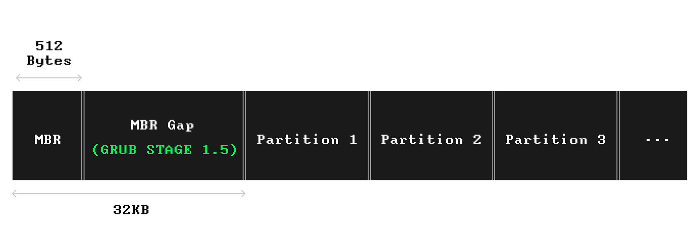
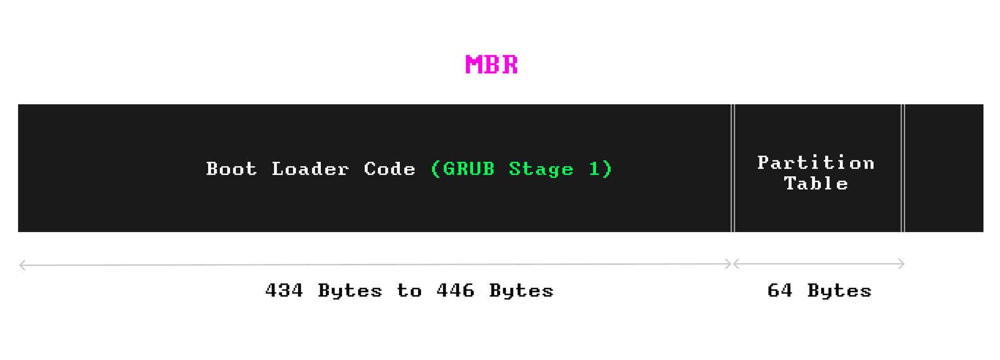
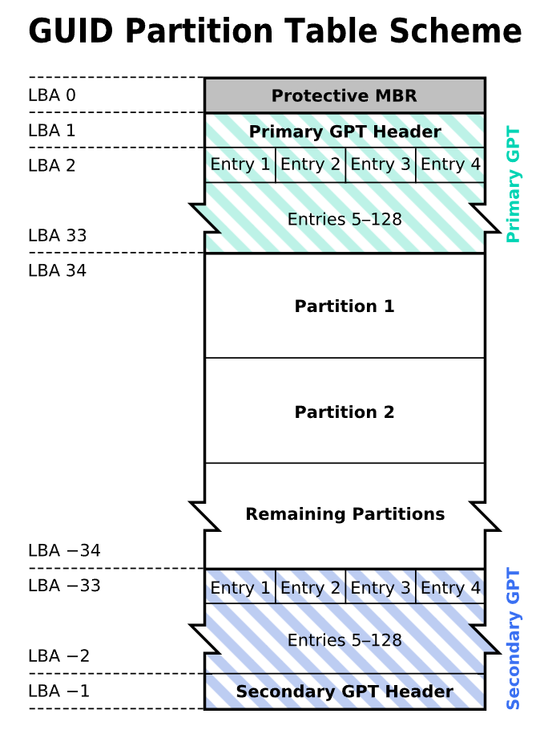
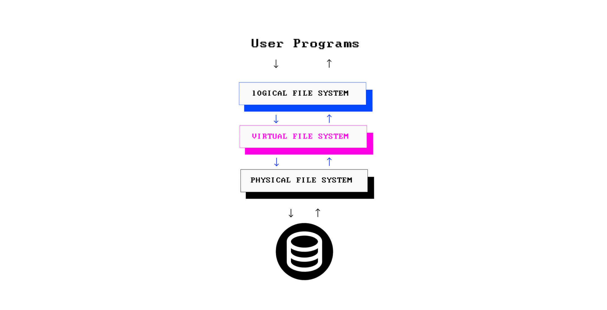


参考文章：[What Is a File System? Types of Computer File Systems and How they Work – Explained with Examples](https://www.freecodecamp.org/news/file-systems-architecture-explained/)


什么是文件系统？文件系统决定着从存储设备中对文件进行**命名**、**存储**和**检索**的方式。

存储设备在使用之前，需要进行分区以及格式化。
## 从分区开始
什么是分区？分区就是将存储设备划分成若干个**逻辑区域**，以便它们能像彼此独立的存储设备一样被管理。

根据需求，一个存储设备通常会有至少一个乃至多个分区。比如说一个基础的 Linux 安装就具有三个分区：一个专门用于存储操作系统，一个专门用于存放用户文件，外加一个交换分区。在 Windows 和 Mac OS 系统中并没有专门的交换分区，它们在操作系统所安装的分区内管理交换，但二者的分区布局与 Linux 相似。(交换分区：当 RAM 空间不足时，交换分区可充当 RAM 扩展。例如，操作系统可能会将一块数据（临时）从 RAM 移动到交换分区，以释放 RAM 上的部分空间。操作系统不断使用各种内存管理技术来确保每个进程都有足够的内存空间来运行。)

在具有多个分区的计算机上，你可以安装多种操作系统，并且每次可以选择不同的分区来启动系统。当然，分区的意义不仅仅限于可安装多种操作系统和工具。通过分区，我们还可以将重要系统文件与普通文件分开存放。对于一些操作系统，比如 Windows，会对磁盘分区分配以不同的字母编号（A，B，C，D），其中主分区（Windows 所安装的分区）的命名为 C：或驱动器 C。而在 Unix 一类的操作系统中，分区则以根目录下的普通目录显示，这点在后面会介绍到。

在对存储设备进行分区时，有两种分区方法可供选择：
* 主引导记录（MBR）方案
* GUID 分区表（GPT）方案

无论选择哪种方案，存储设备上的前几个存储块所存储的始终都是有关分区的关键数据。利用这些数据结构，系统的固件便能启动操作系统。

### 系统固件
首先解释一下什么是固件。固件是嵌入电子设备中以操作该设备或引导另一个程序来操作该设备的低级软件。固件存在于计算机，外围设备（键盘，鼠标和打印机）中，甚至存在于家用电器中。在计算机中，固件为诸如操作系统之类的复杂软件提供了启动和使用硬件组件的标准环境；但是，在打印机等较为简单的系统上，固件却是设备的主要操作系统。打印机菜单就是其固件的交互界面。

计算机固件依据以下两个规范执行：
* 基本输入/输出（BIOS）
* 统一可扩展固件接口（UEFI）

固件（基于 BIOS 或基于 UEFI）存储在非易失性存储器中，例如连接到主板的 Flash ROM（闪存）。当打开计算机电源时，固件是第一个运行的程序，其任务包括启动计算机，运行操作系统，并将整个系统的控制权传递给操作系统。固件在连网环境下还可以运行预操作系统，例如恢复或诊断工具，甚至还可以运行特殊的 shell 来运行基于文本的命令。在操作系统的徽标出现之前，你所看到的那几个页面就是计算机固件的输出，该输出用于验证硬件组件和内存的运行状况。

### MBR分区方案与基于BIOS的固件
#### MBR分区方案结构
MBR 分区方案是 BIOS 规范的一部分，由基于 BIOS 的固件使用。在采用 MBR 分区方案的磁盘上，存储设备上的第一个扇区存储着启动系统所需的基本数据，这一扇区被称为 MBR（主引导扇区）。

MBR 中存有以下信息：
* 引导程序，它是机器代码中的一个简单程序，用于启动引导过程的第一阶段
* 分区表，其中包含有关分区的信息。

下面是 MBR 分区存储设备的图示：


如果放大 MBR 这部分，那么其内容为：


#### MBR如何引导系统启动
系统启动后，BIOS 固件启动，并将包含了 MBR 的**引导加载程序**(boot loader program)载入到内存中。当程序进入内存，CPU 将会运行这段引导加载程序。通过将引导加载程序和分区表放置在 MBR 之类的预定义位置中，便可使 BIOS 来引导系统而无需处理任何文件。

MBR 中的引导加载程序代码占用 MBR 512字节空间中的 434 字节至 446 字节，另有 64 字节分配给了分区表，其中最多包含四个分区的信息。446 字节并不足以容纳很多的代码，正因如此，复杂的引导加载程序（例如 Linux 上的 GRUB 2）会将其功能切分为多个部分或多个阶段：
* 其中最小的部分被称为**第一阶段引导加载程序**(first-stage boot loader)，位于 MBR 内，它的任务就是启动引导过程的下一个阶段。MBR 之后紧接第一个分区之前，还有一个很小的空间，大约1MB，被称为**MBR间隙**(MBR gap)。必要时，它也可以用来放置一部分引导加载程序。
* 利用MBR间隙，引导加载程序（例如 GRUB 2）存储其功能的另一阶段。GRUB 将此称为引导加载程序的**第1.5个阶段**，其中包含文件系统驱动程序。1.5阶段使 GRUB 的下一阶段可以处理文件，而不再是再向第一阶段引导加载程序那样从存储设备中加载原始数据。
* **第二阶段引导加载程序**现在已经能够与文件系统协同工作，它可以加载操作系统的引导加载程序文件，从而启动相应的操作系统。此时也是操作系统徽标逐渐淡出的时候。

#### MBR的局限
* 前面提到分区表最多包含四个分区的信息，因此在MBR的数据结构中，最多只能有四个**主要分区**(primary patitions)。
  * 对于分区数量的限制，一个常见的解决方法是在主分区旁创建一个**拓展分区**(extended partition)，而一个拓展分区可以被分为几个**逻辑分区**(logical partitions)。总之，只要主分区和拓展分区总数不超过四个即可。
* 每个分区的最大空间为 2TiB
* MBR扇区的内容没有备份，这意味着如果MBR因为某些因素损坏，那么我们的存储设备就变成废铁了。

为了应对这些问题，GPT 分区出现了。

### GPT分区方案与基于UEFI的固件
GPT分区方案解决了上述 MBR 的问题，用户可以创建尽可能多的分区（具体数量取决于操作系统的支持），每个分区的大小可以达到市场上最大存储设备的容量。

尽管MBR仍然在许多旧电脑和新电脑中得到广泛支持，但是 GPT 正逐渐取代 MBR。因为 GPT 是 UEFI 规范的一部分，而 UEFI 正在取代传统的 BIOS。如今，许多硬件和操作系统都支持 UEFI，并使用 GPT 方案来对存储设备进行分区。

#### GPT分区方案结构
在 GPT 分区方案中，出于与基于 BIOS 的系统兼容的考虑，保留了存储设备的第一个扇区。因为某些系统可能仍使用基于 BIOS 的固件，但存储设备却采用了 GPT 分区。这个扇区被称为**保护性MBR**(Protective MBR)（这也是第一阶段引导加载程序在 MBR 分区的磁盘中存储的位置）。

在第一个扇区之后，存储了 GPT 数据结构，包括**GPT头**(GPT header)和**分区项**(partition entries)。GPT头和分区项会在存储设备的末尾进行备份，以便在主副本损坏时进行恢复，这个备份被称为**次级GPT**(Secondary GPT)。

GPT分区存储设备的结构如下图所示：


在GPT中，所有的引导服务（引导加载程序，引导管理器，预操作系统环境和shell）都位于名为 **EFI系统分区(EFI System Partions, ESP)** 的特殊分区中，UEFI 固件可以使用该分区。ESP 甚至拥有自己专属的文件系统，该系统是 FAT 的一个特定版本。在Linux上，ESP 存储在 `/sys/firmware/efi` 路径下。如果你在自己的系统上找不到此路径，那你的固件可能是基于 BIOS 的固件。

#### GPT分区方案引导系统启动
基于 UEFI 的固件会假定其存储设备使用 GPT 进行分区，并在 GPT 分区表中查找 ESP，找到后，该固件将查找已配置的引导加载程序，该引导加载程序通常是以 .efi 结尾的文件。

## 分区格式化
完成了分区之后，就需要考虑对分区进行格式化了。大多数操作系统都支持使用一组文件系统来格式化分区，例如在 Windows 上格式化分区时，可以选择 FAT32，NTFS 或 exFAT。

格式化还会涉及创建各种数据结构和用于管理分区内文件的元数据，这些数据结构便是文件系统诸多定义中的一个方面。以 NTFS 文件系统为例，在将一个分区格式化为 NTFS 时，格式化过程会将关键 NTFS 数据结构以及 **主引导表**(Master file table, MFT)放置在该分区上。

### 文件系统一开始是怎么出现的，如今又发展到了什么地步
文件系统由一套数据结构、接口、抽象和 API 构成，它们协同工作，管理各种存储设备上的各种文件。每种操作系统会使用特定的文件系统来管理文件。

* Windows
  * Microsoft曾在 MS-DOS 和 Windows 9x 家族系统中使用过 FAT（FAT12，FAT16和FAT32）。
  * 但自Windows NT 3.1 开始，Microsoft研发了**新技术文件系统**(New Technology File System, NTFS)。比起 FAT32，NTFS 具有诸多多优势，如支持更大的文件，更长的文件名，数据加密，访问管理，日志记录等等。从那时起，NTFS 就成为了 Window NT家族（2000，XP，Vista，7、10等）的默认文件系统。
    * 不过 NTFS 并不适用于非 Windows 环境。例如在 Mac OS 上，你只能读取 NTFS 格式存储设备（如闪存）上的内容，但无法写入任何内容，除非安装具有写入支持的NTFS驱动程序。
  * 2006年，Microsoft 创建**扩展文件分配表**(Extended File Allocaiton Table, exFAT)文件系统，该系统堪称NTFS的精简版。exFAT 的设计面向对象是大容量可移动设备（例如外部硬盘，USB驱动器和存储卡），它也是 SDXC 卡使用的默认文件系统。
    * 与 NTFS 不同，exFAT 在非 Windows 环境（包括 Mac OS）上也支持读写，这也使其成为最佳的高容量可移动存储设备跨平台文件系统。因此基本上可以说，如果你想同时在 Windows、Mac 和 Linux 上使用同一块可移动磁盘，就需要将其格式化为 exFAT 格式。
* Apple：
  * 多年以来，Apple 也在研发利用自己的各种文件系统，这就包括分层文件系统（HFS）, HFS+ 以及苹果文件系统（APFS）。和 NTFS 类似，APFS 也是一个日志文件系统。自苹果在 2017 年推出 OS X High Sierra 以来，APFS 一直使用至今。
* Linux：
  * 文件系统中的**扩展文件系统**(Extended File Syetem, ext)家族是专门为 Linux 内核创建的。
  * ext 的第一版发布于1991年，但不久便在1993年被第二代扩展文件系统（ext2）取代。
  * 进入21世纪，针对Linux开发的具有日志功能的 第三代扩展文件系统（ext3）和第四代扩展文件系统（ext4）也相继出现。如今，ext4 成为Linux的许多发行版本中的默认文件系统，这就包括 Debian 和 Ubuntu。

## 文件系统的体系结构
### 文件系统分层
一个操作系统中的文件系统有三层结构：
* 物理文件系统(Physical file system)
* 虚拟文件系统(Virtual file system)
* 逻辑文件系统(Logical file system)

不同层次之间既可彼此独立存在，也可紧密耦合为诸多抽象。当人们谈论文件系统时，他们所指的就是这三层中的某一层或是这三层组成的整体。尽管这些层次在不同操作系统之间有所不同，但这些概念基本是相通的。

#### 物理文件系统
物理层是文件系统的具体实现，负责数据存储和检索，以及存储设备上的空间管理（或者更确切地说是分区）。物理文件系统通过设备驱动程序与实际的存储硬件进行交互。

#### 虚拟文件系统
下一层是虚拟文件系统，简称 VFS。虚拟文件系统提供了一种支持在操作系统上安装的各类文件系统的**一致视图**(consistent view)。那么这是否意味着一个操作系统可以同时使用多种文件系统呢？答案是肯定的！

可移动存储工具通常都具有与计算机不同的文件系统，例如在使用NTFS作为主要文件系统的Windows环境下，闪存可能已格式化为 exFAT 或 FAT32。也就是说，操作系统需要能够在处理不同程序（文件浏览器和其他处理文件的应用）和不同的挂载文件系统（例如 NTFS，APFS，EXT4， FAT32，exFAT 和 UDF）时提供一种**一致接口**(unified interface)。比如说，当你打开文件资源管理器时，你可以从 EXT4 文件系统复制一份图像，然后将其直接粘贴到 exFAT 格式的闪存中，而不必去管文件在后台进行了不同的管理。

VFS 堪称连接用户（你）和后台文件系统的“便利层”。它制定了一种**合同**(contract)，要求所有的物理文件系统都必须以操作系统支持的方式工作。但是这种合规性(compliance)并未内置于文件系统的核心中，也就是说，文件系统的源代码并不包含对各种操作系统的支持。事实是，这些源代码利用**文件系统驱动程序**(file system driver)来遵守 VFS 的规则。(驱动程序是一种能够使软件与另一个软件或硬件进行通信的特殊程序。)


#### 逻辑文件系统
虽然 VFS 负责为程序与各种文件系统之间提供标准接口，但用户程序并不会直接与 VFS 交互，而是会利用程序和 VFS 之间的统一 API。这就是接下来要说的就是逻辑文件系统。

逻辑文件系统是文件系统中面向用户的一层。通过提供 API，它能使用户程序无需处理任何存储硬件便能执行各种文件操作，例如 `OPEN`, `READ`, `WRITE`。从另一方面来说，VFS 也在逻辑文件系统（程序与之交互）和一组物理文件系统之间搭建了桥梁。



### 什么叫挂载文件系统
在类 Unix 系统上，VFS 为每个分区或可移动存储设备都分配一个 device ID（如 `dev/disk1s1`）。接着，它会创建一个 **虚拟目录树**(virtual directory tree)，并将每个设备的内容作为单独的目录放在该目录树下。在根目录树下给存储设备分配目录的活动就是**挂载**(mounting)，分配的目录被称为**挂载点**(mount point)。就是说，在类 Unix 操作系统上，所有分区和可移动存储设备看起来就都好像是根目录下的目录。

例如在 Linux 上，除非有所配置，否则默认情况下可移动设备（例如存储卡）的挂载点就是根目录下的 `/media`。也就是说，当将闪存连接到一个操作系统时，它会被自动挂载在默认挂载点（在 Linux 环境下就是 `/media`），其内容也将在 `/media` 目录下显示。但有些时候会需要你手动挂载文件系统。

在 Linux上，可进行如下操作：
```bash
mount /dev/disk1s1 /media/usb
```

在上面的命令中，第一个参数（`/dev/disk1s1`）是设备 ID，第二个参数（`/media/usb`）是挂载点。请注意，挂载点应当已经作为目录存在，如果没有则需要先进行创建。

如果挂载点目录中已经存在文件，那么这些文件在存储设备挂在期间会一直被隐藏。这是因为挂载点会成为挂在上去的文件系统的入口，而原来放在该文件夹中的内容还留在之前的文件系统中，因此会被隐藏。例如根目录 `/` 上挂载了 `/dev/sda`，然后用户在 `/home` 中创建了一个文件 `touch /home/demo.txt`，然后将另一个文件系统 `/dev/sdb` 挂载到 `/home` 上，这个时候 `/home` 就成为了 `/dev/sdb` 的入口，就访问不到原本被创建在 `/dev/sda` 上的内容了。

## 文件元数据
文件的元数据通常包含了：
* 文件大小
* 时间戳，比如创建时间、最近一次访问时间以及修改时间
* 文件的拥有者
* 文件的权限设置（谁可以对文件执行什么操作）
* 分区中哪些块已分配给该文件
* 还有很多其他的东西

文件的元数据并不和文件的内容一起存储，而是存放在和该文件相关联的其他地方。

### inode
在类 Unix 系统中，文件元数据被存放在一个叫做**索引节点**(inode)的数据结构中。inode 通过一个唯一的编号来识别，这个编号叫做**索引节点号**(inode number)；同时 inode 通过**索引节点表**(inode table)与文件相关联。

每个存储设备上的文件都有一个 inode，其中包含关于该文件的信息，如创建时间、修改时间等。inode 还包括分配给文件的块的地址；另一方面，它还记录了文件在存储设备上的确切位置。在 ext4 文件系统的 inode 中，分配的块的地址以一组称为**extent**的数据结构存储在 inode 中，每个 extent 包含文件所分配的第一个数据块的地址以及文件占用的连续块的数量。

* 每当用户在 Linux 上打开一个文件，系统首先会将其名称解析为 inode number。
* 有了 inode number 后，文件系统从 inode table 中获取相应的 inode 。
* 一旦获取了 inode ，文件系统开始根据 inode 中记录的数据块构建文件。

你可以在Linux上使用 `df -i` 来查看分区中的 inode 信息，输出形如：
```
udev           4116100    378 4115722    1% /dev
tmpfs          4118422    528 4117894    1% /run
/dev/vda1      6451200 175101 6276099    3% /
```

从以上输出中，可以看出分区 `/dev/vda1` 共有 6451200 个 inode ，只有 3% 被使用了。下面解释一下什么叫 3% 的 inode 被使用：
* inode 也会消耗硬盘空间，所以在格式化硬盘的时候，操作系统自动将硬盘分成两个区域。一个是数据区，存放文件数据；另一个是 inode 区（inode table），存放 inode 所包含的信息。
* 同时每个inode的大小是固定的，因此当文件系统格式化时，inode 节点的总数就固定了。
* 这里的 3% 表示已经分配了 175,101 个 inode ，即这些 inode 已经被某些文件或目录占用。

如果想要查看与文件夹下的文件相关联的 inode ，可以运行 `ls -li`，输出形如：
```
1303834 -rw-r--r--  1 root www-data  2502 Jul  8  2019 wp-links-opml.php
1303835 -rw-r--r--  1 root www-data  3306 Jul  8  2019 wp-load.php
1303836 -rw-r--r--  1 root www-data 39551 Jul  8  2019 wp-login.php
1303837 -rw-r--r--  1 root www-data  8403 Jul  8  2019 wp-mail.php
1303838 -rw-r--r--  1 root www-data 18962 Jul  8  2019 wp-settings.php
```

第一列就是和文件关联的 inode number。

### MFT
在 NTFS 文件系统中，文件的元数据会被存放在一个叫做**主文件表**(Master File Table, MFT)的数据结构中。每个文件在MFT中都至少有一个条目(entry)，条目中包含该文件的所有信息，包括它在存储设备上的位置——类似于 inode table。

在大多数操作系统中，你可以通过图形用户界面获取文件的元数据。例如在 Mac OS上，当你右键点击一个文件并选择“获取信息”（在 Windows 中是“属性”），会弹出一个窗口，显示该文件的信息。这些信息是从相应文件的元数据中获取的。