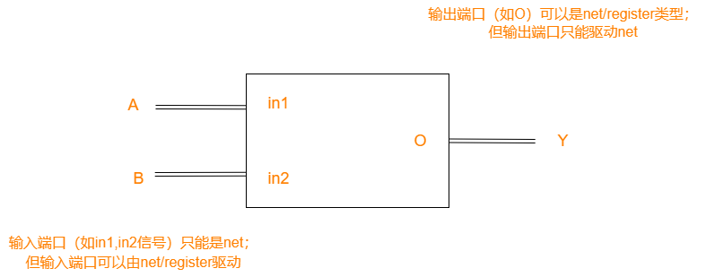

## 代码示例
Verilog语言的一个特点为模块化，一般一个`.v`文件为一个模块。

```verilog
// flowing_light.v
module flowing_light(
    input clock,
    input reset,
    output [7:0] led
    );
    reg [23:0] cnt_reg;
    reg [7:0] light_reg;
    always @(posedge clock) begin
        if (reset)
            cnt_reg<=0;
        else if(cnt_reg==24'h000001)
            cnt_reg<=0;
        else
            cnt_reg<=cnt_reg+1;
    end

    always @(posedge clock) begin
        if(reset)
            light_reg<=8'h01;
        else if(cnt_reg==24'h000001)begin
            if(light_reg==8'h80)
                light_reg<=8'h01;
            else
                light_reg<=light_reg<<1;
        end
    end
    assign led=light_reg;
endmodule
```
```verilog
// flowing_light_tb.v
module flowing_light_tb(

    );
reg clock;
reg reset;
wire [7:0] led;

flowing_light u0(
    .clock(clock),
    .reset(reset),
    .led(led)
);

parameter PERIOD = 10;

always #(PERIOD*2) clock=!clock;

initial begin
    clock=1'b0;
    reset=1'b0;
    #(PERIOD*2)reset=1'b1;
    #(PERIOD*4)reset=1'b0;
end
endmodule
```

## 模块端口设置
模块化的特点是将系统抽象成输入和输出的模型。端口定义了输入和输出。
```verilog
module flowing_light(
    input clock,
    input reset,
    output [7:0] led //定义了一个8位宽的端口
    );
...
endmodule
```
上述代码的括号内部分定义了该模块的输入和输出。端口的设置格式为 `<类型>[端口位宽]<端口名称>`。各个端口的定义语句之间由逗号隔开，括号后面加分号。

## Verilog语句块
### always语句块
相当于 `while` ,`@()` 内是循环条件。
```verilog
always @(posedge clock) begin
    if (reset)
        cnt_reg<=0;
    else if(cnt_reg==24'h000001)
        cnt_reg<=0;
    else
        cnt_reg<=cnt_reg+1;
end
```
这段代码中 `posedge` 指的是时钟上升沿；如果想要时钟下降沿，可以使用 `negedge`；如果对于一个时钟，既不加 `posedge` 也不加 `negedge`，则上升下降沿都能触发。比如说这段代码：
```verilog
always @(OpCode) begin
...
end
```

当 `OpCode` 发生变化的时候就能触发。

代码中的 `begin` 和 `end` 相当于C语言中的大括号。

```verilog
always #(PERIOD*2) clock=!clock;
```
则表示每经过 `PERIOD*2` 的时间，`clok` 翻转一次。时间的单位也在.v文件中写出，如
```verilog
`timescale 1ns / 1ps
```
则表示时间的单位为1ns，分辨率为1ps。

### initial语句块
initial语句在程序的最开始执行，且仅执行一次。在执行initial时，always不会执行。
```verilog
initial begin
    a=0;
    b=0;
    ci=0;

    #100;
    a = 4'b0001;
    b = 4'b0010;

    #100;
    a = 4'b0010;
    b = 4'b0100;
    ...
end
```
如这里的initial语句的例子，就表示先设置 `a,b,ci` 的值，然后过100个时钟周期再设置 `a,b` 的值，再过100个时钟周期再设置……

### case和casex语句块
`case` 语法大致如下，和C语言中的switch类似：
```verilog
case (OpCode)
    6'b000000: begin // R type
        RegDst=1;
        ALUSrc=0;
        MemtoReg=0;
        ...
    end
    6'b100011: begin // lw
        ... 
    end
    6'b101011: begin // sw
        ...
    end
    default: begin // invalid opcode
        ...
    end
endcase
```

`casex` 与 `case` 的区别在于，`case` 语句是精确匹配输入信号值的，如果输入信号与 `case` 语句中的任何一个值不匹配，则不会执行任何语句。而 `casex` 语句则是按位通配符匹配输入信号值的。它允许使用 `x`（表示未知值）、`z`（表示高阻值）和 `*`（表示通配符）等特殊字符，从而可以匹配更多的输入信号模式。

感觉ChatGPT说的地方好像有点问题，待会再看看语法书。

## Verilog数据类型
### 寄存器(register)类型
```verilog
reg [23:0] cnt_reg;
reg [7:0] light_reg;
```
就是寄存器类型，表示抽象的数据存储单元。除了 `reg`，还可以使用 `integer,real` 进行声明。上方的例子定义了24位的 `cnt_reg` 和8位的 `light_reg`。寄存器类型可以初始化。

### 线网(net)类型
如
```verilog
wire [7:0] led;
```
定义了一个8位的 `wire` 类型。在电路图中wire作用相当于导线。除了 `wire`，还可以使用 `tri`,`wand` 来定义线网类型。

### 参数数据类型
参数类型就相当于常量常量，如
```verilog
parameter PERIOD = 10;
```
就定义了一个值为10的常量 `PERIOD`。

### 数字格式
如 `24'h000001`，第一个数字表示数字在二进制下的位数，`'` 用于分隔，`h` 表示后面的数字用16进制表示（`b`表示二进制,`d`表示十进制）。同时为方便阅读，后面的数字之间可以加下划线而不影响结果，如该数字还可以写成 `24'h00_00_01`

## 模块间引用
```verilog
module flowing_light_tb(
    );
reg clock;
reg reset;
wire [7:0] led;

flowing_light u0(
    .clock(clock),
    .reset(reset),
    .led(led)
);
...
endmodule
```

这里展示了 `flowing_light_tb` 模块引用 `flowing_light` 模块的方式。比如 `.clock(clock)` 中的 `.clock` 表示要使用 `flowing_light` 中 `clock` 的端口；而括号中 `clock` 则表示将 `flowing_light_tb` 中的寄存器变量 `clock` 接上。

<div align=center>

</div>

同一个模块可以被多次引用，但是每次实例化的名字要不同
```verilog
adder_1bit  a1(.a(a[0]),.b(b[0]),.ci(ci),.s(s[0]),.co(ct[0])),
            a2(.a(a[1]),.b(b[1]),.ci(ct[0]),.s(s[1]),.co(ct[1])),
            a3(.a(a[2]),.b(b[2]),.ci(ct[1]),.s(s[2]),.co(ct[2])),
            a4(.a(a[3]),.b(b[3]),.ci(ct[2]),.s(s[3]),.co(co));
```
如这段代码就将adder_1bit用了4次，每次实例化的给的名称分别为 `a1,a2,a3,a4`。（这里类似于cpp中创建了一个类，然后在另一个类中使用这个类）

