## 创建project
确定项目地址与名称：路径中不能出现中文，空格也应当避免
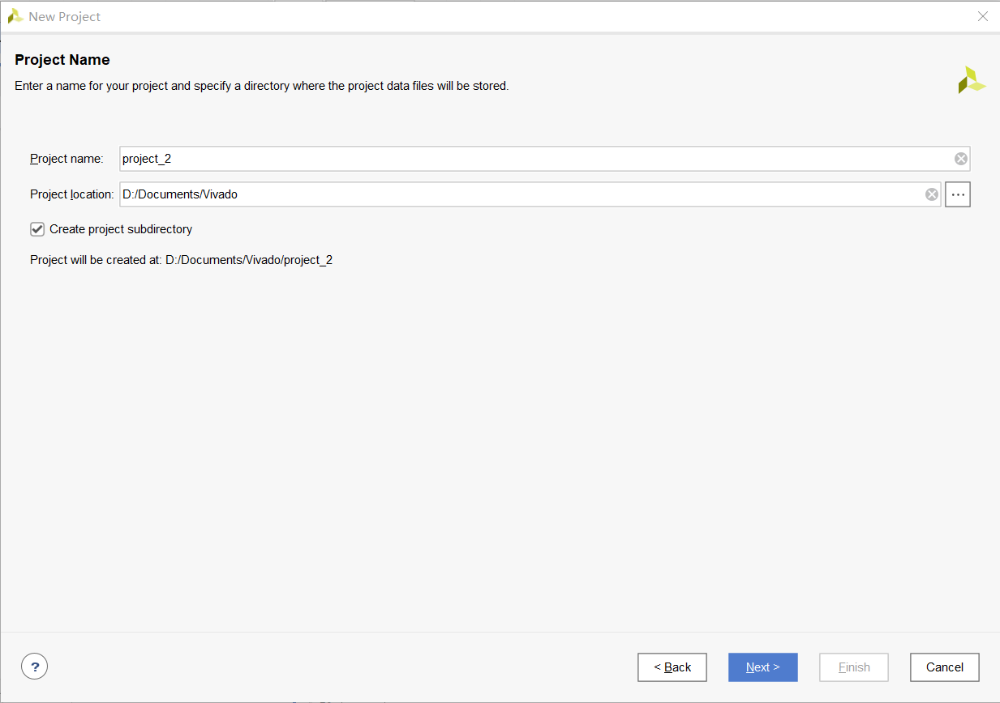

选择项目类型：
RTL Project 能自主编辑source，创建、修改IP，支持各种功能。
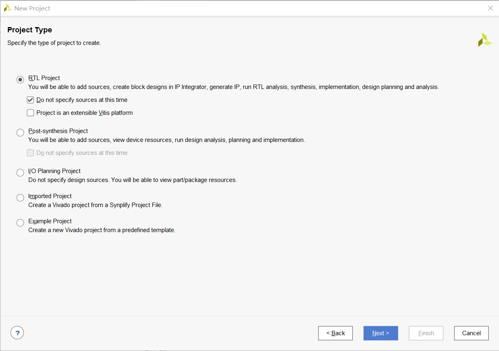

选择板子型号（应该是）：
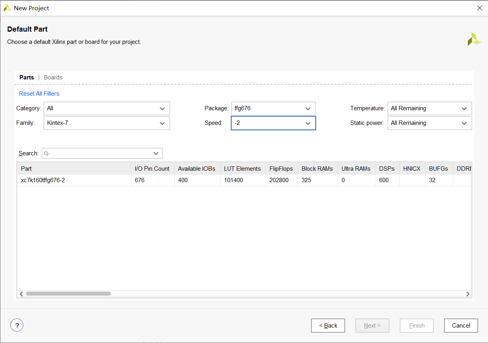
从图中看出，可以选择Family,Package(应该指的是型号的一个归类方式),Speed。最后在下面方框中可以选择具体型号(Part)。

## 页面概览
1. 左侧区 Flow Navigator 包含整个开发流程，像 Project Settings、Run Simulation、Run Synthesized 和 Generate Bitstream 等；
2. 中间区 通常显示当前工程包含的文件树结构，提供工程文件的管理；
3. 右侧区 会显示工程信息、打开的编辑文件等；
4. 下部区 显示各种信息状态。

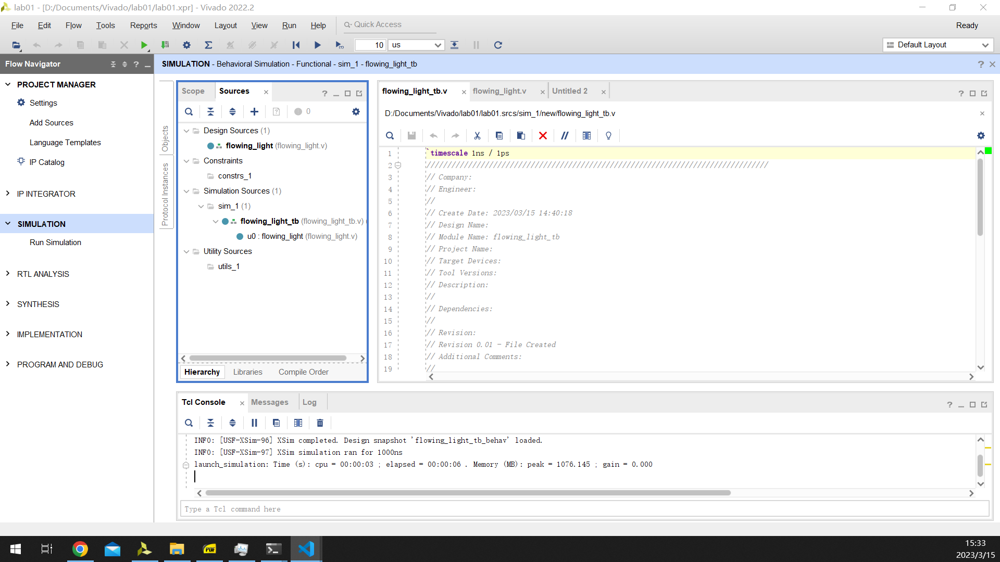

## 添加源文件
可以在左侧 Flow Navigator->PROJECT MANAGER->Add Scource处或者在中间的Sources下按“+”号。
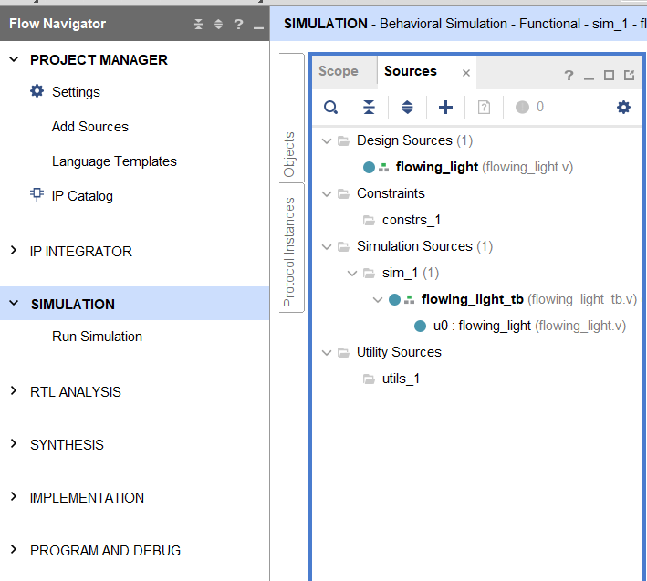
然后可以选择添加文件的类型
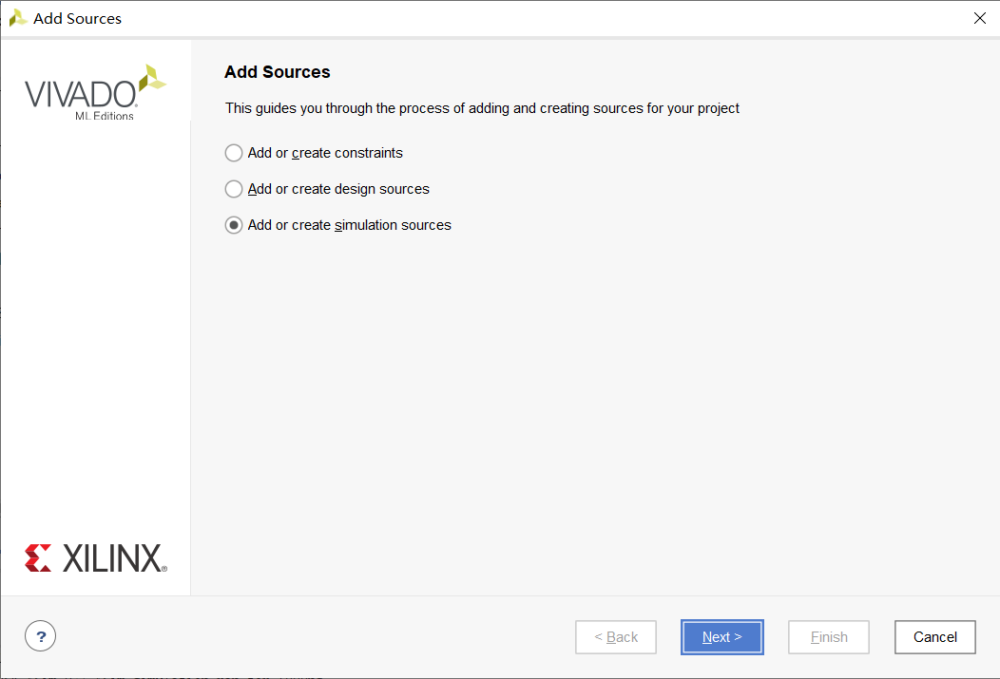
* constraints应该是管脚约束文件
* design source文件就是写Verilog的地方
* simulation source也是创建.v文件，但这个应该还与run simulation有关

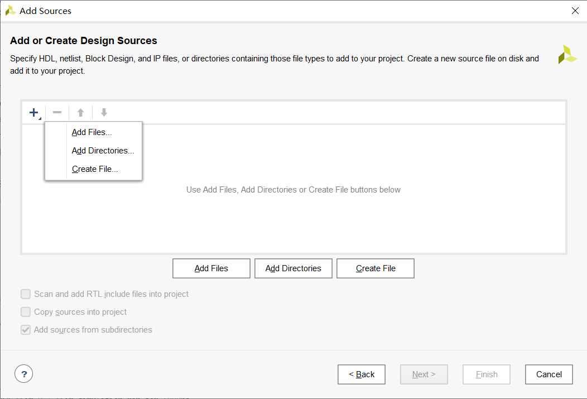
然后可以选择从其他地方添加文件、文件夹，或者直接新建文件。

## 代码编辑
双击左侧的source中的文件，就能在右侧的编辑器中打开文件。
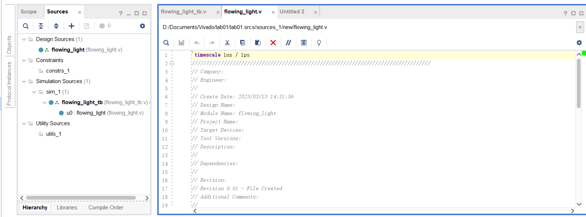
同时这些生成的文件路径就在项目文件夹的.srcs文件夹中。可以用其他文本编辑器打开文件进行编辑，保存后在vivado中也会显示。
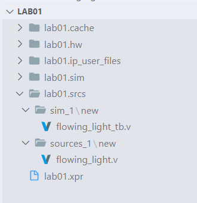

## 代码仿真(Simulation)
点击SIMUALTION->Run Simulation->Behavioral Simulation就可以展示图右图simulation的窗口。
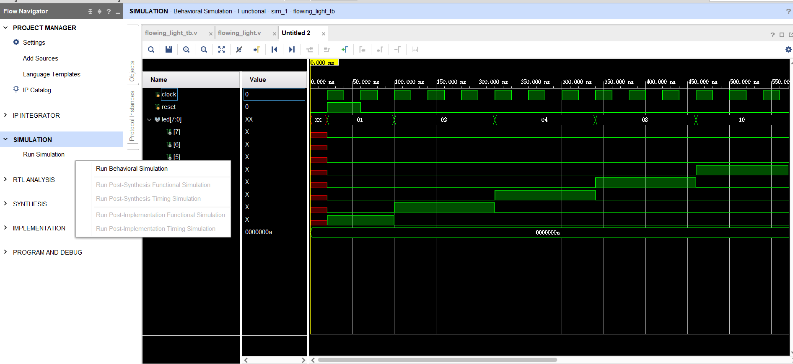

## 添加管脚约束文件
### 通过图形化界面添加
点击左侧Flow Navigator->SYNTHESIS->Run Synthesis

Synthesis完成后出现如图界面，选择Open Synthesis Design.
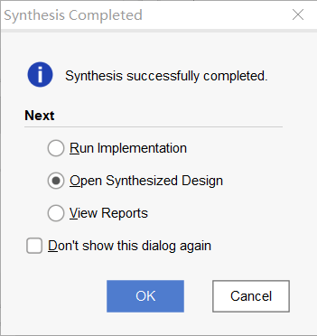

完成后在右上角选择I/O Planning，下方会出现如图管脚信息。然后选择Package Pin和I/O Std完成设置。点击保存，即可保存管脚信息。
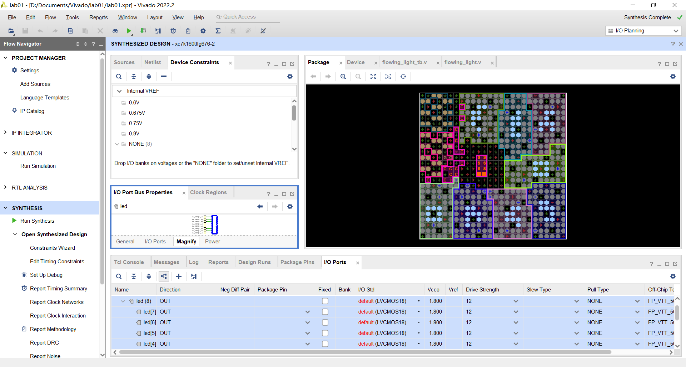
### 通过代码添加
和添加源文件的方式相同，选择create constraints就行。然后新建的.xdc文件同样可以用文本编辑器进行编辑。