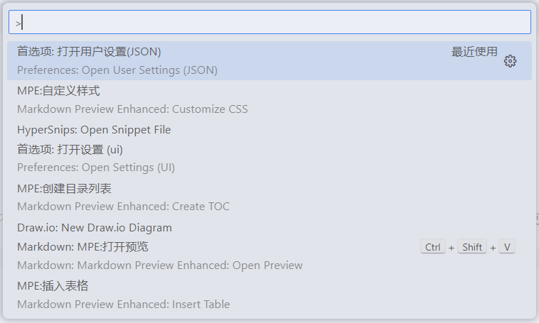
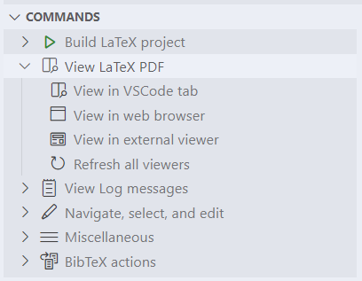

这里主要讲解vscode配置latex时配置文件的内容。配置完成后可以实现latex源码和生成的pdf文件正反向搜索的功能。这里使用的外部pdf浏览器是Sumatrapdf。

配置代码的地方如图，通过`ctrl+shift+P`打开：
<div align=center>

</div>

### 完整配置代码
以下是本人的配置文件的代码：
```json
    // ======================== LaTeX 设置 BEGIN  ========================
     "workbench.editorAssociations": {
        "*.pdf": "latex-workshop-pdf-hook"
    },
    //"latex-workshop.view.pdf.viewer": "tab",

    // 设置 latex-workshop 的 PDF　预览程序，external　指的是外部程序
    "latex-workshop.view.pdf.viewer": "external",
    "latex-workshop.view.pdf.ref.viewer": "external",
    "latex-workshop.view.pdf.external.viewer.command": "C:\\Users\\zhu'xiao'zhi\\AppData\\Local\\SumatraPDF\\SumatraPDF.exe",
    "latex-workshop.view.pdf.external.viewer.args": [
        "%PDF%"
    ],

    // 配置正向、反向搜索：.tex -> .pdf
    "latex-workshop.view.pdf.external.synctex.command": "C:\\Users\\zhu'xiao'zhi\\AppData\\Local\\SumatraPDF\\SumatraPDF.exe",
    "latex-workshop.view.pdf.external.synctex.args": [
        // 正向搜索
        "-forward-search",
        "%TEX%",
        "%LINE%",
        "-reuse-instance",
        // 反向搜索
        "-inverse-search",
        "\"D:\\Program file\\Microsoft VS Code\\Code.exe\" \"D:\\Program file\\Microsoft VS Code\\resources\\app\\out\\cli.js\" --ms-enable-electron-run-as-node -r -g \"%f:%l\"",
        "%PDF%"
    ],

    // 这是一些独立的编译选项，可以作为工具被编译方案调用
    "latex-workshop.latex.tools": [
        {
          "name": "xelatex",
          "command": "xelatex",
          "args": [
            "-synctex=1",
            "-interaction=nonstopmode",
            "-file-line-error",
            "%DOC%"
          ],
          "env": {}
        },
        {
          "name": "pdflatex",
          "command": "pdflatex",
          "args": [
            "-synctex=1",
            "-interaction=nonstopmode",
            "-file-line-error",
            "%DOC%"
          ],
          "env": {}
        },
        {
          "name": "bibtex",
          "command": "bibtex",
          "args": [
            "%DOCFILE%"
          ],
          "env": {}
        }
    ],

    // 这是一些编译方案，会出现在 GUI 菜单里
    "latex-workshop.latex.recipes": [
        {
          "name": "pdflatex",
          "tools": [
            "pdflatex",
          ]
        },
        {
          "name": "xelatex",
          "tools": [
            "xelatex",
          ]
        },
        {
          "name":"bibtex",
          "tools": [
            "bibtex"
          ]
        },
        {
          "name": "xelatex*2",
          "tools": [
            "xelatex",
            "xelatex"
          ]
        },
        {
          "name": "pdflatex ➞ bibtex ➞ pdflatex`×2",
          "tools": [
            "pdflatex",
            "bibtex",
            "pdflatex",
            "pdflatex"
          ]
        },
        {
          "name": "xelatex ➞ bibtex ➞ xeflatex`×2",
          "tools": [
            "xelatex",
            "bibtex",
            "xelatex",
            "xelatex"
          ]
        }
      ],
    "latex-workshop.latex.clean.fileTypes": [  //设定清理文件的类型  
      "*.aux",  
      "*.bbl",  
      "*.blg",  
      "*.idx",  
      "*.ind",  
      "*.lof",  
      "*.lot",  
      "*.out",  
      "*.toc",  
      "*.acn",  
      "*.acr",  
      "*.alg",  
      "*.glg",  
      "*.glo",  
      "*.gls",  
      "*.ist",  
      "*.fls",  
      "*.log",  
      "*.fdb_latexmk",  
      "*.nav",  
      "*.snm",  
      //"*.synctex.gz"  
    ], 
    "latex-workshop.latex.autoClean.run": "onBuilt", 
    "latex-workshop.latex.recipe.default": "lastUsed",
    "latex-workshop.latex.autoBuild.run": "never",
    // ======================== LaTeX 设置 END ========================
```

文件的第一段内容我也不知道在干什么，所以直接从下一段开始
### pdf打开方式
```json
// 设置 latex-workshop 的 PDF　预览程序，external　指的是外部程序
"latex-workshop.view.pdf.viewer": "external",
"latex-workshop.view.pdf.ref.viewer": "external",
"latex-workshop.view.pdf.external.viewer.command": "C:\\Users\\zhu'xiao'zhi\\AppData\\Local\\SumatraPDF\\SumatraPDF.exe",
"latex-workshop.view.pdf.external.viewer.args": [
    "%PDF%"
],
```
这里的前两行应该是设置默认pdf打开方式，我这里选择了`exernal`，表示外部程序打开。如果不用默认方式打开的话，也可以在command这里自行选择。
<div align=center>

</div>
第三行是外部打开程序的路径。第四行不太清楚。

### 正反向搜索
```json
// 配置正向、反向搜索：.tex -> .pdf
"latex-workshop.view.pdf.external.synctex.command": "C:\\Users\\zhu'xiao'zhi\\AppData\\Local\\SumatraPDF\\SumatraPDF.exe",
"latex-workshop.view.pdf.external.synctex.args": [
    // 正向搜索
    "-forward-search",
    "%TEX%",
    "%LINE%",
    "-reuse-instance",
    // 反向搜索
    "-inverse-search",
    "\"D:\\Program file\\Microsoft VS Code\\Code.exe\" \"D:\\Program file\\Microsoft VS Code\\resources\\app\\out\\cli.js\" --ms-enable-electron-run-as-node -r -g \"%f:%l\"",
    "%PDF%"
],
```
这里改一下外部打开程序的路径就行了，后面直接复制粘贴。然后`"-inverse-research"`这一段好像没啥用，反向搜索得到Sumatrapdf的配置文件里配置。

### 编译选项
```json
// 这是一些独立的编译选项，可以作为工具被编译方案调用
"latex-workshop.latex.tools": [
    {
        "name": "xelatex",
        "command": "xelatex",
        "args": [
        "-synctex=1",
        "-interaction=nonstopmode",
        "-file-line-error",
        "%DOC%"
        ],
        "env": {}
    },
    {
        "name": "pdflatex",
        "command": "pdflatex",
        "args": [
        "-synctex=1",
        "-interaction=nonstopmode",
        "-file-line-error",
        "%DOC%"
        ],
        "env": {}
    },
    {
        "name": "bibtex",
        "command": "bibtex",
        "args": [
        "%DOCFILE%"
        ],
        "env": {}
    }
],
```
这一段也直接复制吧，这里配置大概的作用就是当你使用vscode进行编译的时候，事实上vscode会帮你调用命令行。然后`"command"`就是会在命令行中输入的命令，`"args"`就是会用到的参数。然后最前面的`"name"`无关紧要，只是说后面在调用这些编译选项的时候需要使用这些名字。

### 编译方案
```json
    // 这是一些编译方案，会出现在 GUI 菜单里
    "latex-workshop.latex.recipes": [
        {
          "name": "pdflatex",
          "tools": [
            "pdflatex",
          ]
        },
        {
          "name": "xelatex",
          "tools": [
            "xelatex",
          ]
        },
        {
          "name":"bibtex",
          "tools": [
            "bibtex"
          ]
        },
        {
          "name": "xelatex*2",
          "tools": [
            "xelatex",
            "xelatex"
          ]
        },
        {
          "name": "pdflatex ➞ bibtex ➞ pdflatex`×2",
          "tools": [
            "pdflatex",
            "bibtex",
            "pdflatex",
            "pdflatex"
          ]
        },
        {
          "name": "xelatex ➞ bibtex ➞ xeflatex`×2",
          "tools": [
            "xelatex",
            "bibtex",
            "xelatex",
            "xelatex"
          ]
        }
      ],
```
这里的编译方案用到的就是前面的编译选项。然后`"name"`依然是可以随便命名的，`tool`里用到的就是前面编译选项的名字。编译方案的作用在于，有些时候需要多次编译，直接使用整个编译方案就可以一次完成多次编译。

比如说这里的`"pdflatex ➞ bibtex ➞ pdflatex×2"`，就是先调用一次`pdflatex`，再调用一次`bibtex`，再调用两次`pdflatex`，这是因为如果使用了`.bib`文件用于引用的话，就要先编译文章，再编译bib文件，再编译文章将bib文件编译出来的东西加到文章里，最后一次编译是保证文章中使用`\cite`的部分能正常引用。

### 文件清理
```json
"latex-workshop.latex.clean.fileTypes": [  //设定清理文件的类型  
    "*.aux",  
    "*.bbl",  
    "*.blg",  
    "*.idx",  
    "*.ind",  
    "*.lof",  
    "*.lot",  
    "*.out",  
    "*.toc",  
    "*.acn",  
    "*.acr",  
    "*.alg",  
    "*.glg",  
    "*.glo",  
    "*.gls",  
    "*.ist",  
    "*.fls",  
    "*.log",  
    "*.fdb_latexmk",  
    "*.nav",  
    "*.snm",  
    //"*.synctex.gz"  
], 
"latex-workshop.latex.autoClean.run": "onBuilt", 
```
最后这个是用于文件清理的。因为vscode编译latex总是会生成很多看起来没什么用的文件，如果不需要的话可以清理掉，只留下.pdf和.tex文件，还有用于正反向搜索的.gz文件。

<!-- 反向搜索的配置就先不说了，刚刚自己试了一下，发现反向搜索又抽风了QAQ。 -->
### 反向搜索配置
打开Sumatrapdf中的高级设置(可以使用`Alt,S,A`打开)，然后加入
```
InverseSearchCmdLine = "D:\Microsoft VS Code\Code.exe" "D:\Microsoft VS Code\resources\app\out\cli.js" --ms-enable-electron-run-as-node -r -g "%f":"%l"
EnableTeXEnhancements = true
```
`InverseSearchCmdLine`那里要改成自己VSCode的路径。

### 使用
先要用反向搜索，在pdf内容鼠标左键双击，vscode的光标就会跳到对应位置处。
然后要用正向搜索的话，就在源码里选中，按`ctrl+alt+J`就行了。