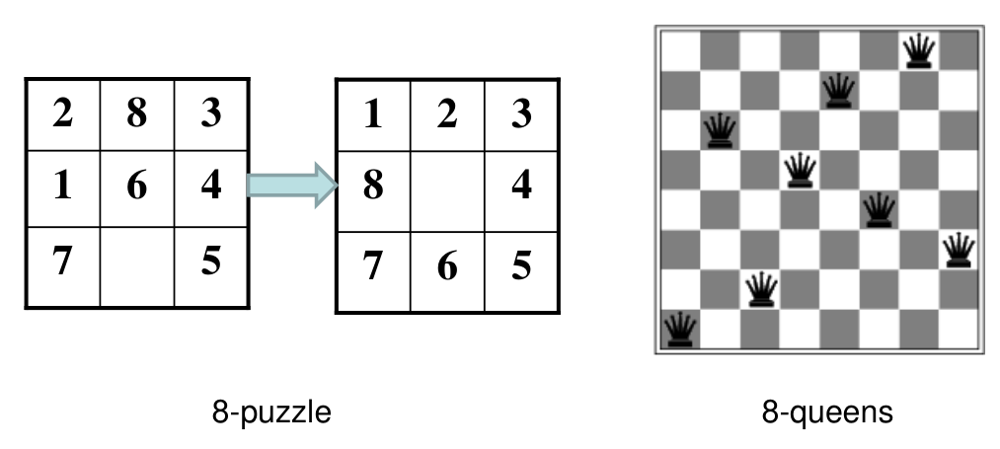
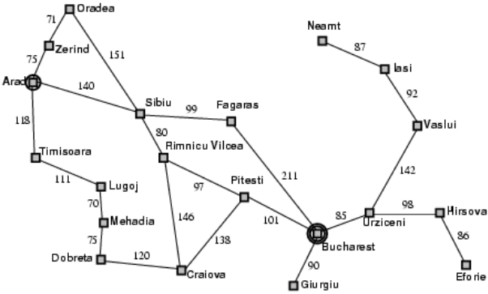
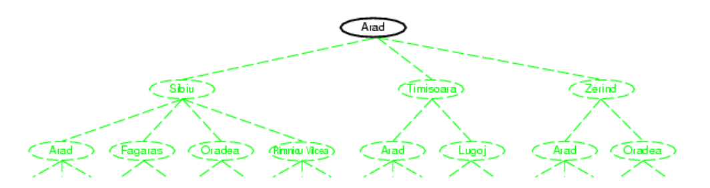
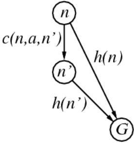
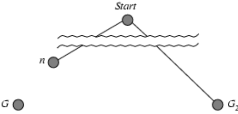
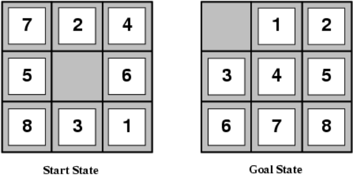
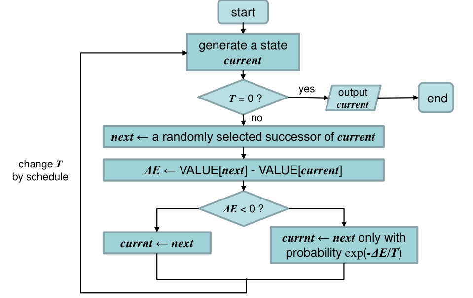
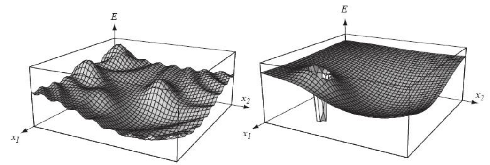
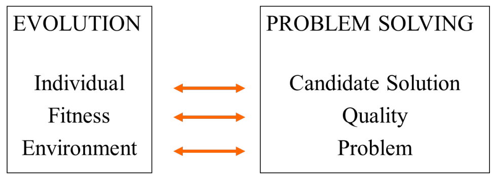
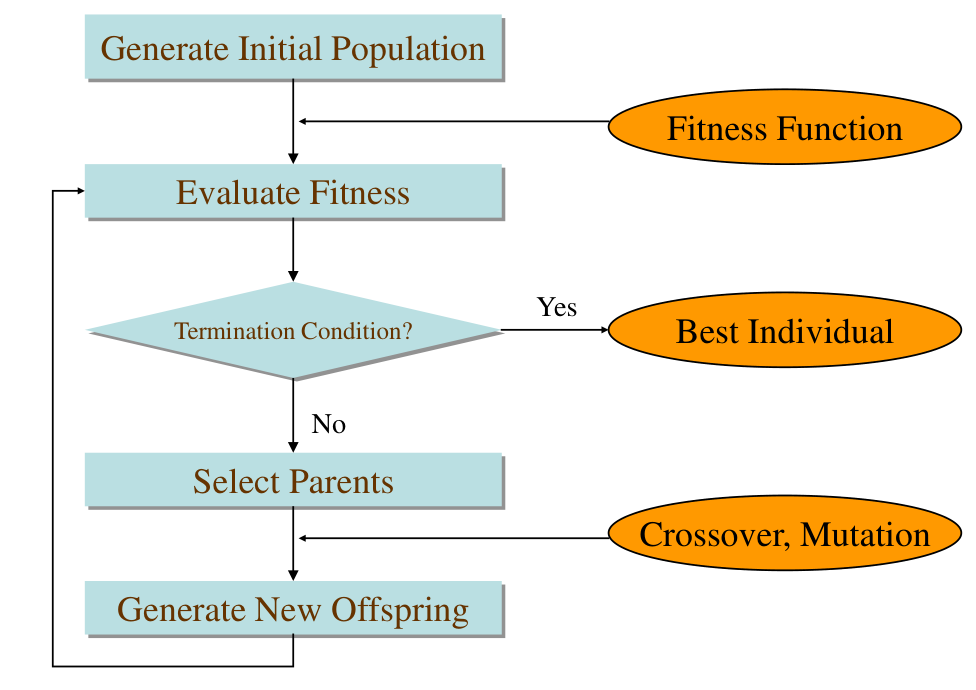

## Problem-solving agent
问题求解智能体使用“原子”进行表征，表示一个状态

### Search problems in real world
比如说地图导航、扫地机器人的路径规划

### Toy Problem

早期的人工智能就是来解决这些小问题的。

## Problem formulation
这些问题有一些共同点：
* 有一个初始情况和比较确定的目标
* 有不同的简单行为(比如8-puzzle中每个数字可以上下左右移动)，执行特定行为的序列可能能够达到目标
* 搜索就是找到能够达到目标的序列
* 这些行为序列可能需要一定的代价(cost)

当有一系列状态时，就可以形成一个状态空间(state space)，然后我们需要在状态空间中做搜索。比如我们想要从一个城市到另一个城市，地图如图

需要找到一条路径，就可以画出一个搜索树，其中初始状态就是树的根，树上的每一个节点表示一个状态，能够代表走过的路径。

这个问题形式化的说：
* 有一个初始状态，就是树的根
* 有一系列行动，或者说后继函数，对应于树上每个节点的子节点
* 目标测试，即看有没有到达目的地
* 路径代价，即从一个城市到另一个的距离。我们可以
* 一个解决方案就是一个行动的序列，能够从初始状态到达目标状态
* 搜索策略：就是从树上的某个节点如何选择到达下一个节点。搜索策略可以分为无信息搜索和启发式搜索
  * 无信息搜索(Uninformed search)表示没有与问题相关的信息，仅仅是根据制定的规则进行搜索
  * 启发式搜索(Heuristic search)指有与问题相关的信息，会综合考虑信息进行搜索

## Search strategies
搜索策略需要考虑以下几个方面：
* 完备性(completeness)：当问题有解时，能够找到问题的解
* 时间复杂度(time complexity)：算法在最坏情况下需要的时间
* 空间复杂度(space complexity)：算法需要的内存空间
* 最优性(optimality)：能否找到代价最小的解？

### Uniformed search strategies
无信息搜索主要包括：广度优先搜索(Breadth-first search)，深度优先搜索(Depth-first search)，深度受限搜索(Depth-limited search)，迭代加深搜索(Iterative deepending search)，一致代价搜索(Uniformed-cost search)。

#### Breadth-first search
广度优先搜索的性质
* 是完备的(只要深度 $b$ 是有限的)
* 时间复杂度 $1+b+b^{2}+ \cdots +b^{d}+b(b^{d}-1)=O(b^{d}+1)$，式子中的最后一项表示的是先扩展节点(将子节点放到队列中)，然后再做目标测试，在最坏情况下有 $b^{d}-1$ 个节点都要做扩展
* 空间复杂度 $O(b^{d+1})$，因为需要把每个节点都存在内存中。这里同样是先做拓展
* 能够满足最优性，因为是从浅到深搜索的，同时每步cost=1

深度优先搜索的优缺点
* 优点：能够找到到目标的最短路径
* 缺点：对空间的需求很高
* 改进为一致代价搜索(Dijkstra算法)

#### Uniform-cost search
拓展代价最低的路径，边缘(fringe)为按照代价排序的优先队列

* 如果每一步的代价都是正数 cost $\ge \varepsilon$，那么是完备的
* 时间复杂度 $O(b^{ceiling(C^{*} / \varepsilon)+1})$，其中 $C^{*}$ 为最优解的代价
* 空间复杂度 $O(b^{ceiling(C^{*} / \varepsilon)+1})$
* 满足最优

#### Depth-first search
* 如果深度是有限的，那么是完备的；否则不完备
* 时间复杂度 $O(b^{m})$，其中 $m$ 为树的最大深度，上面的 $d$ 是解所在的深度。如果 $m\gg d$ 的话，这个时间复杂度是很差的。
* 空间复杂度 $O(bm)$，线性空间
* 不满足最优(最优解可能在其他分支上)

#### Depth-limited search + Iterative deepening search
限制搜索的深度，防止深度优先搜索中搜索过深的问题，但是这可能会导致找不到解(解可能在更深的地方)。因此接着引入迭代加深搜索。即使用深度限制搜索，但是会不断加深深度，知道最后找到解。

这个算法虽然看起来很naive，但是时间复杂度并不会增加太多。假如解的深度依然为 $d$，那么
* 时间复杂度为 $db+(d-1)b^{2}+ \cdots +b^{d}=O(b^{d})$
* 空间复杂度 $O(bd)$
* 能够达到最优解(前提是step cost=1，和BFS一样)

相当于结合了深度和广度优先搜索的优势

## Heuristic search
启发式搜索像一个优化问题，每一步的操作都希望减小代价的预期值，同时最终的解是要求找到全局代价最小的解。

### Greedy best-first search
对每个节点使用评估函数(evaluation function) $f(n)$，用于评估总的代价，然后在执行下一步的时候选择评估代价最小的操作。

贪心最佳优先搜索中， $f(n)=h(n)$，$h(n)$ 为启发式函数(heuristic function)，用于估计某个节点到目标节点的代价。比如说从地图上一个城市到另一个城市寻找最短路径的问题，启发式函数 $h(n)$ 就可以使用某个城市到终点的直线距离，虽然实际要走的路程并不等于直线距离，但是可以用这个来做一个估计。

### A* search
贪心最佳优先只估计某个节点到终点的距离，这是不太合理的，因此A*搜索还考虑了从起点到某个节点的距离，即 $f(n)=g(n)+h(n)$，其中 $g(n)$ 是从起点走到节点 $n$ 已经付出的最小代价(不是估计)。

#### Admissible heuristics
一个可接受的启发式函数(Admissible heuristics)需要满足：对于所有的节点 $n$，要有 $h(n)<h^{*}(n)$，其中 $h^{*}(n)$ 表示从节点 $n$ 到终点的真实代价。

$h(n)<h^{*}(n)$ 称为低估，反之成为高估。A*搜索想要生效，那么启发式函数就应该低估而不能高估，也就是说启发式函数一定要是可接受的。

#### Consistent heuristic
满足一致性的启发式函数需要满足 $h(n)\le c(n,a,n')+h(n')$，其中 $c(n,a,n')$ 为从 $n$ 到 $n'$ 的真实代价

对于通常的例子，满足可接受性的启发式函数也会满足一致性。

#### Optimality of A*
如果 $h(n)$ 是可接受的，那么A* 在树搜索中一定能找到最优解；如果 $h(n)$ 是一致的，那么A* 在图搜索中能找到最优解。

第一条结论不难证明，因为 $h(n)$ 总是低估的。
假设 $G$ 是一个最优解，$G_2$ 是一个次优解，并且此时 $G_2$ 和 $n$ 都在边缘队列(fringe)中，其中 $n$ 是从起点到 $G$ 的路径中的一个节点。
因为 $G$ 是最优的，那么 $g(G)<g(G_2)=f(G_2)$，同时 $f(n)=g(n)+h(n)<g(n)+h^{*}(n)=g(G)<f(G_2)$，因此 $G_2$ 会一直呆在边缘队列中而不会被选中。最终被选中的只能是 $G$。

#### Properties of A*
* 是完备的(只要 $f\le f(G)$ 的节点是有限的)
* 时间复杂度为指数
* 空间复杂度：需要将所有节点都放在内存中
* 找到的解是最优的

### Heuristic function
给出一个启发式函数的设计实例。对于8-puzzle问题

我们可以选择没有放到目标位置上的数字个数作为启发式函数，那么此时 $h_1(S)=8$；也可以把曼哈顿距离之和作为启发式函数，那么此时 $h_2(S)=18$。不难看出这两种启发式函数都是低估的，因此都是可接受的。

而对于这两种启发式函数，使用曼哈顿距离的方法结果更好，因为这种启发式函数的估计值离真实情况更近，搜索错误的空间更小，能够更快地得到最优结果。

## Beyond Classical Search
Local search algorithms
局部搜索，不关系路径，只关心目标；从某个状态开始，通过不断地改进，从而到达理想的状态。比如说8皇后问题，只关心能不能到达8皇后互不冲突的目标，而不关心是通过什么方式达到这个目标；这个问题使用局部搜索的话也可以一次次的移动来改进结果。

因此局部搜索有两个主要优势
* 占用内存较小(因为不像A*搜索那样需要记住中间的情况)
* 在极大甚至无穷的空间中能够找到一个比较好的结果

### Hill-climbing search
“就像一个有失忆症的人在大雾中爬珠穆朗玛峰”。不记录之前状态，只能看到附近的情况，因此容易陷入局部最优解。

### Simulated annealing
模拟退火，并不一定是每一步都向更优的结果走，而是有一定概率会选择比较差的结果。

模拟退火算法的一些问题
* 代价函数(cost funtion)需要设计的比较好，因为这个函数需要被计算上百万次
* 可能和问题相关，并不一定能找到最优解
* 需要能量函数比较平滑，否则效果也不好。比如模拟退火比较适用于左边的图，而不适用于右边的图

### Local beam search
同时做 $k$ 次搜索

### Genetic algorithms
遗传算法，模拟自然选择。遗传算法不一定能找到最优解，也不一定能收敛，但是可以限定遗传的代数来终止迭代。

遗传算法的术语：
* 个体(individual)：任意一个候选解
* 种群(population)：所有的个体
* 适应度(fitness)：正在优化的目标函数
* 特性(trait)：个体的特征
* 基因组(genome)：个体所有的染色体，即特征的集合

遗传算法的进行即问题的求解

遗传算法的基本流程

#### Example: the MAXONE problem
即需要最大化字符串中1的数量

首先进行随机初始化
s1 = 1111010101 f (s1) = 7
s2 = 0111000101 f (s2) = 5
s3 = 1110110101 f (s3) = 7
s4 = 0100010011 f (s4) = 4
s5 = 1110111101 f (s5) = 8
s6 = 0100110000 f (s6) = 3

开始选择能够进行交叉遗传的个体：使用轮盘赌算法，根据适应度来决定被选中的概率，一个个体可能被选中多次。
s1' = 1111010101 (s1)
s2' = 1110110101 (s3)
s3' = 1110111101 (s5)
s4' = 0111000101 (s2)
s5' = 0100010011 (s4)
s6' = 1110111101 (s5)

然后将选中的个体两两配对，进行交叉重组。交叉有一定概率，比如说 $0.6$。交叉就是相互之间交换一小段染色体片段
Before crossover:
s1' = 1111010101 s2' = 1110110101
After crossover:
s1'' = 1110110101 s2'' = 1111010101

最后以一定的概率进行变异，变异有助于种群跳出局部解，能够提高种群多样性。
Initial strings   $\quad \quad$  After mutating
s1'' = 1110110101 s1''' = 1110100101
s2'' = 1111010101 s2''' = 1111110100
s3'' = 1110111101 s3''' = 1110101111
s4'' = 0111000101 s4''' = 0111000101
s5'' = 0100011101 s5''' = 0100011101
s6'' = 1110110011 s6''' = 1110110001

