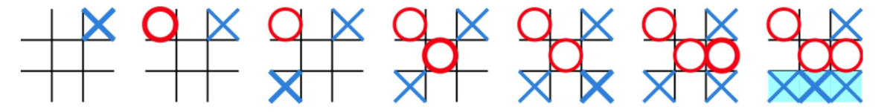
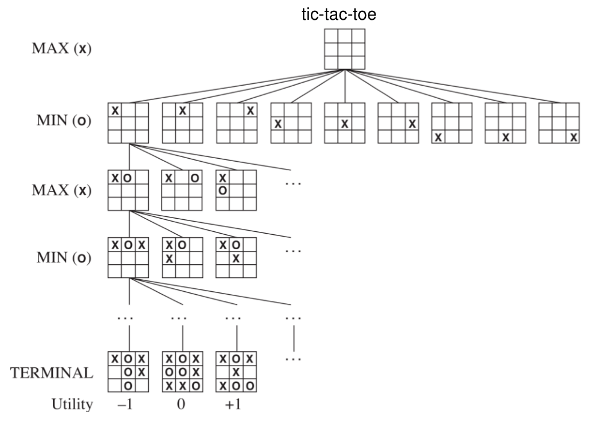
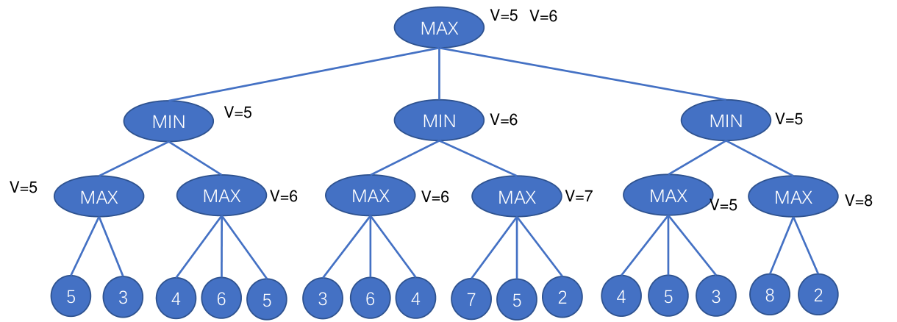
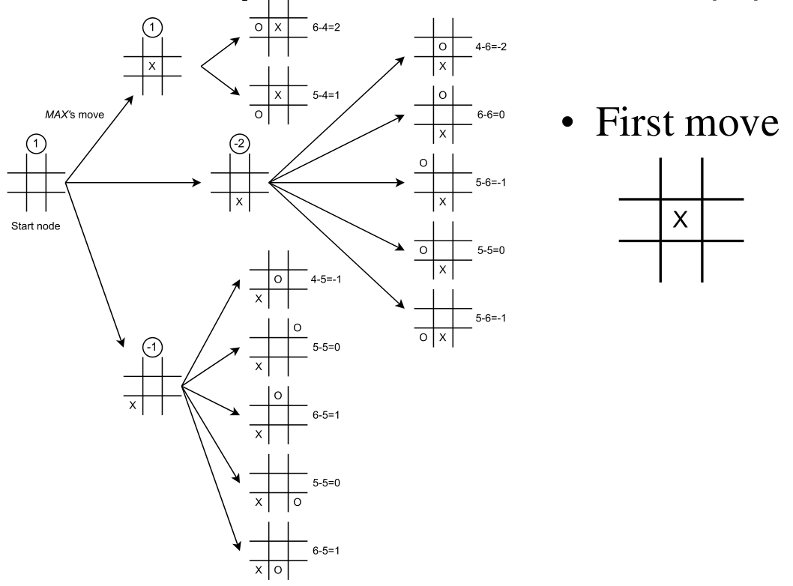
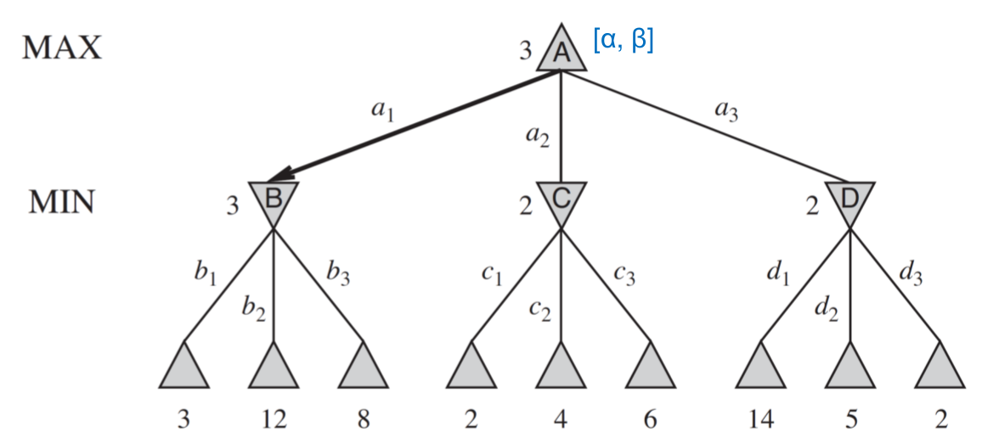

## Multi-Agent System
涉及到多人之间的博弈，但是数量不会特别多，否则应该使用经济学中的原理而非人工智能。同时多智能体系统要有明确的行动规则，比如说篮球比赛现在想要建模还比较困难，因为规则太复杂了。

## A Special Case
现在只考虑只有**两个智能体**开展**零和博弈**的情形，两个玩家**轮流行动**，都默认采取**最佳策略**。同时环境确定且可观测。(Two-Player Sequential Zero-Sum Complete-Information)

### Tic-Tac-Toe

#### Solution Concept
我们在玩这个游戏的时候总是会想如何阻止对方连成一条线，这里可以显示出玩家总是会认为对方会做出最优的策略。

### Game as Search Problem
对于一棵搜索树，一个状态后面会有许多后继状态，这和两个人的博弈是类似的。

定义：
* $S_0$：初始状态
* Players(s)：在状态 $s$ 行动的玩家
* Action(s)：一个合法的行动
* Result(s,a)；状态 $s$ 在行动 $a$ 之后的后继状态
* Terminal-Tests(s)：表示游戏是否在状态 $s$ 终止
* Utility(s,p)：表示某个终止状态状态 $s$ 对于玩家 $p$ 的效用值，其中 $p \in \left\{ MAX, MIN \right\}$。
* Game：在游戏数(搜索树)中搜索

因此我们需要找到一条路径，从初始状态到终止状态。并且对于 MAX 玩家而言，希望终止状态效用函数能最大化；对于 MIN 玩家而言，希望终止状态效用函数能最小化。而在玩家每一步的行动中，他们都会采取对自己最有利的策略。

### Minimax Algorithm
#### Brute force
该算法是为了找出上面提到的路径。算法的执行顺序为：假如知道某个节点 $s$ 所有后继节点的 minimax 值，那么就能确定节点 $s$ 的值，其中
* 假如 Player(s)=MAX，那么节点 $s$ 的值为后继节点的最大值
* 假如 Player(s)=MIN，那么节点 $s$ 的值为后继节点的最小值

即：
$$
MINMAX(s)=
\begin{cases}
    UTILITY(s) & \text{if } TERMINAL-TEST(s)\\
    \max_{a\in Action(s)} MINMAX(RESULT(s,a))& \text{if } PLAYER(s)=MAX\\
    \min_{a\in Action(s)} MINMAX(RESULT(s,a))& \text{if } PLAYER(s)=MIN\\
\end{cases}
$$

因此这种算法相当于对整棵树进行搜索。

比如下面这颗搜索树，使用 minimax 算法的结果如下：

#### Properties of minimax algorithm
* 是完备的(只要搜索树是有限的)
* 是最优的(只要对手同样采取最优策略)
* 时间复杂度为 $O(b^{m})$(该算法其实就是深度优先搜索，$b$ 为每次能采取的行动种数，$m$ 为整盘棋的总步数)
* 空间复杂度为 $O(bm)$

可以看出该算法对于一些比较大型的游戏而言是不可行的，比如下棋时 $b\thickapprox 25, m\thickapprox 100$，那么计算量显然是无法接受的。因此对于很多实际问题而言，我们无法做到搜索整棵树，而是只能搜索树的一部分。

#### Minimax Algorithm
为了实现较快的计算，可以限制搜索树的深度，比如限制为 $d$。但是与此同时，因为无法搜索到叶节点得到准确的效用值，我们需要给中间节点定义评估函数(evaluation function) $e(s)$。

对于一个评估函数
* 评估函数对于终止状态的排序应当和效用值对终止状态的排序应当是相同的。
* 因为评估函数需要多次计算，所以为了节约时间，应当便于计算
* 评估函数的值应当与获胜的概率密切相关

比如对于象棋而言，我们可以依据棋盘上棋子的数量和种类来定义一个评估函数。

#### Example
比如对于 Tic-Tac-Toe 游戏，我们定义 × 是 MAX 一方，而每种状态的评估函数定义为 $e(s)=$ 对于 MAX 玩家目前任然开放的行、列、对角线的数量-对于 MIN 玩家目前任然开放的行、列、对角线的数量。

假如考虑从头开始，第一步为 × 玩家先走，那么得到的限制深度 $d=2$ 的搜索树为：

对各个叶节点使用评估函数估算，然后逐层推回根节点，就能知道 × 玩家应当先走哪一步。假如是从中间某一部开始，那么可以同理计算。

### $\alpha-\beta$ Pruning
之前的算法是限制搜索树的深度，于此同时我们还可以对搜索树进行剪枝，减小其复杂度。这就是 $\alpha-\beta$ 剪枝。

#### Example
首先从一个例子入手

我们希望得到根节点的最优解，那么
1. 首先看最左边的B节点，得到值为 $3$，此时可以确定A节点的下限应当为 $3$
2. 然后再看C节点，C的第一个子节点为 $2$，这说明C节点上限为 $2$，则C的上限低于A的下限，C必然不可能更新A。
3. 所以C的其他子节点都直接不用考虑

$\alpha-\beta$ 剪枝就是这样的思路。

#### Why is it called $\alpha-\beta?$
$\alpha$ 对于某个MAX节点来说，是当前子结点中最好的(即最大的)值，这个值就限定了该MAX节点的下限。那么对于该MAX的某个MIN子节点来说，如果MIN子节点在某个时刻的值 $v$ 小于 $\alpha$，这个分枝就应该被剪掉。

$\beta$ 同理。

#### pseudo code
$$
\begin{aligned}
& \textbf{function ALPHA-BETA-SEARCH}(state)\text{returns an action}\\
& \quad v\leftarrow\text{MAX-VALUE}(state,-\infty,+\infty)\\
& \quad \textbf{return the }action\text{ in ACTIONS}(state)\text{ with value }v
\end{aligned}
$$

$$
\begin{aligned}
& \textbf{function MAX-VALUE}(state,\alpha,\beta)\textbf{ returns }a\textit{ utility value} \\
& \quad\textbf{if TERMINAL-TEST}(state)\textbf{ then return UTILITY}(state) \\
& \quad v\leftarrow-\infty  \\
& \quad \text{for each a in ACTIONS(state) do}  \\
&  \quad \quad v\leftarrow\operatorname{MAX}(v,\operatorname{MIN-VALUE}(\operatorname{RESULT}(s,a),\alpha,\beta)) \\
& \quad \quad \textbf{if }v\geq\beta\textbf{ then return }v \\
& \quad \quad \alpha\leftarrow\mathrm{MAX}(\alpha,v) \\
& \quad \text{return } v
\end{aligned}
$$

$$
\begin{aligned}
&\textbf{function MIN-VALUE}(state,\alpha,\beta)\textbf{ returns }a\textit{ utility value} \\
&\quad \textbf{if TERMINAL-TEST}(state)\textbf{ then return UTILITY}(state) \\
&\quad v\leftarrow+\infty  \\
&\quad\text{for each a in ACTIONS(state) do} \\
&\quad \quad v\leftarrow\mathrm{MIN}(v,\mathrm{MAX-VALUE}(\mathrm{RESULT}(s,a),\alpha,\beta)) \\
&\quad \quad\textbf{if }v\leq\alpha\textbf{ then return }v \\
&\quad \quad \beta\leftarrow\operatorname{MIN}(\beta,v) \\
&\quad \text{return } v
\end{aligned}
$$

在上述伪代码中，$\textbf{if }v\geq\beta\textbf{ then return }v$ 就是剪枝的操作。

#### conclusion
* MAX玩家更新 $\alpha$ 节点，MIN玩家更新 $\beta$ 节点
* 节点 $\alpha, \beta$ 的值从上向下传递
* 节点的效用值 $v$ 从下向上传
* $\alpha-\beta$ 剪枝不会影响最终的结果
* 后继节点出现的顺序会很大的影响算法的效率，在最好的情况下，时间复杂度为 $O(b^{m / 2})$，其中 $b$ 为分支数，$m$ 为深度；而在最差的情况下，时间复杂度为 $O(b^{m})$

#### Iterative Deepening Search
$\alpha-\beta$ 剪枝同样也是一种深度优先搜索，所以同样也可以使用迭代加深的算法，同样也可以使用启发式函数来评估。

