最开始的人工智能做的都是search，而之后的机器学习才开始做inference，会自己学习知识。而CSP问题则介于两者之间，它会把inference的思路融入到search中，这是人工智能的一大进步，智能体在搜索的时候会进行思考。

## Constraint Satisfaction Problems(CSP)
### What is Search For?
* 一种问题是寻找路径，即一系列行动。
* 另一种是识别，识别最终的目标状态，路径则不重要。

这里的目标满足问题(CSP)主要关心识别的问题，即只关心最终状态，不关心路径。

### State Representation
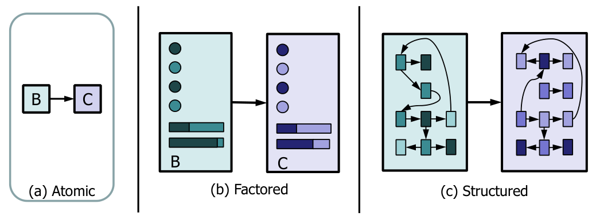

对于CSP问题
* 一个状态由一系列变量 $X_{i}(i=1, 2, \ldots n)$ 的集合构成，值域为 $D_i$
* 目标测试由一系列约束 $C_i(i=1, 2, \ldots m)$ 来决定。

CSP问题相较于之前搜索算法的进步：
* 原子状态(atomic state) $\rightarrow$ (factored state)
* 搜索(search) $\rightarrow$ 搜索+推断(inference)
* 特定算法(specific) $\rightarrow$ 通用算法(general)
  * 搜索问题对于每个问题都需要根据问题进行设计，而CSP问题则有一些通用的算法，只要问题能够建模成CSP问题，就能用特定的算法解决。

### Example: Map-Coloring
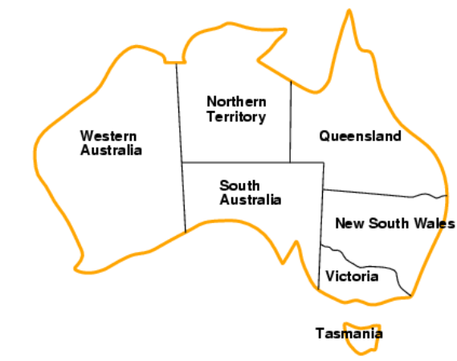

* 变量：WA，NT，Q，NSW，V，SA，T
* 定义域：$D_i$ = {red, green, blue}
* 约束：相邻区域必须颜色不同

将其抽象成一个约束满足问题：
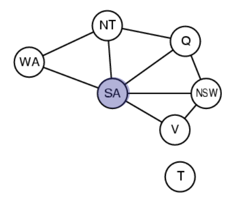

一个节点对应一个变量，一条边对应一个约束。

把这个问题当成约束满足问题，相比最简单的搜索问题，一个优势是可以减小搜索空间，加快搜索。

### Varieties of CSPs
* 变量取离散值
  * 有限域，假如有 $n$ 个变量，$d$ 种取值，那么会有 $O(d^{n})$ 种选择
  * 无限域，那么就需要一些约束条件
* 连续变量
  * 有各种约束和优先级，可能用线性规划来解决

### Standard search formulation (incremental)
对于所有的约束满足问题，初始状态、目标测试和后继函数都可以进行统一的定义
* 初始状态：空的指派
* 后继函数：选择一个还未赋值变量对其进行控制
* 目标测试：看所有变量的赋值有没有冲突

## Backtracking Search
回溯搜索本质上也是一种深度优先搜索，我们把用于约束满足问题的单变量赋值的深度优先搜索称为回溯搜索。回溯搜索是一种没有信息指导的搜索，只需要在每个节点考虑单变量的赋值。

### Two improvements
* 每次只考虑一个变量的赋值，并且变量的赋值是可交换的(即赋值的顺序不影响最终结果)
* 每一次赋值之后需要检查是否满足目标

搜索树越深，已经赋值的变量越多，需要检查的约束也越多。

地图染色的例子如下
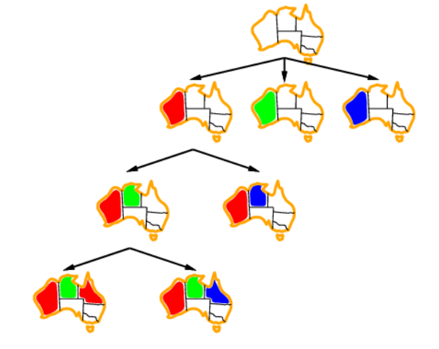

### Pseudo code
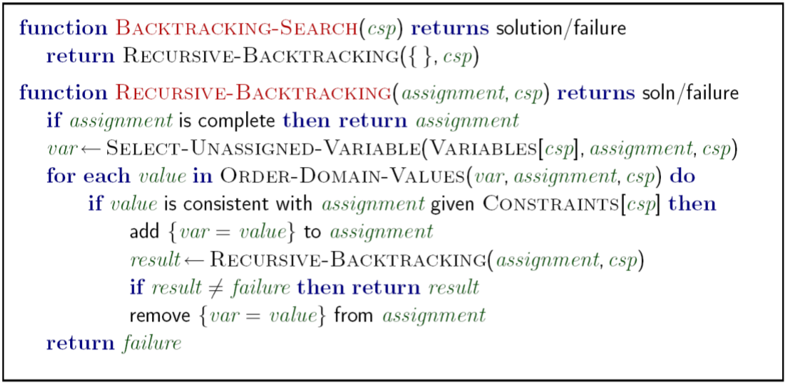

其中 $\text{SELECT-UNASSIGNED-VARIANBLE}(\text{VARIABLE}[csp], assignment, csp)$ 和 $\text{for each } value \text{ in ORDER-DOMAINJ-VALUES}(VAR, assignemnt, csp)$ 这两点都非常重要，选择策略是否合适会影响算法的效率。

改进回溯算法，就是需要改进这两个选择的函数。

### Improving backtracking efficiency
对于**变量的选择**：
1. 首先可以选择约束比较多的变量(most constrained variable)，比如说做数独的时候通常先填那些基本已经确定的，因为此时这个变量能够选择的空间就比较小。(minimum remaining values heuristic)
2. 其次可以选择对其他变量影响最多的(most constraining variable, Tie-breaker)，即选择那些在约束条件中出现次数最多的。比如说地图染色中，我们会倾向于选择中间的点开始染色。

以上操作相当于做剪枝

对于**变量的赋值**：
选择对其他变量影响最少的(least constraining value)。
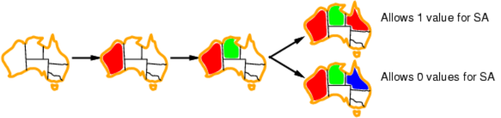

比如说上面这个地图染色的例子中，假如按照上面那种方法进行染色，就有更大的概率继续给后面的变量赋值，也就更有可能找到最终的解。

以上的操作是让当前道路找到满足条件解的成功率更高。

## Interleaving search and inference
除了以上两步的改进，还可以进行进一步的算法优化，即将搜索(search)和推理(inference)结合起来。这里的推理比较简单，就是进行约束的传播。

注：机器学习中的inference和传统人工智能的inference有所差异。机器学习中指的主要是一个推断预测的过程；而在经典的人工智能中，则是做知识的推断。比如在CSP中，inference就是要推出一些新的约束，这些新的约束就可以看成新的知识，加入到知识库中。

### Forward checking
就是要追踪没有被赋值过的变量所有剩下的取值，当发现有变量没有合法的取值的时候，就停止此次搜索。

下图是地图染色的例子，每次染色之后考虑邻居的取值范围的改变。这是一种简单的追踪。
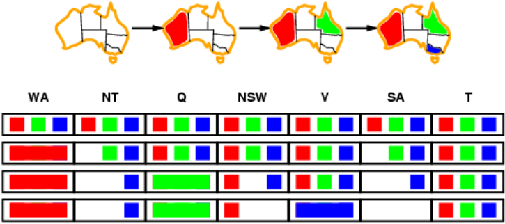

可以看出我们此时需要一个新的数据结构来存储信息。所以Forward checking相当于首次在search中加入了inference。

但是前向检查仍有不足，因为它只更新了邻居的情况。比如像上面例子的第三行，NT和SA的选择都只剩蓝色，但是它们又都是邻居，此时应当已经可以结束搜索，而前向搜索不能解决这个问题。所以还需要对算法进行进一步改进。

### AC-3 algorithm
#### Arc consistency
弧(Arc)：这里指从某一个变量到另一个变量的一条边，是有方向的。

弧 $X \rightarrow Y$ 是一致的，当且仅当对于 $X$ 的每个取值 $x$，变量 $Y$ 都能找到某个取值 $y$ 使其满足约束。

比如下图中，从SA到NSW有一条弧，那么对于SA中的每一个取值(这里正好只有蓝色)，NSW中应当都要找出值以满足约束(比如可以选择红色)。所以我们认为这条弧是相容的。
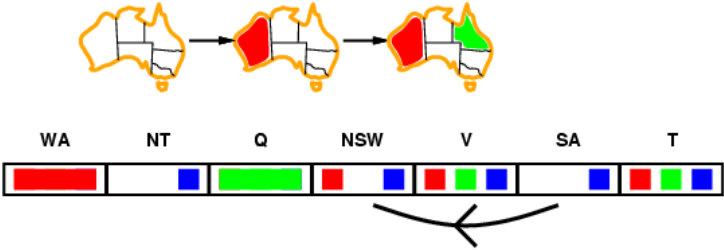

#### Arc Consistency Algorithm #3
在使用弧相容算法时，假如一个区域的取值发生变化(或者是被染色)，那么就需要建立一条从它的邻居指向它的弧，并且改变邻居的取值范围使这条弧相容。在算法的实现中，需要一个队列来储存需要检查的弧；同时检查某个弧时假如改变了某个节点的定义域，则会像队列中加入新的弧。

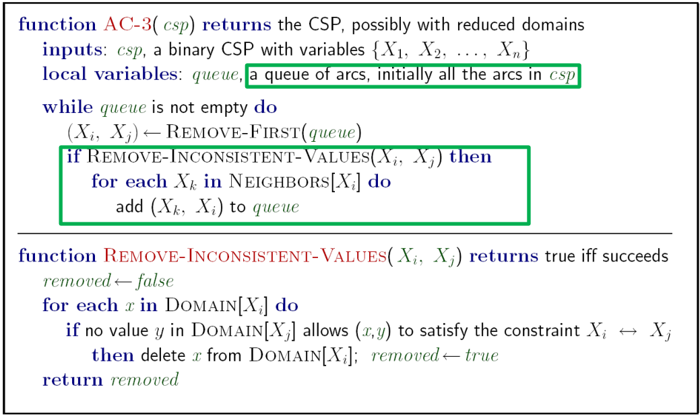

AC-3算法是backtracking的一种改进，相当于在对某个节点赋值之后，对其他节点的定义域进行修改，即将csp改为AC-3(csp)。

#### Limitations of Arc Consistency
对于下图来说，虽然实际上无法正确染色，但是弧相容算法检查不出错误。
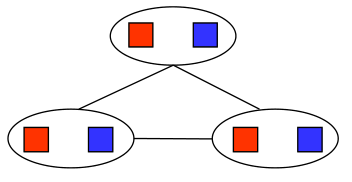

#### Complexity of a single run of AC-3
假如有 $n$ 个变量，每个变量有 $d$ 种取值。

对于函数 $REMOVE-INCONSISTENT-VALUE(X_{i}, X_{j})$，时间复杂度为 $O(d^{2})$，

（这里没搞懂）

## Local search for CSPs
对于约束满足问题，也可以使用爬山算法，模拟退火算法等方法。这种方法同样是给一个初始的赋值，然后逐渐改变赋值使得最终约束都被满足。

* 修改赋值时，首先选择那些不满足约束的变量
* 给变量重新赋值时，尽量让冲突最少

比如说使用爬山法，可以定义启发式函数为违背约束的个数，然后逐渐改变赋值使得约束越来越少，并且需要减少最快。
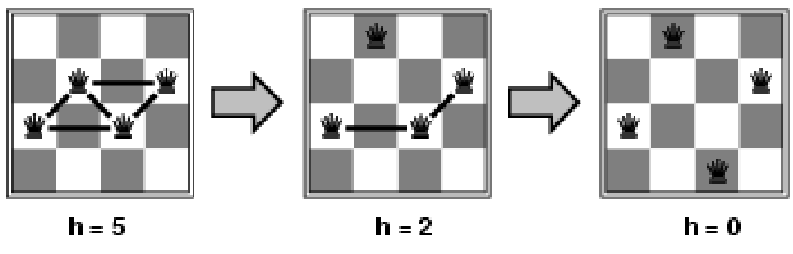

