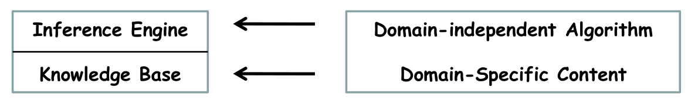
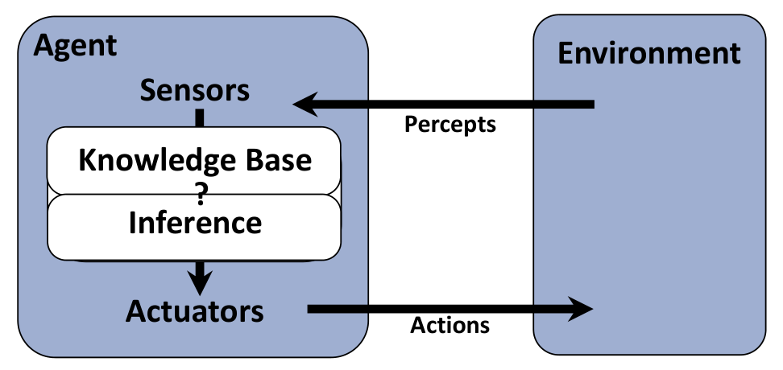
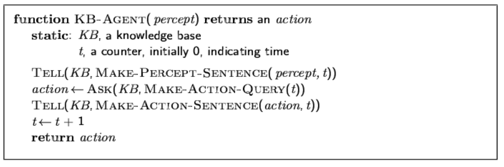
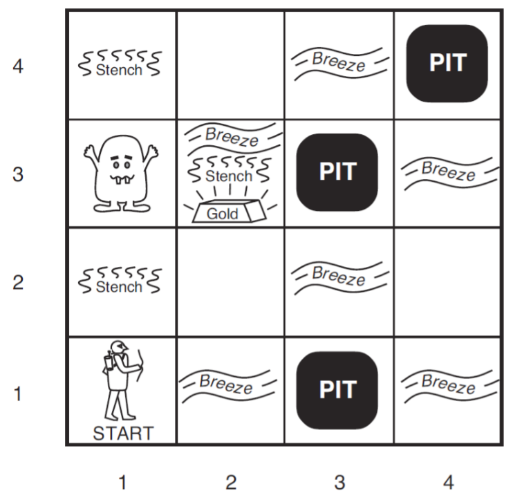
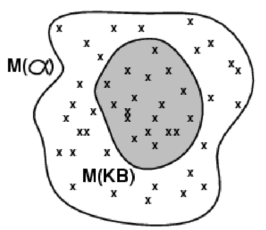
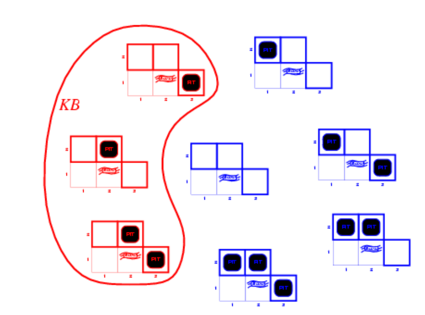
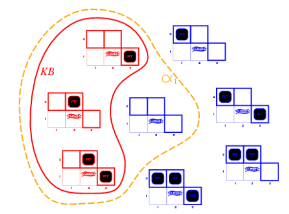
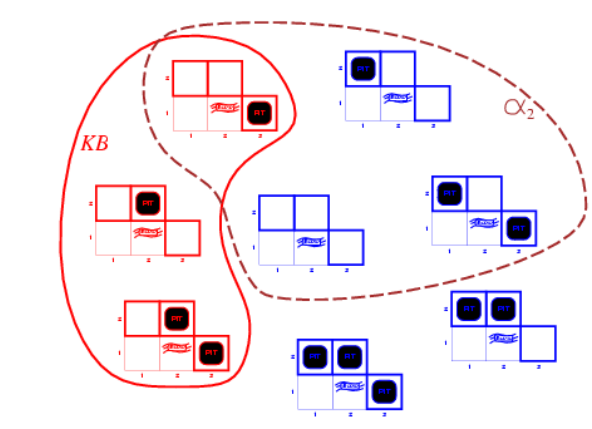
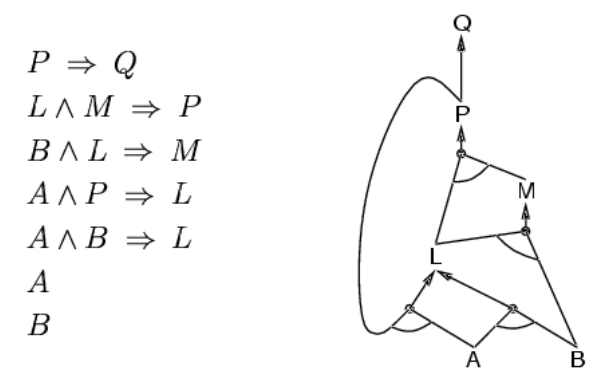
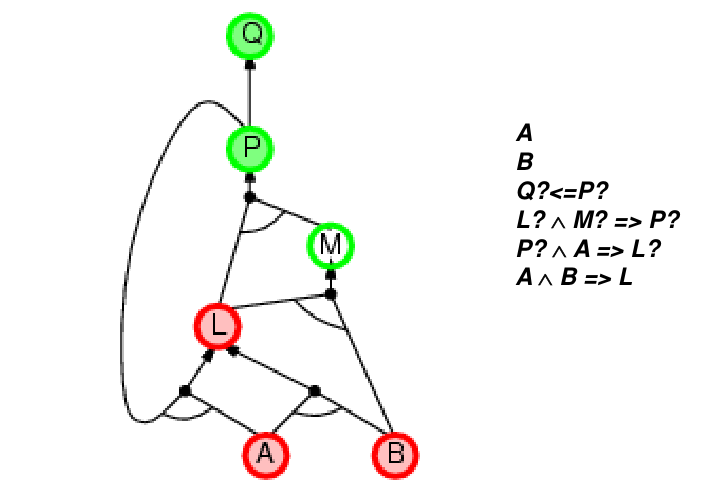

## Knowledge-based agents
### Knowledge Bases

在逻辑智能体中，知识库就是一系列的形式语言，我们告诉智能体可以怎么做，然后智能体就能依照我们提供的指示，从知识库中推导出新的知识。

### Logical Agents
和CSP相比，逻辑智能体存放的内容更加复杂，形式更加丰富(命题逻辑、谓词逻辑)。

比如告诉一个逻辑智能体以下信息：
* 事实(facts)：
  * 草是绿的
  * 天是蓝的
* 规则(rule)：
  * 吃太多糖果会生病
  * 生病了就不用去学校
* 观测条件(percepts and actions)：
  * pat今天吃了很多糖果

智能体会推出结论：pat今天不用去学校

## Wumpus world

想要让逻辑智能体解决这个问题，我们首先要将问题形式化。

## Logic in general - models and entailment
* 逻辑语句(logics)就是包含了能够推出结论的信息的形式化语句(formal language)。
* 语法(syntax)定义了一个句子(sentence)应当是怎样的
* 语义(semantics)定义了句子的是真还是假(meaning)

### Entailment
逻辑蕴含(entailment)指的是一者能够推出另一者
$$
KB \models \alpha
$$

这里是知识库KB蕴含 $\alpha$，即假如KB为真，那么 $\alpha$ 一定为真。逻辑蕴含关系能够让智能体得到新知识。

### Models
我们说 $m$ 是关于句子 $\alpha$ 的一个模型，也就是说在 $m$ 的条件下 $\alpha$ 为真。我们用 $M(\alpha)$ 表示 $\alpha$ 所有模型的集合。因此 $KB \models \alpha$ 等价于
$$
M(KB) \subseteq M(\alpha)
$$

下面演示通过模型检验的方式进行逻辑推导，以前面的Wumpus world游戏为例。假如玩家已经探索了(1, 1)和(2, 1)坐标，然后可以列出所有可能的模型，再根据KB中的规则得到 $M(KB)$

然后记语句 $\alpha_1$ 为“[1, 2]是安全的”，可以得到 $M(\alpha_1)$ 如下：

可以看出 $KB \models \alpha_1$，所以 $\alpha_1$ 为真。但是如果记 $\alpha_2$ 为“[2, 2]是安全的”，那么得到 $M(\alpha_2)$ 如下：

可以看出无法得到 $\alpha_2$ 为真。

### Wumpus world sentence
假如想要使用推导的话，需要将这个游戏形式化。
* 令 $P_{ij}$ 为真表示 $(i,j)$ 点上有陷阱
* 令 $B_{ij}$ 为真表示 $(i,j)$ 点有微风

假如此时玩家探索了 $(1, 1)$ 坐标和 $(1, 2)$ 坐标，那么可以得到知识：$\neg P_{1, 1}, \neg B_{1, 1}, B_{2, 1}$。根据规则：“陷阱的周围有微风”，可以得到 $B_{1, 1}\Leftrightarrow (P_{1, 2} \lor P_{2,1}), B_{2, 1}\Leftrightarrow (P_{1, 1}\lor P_{2, 2} \lor P_{3,1})$

## Inference rules and theorem proving
### resolution
归结法的推导：
对于两个CNF $l_1 \lor  \cdots \lor l_k，m_1 \lor \cdots \lor m_n$，假如存在 $l_i$ 和 $m_j$ 互补，那么就归结出 $l_1 \lor  \cdots \lor  l_{i-1} \lor l_{i+1} \lor \cdots \lor \cdots l_k \lor  m_1 \lor \cdots \lor m_{j-1} \lor m_{j+1} \lor  \cdots  \lor  m_n$

也就是说想要使用归结法，要首先将逻辑表达式变成合取范式。

#### Resolution algorithm
使用归结法实际上是在使用反证法。假如我们希望证明 $KB \Rightarrow \alpha$，那么需要证明 $KB \land  \lnot \alpha$ 是不可满足的。

于是我们将 $KB$ 给出的条件转化为合取范式(CNF)，同时将 $\lnot \alpha$ 也一起放入，假如经过归结，发现得到空集，这就说明 $KB \land  \lnot \alpha$ 不可满足，$KB \Rightarrow \alpha$。

### Horn Form
霍恩子句是一种更加严格的子句。在前面我们提到需要将 $KB$ 化为合取范式，而假如其中的子句满足至多有一个变量为正(positive)，那么该子句就是霍恩子句。比如：$\lnot L_{1,1} \lor \lnot Breeze \lor B_{1,1}$。

使用霍恩子句是为了让子句更方便地变成肯定前件式，便于推导，比如 
$\lnot L_{1,1} \lor \lnot Breeze \lor B_{1,1} \Leftrightarrow L_{1,1} \land  Breeze \rightarrow B_{1,1}$ 

### forward chaining
就是利用肯定前件式直接往后推，比如这个例子，就是在知道A,B的前提下，一步一步推导出其他条件

### backward chaining
将forward的顺序反过来，思路为：我们需要一个条件，然后看实现这个条件还需要什么其他条件，以此类推往前追溯。

上面就是一个backwards chaining的例子。
