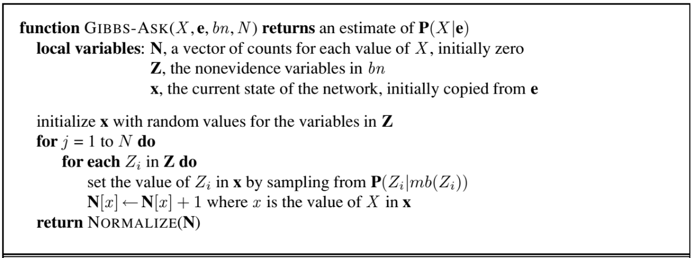

## Uncertainty
假如我们定义一个行为(action) $A_t$，表示在航班开始 $t$ 分钟前前往机场，然后想知道执行 $A_t$ 之后是否能够到达机场。相比之前提到的逻辑智能体，显然这里的某个行为并不能得到确切的结果。

不能得到确切结果的问题在于：
1. 我们无法感知到所有的相关事件
2. 观测到的信息可能并不完全准确
3. 会有一些突发事件
4. 任务过于复杂，无法建模

因此存粹的使用逻辑的方法，可能会犯错；如果希望逻辑严密，又会得到很弱的结论(需要进行大量的前提条件)。

### Methods for handling uncertainty
* 定义缺省情况下的逻辑，即默认各种罕见情况不会发生
* 试图在逻辑中加入模糊因子(fudge factor)。比如：
  * $A_{25}\rightarrow _{0.3}\text{get there on time}$
  * $\text{Sprinkler} \rightarrow _{0.99} \text{WetGrass}$
  * $\text{WetGrass} \rightarrow _{0.7} \text{Rain}$
  * 但是使用这种方法在做逻辑推导的时候可能会导致一些问题。比如按照上述例子，洒水车会导致下雨，这是荒谬的。

## Probability
所以人们最终引入了概率。不过需要注意，这里的“概率”是智能体的一种信念，而不是真实的概率。但是我们任然可以继续使用概率论中的法则对这里的假想概率进行运算。

用概率的好处在于
* (laziness)我们不需要列出所有意外的情况，减少工作量
* (ingnorance)因为我们有很多不能准确预知的结果，所以使用智能体的信念来表达结果更加合理。
### Making decisions under uncertainty
但是假如只依靠概率的话，又会出现问题。还是以提前出发去机场为例，假如智能体预测结果为：
$P(A_{25} \text{ gets me there on time} | …) = 0.04$
$P(A_{90} \text{ gets me there on time} | …) = 0.70$
$P(A_{120} \text{ gets me there on time} | …) = 0.95$
$P(A_{1440} \text{ gets me there on time} | …) = 0.9999$

可以看出提早时间越长，赶上飞机的概率越大。但是一味的提高概率而不考虑代价也是不合理的，所以我们需要引入效用值(utility)。

## Inference
### Inference by enumeration
通过枚举法进行推理，就是把真值表列出来，然后把符合条件的项相加。

比如根据以上的联合概率分布，需要计算牙疼(toothache)的概率：
$$
\operatorname{Pr}(\text{toothache}) = 0.108 + 0.012 + 0.016 + 0.064 = 0.2
$$

这种方法也可以计算条件概率：
$$
\begin{aligned}
\operatorname{Pr}(\lnot \text{cavity}|\text{toothache}) &= \frac{\operatorname{Pr}(\lnot \text{cavity} \land \text{toothache})}{\operatorname{Pr}(\text{toothache})} \\
&= \frac{0.016+0.064}{0.108 + 0.012 + 0.016 + 0.064} \\
& = 0.4
\end{aligned}
$$

**形式化的描述**，就是给定证据变量 $E=e$，想要查询某个变量 $Y$，然后需要把隐藏变量 $H$ 消掉，即：
$$
\operatorname{Pr}(Y|E=e) = \alpha \operatorname{Pr}(Y, E=e) = \alpha \sum_{h} \operatorname{Pr}(Y, E=e, H=h)
$$

上式中的 $\alpha$ 为归一化变量。比如说：
$$
\begin{aligned}
\operatorname{Pr}(\text{Cavity} | \text{toothache}) &= \alpha \operatorname{Pr}(\text{Cavity},\text{toothache}) \\
&= \alpha [\operatorname{Pr}(\text{Cavity},\text{toothache},\text{catch}) + \operatorname{Pr}(\text{Cavity},\text{toothache},\lnot \text{catch})] \\
&= α [<0.108,0.016> + <0.012,0.064>] \\
&= α <0.12,0.08> = <0.6,0.4>
\end{aligned}
$$

(注意上面 Cavity 是随机变量，而 toothache 和 $\lnot$ catch 是确定的取值)。

## Independence and Bayes' Rule
### Independence
随机变量 $A$ 和 $B$ 相互独立，即：$\operatorname{Pr}(A|B)=\operatorname{Pr}(A)$ 或 $\operatorname{Pr}(B|A)=\operatorname{Pr}(B)$ 或 $\operatorname{Pr}(A,B)=\operatorname{Pr}(A)\operatorname{Pr}(B)$。利用独立的条件，能够大大简化真值表的规模。

假如我们考察以下几个随机变量，其中 Cavity, Toothache, Catch, Weather 的取值分别有 2，2，2，4 个。

假如 Weather 和其他变量独立，那么真值表的大小就由原来的 $2\times 2\times 2\times 4=32$ 变为现在的 $2\times 2\times 2+4=12$。

### Conditional independence
绝对独立性虽然很好用，但实际情况中绝对独立的随机变量是很少见的，因此这里考虑条件独立。

随机变量 $A$ 和 $B$ 在 $C$ 的条件下独立，即：$\operatorname{Pr}(AB|C) = \operatorname{Pr}(A|C)\times \operatorname{Pr}(B|C)$，或者 $\operatorname{Pr}(A|C)=\operatorname{Pr}(A|BC)$。上面两个式子等价：
$$
\operatorname{Pr}(A|C) = \operatorname{Pr}(A|BC) = \frac{\operatorname{Pr}(ACB)}{\operatorname{Pr}(BC)} = \frac{\operatorname{Pr}(AB|C)\cdot \operatorname{Pr}(C)}{\operatorname{Pr}(B|C)\cdot P(C)} \\ 
\Leftrightarrow \operatorname{Pr}(AB|C) = \operatorname{Pr}(A|C)\times \operatorname{Pr}(B|C)
$$

继续考虑上面的例子。假如有 Toothache, Cavity, Catch 三个变量，在不考虑独立性的情况下，$\operatorname{Pr}(\text{Toothache}, \text{Cavity}, \text{Catch})$ 有 $2^{3}-1=7$ 个独立项。但假如考虑 Toothache 和 Catch 在 Cavity 的条件下独立，那么
$$
\begin{aligned}
&\operatorname{Pr}(\text{Toothache}, \text{Catch}, \text{Cavity}) \\
&= \operatorname{Pr}(\text{Toothache} | \text{Catch}, \text{Cavity}) \operatorname{Pr}(\text{Catch}, \text{Cavity}) \\
&= \operatorname{Pr}(\text{Toothache} | \text{Catch}, \text{Cavity}) \operatorname{Pr}(\text{Catch} | \text{Cavity}) \operatorname{Pr}(\text{Cavity}) \\
&= \operatorname{Pr}(\text{Toothache} | \text{Cavity}) \operatorname{Pr}(\text{Catch} | \text{Cavity}) \operatorname{Pr}(\text{Cavity}) 
\end{aligned}
$$

总共有 $2+2+1=5$ 个独立项。

### Bayes' Rule and conditional independence
朴素贝叶斯(naive Bayes)模型的基本思想就是，在给定了 label 的情况下，各个特征值是相互独立的。

$$
\operatorname{Pr}(\text{Cause}, \text{Effect}_{1}, \text{Effect}_{2}, \ldots ,\text{Effect}_{n})
= \operatorname{Pr}(\text{Cause}) \prod_{i} \operatorname{Pr}(\text{Effect}_{i}|\text{Cause}) 
$$

如果再考虑之前的例子，即为：
$$
\begin{aligned}
&\operatorname{Pr}(\text{Cavity} | \text{toothache} \land  \text{catch}) \\
&= α \operatorname{Pr}(\text{toothache} \land  \text{catch} | \text{Cavity}) \operatorname{Pr}(\text{Cavity}) \\
&= α \operatorname{Pr}(\text{toothache} | \text{Cavity}) \operatorname{Pr}(\text{catch} | \text{Cavity}) \operatorname{Pr}(\text{Cavity})
\end{aligned}
$$

## Bayesian networks
引入贝叶斯网咯同样是因为 Inference by enumeration 过于繁琐，而朴素贝叶斯的假设又过于理想，因此需要更加强大的工具。

贝叶斯网络是一种图模型，为有向无环图(DAG)。给出贝叶斯网络之后，就很容易得到条件独立性的关系。想要通过贝叶斯网络得到联合概率分布，可以使用以下公式：
$$
\operatorname{Pr}(X_1, \ldots X_{N}) = \prod_{i} \operatorname{Pr}(X_{i}| Parents(X_{i}))
$$

例如：

### Local Structures & Independencies
然后分析贝叶斯网络中的几种独立关系。独立关系的分析是从公式 $\operatorname{Pr}(X_1, \ldots X_{N}) = \prod_{i} \operatorname{Pr}(X_{i}| Parents(X_{i}))$ 以及概率论中的链式法则出发。

下面用一个例子直观的解释以上的独立性与条件独立性。

对于左边的情况，即给定 $B$，$A,C$ 独立(B decouples A and C)。考虑这种情形：

本来是智商影响成绩，成绩影响推荐信，所以智商越高，得到推荐信的概率越大。但是当成绩已经出来了之后，智商就无法间接影响推荐信了。

对于中间的情况，即给定 $B$，$A,C$ 独立(B decouples A and C)。考虑这种情形：

本身课程的成绩和SAT的成绩有关联，就是因为两者都是由智商决定，一般一个分数高，另一个分数也高。但是当智商已知，两者就无关了。

对于右边的情况，即给定 $C$，$A,B$ 相关(C couples A and B)。考虑这种情形：

本身考试难度和一个人的智商无关。但是假如已知分数，比如一个同学考试分数很低，那么我们就可以用难度和智商相互推断，比如当我们知道这个同学智商很高，就可以推断考试很难。

### Bayes Nets Inference
对于图模型来说，有三个主要的问题
* 表征(representation)。贝叶斯网络本身就是表征了相关性的信息。
* 推断(Inference)。给出一系列的询问(query)，希望得到回答。
* 学习(learing)。比如贝叶斯学习和朴素贝叶斯分类器。贝叶斯学习就是从贝叶斯推理中拓展出来的。

### Queries
* 推理查询(inferential query)1：可能性(Likelihood)
就是计算某个确定事件发生的概率。(What is the probability of evidence?)
$$
\operatorname{Pr}(x_{v}) = \sum_{x_{H}}\operatorname{Pr}(X_{H},X_{v})=\sum_{x_1}\cdots \sum_{x_{k}}\operatorname{Pr}(x_1, \ldots ,x_k, x_v)
$$

* 推理查询2：条件概率(Conditional Probability)
$$
\operatorname{Pr}(Y|x_{V})= \sum_{z}P(Y,Z=z|x_{V})
$$

* 推理查询3：最有可能的指派(Most Probable Assignment)
即考虑那种结果可能性是最大的。这个查询和2不同之处在于这里不需要精确求出概率，只需要进行比较即可。

## Approaches to Inference
假如有了一个贝叶斯网络，已知一些先验概率和条件概率，需要求出未知的一些概率值，这就需要一些推断方式。

### Example: A Bayesian Network
假如有一个食物网，我们希望知道当草的条件不好时老鹰离开的概率。即求出 $P(A|H=h)$

### Inference on General BN via Variable Elimination
想要求条件概率分布，可以先求出联合概率分布，然后再将无关的变量做边缘化。即：
$$
\operatorname{Pr}(X_1,e) = \sum_{x_n}\sum_{x_3}\sum_{x_2}\prod_{i} \operatorname{Pr}(x_i|pa_{i})
$$

但无疑直接计算是非常复杂的。因此我们需要采用和乘法分配律类似的方法。比如上式在对 $x_2$ 求和时，可以先将所有无关项提出，就能大大简化加法计算。

#### Example
我们以前面提到的食物网为例，展示计算过程
* 此时的查询(query)为 $\operatorname{Pr}(A|h)$，因此需要消掉 $B,C,D,E,F,G,H$。
* 已知条件为 $\operatorname{Pr}(a), \operatorname{Pr}(b), \operatorname{Pr}(c|b), \operatorname{Pr}(d|a), \operatorname{Pr}(e|c,d), \operatorname{Pr}(f|a), \operatorname{Pr}(g|e), \operatorname{Pr}(h|e,f)$。
* 然后需要选择一个消除(Elimination)的顺序。

1. 首先消除 $H$。记
   $$
   m_{h}(e,f)=\operatorname{Pr}(h=\tilde{h}|e,f) = \sum_{h} \operatorname{Pr}(h|e,f)\delta(h=\tilde{h})
   $$

  则计算式：
  $$
  \operatorname{Pr}(a) \operatorname{Pr}(b) \operatorname{Pr}(c|b) \operatorname{Pr}(d|a) \operatorname{Pr}(e|c,d) \operatorname{Pr}(f|a) \operatorname{Pr}(g|e) \operatorname{Pr}(h|e,f) \\ 
  \Rightarrow 
  \operatorname{Pr}(a) \operatorname{Pr}(b) \operatorname{Pr}(c|b) \operatorname{Pr}(d|a) \operatorname{Pr}(e|c,d) \operatorname{Pr}(f|a) \operatorname{Pr}(g|e) m_{h}(e,f)
  $$
2. 消除 $G$
   $$
   m_{g}(e) = \sum_{g}\operatorname{Pr}(g|e)=1
   $$

   $$
   \operatorname{Pr}(a) \operatorname{Pr}(b) \operatorname{Pr}(c|b) \operatorname{Pr}(d|a) \operatorname{Pr}(e|c,d) \operatorname{Pr}(f|a) \operatorname{Pr}(g|e) m_{h}(e,f) \\
   \Rightarrow 
   \operatorname{Pr}(a) \operatorname{Pr}(b) \operatorname{Pr}(c|b) \operatorname{Pr}(d|a) \operatorname{Pr}(e|c,d) \operatorname{Pr}(f|a) m_{h}(e,f)
   $$
3. 消除 $F$
  $$
  m_{f}(e,a)= \sum_{f}\operatorname{Pr}(f|a)m_{h}(e,f)
  $$

  $$
  \operatorname{Pr}(a) \operatorname{Pr}(b) \operatorname{Pr}(c|b) \operatorname{Pr}(d|a) \operatorname{Pr}(e|c,d) \operatorname{Pr}(f|a) m_{h}(e,f) \\
  \Rightarrow 
  \operatorname{Pr}(a) \operatorname{Pr}(b) \operatorname{Pr}(c|b) \operatorname{Pr}(d|a) \operatorname{Pr}(e|c,d) m_{f}(e,a)
  $$
……

最后总结一下总体消除流程：
$$
\begin{aligned}
& \operatorname{Pr}(e|c,d) \operatorname{Pr}(f|a) \operatorname{Pr}(g|e) \operatorname{Pr}(h|e,f) \\ 
&\Rightarrow 
\operatorname{Pr}(a) \operatorname{Pr}(b) \operatorname{Pr}(c|b) \operatorname{Pr}(d|a) \operatorname{Pr}(e|c,d) \operatorname{Pr}(f|a) \operatorname{Pr}(g|e) m_{h}(e,f) \\
&\Rightarrow
\operatorname{Pr}(a) \operatorname{Pr}(b) \operatorname{Pr}(c|b) \operatorname{Pr}(d|a) \operatorname{Pr}(e|c,d) \operatorname{Pr}(f|a) m_{h}(e,f) \\
& \Rightarrow 
\operatorname{Pr}(a) \operatorname{Pr}(b) \operatorname{Pr}(c|b) \operatorname{Pr}(d|a) \operatorname{Pr}(e|c,d) m_{f}(e,a) \\
&\Rightarrow
\operatorname{Pr}(a) \operatorname{Pr}(b) \operatorname{Pr}(c|b) \operatorname{Pr}(d|a) m_{e}(a,c,d) \\
&\Rightarrow
\operatorname{Pr}(a) \operatorname{Pr}(b) \operatorname{Pr}(c|b) m_{d}(a,c) \\
&\Rightarrow 
\operatorname{Pr}(a) \operatorname{Pr}(b) m_{c}(a,b) \\
&\Rightarrow
\operatorname{Pr}(a)m_{b}(a)
\end{aligned}
$$

最后计算结果：
$$
\operatorname{Pr}(a|\tilde{h}) = \frac{\operatorname{Pr}(a)m_{b}(a)}{\sum_{a}\operatorname{Pr}(a)m_{b}(a)}
$$

#### Computational and Space Complexity
主要的操作是乘法和加法，具体的复杂度和化简每一项的复杂度，因此消除的顺序非常重要。但是我们又没有办法找到最优的消元顺序，所以复杂度不可控。

### Bayes Nets Sampling
当一个网络过于复杂，难以计算，我们就可以通过采样的方式进行估计。

考虑一种最简单的情况，红、绿、蓝三种方块出现的概率为 $0.6, 0.1, 0.3$。那么我们进行采样，比如让数字 $u$ 在 $[0,1)$ 之间取值，假如 $u\in [0,0.6)$ 为红色，$u\in [0.6,0.7)$，为绿色，$u\in [0.7,1)$ 为蓝色。经过多次采样，我们可能得到如下结果：

那么我们就可以通过采样得到方块的数量来估计概率。

#### Prior Sampling
先验采样，最简单的采样方式。就是按照贝叶斯网络，从上往下采样。

以下图为例：

我们首先从 Cloudy 开始采样，假设为真(用绿色表示)。然后根据 Cloudy 为真的结果，采样子节点 Sprinkler 和 Rain，这两个子节点采样时就基于父节点为真的条件。最后再采样 Wet Grass。

最后计算概率时，就是计算贝叶斯网络的联合概率分布。
$$
S_{PS}(x_1, \ldots x_n) = \prod_{i=1}^{n} \operatorname{Pr}(x_i|Parent(X_{i})) = \operatorname{Pr}(x_1, \ldots x_n)
$$

最终分布的估算为：
$$\begin{aligned}
\operatorname*{lim}_{N\to\infty}\hat{\operatorname{Pr}}(x_{1},\ldots,x_{n})& =\operatorname*{lim}_{N\to\infty}N_{PS}(x_{1},\ldots,x_{n})/N  \\
&=S_{PS}(x_{1},\ldots,x_{n}) \\
&=\operatorname{Pr}(x_{1}\ldots x_{n})
\end{aligned}$$

#### Rejection Sampling
我们注意到先验采样完全忽略了证据变量的取值，而是完全随机，因此有很多样本时不符合条件的。拒绝采样则是在采样后将这些不符合条件的采样丢弃。比如说我们现在需要估计：$\operatorname{Pr}(Rain|Sprinkler =true)$，总共采了 $100$ 个样本，其中有 $27$ 个满足 $Sprinkler =true$，那么我们则只用这些样本来计算。

因此拒绝采样主要用来估计条件概率，而上面的先验采样计算的是联合概率。

#### Likelihood Weighting
但是我们发现，假如证据变量的概率非常低，那么就会有大量的样本被丢弃，也就是说很多采样是无效的，这导致采样效率低下。所以这里引入似然加权采样。

似然加权采样的思路是固定证据变量的取值，只对非证据变量采样，然后根据采样的结果与证据变量的一致程度对每个样本进行加权。

以下图为例，此时证据变量 Sprinkler 和 Wet Grass 都为真。

首先从 Cloudy 开始采样，假设为真。然后考虑子节点 Sprinkler，该节点为证据节点，因此直接赋值为真，同时 $w=w*0.1$。再对 Rain 进行采样。最后考虑 Wet Grass，这个子节点同样为证据节点，直接赋值为真，$w=w*0.99$。整个流程结束后，返回各个随机变量取到的值，以及 $w=0.099$。

似然加权采样最终给出的就是条件概率：
$$\begin{aligned}
S_\text{WS}{ ( z , e ) }\cdot w(z,e)& =\prod_{i=1}^l\operatorname{Pr}(z_i|\text{Parents}(z_i))\prod_{i=1}^m\operatorname{Pr}(e_i|\text{Parents}(e_i))  \\
&=\operatorname{Pr}(\mathbf{z},\mathbf{e})
\end{aligned}$$

#### Approximate inference using MCMC
似然加权采样虽然主动考虑了证据变量，但是采样时证据变量只能影响子节点的采样，而不能影响父节点。但是假如有一组父子节点，子节点为证据变量 $E=e$，但是父节点的某些取值 $H=h$ 有 $\operatorname{Pr}(e|h)$ 很小，那么这些采样的权重就很小，也属于作用不大的采样。这里我们引入马尔可夫采样。

与前面的采样方式不同的是，马尔可夫采样不是从父节点到子节点一个一个采样，而是先给所有变量赋值，得到一个样本，然后再对这个样本进行改造。下面是该采样算法的伪代码：

##### Markov blanket
代码中 $mb(Z_i)$ 指的是 $Z_i$ 变量的马尔可夫毯。其中一个节点的马尔可夫毯包含了它的父节点，子节点和子节点的 co-parent。

这里引入马尔可夫毯，是因为贝叶斯网络有一些性质，使得非马尔可夫毯的变量和该变量无关。这是因为我们在分析条件概率的时候，假如给定所有其他节点：
$$
\operatorname{Pr}(x_i|x_{j\neq i}) = \frac{\operatorname{Pr}(x_1, \ldots ,x_{D})}{\int \operatorname{Pr}(x_1, \ldots ,x_{D}) \mathrm{d} x_i} = \frac{\prod_{k} \operatorname{Pr}(x_k|pa_{k}) }{\int \prod_{k} \operatorname{Pr}(x_{k}|pa_{k})\mathrm{d}x_i} 
$$

观察上式，分母中有些项可以移出积分，那么将一些公共因子约掉。而不能从积分中提出的项有这么几种类型：$\operatorname{Pr}(\_|x_i), \operatorname{Pr}(x_i|\_), \operatorname{Pr}(\_|x_i,\_)$，对应的就是马尔可夫毯中的变量。

##### The Markov chain
继续考虑之前的例子。考虑当 Sprinkler=true, WetGrass=true 时的条件概率，变量的赋值共有下图的四种状态
 

可以证明，经过足够多次采样，这几个状态的转移最终会达到稳态分布，同时在每个状态上停留的时间(也就是采样到的概率)和实际的概率是一致的。

比如采样 $100$ 次之后，有 $31$ 次 Rain=true，$69$ 次 Rain=false，那么 $\hat{\operatorname{Pr}}(Rain|Sprinkler=true, WetGrass=true)=<0.31,0.69>$

