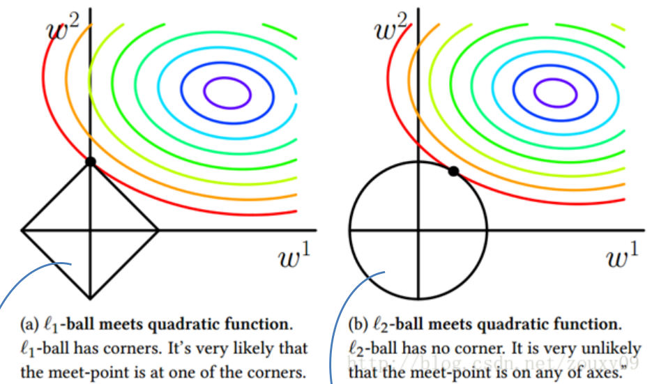
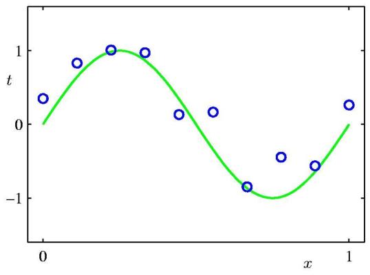
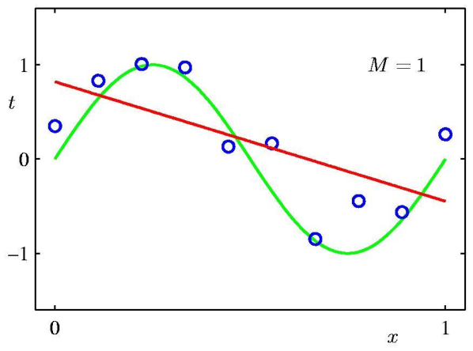
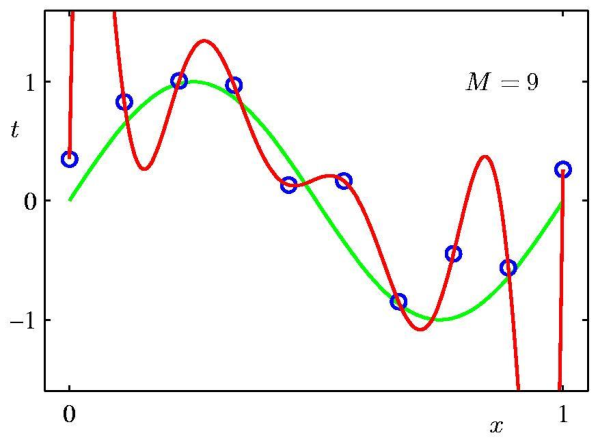
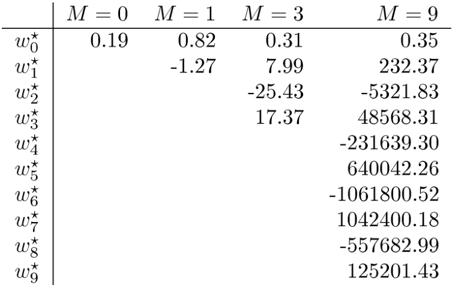
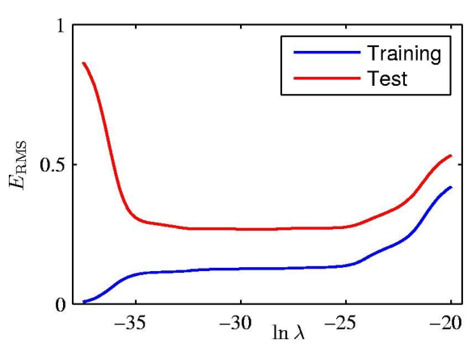

## Types of Learning
机器学习有以下分类：
* 有监督学习：分类，回归
* 无监督学习：聚类，降维
* 半监督学习：介于上两者之间，同时用到了监督学习和无监督学习的技术
* 强化学习：没有明确的可以学习的目标，但是在与环境交互的过程中会有奖励(reward)，然后通过这些奖励来不断学习。
* 自监督学习：与无监督学习有些不同。无监督学习目的是发现数据隐含的pattern，而自监督学习则是自己创造label。比如大语言模型，后面的句子就是前面句子的label。

## Linear Regression
### Linear Basis Function Models
线性回归除了最基础的 $h_{\theta}(\bm{x})=\theta_0+\theta_1 x_1+ \cdots +\theta_{n}x_n$(或者简写成 $\bm{\theta}^{\mathrm{T}}\bm{x}$，其中定义 $x_0=1$)，还可以对 $\bm{x}$ 进行各种形式的变化。所以一个更加通用的拟合方程为：
$$
y(\bm{x},\bm{w}) = \sum_{j=0}^{M-1}w_j \phi_j(\bm{x}) = \bm{w}^{\mathrm{T}}\phi(\bm{x})
$$

其中 $\bm{w}=(w_0, \ldots w_{M-1}), \bm{\phi}=(\phi_0, \ldots \phi_{Mj-1})^{\mathrm{T}}$，并且 $\phi_0(\bm{x})=1$，$w_0$ 为偏移量(bias)。

一些常用的函数为：
* 多项式函数 $\phi_j(x)=x_j$
* 高斯函数 $\phi_j(x)=\exp \left( \displaystyle -\frac{(x-\mu_j)^{2}}{2s^{2}} \right)$
* Sigmoid 函数 $\phi_j(x)=\sigma \left( \displaystyle \frac{x-\mu_j}{s} \right)$，其中 $\sigma(a)=\displaystyle \frac{1}{1+e^{-a}}$。

### The Least Mean Square (LMS) method
定义 cost function：
$$
J(\bm{\theta})=\frac{1}{2}\sum_{i=1}^{m}(h_{\theta}(x^{(i)})-y^{(i)})^{2}
$$

更新 $\bm{\theta}$：
$$
\theta_j :=\theta_j - \alpha \frac{\partial }{\partial \theta_j}J(\bm{\theta})
$$

对于一个训练集，更新变量时可以使用
$$
\theta_{j} := \theta_j + \alpha \sum_{i=1}^{m}(y^{(i)}-h_{\theta}(x^{(i)}))x_j^{(i)}
$$

但是假如数据集特别大，那么每次更新计算开销特别大，所以有了随机梯度下降：
$$
\begin{aligned}
&for\ i=1\ to\ m \\
&\theta_j := \theta_j + \alpha (y^{(i)}-h_{\theta}(x^{i}))x_{j}^{(i)}
\end{aligned}
$$

但如果一次只一个变量，那么这个变量可能会有比较大的噪声，所以也可以一次多取几个数据，形成一个 batch，这就是小批量随机梯度下降。

### The normal equations
写成矩阵形式并且进行运算：
$$
\mathbf{X=}\begin{bmatrix}--(\mathbf{x}^{(1)})^T--\\--(\mathbf{x}^{(2)})^T--\\\vdots\\--(\mathbf{x}^{(m)})^T--\end{bmatrix}=\begin{bmatrix}\mathbf{x}_1^{(1)}&\mathbf{x}_2^{(1)}&\cdots&\mathbf{x}_n^{(1)}\\\mathbf{x}_1^{(2)}&\mathbf{x}_2^{(2)}&\cdots&\mathbf{x}_n^{(2)}\\\vdots&\vdots&\ddots&\vdots\\\mathbf{x}_1^{(m)}&\mathbf{x}_2^{(m)}&\cdots&\mathbf{x}_n^{(m)}\end{bmatrix}\quad\mathbf{Y=}\begin{bmatrix}y^{(1)}\\y^{(2)}\\\vdots\\y^{(m)}\end{bmatrix}
$$

对 $\theta$ 求梯度：
$$
\begin{aligned}
\nabla_{\theta}J(\theta)& =\nabla_\theta\frac{1}{2}(X\theta-\vec{y})^T(X\theta-\vec{y})  \\
&=\frac{1}{2}\nabla_{\theta}\left(\theta^TX^TX\theta-\theta^TX^T\vec{y}-\vec{y}^TX\theta+\vec{y}^T\vec{y}\right) \\
&=\frac{1}{2}\nabla_{\theta}\operatorname{tr}\left(\theta^{T}X^{T}X\theta-\theta^{T}X^{T}\vec{y}-\vec{y}^{T}X\theta+\vec{y}^{T}\vec{y}\right) \\
&=\frac{1}{2} \nabla_{\theta}\left(\operatorname{tr}\theta^TX^TX\theta-2\operatorname{tr}\vec{y}^TX\theta\right) \\
&=\frac12\left(X^TX\theta+X^TX\theta-2X^T\vec{y}\right) \\
&= X^{T}X\theta-X^{T}\vec{y}
\end{aligned}
$$

想要最小化 $J$，那么应该有 $X^{\mathrm{T}}X\theta=X^{\mathrm{T}}\vec{y}$，解得 $\theta = (X^{\mathrm{T}}X)^{-1}X^{\mathrm{T}}\vec{y}$。

以上条件需要在 $(X^{\mathrm{T}}X)^{-1}$ 存在时成立。考察矩阵 $X$，这是一个 $n\times m$ 的矩阵，其中 $n$ 为变量的数量，$m$ 为样本数量。当 $n\le m$ 时，通常矩阵 $(X^{\mathrm{T}}X)$ 满秩，可逆；但是假如 $n\ge m$，即样本数量过少，那么就不可逆，$\theta$ 无法使用该方法求解。此时需要引入正则化。

### Regularized least squares
将 error function 改为
$$
\frac{1}{2}\sum_{i=1}^{m}(h_{\theta}(x^{(i)})-y^{(i)})^{2} + \frac{\lambda}{2}\theta^{\mathrm{T}}\theta \Rightarrow \theta = (\lambda \bm{I}+X^{\mathrm{T}}X)^{-1}X^{\mathrm{T}}\vec{y}
$$

即加入了一个二范数项。

将正则化的操作可视化，左侧为 $l_1$ 正则化，右侧为 $l_2$ 正则化，即上述式子给出的操作方法。图中的等高线表示 $w^{1}, w^{2}$ 取不同值时 error function 取到相同值的情况。
 

对于左图的正则化，做的约束为：$\left\vert w_1 \right\vert +\left\vert w_2 \right\vert \le t$，此时的等高线与正则化限制区域的交点通常在坐标轴上，所以相当于消掉了一个维度；对于右图的正则化，做的约束为 $w_1^{2}+w_2^{2}\le t$。

## Polynomial Curve Fitting
 

假如想拟合图上的这些点。如果多项式的次数太低，那么可能会导致欠拟合；如果多项式次数过高，可能会导致过拟合。欠拟合和过拟合的效果如图：

  
  

如果发现欠拟合，那么可以增加次数；如果发现过拟合，可以减少次数(降低模型复杂度)，增加样本数量，或者使用正则项。

我们先观察在不同次数的情况下拟合得到的系数：
 

我们发现当出现过拟合时，多项式的某些系数会非常大。因此可以使用正则化项来约束系数的复杂度。此时 cost function 为：
$$
\tilde{E}(\bm{w})=\frac{1}{2}\sum_{n=1}^{N} \left\{ y(x_n,\bm{w})-t_n \right\}^{2}+\frac{\lambda}{2} \left\| \bm{w} \right\|_{}^{2}
$$

不同的 $\lambda$ 值对模型有不同的约束力度。
 

## Probabilistic Interpretation of LMS
这里解释为什么拟合问题通常使用最小平方误差。

对于目标变量 $y$ 和已有信息 $x$，假如确实存在线性关系，那么考虑到测量误差等问题，测得的信息通常为
$$
y^{(i)}=\theta^{\mathrm{T}}x^{(i)}+\epsilon^{(i)}
$$

假设其中 $\epsilon^{(i)}$ 满足高斯分布 $N(0,\sigma^{2})$，并且独立同分布，那么我们有
$$
p(y^{(i)}|x^{(i)};\theta)=\frac1{\sqrt{2\pi}\sigma}exp(-\frac{(y^{(i)}-\theta^Tx^{(i)})^2}{2\sigma^2})
$$

然后我们得到似然函数
$$
L(\theta)=L(\theta;X,\vec{y})=p(\vec{y}|X;\theta)
$$

所以再根据独立同分布的假设
$$
\begin{aligned}L(\theta)&=\prod_{i=1}^mp(y^{(i)}|x^{(i)};\theta)\\&=\prod_{i=1}^m\frac1{\sqrt{2\pi}\sigma}exp(-\frac{(y^{(i)}-\theta^Tx^{(i)})^2}{2\sigma^2})\end{aligned}
$$

由于 $L(\theta)$ 不方便计算，因此我们取对数
$$
\begin{aligned}\iota(\theta)&=\log L(\theta)\\&=\log\prod_{i=1}^m\frac1{\sqrt{2\pi}\sigma}exp(-\frac{(y^{(i)}-\theta^Tx^{(i)})^2}{2\sigma^2})\\&=\sum_{i=1}^m\log\frac1{\sqrt{2\pi}\sigma}exp(-\frac{(y^{(i)}-\theta^Tx^{(i)})^2}{2\sigma^2})\\&=m\log\frac1{\sqrt{2\pi}\sigma}-\frac1{\sigma^2}\times\frac12\sum_{i=1}^m(y^{(i)}-\theta^Tx^{(i)})^2\end{aligned}
$$

根据统计学上的规则，我们需要最大化似然，在上式中我们可以看出正是需要最小化平方误差。

## Classification and Logistic Regression
分类问题有二分类(binary classification)，多分类(multi classification)等。除此之外还有多标签(multi label)，这个指的是一个样本可能同属于多个类别。
### Logistic Regression Model Description
Logistic Regression 虽然名为 "Regression"，但实际上是个分类模型。

与线性回归直接对输出结果建模不同，Logistic Regression 对输出的后验概率做建模。这里以二分类为例，用 $y=0,y=1$ 代表两个类：
$$
\begin{aligned}P(y=1|x;\theta)&=h_\theta(x)=g(\theta^Tx)=\frac1{1+e^{-\theta^Tx}}\\P(y=0|x;\theta)&=1-h_\theta(x)\end{aligned}
$$

或者写成一个式子：
$$
P(y|x;\theta)=(h_{\theta}(x))^{y}(1-h_{\theta}(x))^{1-y}
$$

### Maximum Likelihood Estimation
与线性回归最小化均方误差不同，这里要最大化条件似然。此处条件似然函数(conditional likelihood)为
$$
\begin{aligned}
L(\theta)& =p(\overrightarrow{y}|X;\theta)  \\
&=\prod_{i=1}^mp(y^{(i)}|x^{(i)};\theta) \\
&=\prod_{i=1}^m(h_\theta(x^{(i)}))^{y^{(i)}}(1-h_\theta(x^{(i)}))^{1-y^{(i)}}
\end{aligned}
$$

取对数：
$$
\begin{aligned}
\iota(\theta)& =\log L(\theta)  \\
&=\sum_{i=1}^my^{(i)}\log h_{\theta}(x^{(i)})+(1-y^{(i)})\log(1-h_{\theta}(x^{(i)}))
\end{aligned}
$$

最后的形式就是交叉熵。

### Gradient Ascent
所以现在需要解决的问题是：
$$
argmax_\theta\sum_{i=1}^my^{(i)}\log h_\theta(x^{(i)})+(1-y^{(i)})\log(1-h_\theta(x^{(i)}))
$$

考虑到 sigmoid 函数求导的特性：
$$
\begin{aligned}
g^{\prime}(z)& =\frac d{dz}\frac1{1+e^{-z}}  \\
&=\frac1{(1+e^{-z})^2}(e^{-z}) \\
&=\frac1{(1+e^{-z})}(1-\frac1{(1+e^{-z})}) \\
&=g(z)(1-g(z))
\end{aligned}
$$

最终求导结果为：
$$
\begin{aligned}
\frac{\partial\iota(\theta)}{\partial\theta_j}& =\sum_{i=1}^m(y^{(i)}\frac1{h_\theta(x^{(i)})}-(1-y^{(i)})\frac1{1-h_\theta(x^{(i)})})\frac\partial{\partial\theta_j}h_\theta(x^{(i)})  \\
&=\sum_{i=1}^m(y^{(i)}\frac1{h_\theta(x^{(i)})}-(1-y^{(i)})\frac1{1-h_\theta(x(i))})h_\theta(x^{(i)})(1-h_\theta(x^{(i)}))\frac\partial{\partial\theta_j}\theta^Tx^{(i)} \\
&=\sum_{i=1}^m(y^{(i)}(1-h_\theta(x^{(i)}))-(1-y^{(i)})h_\theta(x^{(i)}))x_j \\
&=\sum_{i=1}^m(y-h_\theta(x^{(i)}))x_j
\end{aligned}
$$

和线性回归模型类似，最后在更新参数的时候也可以采用批量梯度上升的方式：
$$
\theta_j:=\theta_j + \alpha \sum_{i=1}^{m}(y^{(i)}-h_{\theta}(x^{(i)}))x_j^{(i)}
$$

