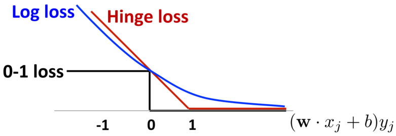

## Linear classifiers – which line is better?

考虑这三条线性分类的线，虽然这三条线都正确的对数据做了分类，从直觉上来说黑色线的效果最好。这是因为这条线离两侧的数据点都比较远。这是因为数据可能有噪声，离数据点尽量远能够使得新的数据加入时，这个分类方式更不容易出错。

### Parameterizing the decision boundary

首先将分界面用线性方程表示，此时正类满足 $\bm{w}\cdot \bm{x}+b>0$，负类满足 $\bm{w}\cdot \bm{x}+b<0$。

然后定义**置信度**为 $(\bm{w}\cdot \bm{x_j}+b)y_i$，其中 $y_i$ 的取值为 $\pm 1$。因此不论是正类还是负类，只要在正确的地方，它们的置信度都大于 $0$。

### Maximizing the margin

支持向量机的目标是最大化两侧的间隔，而间隔可以用点到直线的距离表示，因此定义间隔margin为
$$
2\gamma=\frac{\left\vert \bm{w}\cdot x^{+} + b \right\vert }{\left\| \bm{w} \right\|_{}} + \frac{\left\vert \bm{w}\cdot x^{-} + b \right\vert }{\left\| \bm{w} \right\|_{}} = \frac{2a}{\left\| \bm{w} \right\|_{}}
$$

因此问题被建模为
$$
\begin{gathered}
\max_{\boldsymbol{w},b}2\gamma=\frac{2a}{\|w\|} \\
s.t.(w\cdot x_j+b)y_j\geq a~\forall j 
\end{gathered}
$$

其中第二条式子表示在最大化间隔的同时还要两边的数据点都满足一定的置信度。

### Support Vector Machine
同时我们发现 $a$ 可以是任意的，因此可以取 $a=1$，问题最终被简化为
$$
\min_{w,b}w\cdot w\\
s.t.(w\cdot x_j+b)y_j\geq1\mathrm{~}\forall j
$$

这个问题就是容易求解的。但是这个模型没有什么实用价值，因为现实中基本没有数据集可以被完美二分。

**支持向量**：
落在 $\bm{w}\cdot \bm{x}+b=1$ 上的点。

支持向量机的分界面就是由这些支持向量决定的，改变其他点的位置不会影响分界面。

## What if data is not linearly separable?
在实际情况中，数据往往不可完美的线性分开(可能有噪声)，或者有时为了二分会导致margin非常窄。这时我们就要考虑新的方法。

此时建立新的模型，其中 $C$ 为错误的点的数量。
$$
\begin{aligned}
&\min_{\boldsymbol{w},\boldsymbol{b}}\boldsymbol{w}\cdot\boldsymbol{w}+\boldsymbol{C}\#\mathrm{mistakes}\\
&s.t.(\boldsymbol{w}\cdot\boldsymbol{x}_j+b)y_j\geq1 \quad \forall j
\end{aligned}
$$

但这是个NP难问题，同时这个方法无法区分错误的程度。比如有的点只差一点，有的点差很多，这应该要区别对待。

### Soft-margin SVM
我们引入松弛变量 $\xi_{j}$，其中 $\xi$ 的取值与某个数据点的错误程度相关。那么模型写为：
$$\begin{aligned}
&&\min_{\boldsymbol{w},\boldsymbol{b},\boldsymbol{\xi}_j}\boldsymbol{w}\cdot\boldsymbol{w}+C\sum_j\xi_j \\
&&\begin{aligned}\operatorname{s.t.}(\boldsymbol{w}\cdot\boldsymbol{x}_j+b)y_j\geq1-\xi_j\quad\forall j\end{aligned}\\
&& \xi_{j}\geq0\quad\forall j 
\end{aligned}$$

式子中 $C$ 是调节因此。假如 $C \rightarrow \infty$，那么软间隔重新回到之前的硬间隔。

下图可以感受 $\xi$ 的几何意义：

### SVM vs. Logistic Regression
这里分析一下支持向量机和之前学过的线性模型的区别和联系。

松弛因子在下图中就是Hinge Loss，用公式可以写为
$$
\xi_{j}=(1-(\bm{w}\cdot \bm{x_j}+b)y_i)_{+} = \max_{}(0, 1-(\bm{w}\cdot \bm{x_j}+b)y_i)
$$

上图中同样也展示了Logistic Regression的Loss函数，为
$$
loss(f(x_j),y_j)=-logP(y_j|x_j,w,b)=log\left(1+e^{-(w\cdot x_j+b)\gamma_j}\right)
$$

这里使用的是log似然，推导过程为：
$$
\begin{cases}
    \displaystyle P(y=1|x)=\frac{1}{1+e^{-\theta^{\mathrm{T}}x}} \\
    \displaystyle P(y=-1|x)=1-\frac{1}{1+e^{\theta^{\mathrm{T}}x}}=\frac{1}{1+e^{\theta^{\mathrm{T}}x}}
\end{cases}
\Rightarrow P(y|x)=\frac{1}{1+e^{- (\theta^{\mathrm{T}}x) \cdot y}}
$$

观察Hinge loss和Log loss，可以发现两者比较相似，都是0-1 loss的凸替代，都有比较好的性质。但是和Log loss相比，在 $(\bm{w}\cdot x_j+b)y_j>1$ 时，Hinge loss为 $0$，性质更好。

但是如果观察总的损失函数，我们发现支持向量机为 $\boldsymbol{w}\cdot\boldsymbol{w}+C\sum_j\xi_j$，这就相当于支持向量机先天就具有正则化项，因此有更好的抗过拟合的能力。

## Constrained Optimization
### Lagrange Multiplier Method
从上面的模型可以看出，支持向量机是一个约束优化问题。而优化约束问题的一般解决方法时使用拉格朗日函数。

一般约束问题可以写为：
$$\begin{aligned}
&\operatorname*{min}_{x}f(x)& \text{Convex optimization if}  \\
&s.t.\ g(x)\leq0 & f,g\text{ are convex}  \\
&h(x)=0& \text{h is affine} 
\end{aligned}$$

#### Optimization with equality constraints
首先只考虑等式约束的情形。设 $\mathbf{x}$ 为 $d$ 维向量，我们希望找到最优点 $\mathbf{x}^{*}$ 使得目标函数 $f(\mathbf{x})$ 最小并且满足约束 $g(\mathbf{x})=0$。从几何角度看，这个问题的目标是在方程 $g(\mathbf{x})=0$ 确定的 $d-1$ 维曲面上寻找能够使得目标函数最小化的点，即：

那么对于最优点 $\mathbf{x}^{*}$:
* 在约束曲面上的所有点 $\mathbf{x}$ 都满足 $\nabla g(\mathbf{x})$ 正交与约束曲面，因此 $\nabla g(\mathbf{x}^{*})$ 也正交于约束曲面
* 同时此时 $f(\mathbf{x})$ 取到极值，因此 $\nabla f(\mathbf{x}^{*})$ 也正交于约束曲面。(否则可以往梯度反方向移动，使得目标函数的值更小)

由此可以得到
$$
\nabla f(\mathbf{x}^{*})+\lambda \nabla g(\mathbf{x}^{*})=0
$$

基于上式，可以定义拉格朗日函数
$$
L(\mathbf{x},\lambda) = f(\mathbf{x}) + \lambda g(\mathbf{x})
$$

当 $L(\mathbf{x},\lambda)$ 分别对 $\mathbf{x}$ 和 $\lambda$ 求导时，恰好可以得到 $\nabla f(\mathbf{x}^{*})+\lambda \nabla g(\mathbf{x}^{*})=0$ 和 $g(\mathbf{x})=0$，即我们对拉格朗日函数求极值时，恰好能够满足对 $f(\mathbf{x})$ 求极值以及满足约束 $g(\mathbf{x})=0$ 的条件。

#### Optimization with inequality constraints
然后再考虑仅有不等式 $g(\mathbf{x})\le 0$ 约束的情形，几何解释同样如上图所示。对于不等式约束，最优点 $\mathbf{x}^{*}$ 有两种情形，一种在 $g(\mathbf{x})<0$ 中，另一种在边界 $g(\mathbf{x})=0$ 上。
* 对于 $g(\mathbf{x})<0$ 的情形，约束 $g(x)\le 0$ 不起作用，则可以直接通过 $\nabla f(\mathbf{x})=0$ 获得最优点。此时相当于 $\lambda=0$。
* 对于 $g(\mathbf{x})=0$ 的情形，处理方式与等式约束基本相同，仅需注意此时 $\nabla f(\mathbf{x}^{*})$ 和 $\nabla g(\mathbf{x}^{*})$ 的方向相反，即 $\lambda>0$。

综合上述两种情况，在约束 $g(\mathbf{x})\le 0$ 的条件下最小化 $f(\mathbf{x})$ 的任务，可以转化为在如下约束下最小化 $L(\mathbf{x},\lambda)$ 的任务：
$$
\begin{aligned}
s.t. \quad & g(\mathbf{x})\le 0 \\
&\lambda\ge 0 \\
&\lambda g(\mathbf{x}) =0
\end{aligned}
$$

上述约束就是 **Karush-Kuhn-Tucker(KKT)** 条件。

#### Optimization with multiple constraints
将上述讨论结合起来，并且推广到多个约束的情形。考虑有 $m$ 个等式约束和 $n$ 不等式约束的优化问题：
$$
\begin{aligned}
& \min_{\bm{x}} f(\bm{x}) \\
s.t. \quad & h_i(\bm{x})=0 \quad (i=1, \ldots ,m) \\
&g_i(\bm{x})\le 0 \quad(j=1, \ldots ,m)
\end{aligned}
$$

引入拉格朗日乘子 $\bm{\lambda}=(\lambda_1,\lambda_2, \ldots ,\lambda_m)^{\mathrm{T}}, \bm{\mu}=(\mu_1,\mu_2, \ldots ,\mu_n)^{\mathrm{T}}$，得到拉格朗日函数：
$$
L(\bm{x},\lambda,\mu)=f(\bm{x})+\sum_{i=1}^{m}\lambda_i h_i(\bm{x}) + \sum_{j=1}^{n}\mu_j g_j(\bm{x})
$$

由不等式约束引入的 KKT 条件为：
$$
\begin{cases}
    g_j(\bm{x})\le 0 \\
    \mu_j\ge 0 \\
    \mu_j g_j(\bm{x})=0
\end{cases}
$$

### Duality
一个优化问题可以从两个角度来考虑，即主问题(primal problem)和对偶问题(dual problem)。在约束最优化问题中，常常利用拉格朗日对偶性将原始问题(主问题)转换成对偶问题，通过解对偶问题来得到原始问题的解。
#### Duality problem with multiple constraints
对于上述的多约束问题，我们把需要解决的原问题称为**主问题**
$$
\begin{aligned}
& \min_{\bm{x}} f(\bm{x}) \\
s.t. \quad & h_i(\bm{x})=0 \quad (i=1, \ldots ,m) \\
&g_i(\bm{x})\le 0 \quad(j=1, \ldots ,m)
\end{aligned}
$$

根据其拉格朗日函数 $L(\bm{x},\lambda,\mu)=f(\bm{x})+\sum_{i=1}^{m}\lambda_i h_i(\bm{x}) + \sum_{j=1}^{n}\mu_j g_j(\bm{x})$，可以定义出该拉格朗日函数的**对偶函数**
$$
\Gamma(\bm{\lambda},\bm{\mu}) =  \inf_{\bm{x}\in D}L(\bm{x},\bm{\lambda},\bm{\mu})=\inf_{\bm{x}\in D}\left(f(\bm{x})+\sum_{i=1}^m\lambda_i h_i(\bm{x})+\sum_{j=1}^n\mu_j g_j(\bm{x})\right)
$$

记 $\bm{\tilde{x}}\in D$ 为主问题可行域中的一个点，主问题的最优值为 $p^{*}$，有
$$
\Gamma(\bm{\lambda},\bm{\mu})\leq L(\tilde{\bm{x}},\bm{\lambda},\bm{\mu})\leq f(\tilde{\bm{x}}) \Rightarrow \Gamma(\bm{\lambda},\bm{\mu})\le f(\bm{x}^{*}) = p^{*}
$$

可以看出对偶函数给出了主问题的下界。这个下界取决于 $\bm{\lambda}$ 和 $\bm{\mu}$，于是我们开始考虑：基于对偶函数能够获得的最好的下界是什么？这就引出了**对偶问题**
$$
\max_{\bm{\lambda},\bm{\mu}} \Gamma(\bm{\lambda},\bm{\mu}) \\
s.t. \quad \bm{\mu}\ge 0
$$

记对偶问题的最优值为 $d^{*}$。考虑 $p^{*}$ 和 $d^{*}$ 的关系：
* $d^{*}\le p^{*}$，这称为“弱对偶性(weak duality)”成立；
* $d^{*}=p^{*}$，则称为“强对偶性（strong duality）”成立，此时由对偶问题能获得主问题的最优下界

对于一般的优化问题，强对偶性通常不成立，但是若主问题是凸优化问题，如主问题中 $f(\bm{x})$ 和 $g_j(\bm{x})$ 均为凸函数，$h_j(\bm{x})$ 为仿射函数(线性)，且其可行域中至少有一点使不等式约束严格成立，则此时强对偶性成立。

对于一般的问题，强对偶性和 KKT 条件的关系为：

即在凸优化的条件下，两者等价。

### Solving optimal margin classifier
SVM 的优化函数是个凸优化问题，因此我们考虑使用对偶来求解。首先将原问题(这里先考虑能够满足二分的情况)：
$$
\begin{gathered}\max_{\boldsymbol{w},\boldsymbol{b}}\frac1{\|\boldsymbol{w}\|}\\
s.t. \quad (w^T\cdot x_i+b)y_i\geq1,\forall i\end{gathered}
$$

转化为约束满足问题的标准形式：
$$
\begin{gathered}
\underset{\mathbf{w},b}{\operatorname*{min}}\frac12w^Tw\\
s.t.\quad 1-(w^T\cdot x_i+b)y_i\leq0,\forall i
\end{gathered}
$$

然后写出拉格朗日函数：
$$
\mathcal{L}(w,b,\alpha)=\frac12w^Tw-\sum_{i=1}^m\alpha_i[y_i(w^Tx_i+b)-1]
$$

对 $\omega$ 和 $b$ 求偏导，可以求解得到：
$$
\begin{aligned}\frac{\partial \mathcal{L}}{\partial w}&=w-\sum_{i=1}^m\alpha_iy_ix_i=0\\
\frac{\partial \mathcal{L}}{\partial b}&=\sum_{i=1}^m\alpha_iy_i=0\\
w&=\sum_{i=1}^m\alpha_iy_ix_i
\end{aligned}
$$

可以发现此时 $w$ 可以表示成所有样本线性组合的形式。再将 $w$ 的值代回 $\mathcal{L}$ 的方程中，并且利用 $\sum_{i=1}^m\alpha_iy_i=0$，可以得到对偶问题
$$
\Gamma(\alpha)=\sum_{i=1}^{m}\alpha_{i}-\frac{1}{2}\sum_{i=1}^{m}\sum_{j=1}^{m}\alpha_{i}\alpha_{j}y_{i}y_{j}(x_{i}^{T}x_{j}) \\
s.t. \quad \sum_{i=1}^m\alpha_iy_i=0, \alpha_i\ge 0
$$

再考虑互补松弛条件，由于 SVM 问题中 $g(x)=1-(w^T\cdot x_i+b)y_i\leq0$，和置信度相关，因此如果 $\alpha_i>0$，那么说明 $(w^{\mathrm{T}}\cdot x_i+b)y_i=1$，即置信度为 $1$。假如置信度不为 $1$，那么 $\alpha_i=0$。

而置信度为 $1$ 的点恰好都是支持向量，也就是说只有支持向量的点 $\alpha>0$，其他点都有 $\alpha=0$。因此 $w=\sum_{i=1}^{m}\alpha_i y_i x_i$ 说明 $w$ 是支持向量的线性组合，和其他点无关。这里体现了支持向量存在稀疏解的优势。

同时观察 $\Gamma(\alpha)$，发现式子中包含是 $x_i$ 与 $x_j$ 求内积的形式。

#### Quadratic programming (QP)
得到的对偶式子可以写成矩阵的形式：
$$
\left.\min_{\alpha}\quad\frac{1}{2}\alpha^{\intercal} 
\left[
    \begin{array}{ccccc}
    y_1y_1\mathbf{x}_1^\intercal\mathbf{x}_1&y_1y_2\mathbf{x}_1^\intercal\mathbf{x}_2&\ldots&y_1y_N\mathbf{x}_1^\intercal\mathbf{x}_N\\
    y_2y_1\mathbf{x}_2^\intercal\mathbf{x}_1&y_2y_2\mathbf{x}_2^\intercal\mathbf{x}_2&\ldots&y_2y_N\mathbf{x}_2^\intercal\mathbf{x}_N\\
    \ldots&\ldots&\ldots&\ldots\\
    y_Ny_1\mathbf{x}_N^\intercal\mathbf{x}_1&y_Ny_2\mathbf{x}_N^\intercal\mathbf{x}_2&\ldots&y_Ny_N\mathbf{x}_N^\intercal\mathbf{x}_N
    \end{array}\right.^\intercal 
\right]\alpha  + (-\bm{1}^{\mathrm{T}})\alpha
$$

s.t.
$$
\begin{cases}
y^{\mathrm{T}}\alpha =0 \\
0\le \alpha\le \infty
\end{cases}
$$

这就是一个常规的二次规划问题。求出了 $\alpha$ 之后，使用 $w=\sum_{i=1}^m\alpha_iy_ix_i$ 可以回代得到 $w$。

## Kernel transform
同样是考虑线性不可分的问题。

这里是将原空间的数据映射到另一个空间，使之线性可分。对偶方程此时为：
$$
\Gamma(\boldsymbol{\alpha})=\sum_{n=1}^N\alpha_n-\frac12\sum_{n=1}^N\sum_{m=1}^Ny_ny_m\alpha_n\alpha_m\mathbf{z}_n^\intercal\mathbf{z}_m
$$

约束条件依然为：
$$
\begin{cases}
    \alpha_n\ge 0 \\
    \sum_{n=1}^{N} \alpha_n y_n = 0
\end{cases}
$$

对映射后的向量进行求解后，我们发现分类函数为：
$$
g(\mathbf{x})=\operatorname{sign}\left(\mathbf{w}^\intercal\mathbf{z}+b\right)
$$

其中 $\mathbf{w}, b$ 分别满足
$$
\mathbf{w}=\sum_{\mathbf{z}_n\text{ is SV}}\alpha_ny_n\mathbf{z}_n \\
y_m\left(\mathbf{w}^\intercal\mathbf{z}_m+b\right)=1
$$

将 $\mathbf{w}$ 带入
$$
\begin{aligned}
g(\mathbf{x})&=\mathrm{sign}\left(\sum_{\alpha_n>0}\alpha_ny_nK(\mathbf{x}_n,\mathbf{x})+b\right) \\
b&=y_m-\sum_{\alpha_n>0}\alpha_ny_nK(\mathbf{x}_n,\mathbf{x}_m)
\end{aligned}
$$

发现表达式中出现的是 $\mathbf{z}_n^{\mathrm{T}}\mathbf{z}_m$，由此我们不需要知道 $\mathbf{z}$ 的具体表达式，而只需要知道 $\mathbf{z}^{\mathrm{T}}\mathbf{z}' \equiv K(\mathbf{x}, \mathbf{x}')$ 的表达式即可。

### Mercer’s condition
$K(\mathbf{x},\mathbf{x}')$ 是一个合法的 kernel，当且仅当
1. $K(\mathbf{x},\mathbf{x}')$ 是对称的
2. 矩阵 $\left.\left[\begin{array}{cccc}K(\mathbf{x}_1,\mathbf{x}_1)&K(\mathbf{x}_1,\mathbf{x}_2)&\ldots&K(\mathbf{x}_1,\mathbf{x}_N)\\K(\mathbf{x}_2,\mathbf{x}_1)&K(\mathbf{x}_2,\mathbf{x}_2)&\ldots&K(\mathbf{x}_2,\mathbf{x}_N)\\\ldots&\ldots&\ldots&\ldots\\K(\mathbf{x}_N,\mathbf{x}_1)&K(\mathbf{x}_N,\mathbf{x}_2)&\ldots&K(\mathbf{x}_N,\mathbf{x}_N)\end{array}\right.\right]$ 是半正定矩阵。

