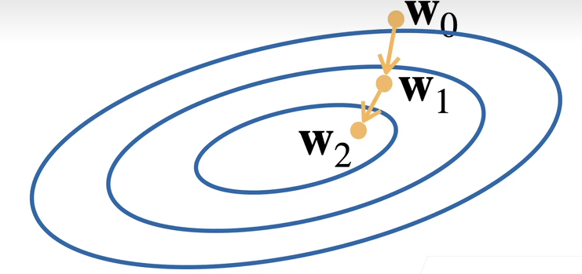

# 线性回归+基础优化算法
## 线性模型
* 输入 $\bm{x}=[x_1, x_2, \ldots , x_n]^{\mathrm{T}}$
* 线性模型有一个 $n$ 维权重和一个标量偏差 $b$
* 输出 $y=w_1x_1+w_2x_2+ \cdots +w_n x_n + b$
  向量版本：$y=<\bm{w},\bm{x}>+b$

线性模型可以看成是单层的神经网络。

### 衡量预测质量
比较真实值和估计值的差距，通常使用平方损失。假设 $y$ 是估计值，$\hat{y}$ 是估计值
$$
l(y, \hat{y}) = \frac{1}{2} (y-\hat{y})^{2}
$$

式子中有 $1 /2$ 是为了求导时便于消去。

### 训练数据
假设我们有 $n$ 个样本，记
$$
\bm{X}=[\bm{x_1},\bm{x_2}, \ldots ,\bm{x_n}]^{\mathrm{T}} \quad \bm{y}=[y_1,y_2, \ldots ,y_n]^{\mathrm{T}}
$$

### 参数学习
* 训练损失
  $$
  l(\bm{X}, \bm{y},\bm{w},b) = \frac{1}{2n}\sum_{i=1}^{n}(y_i- <\bm{x_i},\bm{w}>-b)^{2}=\frac{1}{2n}\left\| \bm{y}-\bm{X}\bm{w}-b \right\|_{}^{2}
  $$
* 最小化损失来学习参数
  $$
  \bm{w}^{*},\bm{b}^{*} = arg \min_{\bm{w},b}l(\bm{X}, \bm{y}, \bm{w}, b)
  $$

### 显式解
由于是一个简单的线性模型，损失是一个凸函数，因此有显式解
$$
\bm{w}^{*} = (\bm{X}^{\mathrm{T}}\bm{X})^{-1}\bm{X}\bm{y}
$$

## 基础优化算法
### 梯度下降
$$
\bm{w}_{t}=\bm{w}_{t-1}-\eta \frac{\partial l}{\partial \bm{w}_{t-1}}
$$

$l$ 在这里称为学习率。

### 小批量随机梯度下降
在实际应用中我们很少直接使用梯度下降，因为每次计算梯度时要对整个损失函数求导，而损失函数是对所有样本的平均，因此每次求梯度都要把整个样本算一次，计算量很大。因此我们可以随机采样 $b$ 个样本来近似损失
$$
\frac{1}{b} \sum_{i\in I_{b}}l(\bm{x}_i,y_i,\bm{w})
$$

在 $b$ 很大时估计较为精确，很小时没那么精确，但是计算更快。

小批量随机梯度是深度学习默认的求解算法，虽然有更好的算法，但是这种算法稳定而且简单，因此应用广泛。

## QA
* Q：为什么用平方损失而不是绝对差值？
  * A：使用绝对差值在原点处不容易求导，但是实际上差别不大。
* Q：线性回归损失函数是不是通常都是mse？
  * A：是的
* 梯度下降和随机梯度下降如何找到合适的学习率？
  * A：首先可以选择Adam之类对学习率不太敏感的算法，以及合理的参数初始化，学习率取个差不多0.1。   
* Q：batchsize对最终结果的影响？
  * A：batchsize小结果可能会更好，因为小批量随机梯度下降理论上带来了噪音，而噪音对很深的神经网络来说是件好事，这能防止神经网络走偏，得到更强的鲁棒性以及泛化性。
* Q：训练过程中，过拟合和欠拟合情况下学习率和批次应当如何调整？
  * A：在正常的范围内学习率和批量大小对拟合情况影响不大，只要学习次数足够最终都会拟合。

# Softmax回归+损失函数+图片分类数据集
## Softmax回归
* 回归估计一个连续值
* 分类预测一个离散类别

分类通常有多个输出，输出 $i$ 是第 $i$ 类的置信度。

### 从回归到多类分类——均方损失
* 首先对每一位进行有效编码。比如有一个label为 $y$，那么编码之后 $y$ 变为 $\bm{y}$
$$
\bm{y}=[y_1,y_2, \ldots y_n]^{\mathrm{T}} \\
y_i = \begin{cases}
    1 , \text{if } i=y\\ 
    0, \text{otherwise}
\end{cases}
$$
* 使用均方损失训练
* 最大值为预测结果 $\hat{y}=\argmax_{i}o_i$

### 从回归到多类分类——无校验比例
在计算损失的时候，可以只考虑正确类的误差，而不考虑非正确类的情况。即我们希望正确类的置信度远远大于非正确类。$o_y-o_i\ge \Delta(y,i)$

同时我们希望输出的结果是一个概率，因此可以把输出向量 $\bm{o}$ 做一个softmax操作，即
$$
\bm{\hat{y}} = \operatorname{softmax} (\bm{o}) \\ 
\hat{y}_i=\frac{\exp (o_i)}{\sum_{k}\exp (o_k)}
$$

这里使用指数是希望输出都为正数。

### Softmax和交叉熵损失
交叉熵常用来衡量两个概率的区别 $H(\bm{p},\bm{q})=\sum_{i}-p_{i}\log(q_i)$，如果将其作为损失，则为 
$$
l(\bm{y},\bm{\hat{y}})=-\sum_{i}y_i \log \hat{y}_i = -\log \hat{y}_y
$$

可以看出这里只考虑了正确类的预测情况。

## 损失函数
### L2 Loss
$$
l(y, y')=\frac{1}{2}(y-y')^{2}
$$

导数是一条过原点的直线，因此当损失函数逐渐减小的时候收敛地会越来越慢。但是我们有时并不希望在比较远的时候梯度过大。

### L1 Loss
$$
l(y,y')=\left\vert y-y' \right\vert 
$$

梯度永远是常数，对稳定性比较好。但是在原点处不可导，因此在优化末期可能不太稳定。

### Huber's Robust Loss
$$
l(y, y')=\begin{cases}
    \left\vert y-y' \right\vert -\frac{1}{2}&, \text{if } \left\vert y-y' \right\vert >1  \\
    \frac{1}{2}(y-y')^{2} &,\text{otherwise}
\end{cases}
$$

## QA
* softlabel训练策略为什么有效？
  * 一般的标号是将label变成一个长为 $n$ 的向量，其中只有正确的那一项为 $1$，但是这回导致不太好完全逼近，因为预测的正确项的指数要趋近于无穷大。因此softlabel将正确的类记录为 $0.9$，其他项平分 $0.1$，这样就更好逼近。这也是图片分类中常用的技巧。
* 为什么使用交叉熵而不是相对熵、互信息等其他基于信息量的度量？
  * 相互熵相比交叉熵而言是对称的，这一点更好。但是计算起来更麻烦一下，而且用这两个效果差不多。