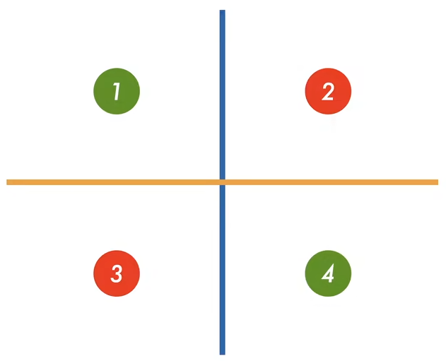
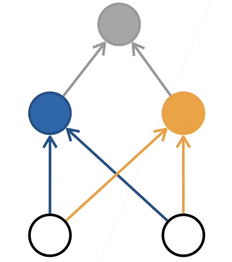
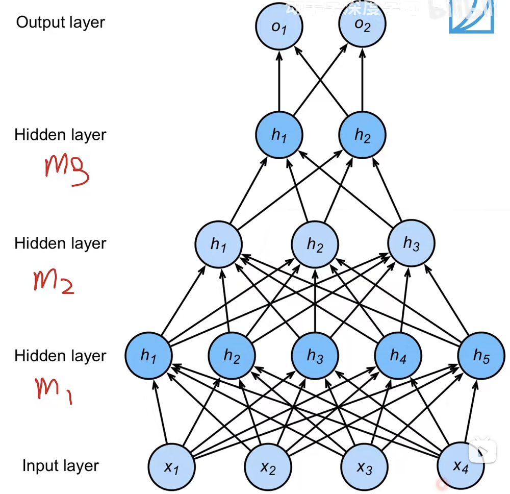
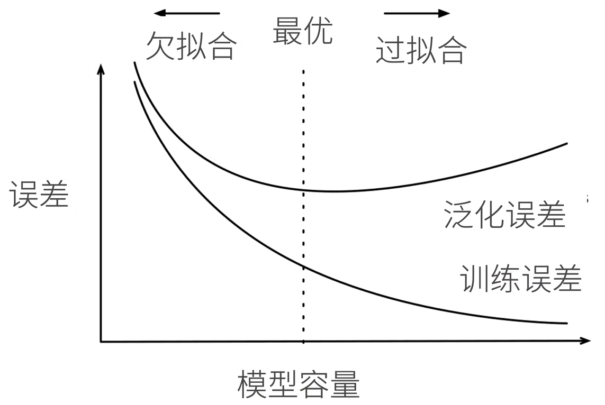
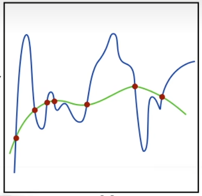
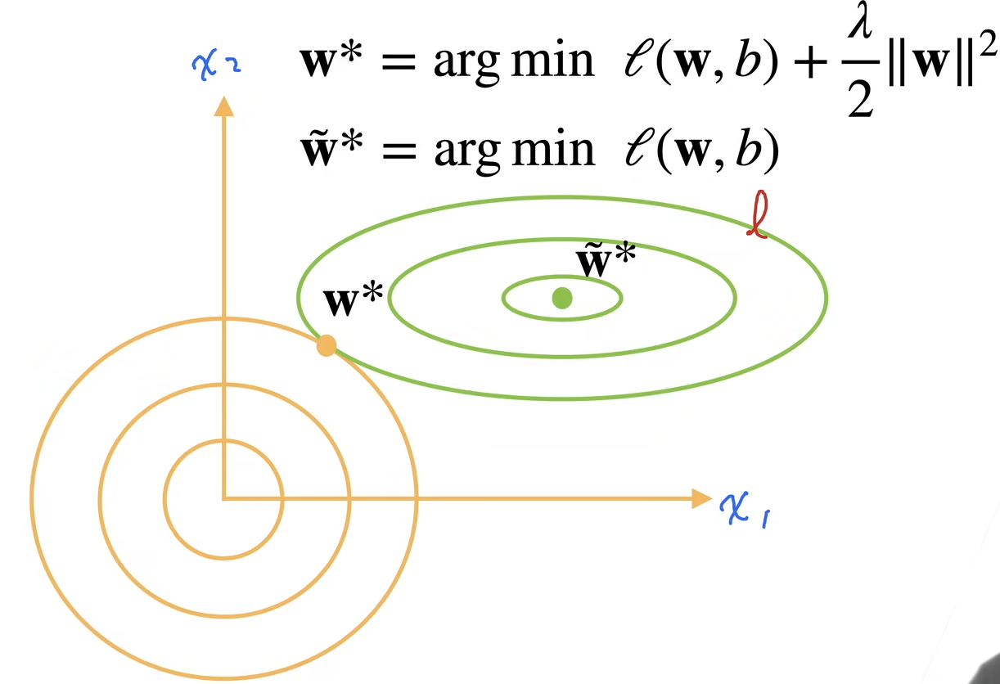
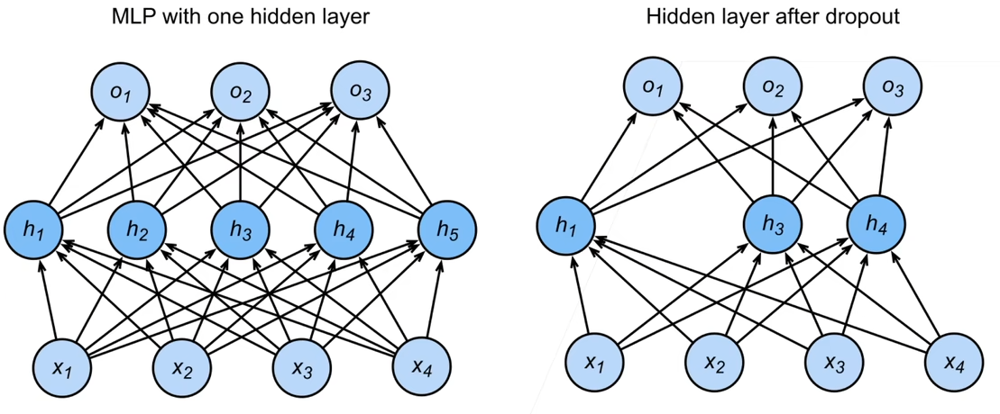

# 多层感知机
## 感知机
人工智能最早的模型。给定输入 $\bm{x}$，权重 $\bm{w}$，和偏移 $b$，感知机输出
$$
o = \sigma(<\bm{w},\bm{x}>+b) \quad \sigma(x) = \begin{cases}
    1, \text{if } x>0 \\ -1, \text{otherwise}
\end{cases}
$$

感知机在这里就相当于是一个二分类的问题。

### 训练感知机
如果 $y_i[<w, x_i>+b]\le 0$，那么 $w \leftarrow w+y_i x_i, b \leftarrow b+y_i$，知道所有类都分类正确。

这种算法等价于使用批量大小为 $1$ 的梯度下降，并且使用的损失函数为 $l(y, \bm{x}, \bm{w})=\max (0, -y<\bm{w}, \bm{x}>)$。

### 收敛定理
因为感知机是一个很简单的模型，因此它有一个很好的收敛定理。

假设数据在半径 $r$ 内，$\exists \rho>0$，使得对于 $\left\| \bm{w} \right\|_{}^{2}b^{2}\le 1$，有 $y(\bm{x}^{\mathrm{T}}\bm{w}+b)\ge \rho$。那么感知机保证能在 $\displaystyle \frac{r^{2}+1}{\rho^{2}}$ 步后收敛。

### XOR问题
感知机不能拟合XOR问题，因为它只能产生线性的分割面。

比如上图所示的分类问题就无法用感知机直接解决。

## 多层感知机
从对感知机的讨论中，我们可以看出简单的线性模型无法解决XOR问题。因此我们考虑先学习蓝色的线，再学习黄色的线，将两个进行组合，从而得到正确的结果。

### 单隐藏层——单分类
* 输入层 $\bm{x}\in \mathbb{R}^{n}$
* 隐藏层 $\bm{W_1} \in \mathbb{R}^{m\times n}, \bm{b_1}\in \mathbb{R}^{m}$
* 输出层 $\bm{w_2}\in \mathbb{R}^{m}, b_2\in \mathbb{R}$

$$
\begin{aligned}
\bm{h} &= \sigma (\bm{W_1}\bm{x}+\bm{b_1})\\
o&=\bm{w_2}^{\mathrm{T}}\bm{h}+b_2
\end{aligned}
$$

$\sigma$ 是一个按元素的非线性激活函数。激活函数不能是线性的，否则会导致输出 $o$ 依然是一个相对 $\bm{x}$ 的线性函数，那么没有隐藏层的感知机就没有区别了。

### 激活函数
#### Sigmoid 激活函数
$$
\operatorname{sigmoid}(x) = \frac{1}{1+\exp (-x)}
$$

#### Tanh函数
$$
\tanh(x)=\frac{1-\exp (-2x)}{1+\exp (2x)}
$$

#### ReLU激活函数
$$
\operatorname{ReLU}(x) = \max (x, 0)
$$

ReLU的优势在于比较简单，计算足够快。

### 多类分类
和 Softmax 基本一致，只是多了个隐藏层。

* 输入层 $\bm{x}\in \mathbb{R}^{n}$
* 隐藏层 $\bm{W_1} \in \mathbb{R}^{m\times n}, \bm{b_1}\in \mathbb{R}^{m}$
* 输出层 $\bm{W_2}\in \mathbb{R}^{m\times k}, b_2\in \mathbb{R}^{k}$

$$
\begin{aligned}
\bm{h} &= \sigma (\bm{W_1}\bm{x}+\bm{b_1})\\
\bm{o}&=\bm{W_2}^{\mathrm{T}}\bm{h}+\bm{b_2} \\
\bm{y}&=\operatorname{softmax}(\bm{o})
\end{aligned}
$$

### 多隐藏层
在中间多加几层就行。

多隐藏层的每一层的大小一般慢慢减小，不断地提取信息。同时最下面的隐藏层也可以相对输入稍微大一些。

## QA
* 为什么神经网络倾向于增加网络的层数而不是某一层神经元的个数？
  * 在相同计算量的情况下，更深的网络更好训练一些。浅层但是很胖的网络理论效果应该和计算量相同的深度网络一样，但是这需要一次学习大量数据特征，不好训练，容易导致过拟合；而深层的网络可以理解为一步步地学习数据特征。
* relu为什么管用？
  * 激活函数的本质就是引入非线性性，因此对激活函数的复杂性没有太多要求。
* 如何设置模型的深度和宽度？
  * 遇到一个问题，可以先直接使用线性模型算一次，然后在加一层，并且试出一个比较好的结果，再不断向上增加隐藏层，继续尝试。

# 模型选择+过拟合和欠拟合
## 模型选择
### 训练误差和泛化误差
* 训练误差：模型在训练数据上的误差
* 泛化误差：模型在新数据上的误差

### 验证数据集和测试数据集
* 验证数据集：一个用来评估模型好坏的数据集
  * 帮助调整超参数
* 测试数据集：只用一次的数据集

### K-则交叉验证
在没有足够多的数据时使用

* 将数据分成 $K$ 块
  * 使用第 $i$ 块作为验证数据集，其余的作为训练数据集
* 报告 $K$ 个验证集误差的平均

常用：$K=5$ 或 $10$

## 过拟合和欠拟合

### 模型容量
* 低容量的模型难以拟合训练数据
* 高容量的模型可以记住所有的训练数据

在学习模型的时候我们希望得到一个最小的泛化误差

#### 估计模型容量
* 难以在不同的种类算法之间比较
  * 例如树模型和神经网络
* 给定一个模型种类，将有两个因素
  * 参数的个数
  * 参数值的选择范围

#### VC维
VC维是统计学习理论的核心思想

对于一个分类模型，VC等于一个最大的数据集的大小，不管如何给定标号，都存在一个模型来对它进行完美分类（相当于记住所有数据）。
* 二维输入的感知机，VC维 $=3$（即假如数据集只有 $3$ 个样本，那么感知机总是能进行划分；但是如果有 $4$ 个样本，那对于比如说XOR的情形就无法处理）
* 支持 $N$ 维输入的感知机的VC维是 $N+1$
* 一些多层感知机的VC维为 $O(N\log_2 N)$

### 数据复杂度
* 样本个数
* 每个样本的元素个数
* 时间、空间结构
* 多样性

## QA
* 验证数据集和训练数据集的数据清洗（如异常值处理）和特征构建（如标准化）是否需要放到一起处理？
  * 如果能拿到验证数据集，那么可以统一做处理；如果拿不到，那就单独处理训练集的数据。
* 如何有效地设计超参数？
  * 自己多次调试，或者随机。
* 假设做一个二分类问题，实际情况是1/9的比例，训练集两种类型的比例应该是1/1还是1/9?
  * 验证集的数据比例最好是比较均衡，或者也可以调整权重

# 权重衰退
## 权重衰退
一种处理过拟合的方法。权重衰退是通过限制参数值的选择范围来控制模型容量。

限制参数的范围之所以能防止过拟合，是因为较小的范围能够防止神经网络学习出一些过于复杂的模型，从而使学习的结果趋于平滑。就如上图所示。
### 使用均方范数作为硬性限制
$$
\min_{}l(\bm{w},b) \text{ subject to } \left\| \bm{w} \right\|_{}^{2}\le \theta
$$

* 通常不限制 $b$
* 小的 $\theta$ 意味着更强的正则项

### 使用均方范数作为柔性限制
对于每个 $\theta$，都可以找到 $\lambda$ 使得之前的目标函数等价于（可以通过拉格朗日乘子法证明）
$$
\min l(\bm{w},b)+\frac{\lambda}{2}\left\| \bm{w} \right\|_{}^{2}
$$

### 参数更新法则
* 计算梯度
  $$
  \frac{\partial }{\partial \bm{w}} \left(l(\bm{w},b)+\frac{\lambda}{2}\left\| \bm{w} \right\|_{}^{2}\right) = \frac{\partial l(\bm{w},b)}{\partial \bm{w}} + \lambda \bm{w}
  $$
* 时间 $t$ 的更新
  $$
  \bm{w_{t+1}}=(1-\eta \lambda)\bm{w_t}-\eta \frac{\partial l(\bm{w_t},b)}{\partial \bm{w_t}}
  $$

从式子中可以看出在更新 $\bm{w}$ 的时候总是先将 $\bm{w}$ 变小再减去梯度，所以叫做权重衰退。

## QA
* 实践中权重衰退的值一般取多少比较合适？
  * 一般取 $10^{-2}, 10^{-3}, 10^{-4}$。效果不好可以取其他方法。

# 丢弃法
## 丢弃法
一个好的模型需要对输入数据的扰动鲁棒
* 使用有噪音的数据等价于Tikhonov正则（这里的噪音和数据集的噪音不同，数据集的噪音是固定的，因此可能被学习到；而这里正则加入的噪音是随机的）
* 丢弃法就相当于在层之间加噪音

### 无偏差的加入噪音
对某一层 $\bm{x}$ 加入噪音得到 $\bm{x'}$，但我们希望期望值不变 $E(\bm{x'})=E(\bm{x})$，于是丢弃法对每个元素进行如下扰动：
$$
x_i'=\begin{cases}
    0, \text{with probablity } p \\
    \frac{x_i}{1-p}, \text{oterwise}
\end{cases}
$$

### 使用丢弃法
通常将丢弃法作用在隐藏全连接层的输出上
$$
\begin{aligned}
\bm{h}&=\sigma(\bm{W_1}\bm{x}+\bm{b_1}) \\
\bm{h'}&=\operatorname{dropout}(\bm{h}) \\
\bm{o}&=\bm{W_2}\bm{h'}+\bm{b_2}\\
\bm{y}&=\operatorname{softmax}(\bm{o})
\end{aligned}
$$

需要注意的是每次dropout丢弃的神经元都是随机的。

同时dropout只在训练时使用，用来影响模型的更新；而在推理时不需要drop。

## QA
* 为什么预测的时候不用drop？
  * 为了防止推理时出现随机性
* dropout为什么比权重衰退更好用更常用？
  * dropout更加直观，方便调参

# 数值稳定性+模型初始化和激活函数
## 数值稳定性
### 神经网络的梯度
损失函数 $l$ 关于参数 $\bm{W_t}$ 的梯度
$$
\frac{\partial l}{\partial \bm{W_t}} = \frac{\partial l}{\partial \bm{h^{d}}} \frac{\partial \bm{h^{d}}}{\partial \bm{h^{d-1}}}\cdots \frac{\partial \bm{h^{t+1}}}{\partial \bm{h^{t}}} \frac{\partial \bm{h^{t}}}{\partial \bm{W^{t}}}
$$

假如神经网络非常深，那么可能带来梯度爆炸或者梯度消失。

### 梯度爆炸的问题
* 值超出值域
* 对学习率敏感
  * 如果学习率太大 $\rightarrow$ 大的参数值 $\rightarrow$ 更大的梯度
  * 学习率太小 $\rightarrow$ 训练无法进展
  * 我们可能需要在训练过程中不断调整学习率

### 梯度消失的问题
* 梯度值变成 $0$
  * 训练没有进展
* 对底部层尤为严重
  * 仅仅顶部训练的较好
  * 无法让神经网络更深

## 模型初始化和激活函数
目标：让训练更加稳定，即让梯度值在合理的范围内
* 将乘法变为加法
  * ResNet，LSTM
* 归一化
  * 梯度归一化，梯度剪裁（即假如梯度超过了某个范围，就强行把梯度剪裁回去）

### 让每层的方差是一个常数
我们把每层的输出和梯度都看成是一个随机变量，那么我们希望每层的方差和均值都保持一致，那么神经网络不论多深，都不容易出问题。

令正向
$$
\mathbb{E}[h_i^{t}] = 0 \quad \operatorname{Var}[h_i^{t}]=a
$$

反向
$$
\mathbb{E}\left[\frac{\partial l}{\partial h_i^{t}}\right] = 0 \quad \operatorname{Var}\left[ \frac{\partial l}{\partial h_i^{t}} \right]=b
$$

### 权重初始化
即在合理值区间里随机初始参数。一般而言，远离最优解的地方损失函数表面会比较复杂，而最优解附近表面会比较平。之前随机初始化 $N(0, 0.01)$ 对于小网络是可行的，但是不一定适用于深度神经网络。

以MLP为例。假设
* $w_{i,j}^{t}$ i.i.d，那么 $\mathbb{E}[w_{i,j}^{t}]=0, \operatorname{Var}[w_{i,j}^{t}]=\gamma_t$
* $h_i^{t-1}$ 独立于 $w_{i,j}^{t}$

同时先不考虑激活函数，那么 $\bm{h}^{t}=\bm{W}^{t}\bm{h}^{t-1}$
$$
\mathbb{E}[h_i^{t}]=\mathbb{E}\left[ \sum_{j}w_{i,j}^{t}h_j^{t-1} \right] = \sum_{j}\mathbb{E}[w_{i,j}^{t}]\mathbb{E}[h_j^{t-1}]=0
$$

$$
\begin{aligned}
\operatorname{Var}\left[h_{i}^{t}\right] & =\mathbb{E}\left[\left(h_{i}^{t}\right)^{2}\right]-\mathbb{E}\left[h_{i}^{t}\right]^{2}=\mathbb{E}\left[\left(\sum_{j} w_{i, j}^{t} h_{j}^{t-1}\right)^{2}\right] \\
& =\mathbb{E}\left[\sum_{j}\left(w_{i, j}^{t}\right)^{2}\left(h_{j}^{t-1}\right)^{2}+\sum_{j \neq k} w_{i, j}^{t} w_{i, k}^{t} h_{j}^{t-1} h_{k}^{t-1}\right] \\
& =\sum_{j} \mathbb{E}\left[\left(w_{i, j}^{t}\right)^{2}\right] \mathbb{E}\left[\left(h_{j}^{t-1}\right)^{2}\right] \\
& =\sum_{j} \operatorname{Var}\left[w_{i, j}^{t}\right] \operatorname{Var}\left[h_{j}^{t-1}\right]=n_{t-1} \gamma_{t} \operatorname{Var}\left[h_{j}^{t-1}\right]
\end{aligned} \Rightarrow n_{t-1}\gamma_t=1
$$

再考虑反向
$$
\frac{\partial \ell}{\partial \mathbf{h}^{t-1}}=\frac{\partial \ell}{\partial \mathbf{h}^{t}} \mathbf{W}^{t} \Rightarrow \left(\frac{\partial \ell}{\partial \mathbf{h}^{t-1}}\right)^{T}=\left(W^{t}\right)^{T}\left(\frac{\partial \ell}{\partial \mathbf{h}^{t}}\right)^{T} \\ \quad \\
\mathbb{E}\left[\frac{\partial \ell}{\partial h_{i}^{t-1}}\right]=0 \\ \quad \\
\operatorname{Var}\left[\frac{\partial \ell}{\partial h_{i}^{t-1}}\right]=n_{t} \gamma_{t} \operatorname{Var}\left[\frac{\partial \ell}{\partial h_{j}^{t}}\right] \Rightarrow n_{t} \gamma_{t}=1
$$

### Xavier初始
难以同时满足 $n_{t-1}\gamma_t=1$ 和 $n_t\gamma_t=1$，于是取个折中的方案

* Xavier使得 $\gamma_t(n_{t-1}+n_t)/2=1\rightarrow \gamma_t=2/(n_{t-1}+n_t)$
  * 均匀分布 $\mathscr{U}(- \sqrt{6 /(n_{t-1}+n_t)}, \sqrt{6 /(n_{t-1}+n_t)})$
  * 正态分布 $\mathscr{N}(0, \sqrt{2 /(n_{t-1}+n_t)})$

### 假设线性的激活函数
假设 $\sigma(x)=\alpha x+\beta$
$$
\begin{aligned}
&\mathbf{h}'=\mathbf{W}^t\mathbf{h}^{t-1}\quad\text{and}\quad\mathbf{h}^t=\sigma(\mathbf{h}') \\
\mathbb{E}[h_i^t]& =\mathbb{E}\left[\alpha h_i^{\prime}+\beta\right]=\beta \Rightarrow \beta=0 \\
\mathbf{Var}[h_i^t]& =\mathbb{E}[(h_i^t)^2]-\mathbb{E}[h_i^t]^2  \\
&=\mathbb{E}[(\alpha h_i^{\prime}+\beta)^2]-\beta^2 \\
&=\mathbb{E}[\alpha^2(h_i^{\prime})^2+2\alpha\beta h_i^{\prime}+\beta^2]-\beta^2 \\
&=\alpha^2\mathrm{Var}[h_i^{\prime}] \Rightarrow \alpha=1
\end{aligned} 
$$

在反向的情况下
$$
\begin{aligned}
\frac{\partial\ell}{\partial\mathbf{h}^{\prime}}&=\frac{\partial\ell}{\partial\mathbf{h}^{\prime}}(W^t)^T\quad\mathrm{and}\quad\frac{\partial\ell}{\partial\mathbf{h}^{t-1}}=\alpha\frac{\partial\ell}{\partial\mathbf{h}^{\prime}}\\\\
&\mathbb{E}\left[\frac{\partial\ell}{\partial h_i^{t-1}}\right]=0\quad \Rightarrow \quad\beta=0\\\\
\mathrm{Var}\left[\frac{\partial\ell}{\partial h_i^{t-1}}\right]&=\alpha^2\mathrm{Var}\left[\frac{\partial\ell}{\partial h_j^{\prime}}\right]\quad \Rightarrow \quad\alpha=1
\end{aligned}
$$

### 检查常用激活函数
通过上面的讨论我们发现激活函数最好是 $f(x)=x$，单这对非线性的激活函数来说是不可能的，因此我们讨论泰勒展开的情况。
$$
\begin{gathered}
\text{sigmoid(x)} =\frac12+\frac x4-\frac{x^3}{48}+O(x^5) \\
\text{tanh(x)} =0+x-\frac{x^3}3+O(x^5) \\
\text{relu(x)} =0+x\quad\mathrm{~for~}x\geq0 
\end{gathered}
$$

发现sigmoid不太符合，因此可以调整为
$$
4\times \operatorname{sigmoid} - 2
$$

## QA 
* 孪生网络两路输入不一样，是不是很可能引起数值不稳定？
  * 如果有两种输入，一种是文字，一种是图片，确实很可能输出的范围不一样。这个时候可以使用权重调整或者使用batchnorm。