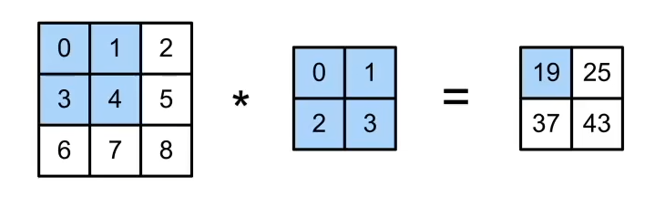
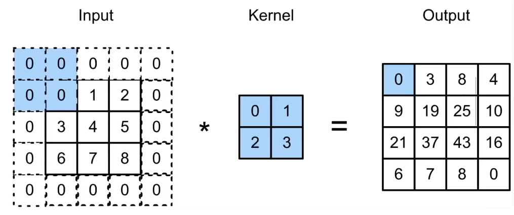
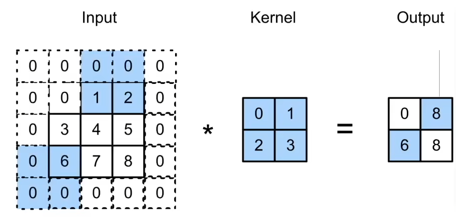
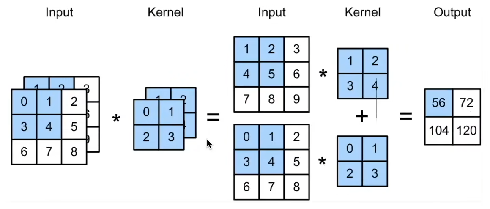
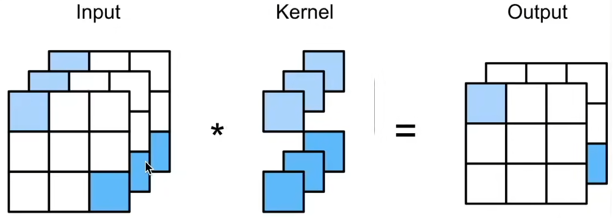
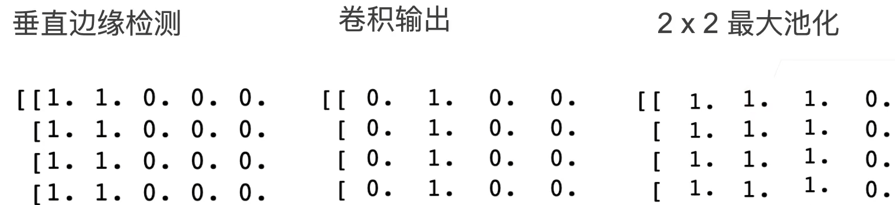
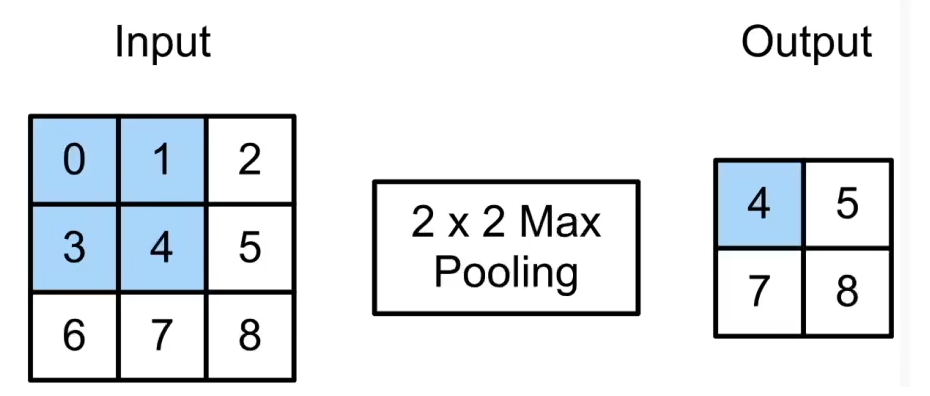
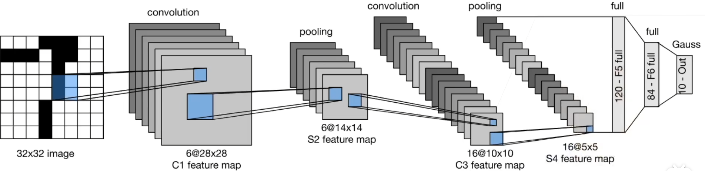

# 卷积层
## 从全连接到卷积
分类猫和狗的图片，假设图片有12M像素，那么对于RGB图片而言有36M个元素，如果使用单隐藏层MLP的话，参数的数量甚至会超过世界上所有猫和狗的数量，这显然是不合理的。

图片识别应该遵循两个原则：
* 平移不变性
* 局部性

### 重新考察全连接层
* 输入和输出为矩阵
* 权重变为4维的张量 $(h,w)$ 到 $(h',w')$
$$
h_{i,j}=\sum_{k,l}w_{i,j,k,l}x_{k,l} = \sum_{a,b}v_{i,j,a,b}x_{i+a,j+b}
$$
* $V$ 是 $W$ 的重新索引 $v_{i,j,a,b}=w_{i,j,i+a,j+b}$

#### 平移不变性
如果使用 $h_{i,j}=\sum_{k,l}w_{i,j,k,l}x_{k,l} = \sum_{a,b}v_{i,j,a,b}x_{i+a,j+b}$，$x$ 的平移会导致 $h$ 的平移，因此 $v$ 不应该依赖于 $(i,j)$，所以有 $v_{i,j,a,b}=v_{a,b}$
$$
\therefore h_{i,j}=\sum_{a,b}v_{a,b}x_{i+a,j+b}
$$

这就是二维交叉相关，在深度学习中被称为二维卷积。

#### 局部性
现在有 $h_{i,j}=\sum_{a,b}v_{a,b}x_{i+a,j+b}$，如果考虑局部性，当评估 $h_{i,j}$ 时，我们不应该使用远离 $x_{i,j}$ 的参数，所以当 $\left\vert a \right\vert ,\left\vert b \right\vert >\Delta$ 时，应当使得 $v_{a,b}=0$
$$
\therefore h_{i,j}=\sum_{a=-\Delta}^{\Delta}\sum_{b=-\Delta}^{\Delta}v_{a,b}x_{i+a,j+b}
$$

## 卷积层
### 二维卷积层

* 输入 $\bm{X}: n_h\times n_w$
* 核 $\bm{W}: k_h\times k_w$
* 偏差 $b\in \mathbb{R}$
* 输出 $\bm{Y}:(n_h-k_h+1)\times (n_w-k_w+1)$
$$
\bm{Y}=\bm{X} \ast \bm{W}+b
$$

### 一维和三维交叉相关
* 一维
  $$
  y_i=\sum_{a=1}^{h}w_a x_{i+a}
  $$
  * 文本
  * 语言
  * 时序序列

* 三维
$$
y_{i,j,k}=\sum_{a=1}^{h}\sum_{b=1}^{w}\sum_{c=1}^{d} w_{a,b,c}x_{i+a,j+b,k+c}
$$
  * 视频
  * 医学图像
  * 气象图像

## QA
* 卷积层为什么不是越大越好？
  * 这个问题类似于全连接层不是越宽越好，通常比较深的全连接层比宽的效果更好。卷积层同样也是核小一点，同时做的深一点效果号。所以通常选择 $5\times 5$，$3\times 3$ 之类大小的卷积核。

# 卷积层的填充和步幅
## 填充和步幅
### 填充
如果输入和核的形状为 $n_h\times n_w, k_h\times k_w$，那么输出形状 $(n_h-k_h+1)\times (n_w-k_w+1)$。可以看出更大的卷积核可以更快地减小输出大小。如果图片不是很大，那么可能就做不了更深的卷积神经网络。

一种解决方法是在四周进行填充。

如果填充 $p_h$ 行和 $p_w$ 列，输出形状为 $(n_h-k_h+p_h+1)\times (n_w-k_w+p_w+1)$。通常取 $p_h=k_h-1, p_w=k_w-1$。
* 当 $k_h$ 为奇数：在上下两侧填充 $p_h/2$
* 当 $k_h$ 为偶数：在上侧填充 $\left\lceil p_h /2 \right\rceil$，在下册填充 $\left\lfloor p_h /2 \right\rfloor$

### 步幅
如果输入比较大，但是卷积核比较小，那么如果希望输出比较小，会导致需要非常深的神经网络。

因此可以增加步幅，步幅指的是行/列的滑动长度。比如做高度为3宽度为2的步幅

* 给定高度 $s_h$ 和宽度 $s_w$ 的步幅，输出形状为 $\lfloor(n_h-k_h+p_h+s_h)/s_h\rfloor\times\lfloor(n_w-k_w+p_w+s_w)/s_w\rfloor$
* 如果 $p_h=k_h-1, p_w=k_w-1$，输出形状为 $\lfloor(n_h+s_h-1)/s_h\rfloor\times\lfloor(n_w+s_w-1)/s_w\rfloor$
* 如果输入高度和宽度可以被步幅整除，输出形状为 $(n_h / s_h)\times (n_w / s_w)$

## QA
* 卷积神经网络的超参数的重要程度如何(核大小、填充、步幅)
  * 一般而言填充会使得图片的高度和宽度不变(为了方便)，而步幅一般选为 $1$，除非计算量太大，才可能在某些层使步幅为 $2$，用于控制计算复杂度。因此核大小通常是最关键的。
* 现在已经有很多经典的网络结构了，在平时使用的时候需要自己设计卷积核还是直接套用经典网络结构？
  * 通常是直接使用经典网络结构，比如ResNet。除非输入的形状非常特殊，比如是一个 $20\times 1000$ 的图片，那就需要在经典架构上稍微做一点调整。自己设计的话也行，但是效果可能没有那么好。同时在实际应用中网络结构的影响可能没有那么大，而数据的处理可能会有更大的影响。
* 为什么通常使用 $3\times 3$ 的卷积核，$3$ 个像素视野感觉很小。
  * 如果神经网络足够深的话就不小了，随着深度的增加，最后一层的某个像素对应到原图片的很大的面积。
* 有没有办法让超参数一起训练？
  * 使用NAS。可以直接暴力搜索，或者自己设计求解。这种情况一般适用于需要在一些特殊的硬件上跑神经网络，才会需要搜索一个特殊的超参数。否则一般是不用的。

# 卷积层里的多输入多输出通道
## 多输入多输出通道
### 多个输入通道
彩色图片可能有RGB三个通道，如果转换为灰度会丢失信息。

假如有多个通道，那么每个通道都有一个卷积核，结果是所有通道卷积结果的和

* 输入 $\bm{X}:c_i\times n_h\times n_w$
* 输出 $\bm{W}:c_i\times k_h\times k_w$
* 输出 $\bm{Y}:m_h\times m_w$

### 多个输出通道
我们可以有多个三维卷积核，每个和生成一个输出通道。即设置 $c_o$ 个上面的多输入通道的卷积核。
$$
\begin{aligned}
&\text{ 输入 }\mathbf{X}:c_i\times n_h\times n_w \\
&\text{ 核 }\mathbf{W}:c_o\times c_i\times k_h\times k_w \\
&\text{ 输出 }\mathbf{Y}:c_o\times m_h\dot{\times}m_w
\end{aligned}
$$

### 多个输入和输出通道
每个输出通达可以识别特定模式，输入通道识别并组合输入中的模式。

### $1\times 1$ 卷积层
这是一个受欢迎的选择。这个卷积层不识别空间模式，只是融合通道。相当于输入形状为 $n_h n_w\times c_i$，权重为 $c_o\times c_i$ 的全连接层。

### 二维卷积层
* 输入 $\bm{X}:c_i\times h_n\times n_w$
* 核 $\bm{W}:c_o\times c_i\times k_h\times k_w$
* 偏差 $\bm{B}:c_o\times c_i$
* 输出 $\bm{Y}:c_o\times m_h\times m_w$

计算复杂度 $O(c_i c_o k_h k_w m_h m_w)$

## QA
* 如何设计通道数量？
  * 假如宽度和高度都减半了，那么一般通道数会加倍。否则通道数通常不变。
* 同一层不同通道卷积核大小必须一样吗？
  * 设置成一样计算效率更高(利于GPU并行)，但是没有强制规定要一样。

# 池化层
## 池化层
卷积对位置敏感，比如如果要检测垂直边缘，稍微偏移一点就偏离了边缘。但是这并不是我们希望的，因为实际情况下物体的边缘并不是完全准确的。所以需要引入池化层来解决这个问题。

### 二维最大池化
返回滑动窗口中的最大值

使用最大池化之后，发现可以允许一定距离的位移。

### 填充，步幅和多个通道
池化层和卷积层类似，都具有填充和步幅，但是没有可以学习的参数。在每个输入通道应用池化层获得相应的输出通道，因此池化层的输出通道数=输入通道数。

# LeNet
## LeNet
用于识别手写的数字

使用了几个卷积层加上全连接层。

## QA
* 在跑得动的情况下，中间计算层的输出通道应该尽量大吗？
  * 如果太大会导致过拟合。一般中间层的大小和数据的复杂度相关。
* 目前的深度学习是否都需要较多的训练数据？如果数据体量很小是否不适合用深度学习？
  * 现在已经可以实现在很少的训练样本上训练神经网络了。在真实的产业应用中不会从零开始学习，而是有先验知识的，而是会在很大的数据集上训练好一些模型作为起始点，再在小数据集上做微调。