# 深度卷积神经网络 AlexNet
## AlexNet
AlexNet是因此此次深度学习热潮的第一个网络。

在此之前(2000年左右)使用的主流机器学习模型是核方法。核方法首先提取特征，然后选择核函数来计算相似性，形成一个凸优化问题，因此有很漂亮的定理。同时当时处理图片(计算机视觉)主要考虑的是几何学，核心思想是做特征抽取，把计算机视觉问题转化为几何问题，如果有比较好的几何模型，就能建立凸优化(或者非凸优化)的函数，只要几何模型建立的比较好，那么就能得到非常好的结果。

在当时的计算机视觉中，最重要的工作是特征抽取，当时也提出了各种从图像中提取特征的方法。只要提取特征比较好，具体的机器学习算法不重要。

而现今神经网络的兴起，很重要的原因是数据量的爆炸以及硬件性能的提升。AlexNet在第三次ImageNet竞赛中拿到了冠军，这个神经网络相当于一个更深更大的LeNet，主要改进了
* 使用了丢弃法
* ReLu
* MaxPooling

这次竞赛AlexNet引起了人们计算机视觉方法论的改变，通过CNN学习特征更加简单，同时CNN和Softmax一起训练，更加高效。
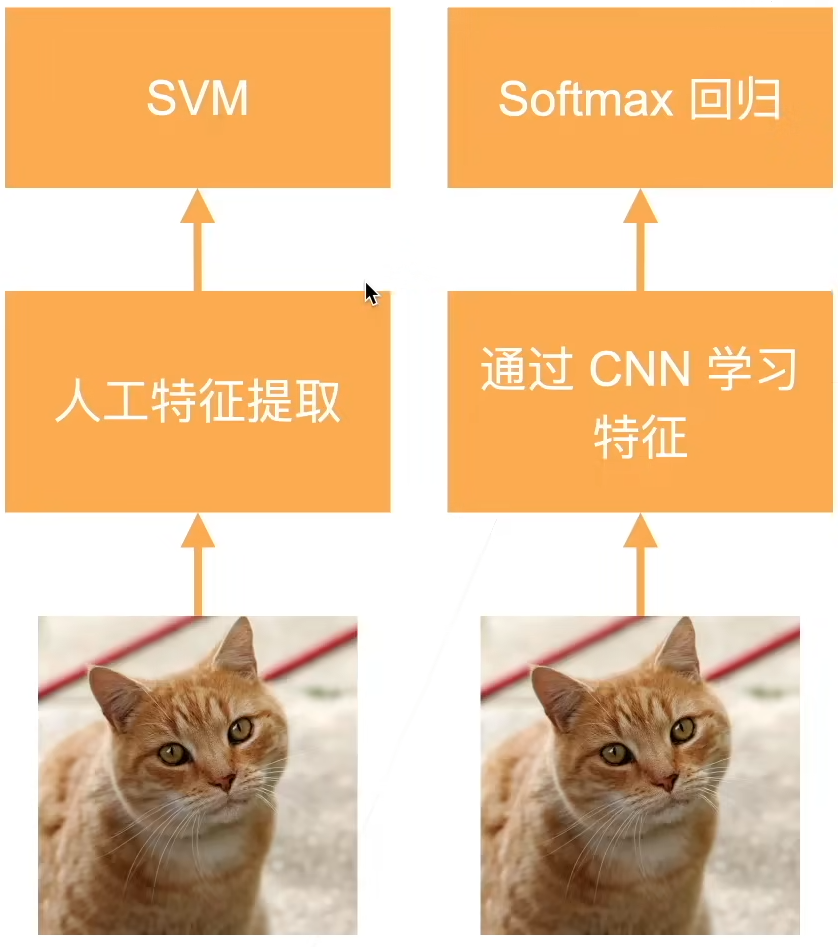

### AlexNet 架构
对于第一层，AlexNet的核更大，因为图片更大，需要更大的窗口看到更多东西。同时输出通道数为96，是希望在第一层就能学习到更多信息。$3\times 3$ 的池化层能够允许像素向左以及向右的偏差，使用MaxPooling值更大，学习更快。
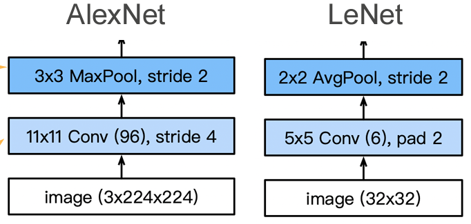

对于第二层，进一步增加输出通道数，同样是要识别更多的模式。同时与LeNet相比，又增加了3个卷积层。
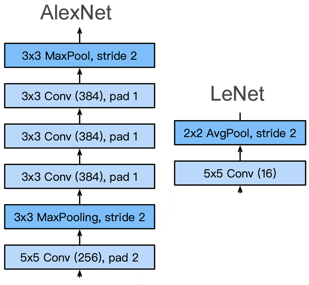

对于最后一层，结构相似，不过AlexNet识别的种类更多，因此全连接层的隐藏层更大。
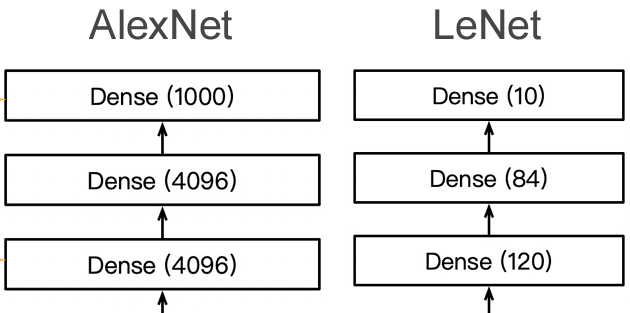

### 更多细节
AlexNet还对图片进行了数据增强，因为CNN对光照等比较敏感，所以可以先对图片进行各种处理

# 使用块的网络 VGG
## VGG
在学习AlexNet的时候我们遇到的最大的问题是这个网络长得不规则，结构不清晰。如果想要将卷积神经网络设计的更深，那么应该要有更好的设计框架，这就是VGG。

如何做到更深更大？
* 全连接层(太贵)
* 更多的卷积层
* 将卷积层组合成块

### VGG 块
VGG块就是AlexNet中一个部分的拓展，VGG块中的卷积层可以重复 $n$ 次，以及卷积层可以有 $m$ 个通道。
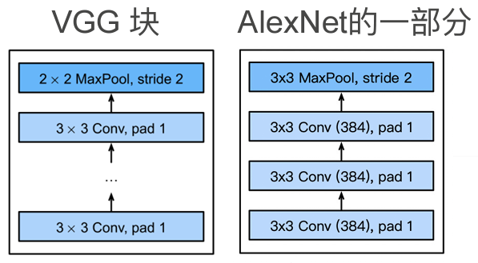

这里使用 $3\times 3$ 而不是用 $5\times 5$ 的卷积层，是因为经过测试发现，在计算量相同的情况下，$3\times 3$ 的卷积层效果更好。

### VGG 架构
多个VGG块后接全连接层，不同次数重复块可以得到不同的架构，如VGG-16，VGG-19。
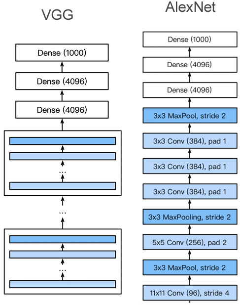

# 网络中的网络 NiN
## NiN
### 全连接层的问题
卷积层需要的参数比较少，只要 $c_i\times c_o\times k^{2}$ 个，但是卷积层之后的全连接层参数非常多：
* LeNet: $16\times 5\times 5\times 120=48k$
* AlexNet: $256\times 5\times 5\times 4096=26M$
* VGG: $512\times 7\times 7\times 4096=102M$

因此NiN的思想就是完全不使用全连接层，而是用卷积层替代。
### NiN块
一个卷积层之后跟两个全连接层，可以使用一个卷积层之后再跟两个 $1\times 1$ 且步幅也为 $1$ 的卷积层来替代，这两个卷积层的作用就相当于全连接层。

### NiN架构
* 无全连接层
* 交替使用NiN块核步幅为2的最大池化层，逐步减小高宽和增大通道数
* 最后使用全局平均池化层得到输出，类别数就是输入通道数

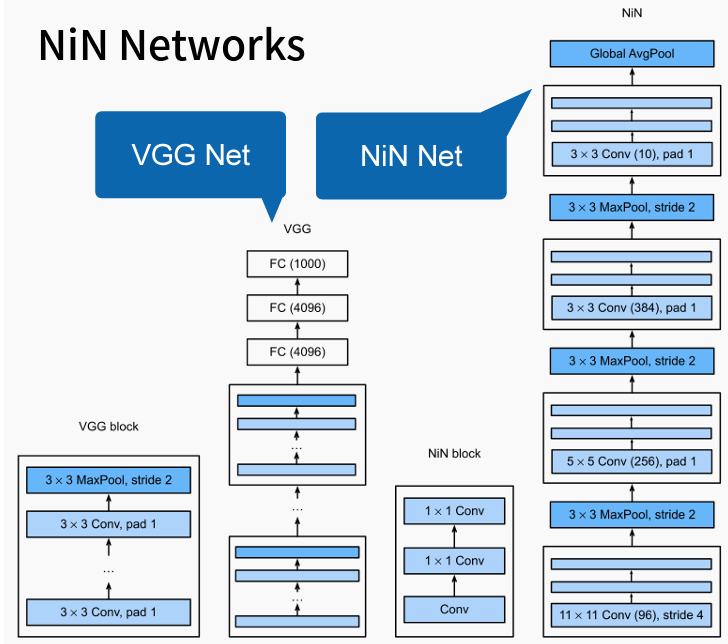

# 含并行连结的网络 GoogLeNet
## GoogLeNet
### Inception 块
4个路径从不同层面抽取信息，然后在输出通达维合并。使用多种结构，就可以不用纠结到底哪种更好。
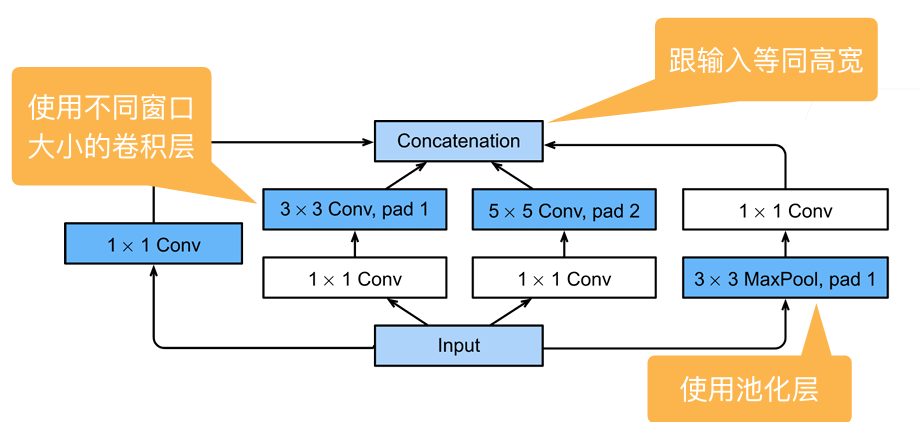

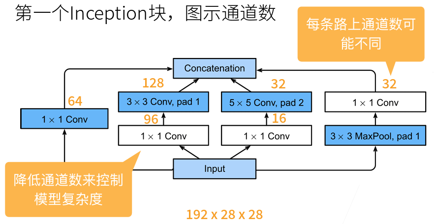

图中的白色块可以认为是抽取通道信息，蓝色的块是抽取空间信息。

和单 $3\times 3$ 或者 $5\times 5$ 卷积层相比，inception块有更少的参数和计算复杂度
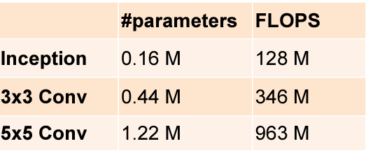

### GoogLeNet
可以理解为多个inception块堆起来。
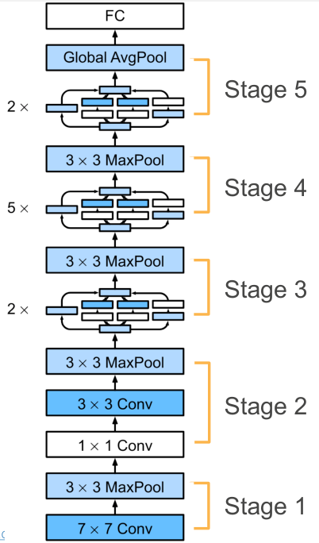

# 批量归一化
## 批量归一化
当神经网络特别深的时候，假设数据在底部，预测结果在顶部，那么梯度在上面会比较大，越到下面就越小(很多比较小的数相乘)，因此上层的参数会不断更新，而下层则变化很慢，导致上面很快就会收敛，下层则要一直训练。但是每次下层一变化，上层的参数又要重新学习，最终导致整体收敛变慢。(底层学习的是一些比较具体的纹理特征，而上层得到的则是一些更高维的特征)

因此我们希望在改变底部参数的时候避免顶部重复训练，这就需要批量归一化。

### 批量归一化
固定小批量里的均值和方差，就能让各层相对稳定。同时具体的分布可以学习，但会有一定的限制
$$
x_{i+1}=\gamma \frac{x_i-\mu_{B}}{\sigma_{B}}+\beta
$$

式中 $\gamma$ 和 $\beta$ 是可以学习的参数。

假如批量归一化可以作用在：
* 全连接层和卷积层的输出上，激活函数之前
* 全连接层和卷积层的输入上

对于全连接层，作用在特征维；对于卷积层，作用在通道维。

## QA
* xavier也有类似normalization的东西，这两者有什么区别？
  * 本质上没有区别，都是希望让模型更稳定。但是xavier是在初始的时候进行设置，而batch normalization能在整个训练过程中对每一层进行操作。
* 为什么加了batch normalization收敛时间变短？
  * 加了bn能让梯度变大一点，对权重的更新会变快

# 残差网络 ResNet
## ResNet
### 加更多的层总是能改进精度吗？
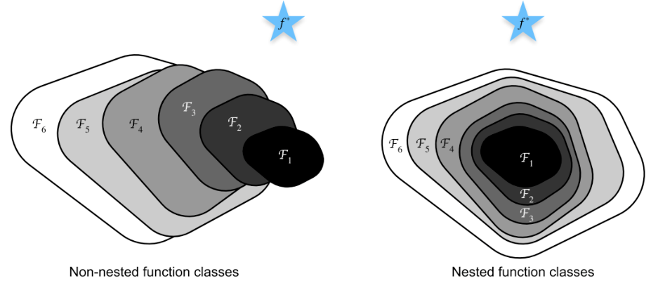

假设 $f^{*}$ 是需要学习的最优值，$F$ 是学习的函数，图中函数的大小代表模型的复杂程度，一个函数；(比如说 $F_1$)能学到的最好的值就是在图中离 $f^{*}$ 最近的位置。我们可以增加模型的层数，使得模型更加复杂，从而学到更大的区域，比如图中 $F_1$ 到 $F_6$。

但是我们可以注意到，如果像左图中，虽然模型更加复杂了，但是学偏了，相比更小的模型反而偏差更大。但是如果能像右图中，大的模型总是能包含小的模型，那么我们至少可以保证模型不会更差。ResNet的核心思想就是实现右图，让情况不会更差。

### 残差块
串联一个层改变函数类，如果我们希望扩大函数类，那么就给残差块加入快速通道来得到 $f(x)=x+g(x)$ 的结构。假如虚线框内的模型没有作用，那么依然能够包含原来的模型。(这只是一种解释方法)
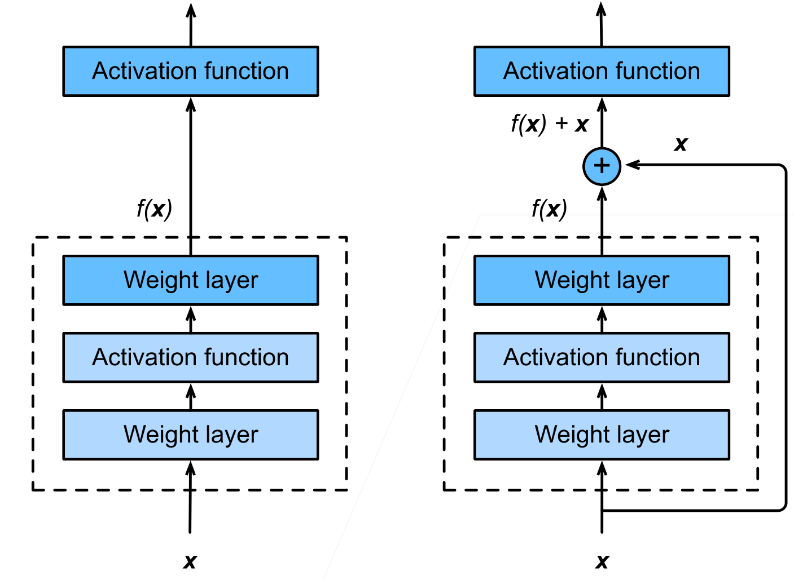

### ResNet 架构
类似VGG和GoogleNet的总体架构，但是将块替换成了ResNet块。

残差块可以使得很深的网络更加容易训练，甚至可以训练一千层的网络。残差网络也对之后的网络产生了非常深远的影响。

## QA
* 为什么 $f(x)=x+g(x)$ 能使得更大的模型包含原来的小模型？
  * 我们在训练 $f(x)$ 的时候，如果模型发现加上 $g(x)$ 对模型的效果并不好，那么在做梯度下降的时候 $g(x)$ 就得不到较大的梯度，权重会很小。
* 残差网络名字的由来？
  * $f(x)=x+g(x)$ 可以理解为我们先训练了下面的小网络，然后 $g(x)$ 项用于在原有的基础网络上做微调，就相当于残差。
* 

