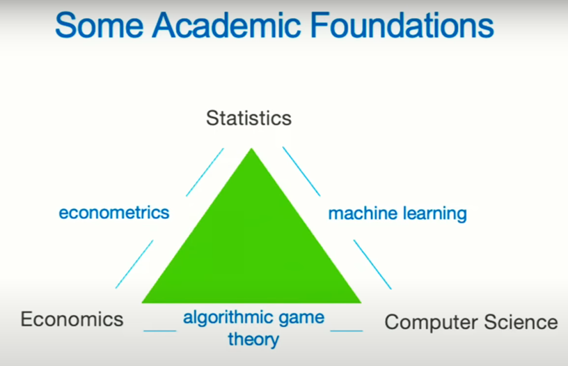
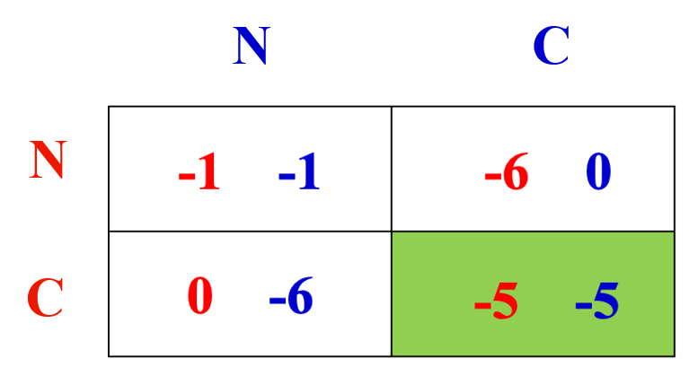
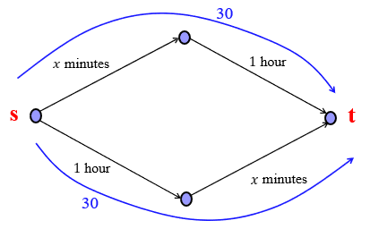
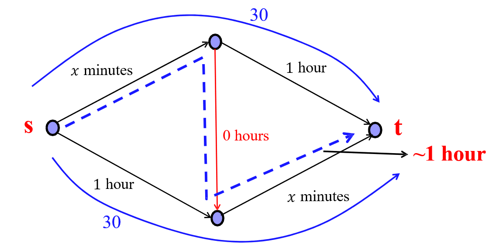

## Game Theory
所有的智能体(agent)在同一个环境中，且都是自私理性(self-interested)的，博弈论研究这些智能体的行为。

这门课需要回答的问题：
* What to expect? 即 game 的最终状态，比如生态系统中生物最后的稳态分布。
* How good is it? 即最终的 game 的状态是否是好的状态。
* Can it be controlled? 即我们能否控制这个 game 使之达到一个好的状态。

## 3 Board Goals
### Games and Equilibria
Understand outcomes arising from interaction of intelligent and self-interested agents.

需要知道：
* 是否存在均衡(equilibria)？
* 均衡是否唯一？
* 如何得到均衡？

#### Prisoner's Dilemma

无论另一个人选什么，选择 C(confess) 对于自己来说结果总是更优的，因此两者都 confess 是唯一的均衡(equilibria)状态。但是对于两个囚徒而言，这个结果并不是最优的。

#### Static Games with Complete Information
* Model for strategic games: matrix games (Prisoner's Dilemma) and continuous games (Cournot Game)
* Solution concepts: equilibrium hierarchy (几个 equilibrium 是从强到弱的关系)
  * Dominant and Dominated Strategies 
  * Pure Nash Equilibrium (NE) and Mixed Nash Equilibrium
  * Correlated Equilibrium
* Existence of NE: a fixed point of best-response correspondences.
  * For finite games, Nash's Theorem shows the existence of a mixed NE using fixed-point theorems.
  * For continuous games, show the existence of pure NE under convexity assumption.
  *  For general continuous games, Glicksberg's Theorem shows the existence of mixed NE.
  *   For discontinous games, existence of a mixed equilibrium established under some assumptions.
* Uniqueness of NE using "strict diagonal concavity"

**没太搞懂**

### Price of Anarchy
Analyze quality of the outcome arising from strategic interaction, i.e. OPT vs NE.

即分析的是在博弈论中，每个个体的自私性对于整个系统总的结果的影响。

#### Braess' Paradox

假设总共有 $60$ 个人需要从起点 $s$ 到终点 $t$。对于图上标的两个 $x$ minutes 的路径，我们假设 $x=n$，其中 $n$ 为走在这条路上的人数。那么每个人在追求自己时间最小化的情况下，两条路最终都会有 $30$ 个人，所有人的总时间都是 $90$ 分钟。

但是如果中间又新修了一条路

会发现所有人都会走 $x$ minutes 的那条路，导致 $x=60$。那么所有人从 $s$ 到 $t$ 的时间变成了 $120$ 分钟，结果反而更差了，这是作为 game 的结果。而在新的情况下，这个系统整体的最优解依然是像原来一样，时间应当为 $90$ 分钟，这是作为 optimization 的结果。

于是我们可以得到新的情况的 Price of Anarchy (PoA) 为
$$
\frac{worst~NE}{OPT} = \frac{2}{1.5} = \frac{4}{3}
$$

PoA 就是用来衡量 game 的结果(outcome)的质量(quality)，希望越小越好。

### Mechanism Design
Designing rules to ensure “good” outcome under strategic interaction among selfish agents. 

即如何设计 game 的规则(rule)，使得最后的结果是好的，即让 PoA 更小。

## More on Game Theory
Optimization Theory: 
* Maximize $\sum_{i}u_i(x)$
* Subject to $x\in \bm{X} \subset \mathbb{R}^{n}$

假设最后的解为 $x^{*}$，这就是一个 optimal 的解。

Game Theory:
* 共有 $n$ 个 agent，每个 agent 选择一个 $x_i \in \mathbb{R}$ 使得自己的 utility $u_i(x)$ 最大。其中 $u_i(x)$ 也可以写成
$$
u_i(x_i,x_{-i}), \quad x_{-i} = (x_1, \ldots ,x_{i-1}, x_{i+1}, \ldots , x_n)
$$

在多个 agent 的共同作用下，也可以得到一个解，或者说是一个 equilibrium，记为 $\hat{x}^{*}$。

### Example: Resource Allocation
资源有限，需要竞争。假设总共的资源为 $1$，有 $3$ 个 agent 来竞争，并且这三个 agent 的 utility 分别为：
$$
u_0(x_0)=\log(x_0) \quad u_1(x_1)=3\log(x_1) \quad u_2(x_2)=4\log(x_2)
$$

Optimization Problem:
$$
\max_{x_0+x_1+x_2\le 1} \log x_0 + 3 \log x_1 + 4 \log x_2
$$

可以解得最优情况为 $x_0^{*}=1 / 8, x_1^{*}=3/8, x_2^{*}=1 /2$，总的 utility 约为 $-3.39$。

Game Problem:
系统不知道每个 agent 实际的 utility。每个 agent 为了最大化自己的 utility，都 report $u_0(x)=u_1(x)=u_2(x)=4\log x$ (假设这个就是最大值)。那么最终做出的分配就为 $\hat{x}_{0}^{*}=\hat{x}_{1}^{*}=\hat{x}_{2}^{*}=1 /3$，导致实际的总 utility 约为 $-3.82$

strategy