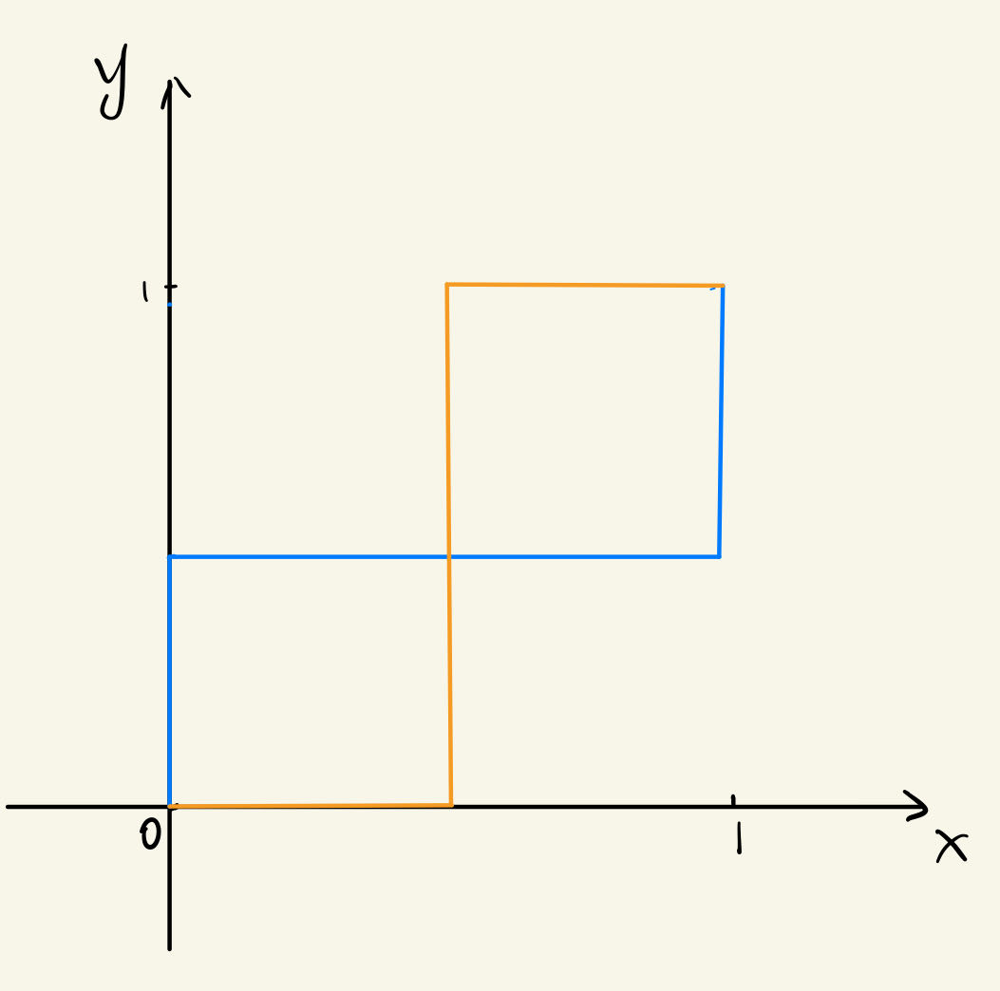

* player/agent: $n$
* (pure) stratety/action: $a_i\in A_i$ ($A_i$ 是一个离散的有限集合)
  * (mixed) strategy: $p_{i}$，即在 $A_i$ 上的概率分布。并且 $p_{i}(a)=\operatorname{Pr}(\text{player i plays action } a)$
* utility/payoff for user i: $u_i(a_1,a_2, \ldots ,a_n)$
  * 对于 mixed strategy $(p_1, p_2, \ldots ,p_{n})$ 来说，utility 应该为(此处假设了 mixed strategy 的概率独立同分布)
  $$
  \sum_{a_1\in A_1}\sum_{a_2\in A_2}\cdots \sum_{a_{n}\in A_{n}} u_i(a_1,a_2, \ldots ,a_n)p_1(a_1)p_2(a_2)\cdots p_n(a_n)
  $$
  * 上式可以简记为 $u_i(p_{i},-p_{i})$

Best response for player i:
给定其他 agent 的策略 $p_{-i}$，记 Best response 为 $BP_{i}(p_{-i})$，有
$$
BP_{i}(p_{-i}) = \argmax_{p_{i}} u_i(p_{i},p_{-i})
$$

* $BP_{i}(p_{-i})$ 可能是一个集合。 (有多个满足条件的 $p_{i}$)
* $BP_{i}(p_{-i})$ 是一个 convex set。 (即假如 $p_1,p_2 \in BP_{i}(p_{-i})$，那么 $p_3=\alpha p_1+(1-\alpha)p_2, \alpha \in (0,1)$，仍满足 $p_3\in BP_{i}(p_{-i})$)。

## 纳什均衡
纳什均衡 (Nash Equilibrium)：用于刻画 $n$ 个 agent 的策略
如果 $u_i(p_{i},p_{-i}^{*})\le u_i(p_{i}^{*},p_{-i}^{*}), \forall i,p_{i}$，那么 $p^{*}=(p_1^{*},p_2^{*}, \ldots ,p_n^{*})$ 是一个纳什均衡。

由于 $p_{i}^{*}\in BP_{i}(p_{-i}^{*})$，那么可以写出
$$
\begin{pmatrix} 
    p_1^{*} \\ p_2^{*} \\ \vdots \\ p_n^{*} 
\end{pmatrix} \in 
\begin{pmatrix} 
    BP_1(p_{-1}^{*})  \\ BP_2(p_{-2}^{*}) \\ \vdots \\ BP_{n}(p_{-n}^{*})
\end{pmatrix} \Rightarrow
p^{*} \in  BP(p^{*})
$$

因此算子 $BP$ 如果有不动点(fixed point)，那么存在纳什均衡。在数学上可以证明上述不动点总是存在的，因此纳什均衡也总是有 mixed strategy。

### Example
partner game
* player：p1,p2
* actions: work hard, be lazy ($W,L$)
* utility:
    | (p1,p2) | $W$     | $L$    |
    | ------- | ------- | ------ |
    | $W$     | (10,10) | (-5,5) |
    | $L$     | (5,-5)  | (0,0)  |

满足纳什均衡的 pure strategy 有 $(W,W)$ 和 $(L,L)$。
对于 mixed strategy，设 p1 work 的概率为 $x$, lazy 的概率为 $1-x$；p2 work 和 lazy 的概率则为 $y$ 和 $1-y$。此时两个 player 的 utility 为：
$$
\begin{aligned}
u_1 &= 10xy+(-5)x(1-y)+5(1-x)y+0(1-x)(1-y) = 10xy+5y-5x = 5x(2y-1) + 5y \\
u_2 &= 5y(2x-1) + 5x
\end{aligned}
$$

$$
\Rightarrow 
x^{*}=\begin{cases}
    1 \text{~ if y > 1/2} \\
    0 \text{~ if y < 1/2} \\
    [0,1] \text{~ if y = 1/2} \\
\end{cases} 
\quad 
y^{*}=\begin{cases}
    1 \text{~ if x > 1/2} \\
    0 \text{~ if x < 1/2} \\
    [0,1] \text{~ if x = 1/2} \\
\end{cases}
$$

由图像可得最终结果为 $(1 /2, 1/2)$

## Dominant & Dominated Strategy
### Dominant Strategy
A strategy is a dominant strategy for player $i$ if 
$$
u_i(a_i,a_{-i})\le u_i(a_i^{*},a_{-i}) \quad \forall a_i, a_{-i}
$$

可以看出这个条件比纳什均衡更强。

A strategy profile $A=(a_1^{*},a_2^{*}, \ldots ,a_n^{*})$ is a dominant strategy equilibrium if $a_i^{*}$ is a dominant strategy for each player $i$.

DSE(Dominant Strategy Equilibrium)并不是总是存在的，而 NE 却总是存在的。

#### prisoner dilemma Example 
* player：p1,p2
* actions: confess, deny ($C,D$)
* utility:
    | (p1,p2) | $C$     | $D$     |
    | ------- | ------- | ------- |
    | $C$     | (-3,-3) | (0,-5)  |
    | $D$     | (-5,0)  | (-1,-1) |

在这个例子中，无论对手选择的是什么，选择 $C$ 总是对自己更加有利的。因此 $(C,C)$ 不仅是一个 pure strategy NE，同时也是 Dominant Strategy。

### Dominated Strategy
A strategy  $a_i$ is a dominated strategy for player $i$ if $\exists a_i'$
$$
u_i(a_i',a_{-i}) > u_i(a_i,a_{-i}) \quad \forall a_{-i}
$$

因此假如一个 game 里存在 dominated strategy，我们就可以直接将这个策略去掉。

#### prisoner dilemma Example 
还是上面的例子，但是让第一个囚徒加上自杀(suicide)的选项：

| (p1,p2) | $C$       | $D$      |
| ------- | --------- | -------- |
| $C$     | (-3,-3)   | (0,-5)   |
| $D$     | (-5,0)    | (-1,-1)  |
| S       | (-100,-3) | (-100,0) |

此时 $S$ 对于 $C$ 来说就是一个 dominated strategy。

## Correlated Equilibrium
Let $P(a)$ be a (joint) probability distribution over $a\in A_1\times A_2\times \cdots \times A_n$, then $P^{*}(a)$ is a correlated equilibrium (CE) if 
$$
\sum_{a_{-i}}p^{*}(a_{-i}|a_i)\times u_i(a_i,a_{-i}) \ge  \sum_{a_{-i}} p^{*}(a_{-i}|a_i)\times u_i(a_i',a_{-i}) \quad \forall a_i,a_i'
$$

这里表示所有的 player 都没有动机去 deviate。

上面的式子经过数学变换之后同样可以写为
$$
\sum_{a_{-i}}p^{*}(a_{-i}, a_i)\times u_i(a_i,a_{-i}) \ge  \sum_{a_{-i}} p^{*}(a_{-i}, a_i)\times u_i(a_i',a_{-i}) \quad \forall a_i,a_i'
$$

我们希望能够调整 $P(a)$ 使得结果更优，因此这是个优化问题：
$$
\max_{} \sum_{} p^{*}(a) u_i(a) \\
\sum_{a\in A} p^{*}(a)=1 \\
p^{*}(a)\ge 0
$$

可以看出这是个线性规划，有多项式复杂度的方法可以求解。但是 MNE(Mixed Nash Equilibrium) 是没有特定解法的。因此 Correlated Equilibrium 更弱。

### Traffic light game Example
#### Example1

| (p1,p2) | $Go$      | $Yield$ |
| ------- | --------- | ------- |
| $Go$    | (-10,-10) | (5,0)   |
| $Yield$ | (0,5)     | (-1,-1) |

可以得到
* pure NE: $(G,Y)$, $(Y,G)$
* mixed NE: $x=\operatorname{Pr}(\text{player 1 plays G}), y=\operatorname{Pr}(\text{player 2 plays G})$
  * $x^{*}=y^{*}=3 /8$
* the expected payoff to p1 is $-15 /32$

上述情况是两个人的选择是独立的。但是假如出现了红绿灯，那么就会影响两个 player 的选择。假设
$$
\operatorname{Pr}(G,Y)=0.5 \quad \operatorname{Pr}(Y,G)=0.5
$$

其中 $(G,Y)$ 表示红绿灯推荐 player 1 往前走，player 2 停下。

那么此时我们需要考虑两个 player 是否会遵守红绿灯。
* If p1 is told to play $G$, it knows that p2 is playing $Y$
* If p1 is told to play $Y$, it knows that p2 is playing $G$

the expected payoff to p1 is $3/2$

可以得知两个 player 都会遵守。

#### Example2
假如红绿灯的情况更加复杂
$$
\operatorname{Pr}(G,Y)=0.55 \quad \operatorname{Pr}(Y,G)=0.4 \quad \operatorname{Pr}(Y,Y)=0.05
$$

* If p1 is told to play $G$, it knows that p2 is playing $Y$
* If p1 is told to play $Y$, it knows the probability of p2 playing $Y$ is $1/9$; $G$ is $8 /9$。
  * If p1 stick to $Y$, its expected payoff is $1 /9 \times (-1) + 8 /9 \times 0 = -1/ 9$
  * If p1 stick to $Y$, its expected payoff is $1 /9 \times 5 + 8 /9 \times (-10) = -75/ 9$

因此 player 仍然会选择 $Y$。

