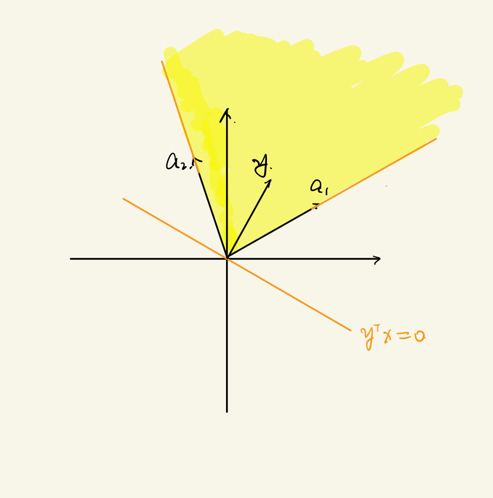

## LP Duality
Prime problem:
$$
\begin{aligned}
\max_{\mathbf{x}} \mathbf{c}^{\mathrm{T}}\mathbf{x}\\
s.t. \quad \mathbf{A}\mathbf{x}\le \mathbf{b}\\
\mathbf{x}\ge 0
\end{aligned}
$$

Interpretation:
* $x_i$: amount of product $i$ produced
* $b_i$: amount of raw material of type $i$ available
* $a_{ij}$: amount of raw material $i$ used to produced $1$ unit of product $j$
* $c_j$: profit from $1$ unit of product $j$

Dual problem:
$$
\begin{aligned}
\min_{y} \mathbf{b}^{\mathrm{T}}\mathbf{y} \\
s.t. \quad \mathbf{A}^{\mathrm{T}}\mathbf{y}\ge \mathbf{c}\\
\mathbf{y}\ge 0
\end{aligned}
$$

* $y_i$ 可以理解为单位原材料 $i$ 的售价
* $\mathbf{A}^{\mathrm{T}}\mathbf{y}\ge \mathbf{c}$ 是因为只有当直接售卖原材料的收益大于产品利润是，才会出售
* $\min_{y} \mathbf{b}^{\mathrm{T}}\mathbf{y}$ 是买家希望最小化支出

有结论：
$\mathbf{b}^{\mathrm{T}}\mathbf{y}^{*}=\mathbf{c}^{\mathrm{T}}\mathbf{x}^{*}$

Strong Duality of LP:
If the primal and dual are feasible, then both have the same optimal objective value. (feasible 表示有解)

### Farka's lemma
Exactly one of the following statements is true:
* $\exists \mathbf{x}\ge 0,\quad s.t. ~\mathbf{A}\mathbf{x}=\mathbf{b}$
* $\exists \mathbf{y}, \quad s.t. ~\mathbf{y}^{\mathrm{T}}\mathbf{A}\ge 0 \text{ and } \mathbf{y}^{\mathrm{T}}\mathbf{b}<0$

#### Geometric Interpretation of Fraka's
考虑二维的情形，记组成 $\mathbf{A}$ 的向量为 $\mathbf{a}_1,\mathbf{a}_2$

如果想要满足第一个条件，那么向量 $\mathbf{b}$ 应当在图像中高亮区域内；但是如果要满足第二个条件，则需要找到 $\mathbf{y}$，使得向量 $\mathbf{a}_1,\mathbf{a}_2$ 和 $\mathbf{b}$ 应当正好在直线 $\mathbf{y}^{\mathrm{T}}\mathbf{x}=0$ 的两侧。因此此两个条件只能有一个满足。

#### Proof of Duality
要证明 $\mathbf{b}^{\mathrm{T}}\mathbf{y}^{*}=\mathbf{c}^{\mathrm{T}}\mathbf{x}^{*}$，可以先证明左边小于等于右边，再证明右边小于等于左边。

$$
\mathbf{c}^{\mathrm{T}}\mathbf{x}=\mathbf{x}^{\mathrm{T}}\mathbf{c}\le \mathbf{x}^{\mathrm{T}}\mathbf{A}^{\mathrm{T}}\mathbf{y} \le \mathbf{b}^{\mathrm{T}}\mathbf{y}
$$

现在希望证明 $\mathbf{c}^{\mathrm{T}}\mathbf{x}^{*}\ge \mathbf{b}^{\mathrm{T}}\mathbf{y}^{*}$

记 $\mathbf{c}^{\mathrm{T}}\mathbf{x}^{*}=\Delta$，由于 $\mathbf{x}^{*}$ 为最优解，因此
$$
\not \exists \mathbf{c}^{\mathrm{T}}\mathbf{x}\ge \Delta+\varepsilon (\forall \varepsilon>0), \mathbf{A}\mathbf{x}\le \mathbf{b}, \mathbf{x}\ge 0
$$

我们使用 $\alpha_0, \mathbf{\alpha}$ 将不等式写为等式
$$
-\mathbf{c}^{\mathrm{T}}\mathbf{x}+\alpha_0  = -\Delta + \varepsilon, \mathbf{A}\mathbf{x}+\mathbf{\alpha} = \mathbf{b}, \alpha_0, \mathbf{\alpha}, \mathbf{x}\ge 0
$$

将其写为矩阵形式
$$
\begin{pmatrix} 
    -\mathbf{c}^{\mathrm{T}} & 1 & \mathbf{0} \\
    \mathbf{A} & \mathbf{0} & \mathbf{I}
\end{pmatrix} 
\begin{pmatrix} 
    \mathbf{x} \\ \alpha_0 \\ \mathbf{\alpha} 
\end{pmatrix} =
\begin{pmatrix} 
    -\Delta - \varepsilon \\ \mathbf{b}
\end{pmatrix} 
$$

由 Farkas' lemma，因为上述方程不存在解，因此
$$
\exists \lambda_0\ge 0, \mathbf{\lambda}_1 \ge 0
$$

使得
$$
-\mathbf{c}^{\mathrm{T}}\lambda_0 + \mathbf{\lambda}_1^{\mathrm{T}}\mathbf{A}\ge 0 \text{ and } -(\Delta+\varepsilon)\lambda_0 + \mathbf{\lambda}_1^{\mathrm{T}}\mathbf{b} < 0 \\
\Rightarrow \frac{1}{\lambda_0} \mathbf{\lambda}_1^{\mathrm{T}}\mathbf{A} \ge \mathbf{c}^{\mathrm{T}} \text{ and } \frac{1}{\lambda_0}\mathbf{\lambda}_1^{\mathrm{T}}\mathbf{b}<\Delta + \varepsilon
$$

令 $y = \mathbf{\lambda}_1 / \lambda_0$，那么对于 $\forall \varepsilon>0$，都有 $\mathbf{y^{*}}^{\mathrm{T}}\mathbf{b} \le \mathbf{y}^{\mathrm{T}}\mathbf{b}<\Delta+\varepsilon$，因此
$$
\mathbf{y^{*}}^{\mathrm{T}}\mathbf{b}\le \Delta=\mathbf{c}^{\mathrm{T}}\mathbf{x}^{*}
$$

### Another explanation of Duality
将原问题写为：
$$
\begin{aligned}
\max_{\mathbf{x}} \mathbf{c}^{\mathrm{T}}\mathbf{x}\\
s.t. \quad \mathbf{a}_1^{\mathrm{T}} \mathbf{x}\le b_1\\
\mathbf{a}_2^{\mathrm{T}} \mathbf{x}\le b_2 \\
\cdots \\
\mathbf{a}_n^{\mathrm{T}} \mathbf{x}\le b_n \\
\mathbf{x}\ge 0
\end{aligned}
$$

引入一系列系数 $y_1,y_2, \ldots ,y_n>0$，则有
$$
y_1 \mathbf{a}_1^{\mathrm{T}}\mathbf{x} \le b_1 y_1\\
y_2 \mathbf{a}_2^{\mathrm{T}}\mathbf{x} \le b_2 y_2\\
\cdots \\
y_n \mathbf{a}_n^{\mathrm{T}}\mathbf{x} \le b_n y_n
$$

假如满足条件 $y_1 \mathbf{a}_1^{\mathrm{T}} + y_2 \mathbf{a}_2^{\mathrm{T}} + \cdots + y_n \mathbf{a}_n^{\mathrm{T}}\ge \mathbf{c}^{\mathrm{T}}$，即 $\mathbf{A}^{\mathrm{T}}\mathbf{y}\ge \mathbf{c}$，则有
$$
\mathbf{c}^{\mathrm{T}}\mathbf{x} \le (y_1 \mathbf{a}_1^{\mathrm{T}} + y_2 \mathbf{a}_2^{\mathrm{T}} + \cdots + y_n \mathbf{a}_n^{\mathrm{T}})\mathbf{x} \le \mathbf{b}^{\mathrm{T}}\mathbf{y}
$$

从而得到了对偶问题。

从直观上来说，就是希望 $\mathbf{c}$ 能够被 $\mathbf{a}_1,\mathbf{a}_2, \ldots \mathbf{a}_n$ 的线性组合得到，从而就可以确定 $\mathbf{c}^{\mathrm{T}}\mathbf{x}$ 的上界；同理，这个上界也是 $\mathbf{b}^{\mathrm{T}}\mathbf{y}$ 的下界。

## Two-player zero sum Game
* Two player p1,p2
* Payoff to p1 = - Payoff to p2

Let:
* $A(i,j)$ is the payoff to p1 when $i$ is p1's action, $j$ is p2's action.
* $x$: prob distribution over p1's actions
* $y$: prob distribution over p2's actions

$$
\Rightarrow u_1(x,y)=\sum_{ij}A(i,j)x_i y_j = \mathbf{x}^{\mathrm{T}}\mathbf{A}\mathbf{y}\\
u_2(x,y) = -u_1(x,y)
$$

Thus a NE $(x^{*},y^{*})$ satisfies
$$
\begin{aligned}
&(x^{*})^{\mathrm{T}}A y^{*} \ge x ^{\mathrm{T}} A y^{*}\\
\text{and~} &(x^{*})^{\mathrm{T}} A y^{*}\le (x^{*})^{\mathrm{T}}A y
\end{aligned}
$$

我们称 $(x^{*},y^{*})$ 是 saddle point

### Minmax Theorem
1. 
    $$
    \min_{y} \max_{x} x^{\mathrm{T}}Ay = \max_{x} \min_{y} x^{\mathrm{T}}Ay  \tag{1}
    $$

    上述结果得到的值我们称其为 game 的 value。
2. 
    $$
    \max_{x}(\min_{y}x^{\mathrm{T}}Ay) \tag{2.1}
    $$

    $$
    \min_{y}(\max_{x}x^{\mathrm{T}}Ay) \tag{2.2}
    $$

    $x^{*}$ solves (2.1), $y^{*}$ solves (2.2). Then
    * $(x^{*},y^{*})$ is NE
    * $(x^{*})^{\mathrm{T}}Ay^{*}$ is the value of the game
3. If $(x^{*},y^{*})$ is a NE
   * $(x^{*})^{\mathrm{T}}Ay^{*}$ is the value of the game
   * $x^{*}$ solves (2.1), $y^{*}$ solves (2.2)

以上三个条件得到的 $(x^{*},y^{*})$ 都是相同的。

#### Proof
1. Suppose p1 wants to maximize its worst case payoff
    $$
    \max_{x} \min_{y} x^{\mathrm{T}}Ay\\
    = \max_{x} \min_{j} (x^{\mathrm{T}}A)_{j}
    $$

    问题转化为 LP 问题，可以用 LP Duality 来解
    $$
    \max_{x,v_1} v_1 \\ \tag{LP1}
    s.t. \quad v_1\le (x^{\mathrm{T}}A)_{j}  ,\forall j\\
    x\ge 0
    $$

    Similarly, p2's problem is 
    $$
    \min_{y,v_2} v_2 \\ \tag{LP2}
    s.t. \quad v_2\ge (Ay)_{i}, \forall i \\
    y\ge 0
    $$

    Thus by strong duality, we have $v_1^{*}=v_2^{*}$, or 
    $$
    \max_{x}\min_{y}x^{\mathrm{T}}Ay=\min_{y}\max_{x}x^{\mathrm{T}}Ay
    $$
2. Let $x^{\star }$ be a solution of LP1. From the constraint
    $$
    \begin{aligned}v_1^\star\leq(x^{\star\mathrm{T}}A)_j\forall j\end{aligned}
    $$

    Multiply $y_j^\star$ and sum over $j$, we get
    $$
    \begin{aligned}\sum_jv_1^\star y_j^\star\leq\sum_j(x^{\star\mathrm{T}}A)_jy_j^\star\end{aligned}
    $$

    $$
    \Rightarrow v_{1}^{\star}\leq x^{\star\mathrm{T}}Ay^{\star}
    $$

    where $y^{\star }$ is the solution of LP2. Similarly, we can show that

    $$
    v_{2}^{\star}\geq x^{\star\mathrm{T}}Ay^{\star}
    $$

    Since $v_{1}^{\star }= v_{2}^{\star }$, we have

    $$
    x^{\star\mathrm{T}}Ay^{\star}=\max_{x}\min_{y}x^{\mathrm{T}}Ay=\min_{y}\max_{x}x^{\mathrm{T}}Ay
    $$

    Then we can show that $( x^\star , y^\star )$ is a NE.

    $$
    \operatorname*{min}_{y}x^\mathrm{\star T}Ay=\operatorname*{max}_{x}\operatorname*{min}_{y}x^\mathrm{T}Ay=\operatorname*{min}_{y}\operatorname*{max}_{x}x^\mathrm{T}Ay=\operatorname*{max}_{x}x^\mathrm{T}Ay^{\star} \ge x^{\star \mathrm{T}}Ay^{\star}
    $$
    
    $\Rightarrow y^\star$ solves $\min_{y} \max_{x} x^\mathrm{T} Ay$

    Similarly, $x^{*}$ solves $\max_{x}\min_{y}x^{\mathrm{T}}Ay$. So $(x^{*},y^{*})$ is a NE.
3. Suppose $(x^{*},y^{*})$ is a NE, then
    $$
    x^{* {\mathrm{T}}} A y^{*} = \min_{y} x^{* {\mathrm{T}}} A y \le \max_{x} \min_{y} x^{\mathrm{T}}Ay
    $$

    Similarly, 
    $$
    x^{* {\mathrm{T}}}A y^{*} = \max_{x} x^{\mathrm{T}}Ay\ge \min_{y} \max_{x} x^{\mathrm{T}}Ay
    $$

    $$
    \Rightarrow\min_y\max_xx^{\mathrm{T}}Ay\leq x^{\star\mathrm{T}}Ay^{\star}\leq\max_x\min_yx^{\mathrm{T}}Ay
    $$

    Considering
    $$
    \begin{aligned}\min_y\max_xf(x,y)\geq\max_x\min_yf(x,y)\end{aligned}
    $$

    So
    $$
    \min_{y}x^{\star\mathsf{T}}Ay=x^{\star\mathsf{T}}Ay^{\star}=\max_{x}\min_{y}x^{\mathsf{T}}Ay\geq\min_{y}x^{\mathsf{T}}Ay\forall x
    $$

    $\Rightarrow x^{*}$ maximizes $\min_{y}x^{\mathrm{T}}Ay$. Similarly, $y^{*}$ minimizes $\max_{x}x^{\mathrm{T}}Ay$

#### Remark
$(x^{*},y^{*})$, $(\tilde{x},\tilde{y})$ are NE, then $(x^{*},\tilde{y})$, $(\tilde{x},y^{*})$ are also NE.

## None Zero Sum Game
$u_i(a_i,a_{-i})$ payoff to p1, $a_i\in A_i$ (discrete, finite)
$p_{i}(a_i)=\operatorname{Pr}(\text{player } i \text{ plays } a_i)$
$u_i(p_{i},p_{-i})=E(\text{payoff to } p_{i})$

### Theorem: A NE exists.
Let $C \subseteq{\mathbb{R}^{n}}$ be a convex, closed, bounded set. Let $f: C \rightarrow C$ be a continuous function. The $f$ has a fixed point, i.e. $\exists x \in C, x=f(x)$。从直观上来说，就是符合条件的 $y=f(x)$ 与 $y=x$ 必定有交点。

Let $p=(p_1,p_2, \ldots ,p_n)$ be a set of strategies. 
Define $r_i(a_i)=(u_i(a_i,p_{-i})-u_i(p_{i},p_{-i}))^{+}$，这个变量表示的是从策略 $p_{i}$ 变化到 $a_i$ 之后收益的增加量。我们希望能找到 $p_{i}^{*}$，使得 $\forall a_i$，有 $r_i(a_i)=0$，此时就能够得到一个纳什均衡。

Define
$$
f_i(p_{i}(a_i)) = \frac{p_{i}(a_i)+r_i(a_i)}{\sum_{\alpha}(p_{i}(\alpha)+r_i(\alpha))}
$$

$p_{i}(a_i)$ 表示的是对于策略 $p_{i}$，选中 $a_i$ 的概率。可以看出这个式子相当于求出 $p_{i}(a_i)+r_i(a_i)$ 在所有可能中的权重。

记
$$
f(p) = \begin{pmatrix} 
    f_1(p_1) \\ f_2(p_2) \\ \vdots \\ f_n(p_n)
\end{pmatrix} 
$$

1. 注意到 $p=(p_1,p_2, \ldots p_n) \subseteq[0,1]^{n}$，$p \in$ closed, bounded, convex set
2. $f$ 是一个连续函数

所以存在一个 fixed point $p$，$p=f(p)$，此时利用 $f$ 的表达式，应当有
$$
p_{i}(a_i) = \frac{p_{i}(a_i)+r_i(a_i)}{\sum_{\alpha}(p_{i}(\alpha)+r_i(\alpha))}
$$

同样的，我们希望证明 $r_i(a_i)=0$。

First, we claim that for each $i$, $\exists a_i, s.t.~ r_i(a_i)=0$. 
Suppose for some $i$, $r_i(a_i)>0, \forall a_i$ 
$$
\Rightarrow u_i(a_i,p_{-i})>u_i(p_{i},p_{-i}) ,\forall a_i
$$

$$
\Rightarrow \sum_{a_i\in A_i}p_{i}(a_i) u_i(p_{i},p_{-i}) > u_i(p_{i},p_{-i})
$$

$$
\Leftrightarrow u_i(p_{i},p_{-i})>u_i(p_{i},p_{-i})
$$

which is contradictory.

Fix $i$, let $a_i$ be $r_i(a_i)=0$
$$
p_{i}(a_i) = \frac{p_{i}(a_i)}{\sum_{\alpha}(p_{i}(\alpha)+ r_i(\alpha))}
$$

$$
\Rightarrow \sum_{\alpha\in A_i} p_{i}(\alpha) + \sum_{\alpha \in A_i}r_i(a_i)=1
$$

$$
\Rightarrow \sum_{\alpha \in A_i}r_i(\alpha) = 0
$$

Thus, $\forall \alpha\in A_i, r_i(\alpha)=0$

### Proof using the kakvtani fixed point theorem
Let $C$ be a closed, bounded, convex subset of $\mathbb{R}^{n}$. Let $f$ be a corresponding mapping each point in $C$ to a subset of $C$.
$$
f: C \rightarrow 2^{C}
$$

需要证明这一点是因为之前遇到过 $p \in BP(p)$，这也是一个从 point 到 subset 的映射。

Suppose that:
1. $f(x)\neq \emptyset~\forall x$, 
2. $f(x)$ is a convex set $\forall x$
3. $f$ has a closed graph. ($f$ has a closed graph if all sequence $\left\{ x_n \right\} \in C$ and $\left\{ y_n \right\}$, $(x_n,y_n)\rightarrow(x,y)$ with $y_n\in f(x_n)$, $\Rightarrow y\in f(x)$).

Then $f$ has a fixed point in $C$, $x\in f(x)$.

To estalish the existance of a solution to 
$$
p\in BP(p)
$$

where
$$
p=\begin{pmatrix} 
    p_1\\ p_2\\ \vdots \\ p_{n}
\end{pmatrix}  \quad
BP(p) = \begin{pmatrix} 
    BP(p_{-1}) \\ BP(p_{-2}) \\ \vdots \\ BP(p_{-n})
\end{pmatrix} 
$$

We will verify BP has all the properties required in the kakvtani FP theorem.
1. $BP(p)$ is a non-empty for each $p$. 这是显然的，因为在别人给出了策略的情况下，我们总能找到最大化自身收益的策略。
2. 根据 convex 的定义。If $p_{i}^{*}, \tilde{p_{i}} \in BP(p_{-i})$, $\alpha p_{i}^{*}+(1-\alpha)\tilde{p_{i}} \in BP(p_{-i})$。这也是显然的。由以下 $u_i$ 的定义
   $$
   u_i(p_{i},p_{-i}) = \sum_{a} u_i(a_i, a_{-i}) p_1(a_1) p_2(a_2) \cdots  p_n(a_n)
   $$
   从线性的特征可以看出 
   $$
   u_i(p_{i},p_{-i}) = u_i(\tilde{p_{i}},p_{-i}) = \alpha u_i(p_{i},p_{-i}) + (1-\alpha) u_i(\tilde{p_{i}},p_{-i}) = u_i(\alpha p_{i}^{*}+(1-\alpha)\tilde{p_{i}},p_{-i})
   $$
3. Let $(p_{i}^{(n)}, p_{-i}^{(n)}) \rightarrow (p_{i}, p_{-i})$ and  $p_{i}^{(n)} \in  BP_{i}(p_{-i}^{(n)})$
    Suppose that $p_{i} \not \in BP_{i}(p_{-i})$. Then $\exists \hat{p}_i$ and $\varepsilon>0$
    $$
    u_i(\hat{p}_i,p_{-i})\ge  u_i(p_{i},p_{-i}) + \varepsilon
    $$
    **$\hat{p}_i$ is a better response for $p_{-i}^{(n)}$ (for some $n$) then $p_{i}^{(n)}$ thus contradictory**.
    For sufficiently large $n$, 
    $$
    \begin{aligned}
    u_i(\hat{p}_i,p_{-i}^{(n)}) &\ge  u_i(\hat{p}_i,p_{-i}) - \frac{\varepsilon}{2}  \\
    &\ge u_i(p_{i},p_{-i}) + \varepsilon -\frac{\varepsilon}{2} \\
    &\ge  u_i(p_{i}^{(n)}, p_{-i}^{(n)}) - \frac{\varepsilon}{4} + \frac{\varepsilon}{2} \\
    &=u_i(p_{i}^{(n)},p_{-i}^{(n)}) + \frac{\varepsilon}{4}
    \end{aligned}
    $$

    

