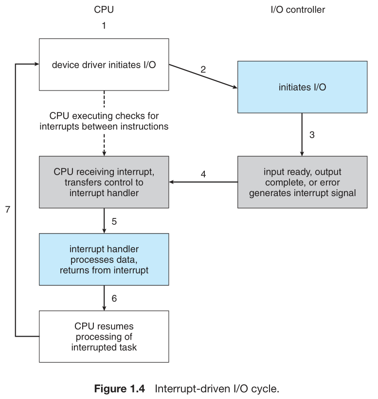
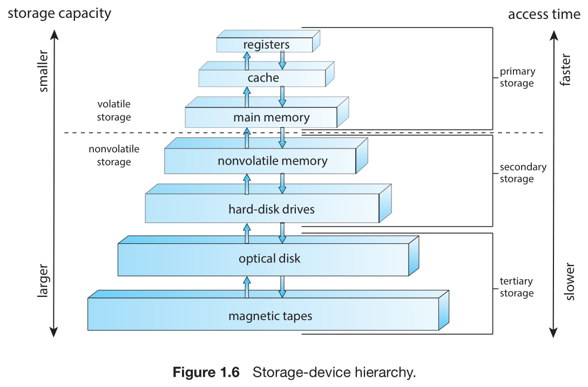
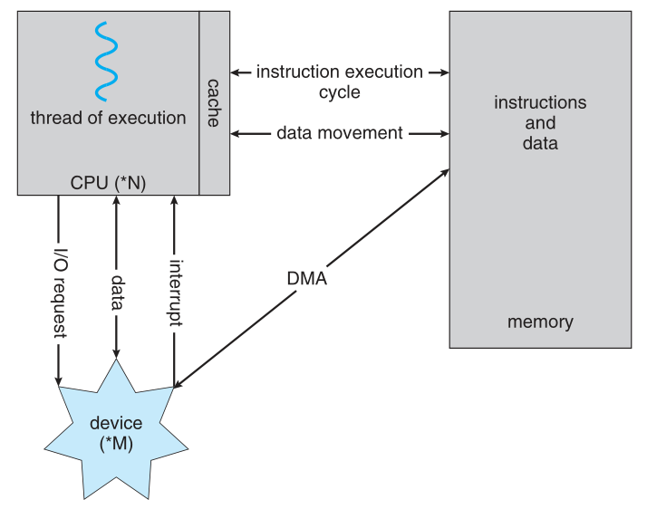

## What Operating Systems Do
### User View
The user’s view of the computer varies according to the interface being used.
* a laptop or in front of a PC consisting of a monitor, keyboard, and mouse.
* mobile devices with touch screen or voice recognition.
* emmbedded computers have little or no user view.

### System View
* **resource allocator**: Facing numerous and possibly conflicting requests for resources, the operating system must decide how to allocate them to specific programs and users
* **control program**: manages the execution of user programs to prevent errors and improper use of the computer.

### Defining Operating Systems
In summary, the operating system includes:
* the always running kernel
* middleware frameworks that ease application development and provide features
* system programs that aid in managing the system while it is running

## Computer-System Organization
### Interrupts
To handle the program performing I/O.

The basic interrupt mechanism works as follows.
1. ***interrupt-request*** line: the CPU senses after executing every instruction.(检测信号)
2. CPU detects that a controller has asserted a signal on the interrupt-request line(检测到信号)
3. reads the interrupt number and jumps to the ***interrupt-handler routine*** by using that interrupt number as an index into the interrupt vector.(跳转到中断指令处)
4. starts execution at the address associated with that index.(执行中断处理命令)
5. interrupt handler saves any state it will be changing during its operation...,executes a `return_from_interrupt` instruction to return the CPU to the execution state prior to the interrupt.(回到正常执行状态)

We say that the device controller **raises** an interrupt by asserting a signal on the interrupt request line, the CPU **catches** the interrupt and **dispatches** it to the interrupt handler, and the handler **clears** the interrupt by servicing the device.

*In summary*, 
* interrupts are used throughout modern operating systems to handle asynchronous events. 
* Device controllers and hardware faults raise interrupts.
* To enable the most urgent work to be done first, modern computers use a system of interrupt priorities. 

### Storage Structure
General-purpose computers run most of their programs from rewritable memory, called 
* main memory(***random-access memory***, or ***RAM***).
* commonly ***dynamic random-access memory***: ***(DRAM)***
* RAM is ***volatile—loses*** its content when power is turned off or otherwise lost

To store the ***bootstrap program***,the computer uses: 
* electrically ***erasable programmable read-only memory*** (***EEPROM***) and other forms of ***firmwar*** 
* storage that is infrequently written to and is nonvolatile.
* In addition, it is low speed, and so it contains mostly static programs and data that aren’t frequently used.

Most computer systems provide ***secondary storage*** as an extension of main memory. 
*  most common secondary-storage devices are ***hard-disk drives (HDDs)*** and ***nonvolatile memory (NVM)*** devices

In general, we will use the following terminology:
* **Volatile storage** will be referred to simply as **memory**. If we need to emphasize a particular type of storage device (for example, a register),we will do so explicitly.
* Nonvolatile storage retains its contents when power is lost. It will be referred to as ***NVS***. The vast majority of the time we spend on NVS will be on **secondary storage**. This type of storage can be classified into **two distinct types**:
  * **Mechanical**. A few examples of such storage systems are HDDs, optical disks, holographic storage, and magnetic tape. 
  * Electrical. A few examples of such storage systems are flash memory, FRAM, NRAM, and SSD. Electrical storage will be referred to as **NVM**.

### I/O Structure
It can produce high overhead when CPU used for bulk data movement such as NVS I/O. To solve this problem, ***direct memory access (DMA)*** is used.

device controller transfers an entire block of data directly to or from the device and main memory, with no intervention by the CPU

