## Background
一个进程的数据无法完全加载到整个内存中，所以需要虚拟内存来假装成物理内存。通过这种方式，能储存当前应用程序的几乎所有数据，而不需要全部加载到内存中。

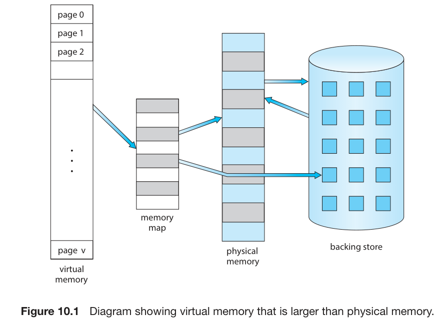

## Demand Paging
***demand pageing***: Pages are loaded only when they are demanded during program execution. Pages that are never accessed are thus never loaded into physical memory. (stored in virtual memory)

### Basic Concepts
While a process is executing, some pages will be in memory, and some will be in secondary storage. 

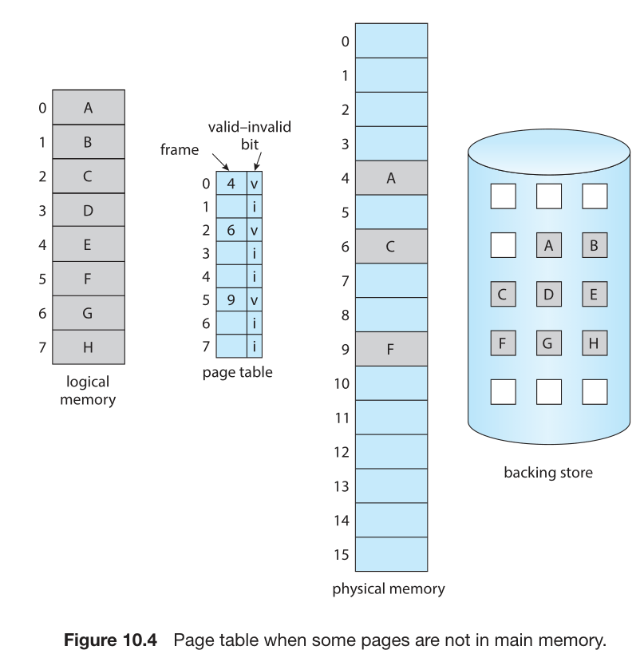

When the bit is set to 
* *valid*: the associated page is both legal and in memory.
* *invalid*: the page either is not valid (that is, not in the logical address space of the process) or is valid but is currently in secondary storage.

***page fault***: when a page is referenced that is not in memory.(被放在虚拟内存中)

The procedure for handling this page fault is straightforward：

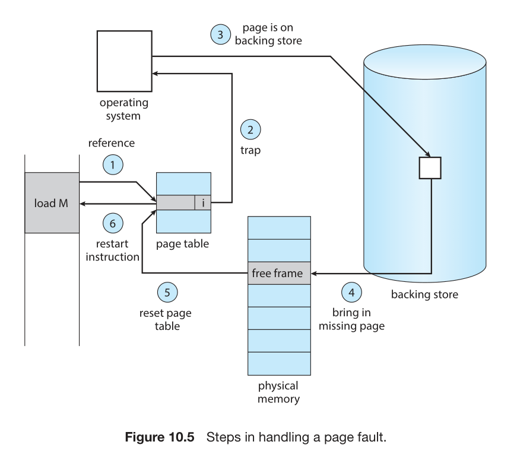

***pure demand paging***: never bring a page into memory until it is required.

Programs tend to have ***locality*** of reference(时间局部性、空间局部性、访问频率局部性), which results in reasonable performance from demand paging.

The hardware to support demand paging is the same as the hardware for paging and swapping:
* **page table**
* **Secondary memory.** :It is known as the swap device, and the section of storage used for this purpose is known as ***swap space***. 

### Free-Frame List
To resolve page faults, most operating systems maintain a ***free-frame list***, a pool of **free frames** for satisfying such requests.

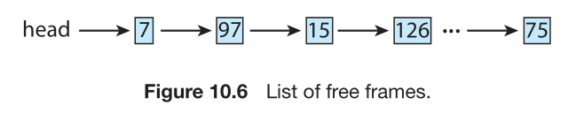

Operating systems typically allocate free frames using a technique known as ***zero-fill-on-deman***: demand frames are “zeroed-out” before being allocated, thus erasing their previous contents.

When a system starts up, all available memory is placed on the free-frame list.

### Performance of Demand Paging
As long as we have no page faults, the effective access time is equal to the memory access time. If, however, a page fault occurs, we must first read the relevant page from secondary storage and then access the desired word.
> effective access time = (1 − p) × ma + p × page fault time.

## Copy-on-Write
Process creation using the `fork()` system call may initially bypass the need for demand paging by using a technique similar to page sharing (covered in Section 9.3.4)

***copy-on-write***: allowing the parent and child processes initially to share the same pages. These shared pages are marked as copy-on-write pages, meaning that if either process writes to a shared page, a copy of the shared page is created.
(就是如果要写数据，那就要重新拷贝一份)

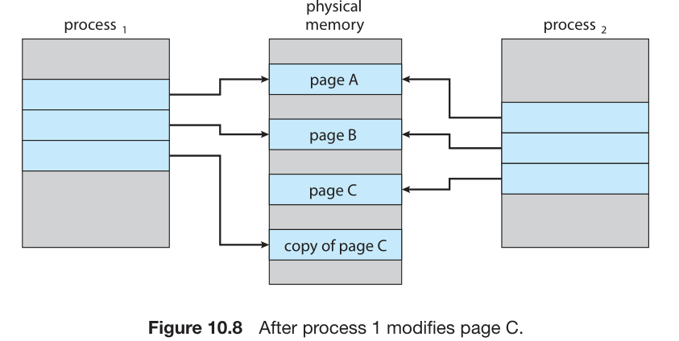

## Page Replacement
***page replacement***: the process of selecting a page to be removed from memory and replaced with another page.

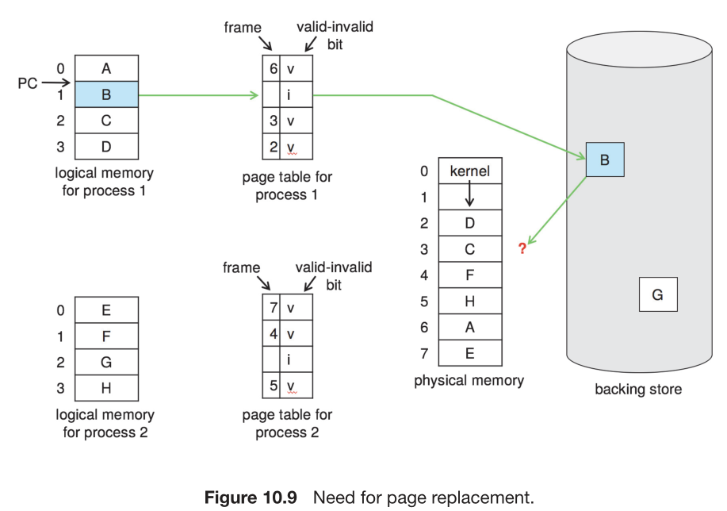

不存在空闲页框，因此需要页面替换。

### Basic Page Replacement

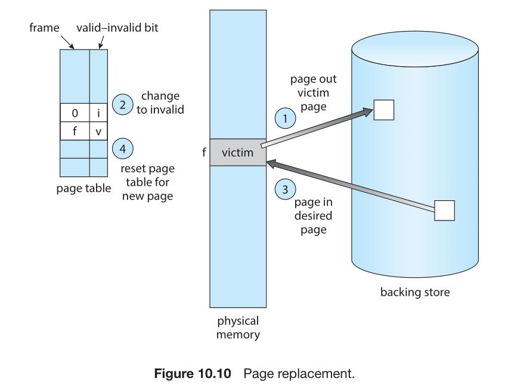

***modify bits(dirty bits)*** :The modify bit for a page is set by the hardware whenever any byte in the page is written into, indicating that the page has been modified. (就是看内存和硬盘上数据是否一致，如果不一致，就设置为dirty，目的是为了减少写入硬盘的次数)

We must solve two major problems to implement demand paging:
* ***frame-allocation algorithm***: if we have multiple processes in memory, we must decide how many frames to allocate to each process
* ***page-replacement algorithm***: when page replacement is required, we must select the frames that are to be replaced.

### FIFO Page Replacement
***first-in, first-out (FIFO) page replacement***: the oldest page is replaced first.

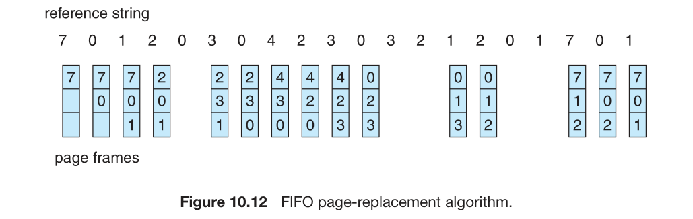

Curve of page faults for this reference string versus the number of available frames:

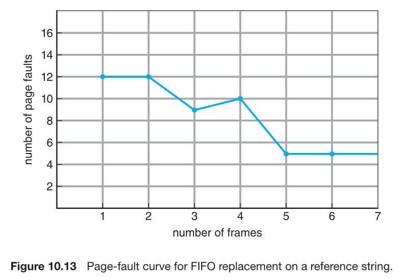

***Belady’s anomaly***: the number of page faults increases as the number of frames increases.

### Optimal Page Replacement
***optimal page replacement***: the page that *will* not be referenced for the longest time is replaced first.(但是需要预知未来的访问情况，因此该算法无法实现)

Example: The reference to page 2 replaces page 7, because page 7 will not be used until reference 18, whereas page 0 will be used at 5, and page 1 at 14.

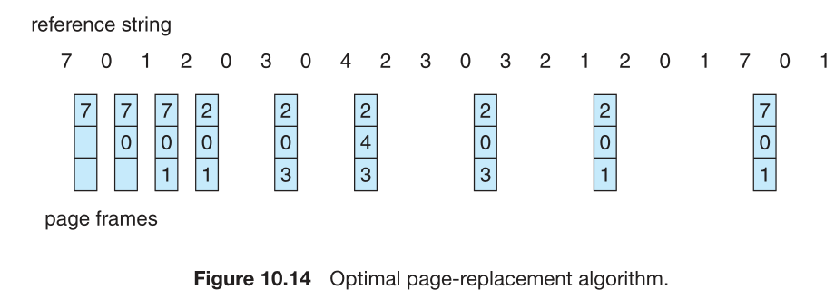

### LRU Page Replacement
***least-recently used (LRU) page replacement***: the page that *has* not been referenced for the longest time is replaced first.

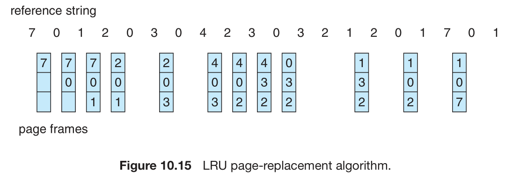

## Allocation of Frames
How do we allocate the fixed amount of free memory among the various processes?
*the basic strategy*: the user process is allocated any free frame.

### Minimum Number of Frames
We must also allocate at least a minimum number of frames. 

One reason for allocating at least a minimum number of frames involves performance. 

### Allocation Algorithms
***equal allocation***: split *m* frames among *n* processes is to give everyone an equal share, *m/n* frames .
***proportional allocation***: 按照进程大小分配 frame
With proportional allocation, we would split 62 frames between two processes, one of 10 pages and one of 127 pages, by allocating 4 frames and 57 frames, respectively, since 10/137 × 62 ≈ 4 and 127/137 × 62 ≈ 57.

## Thrashing
***thrashing***: A process is thrashing if it is spending more time paging than executing. As you might expect, thrashing results in severe performance problems.

### Cause of Thrashing
*scenario*: A global page-replacement algorithm is used; it replaces pages without regard to the process to which they belong.

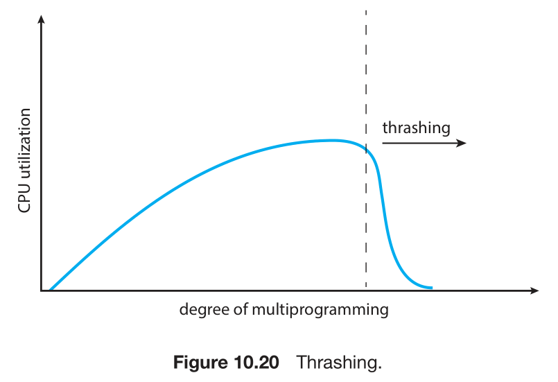

并行度增加，更多的进程导致更多的 page fault，甚至从正在运行的进程中做 page swapping，从而导致更严重的 page fault。最终计算机大多数时间都浪费在 page swapping 上，CPU利用率严重下降。

At this point, to increase CPU utilization and stop thrashing, we must decrease the degree of multiprogramming.

### Working-Set Model
The working-set model is based on the assumption of locality. The set of pages in the most recent Δ page references is the working set. Thus, the working set is an approximation of the program’s locality.

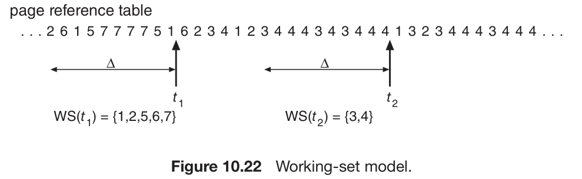

For example, given the sequence of memory references shown in Figure above, if Δ = 10 memory references, then the working set at time $t_1$ is {1, 2, 5, 6, 7}. By time $t_2$, the working set has changed to {3, 4}.

If we compute the working-set size, $WSS_{i}$, for each process in the system, we can consider that $D=\sum_{}WSS_{i}$, where $D$ is the total demand for frames. If the total demand is greater than the total number of available frames $(D > m)$, thrashing will occur.

### Page-Fault Frequency
Thrashing has a high page-fault rate. We can establish upper and lower bounds on the desired page-fault rate 

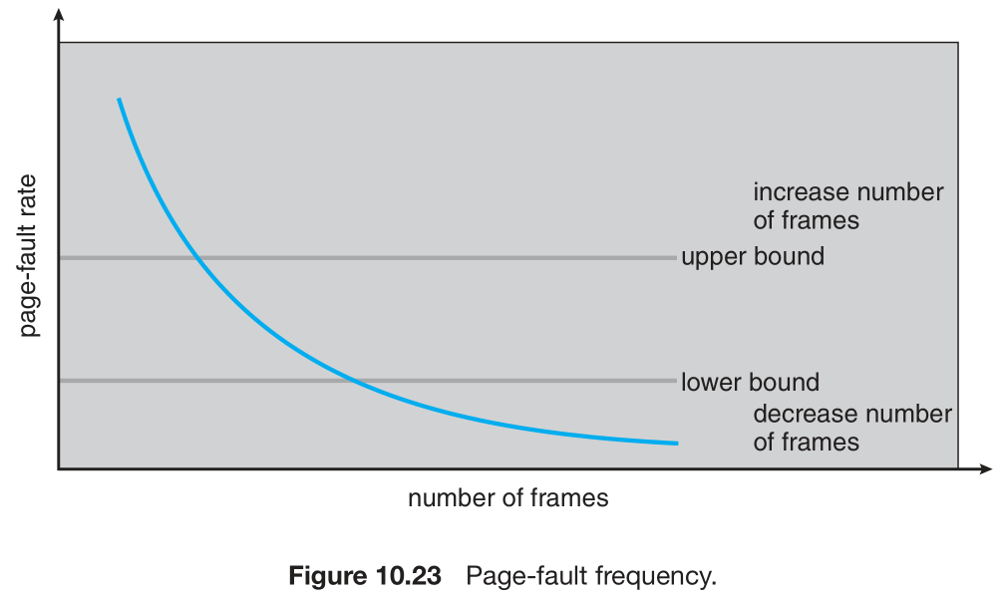

If the actual page-fault rate exceeds the upper limit, we allocate the process another frame. If the page-fault rate falls below the lower limit, we remove a frame from the process.

## Allocating Kernel Memory
Kernel memory is often allocated from a free-memory pool different from the list used to satisfy ordinary user-mode processes. 

### Buddy System
The buddy system allocates memory from a fixed-size segment consisting of physically contiguous pages. Memory is allocated from this segment using a ***power-of-2 allocator***.

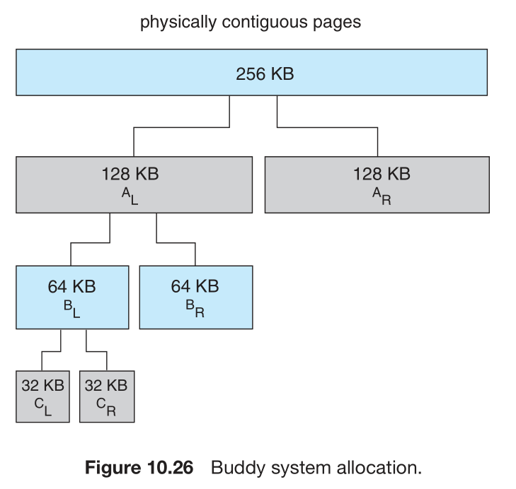

### Slab Allocation
A second strategy(和 buddy system 共同使用) for allocating kernel memory is known as ***slab allocation***. A ***slab*** is made up of one or more physically contiguous pages. A ***cache*** consists of one or more slabs.

There is a single cache for each unique kernel data structure. Each cache is populated with objects that are instantiations of the kernel data structure the cache represents.

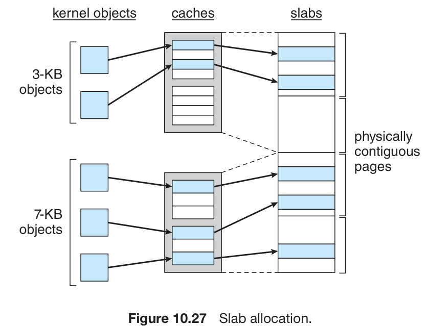

## Other Considerations
### Prepaging
An obvious property of pure demand paging is the large number of page faults that occur when a process is *started*. ***Prepaging*** is an attempt to prevent this high level of initial paging. The strategy is to bring some—or all—of the pages that will be needed into memory at one time.

We remember the working set for a process suspended, when the process is to be resumed, we automatically bring back into memory its entire working set before restarting the process.