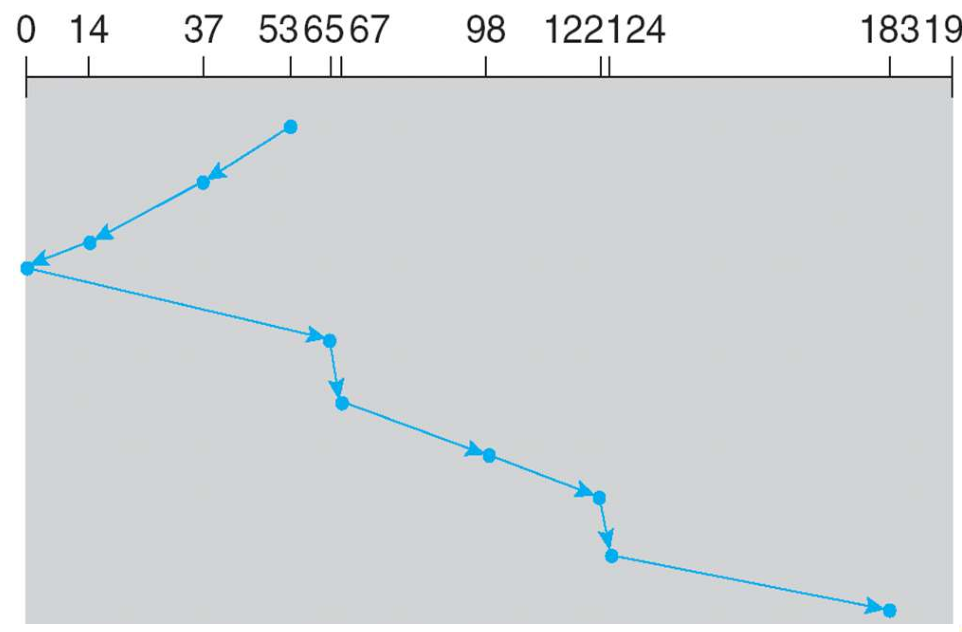

## 存储设备
HDD（Hard Disk Drive）：机械硬盘
SSD（Solid State Drive）：固态硬盘
### 机械硬盘
#### 总体结构

#### 工作原理
磁极方向表示数据，用加热的方式改变磁极方向。

#### 硬盘结构图

Disk $\rightarrow$ platter $\rightarrow$ surface $\rightarrow$ track $\rightarrow$ sector $\rightarrow$ block

其中sector由gap分开。
每个paltter有两个surface，每个surface上都有磁头可以读写。

#### 访问时间
$$
T_{access} = T_{seek} + T_{rot} + T_{lat}
$$

$T_{seek}$ 表示的是磁头移动到磁道(track)的时间；$T_{rot}$ 表示的是磁头在磁道上旋转的时间，这一步需要找到正确的sector；$T_{lat}$ 表示的是磁头在磁道上等待，也就是数据传输的时间。

$T_{rot}$ 与参数RPM有关，RPM指的是每分钟转动的圈数，单位为 $r/min$。

$T_{lat}$ 与参数BPS有关，BPS指的是每秒传输的bit数，单位为 $bit/s$。

### 固态硬盘
#### 总体结构

图中的flash chip是基本的存储单元。

#### 结构图

* **Die**: Semiconductor wafers are cut from a block of electronic-grade silicon. The piece of wafer cut from the block is referred to as a die.
* **Plane**: One die contains one to two planes. Planes can (generally) execute identical operations together.
* **Block**: Planes contain varying numbers of blocks. NAND Flash cells can only be erased at the block level.
* **Page**: Blocks usually contain around 128 pages. Pages are the smallest units that can be programmed (or written to)

#### Flash颗粒结构

以上是一个Flash颗粒的结构图，就是一个MOS管。

Flash是组成固态硬盘的颗粒，同时闪存也可以用来做U盘。

#### SLC, MLC, TLC, QLC Flash

就是让一个flash颗粒存储更多位的数据。方式是让不同范围的电压表示不同的数据。例如对于MLC来说，一种可行的数据表示方式如下：

$$
electron\ number>80\% \rightarrow 11\\
60\sim 80\% \rightarrow 10\\
40\sim 60\% \rightarrow 01\\
<20\% \rightarrow 00
$$

但是存储的数量越多，就越容易出错，耐久性也越低。所以一般来说，SLC的可靠性最高，QLC的可靠性最低。

#### Wear Leveling

使用过程中可能有些位置读写较多，有些较少。所以就通过数据存储位置的调整来保证每个位置的使用均匀。

## I/O接口
### 各种的I/O接口
ATA/IDE:
ATA（Advanced Technology Attachment）是一种硬盘接口标准，而IDE（Integrated Drive Electronics）指的是Parallel ATA（PATA）的一种实现方式。

SATA:
Serial ATA（SATA）是一种硬盘接口标准，是ATA的升级版。采用了串行的方式传输数据，而不是并行的方式，使得数据传输速度更快。这是如今主流使用的接口。

SCSI:
SCSI（Small Computer System Interface）主要用于大容量数据传输（如数据中心）。

SAS:
Serial Attached SCSI（SAS）是一种硬盘接口标准，是SCSI的升级版。采用了串行的方式传输数据。

USB:
Universal Serial Bus（USB）是一种硬盘接口标准，是一种通用的接口，可以支持多种设备。主要用于小容量数据传输。

PCIe:
PCI Express（PCIe）是一种硬盘接口标准，是一种高速的接口，可以支持多个硬盘。主要用于大容量数据传输。

PCIe的插槽越长，接口数量越多，传输速度越快。现在的GPU和SSD都是通过PCIe接口连接的。

### A Typical PC Bus Structure

### Polling
I/O调度的方法和CPU类似。Polling是将各种I/O请求放到一起，然后一次处理多个请求。

### DMA transfer

### A Kernel I/O Structure

## 硬盘调度算法
主要优化的是寻道时间。

以下用一个例子展示各种算法。当先Head pointer在 53，后面请求数据的硬盘位置在98, 183, 37, 122, 14, 124, 65, 67。

### FCFS
First Come First Serve，先来先服务。先到先服务。

### SCAN
SCAN（Elevator）算法，电械臂扫描算法。

从任意两个方向都可以先走，但一般优先更短的。

优化之后有LOOK算法，可以不用走到头。（如在上图中不用到达位置0）

SCAN算法有个问题，就是可能会导致各个请求等待时间不一定最短。因此有了C-SCAN算法。

### C-SCAN
Circular SCAN，循环扫描算法。

先扫描请求多的一侧，然后快速倒回，再扫描剩下的。

## 校验
### 基本方法
checksum：对原数据取模
CRC(cyclic redundancy check)：用哈希函数
ECC：有一定的纠错能力

### RAID(redundant array of inexpensive disks)
Storage Array（存储阵列）。 A set of disks from one or more commonly accessible disk subsystems, combined with a body of control software.
原因：内存比硬盘快很多，因此多个硬盘对一个内存。

#### JBOD
Just a Bunch of Disks。仅仅实现了将一个硬盘互联，同时对接一个内存的操作。没有校验能力。

#### RAID Array Components

中间的controller用于调度。

RAID的几种方法：strip（分条），Mirroring（镜像，即复制数据作为备份），Parity（校验，同样有一定恢复数据的能力）

#### RAID-0

仅仅提供了更好的读写性能。只使用了strip方法。

#### RAID-1

使用了mirroring方法，对数据做了备份。但是会造成双倍的空间被占用。

#### RAID-4

使用了parity方法。最后一个硬盘放的是校验位。如果出错，可以通过异或的计算恢复原来的数据。（parity就是根据异或计算出来的）

#### RAID-5

Distributed Parity。因为校验位需要不断地被写入，导致对应硬盘寿命更短。因此采用将校验位分布在各个硬盘的方法，让最后的负载均衡。

#### RAID-6

double parity。即如果同时错了两个位，同样能做修正。例如
$$
\begin{cases}
    A_1 \oplus A_2 \oplus A_3 =A_p\\
    A_1 \oplus 2A_2 \oplus 4A_3 =A_q
\end{cases}
$$

这样即使 $A_1,A_2,A_3$中有两个位丢失，同样可以修正回来。

