## Process Concept
 
jobs $\leftrightarrow$ processes

In time-shared systems, many user programs can be run.
并发：一个CPU，多个程序。分时系统中每个程序执行一个小时间段。

### The process
*Process* – a program in execution; (process execution must progress in sequential fashion)

The status of the current activity of a process is represented by the value of the *program counter* and the contents of the processor’s registers. 

The memory layout of a process is typically divided into multiple sections:
* ***Text section***: the executable code
* ***Data section***: global variables
* ***Heap section***: memory that is dynamically allocated during program run time
* ***Stack section***: containing temporary data
  * Function parameters, return addresses, local variables

<div align=center>
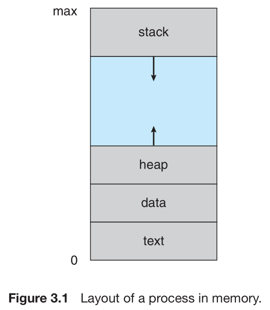
</div>

differences between program and process:
* Program: passive entity stored on disk (executable file)
* Process: active

Program becomes process when executable file loaded into memory

Although two processes may be associated with the same program, they are nevertheless considered two separate execution sequences.(One process can be several processes.)

<div align=center>
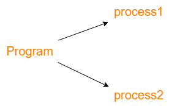
</div>

### Process State

As a process executes, it changes state
* **New**: The process is being created
* **Running**: Instructions are being executed
* **Waiting**: The process is waiting for some event to occur
* **Ready**: The process is waiting to be assigned to a processor
* **Terminated**: The process has finished execution

<div align=center>

</div>

### Process Control Block
进程控制块

Each process is represented in the operating system by a *process control block* (PCB)—also called a task control block.
* **Process id** .就是PID.每个Process都有独立的PID.
* **Process state**. The state may be new, ready, running, waiting, halted, and so on.
* **Program counter**. The counter indicates the address of the next instruction to be executed for this process.（从其他process转到这个process的时候，PC需要知道应该从哪条指令开始执行）
* **CPU registers** . contents of all process-centric registers
* **Accounting information**.:有关用户信息的
* **I/O status information**. This information includes the list of I/O devices allocated to the process, a list of open files, and so on.

In brief, the PCB simply serves as the repository for all the data needed to start, or restart, a process, along with some accounting data.(储存和进程相关的信息)

### Threads

把一个Process拆分成很多Thread在多核执行.

Most modern operating systems have extended the process concept to allow a process to have multiple threads of execution and thus to perform more than one task at a time.

This feature is especially beneficial on multicore systems, where multiple threads can run in parallel. 

The PCB is expanded to include information for each thread.

## Process Scheduling

The process control block in the Linux operating system is represented by the C structure `task_struct`. Some of these fields include:
```c
long state; /* state of the process */
struct sched_entity se; /* scheduling information */
struct task_struct *parent; /* this process’s parent */
struct list_head children; /* this process’s children */
struct files_struct *files; /* list of open files */
struct mm_struct *mm; /* address space */
```

Within the Linux kernel, all active processes are represented using a doubly linked list of `task_struct`.

<div align=center>
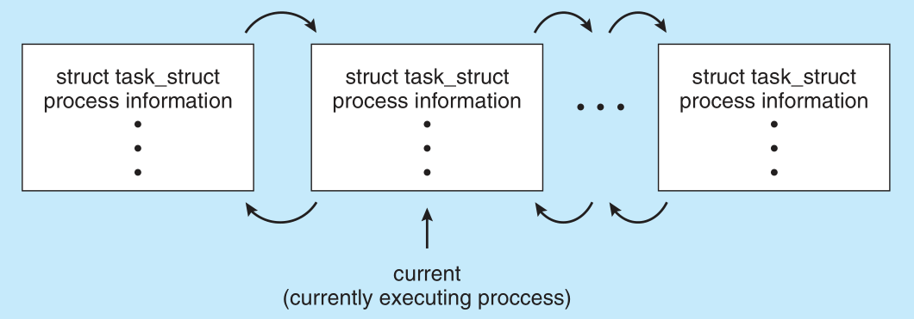
</div>

### Scheduling Queues
As processes enter the system, they are put into a *ready queue*.
The system also includes other queues. When a process is allocated a CPU core, it executes for a while and eventually *terminates*, is interrupted, or *waits* for the occurrence of a particular event.

A common representation of process scheduling is a queueing diagram. Two types of queues are present.

<div align=center>
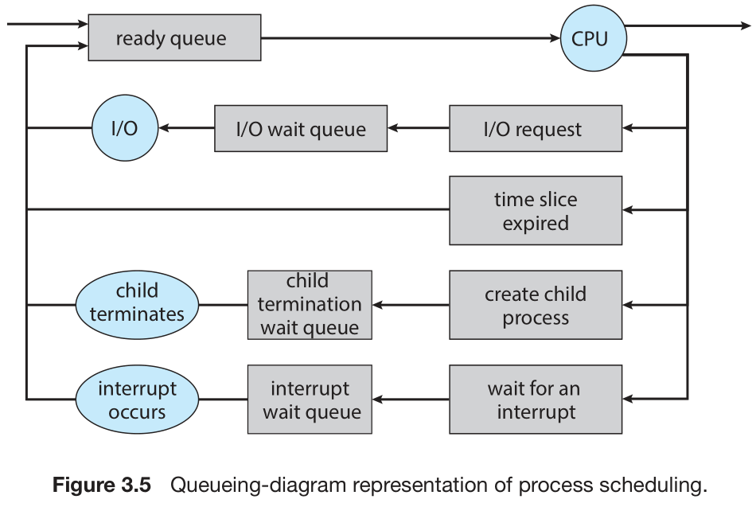
</div>

In the first two cases, the process eventually switches from the waiting state to the ready state and is then put back in the ready queue. A process continues this cycle until it terminates.

### Context Switch
Save the current *context* of the process running on the CPU core so that it can restore that context when its processing is done.

The context is represented in the PCB of the process. (和前面的PCB内容相照应.)

Context-switch time is pure overhead, because the system does no useful work while switching.(切换需要浪费一定时间)

<div align=center>
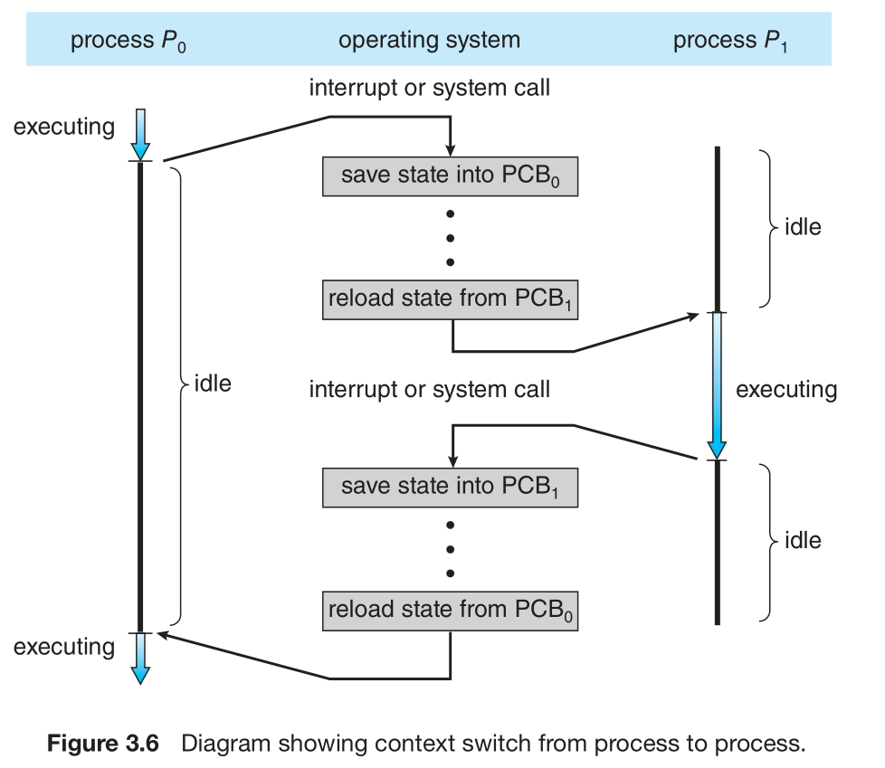
</div>

Also, the more complex the operating system, the greater the amount of work that must be done during a context switch.

## Operation on Process

### Process Creation

Parent process create children processes, which, in turn create other processes, forming a tree of processes

Generally, process identified and managed via a process identifier (pid)

<div align=center>
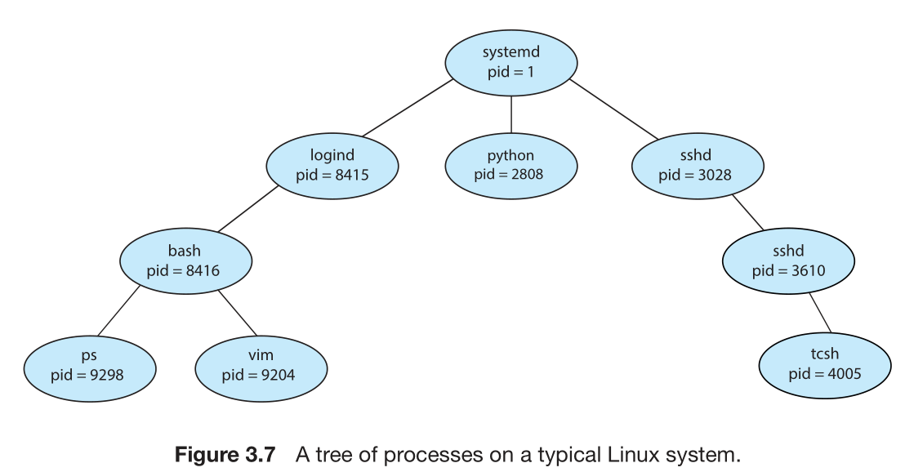
</div>

Resource sharing options
* Parent and children share all resources
* Children share subset of parent’s resources
* Parent and child share no resources

Execution options
* Parent and children execute concurrently
* Parent waits until children terminate

(上面两段老师没讲)

Address space
* Child duplicate of parent.(使用相同的程序和数据)
* Child has a program loaded into it.(重新加载)

A new process is created by the `fork()` system call.The new process consists of a copy of the address space of the original process.(复制地址空间?)

Both processes (the parent and the child) continue execution at the instruction after the `fork()`, with one difference:
* child: return zero
* parent: return nonzero

After a `fork()` system call, one of the two processes typically uses the `exec()` system call to replace the process’s memory space with a new program.(在fork之后使用exec,用于重新加载一个程序进来.)

```c
#include <sys/types.h>
#include <stdio.h>
#include <unistd.h>
int main()
{
    pid_t pid; 

    /* fork a child process */
    pid = fork();

    if (pid < 0) { /* error occurred */
        fprintf(stderr, "Fork Failed");
        return 1;
    }
    else if (pid == 0) { /* child process */
        execlp("/bin/ls","ls",NULL);    
    }
    else { /* parent process */
        /* parent will wait for the child to complete */
        wait(NULL);
        printf("Child Complete");
    }
    return 0;
}
```

The child process then overlays its address space with the UNIX command `/bin/ls` (used to get a directory listing)(这里执行了一个新的process) using the `execlp()` system call (`execlp()` is a version of the `exec()` system call).  The parent waits for the child process to complete with the `wait()` system call.(然后父程序`wait()`等待子程序完成)

<div align=center>
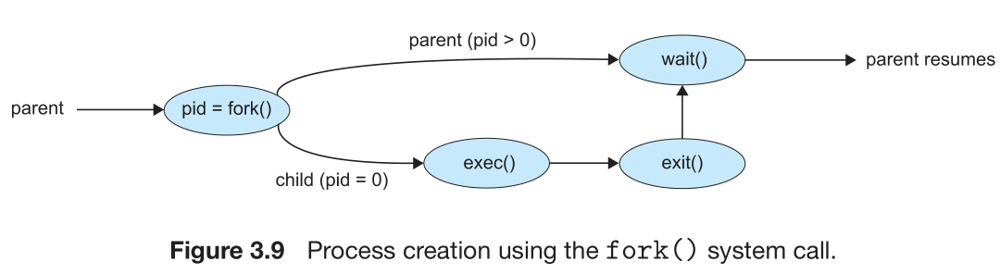
</div>

### Process Termination
Process executes last statement and then asks the operating system to delete it using the `exit()` system call.
* Returns *status data* from child to parent (via `wait()`)
* Process’ resources are deallocated by operating system

A parent may terminate the execution of one of its children using the `abort()` system call for a variety of reasons, such as these:(父进程终止子进程原因)
* The child has exceeded its usage of some of the resources that it has been allocated. (To determine whether this has occurred, the parent must have a mechanism to inspect the state of its children.)
* The task assigned to the child is no longer required.
* The parent is exiting, and the operating system does not allow a child to continue if its parent terminates.

<div align=center>
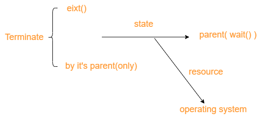
</div>

*cascading termination*: Some systems do not allow a child to exist if its parent has terminated.(父进程停止,子进程也停止,大多数操作系统如Linux,Windows是如此)

```c
pid_t pid;
int status;
...
pid = wait(&status);
```

This system call also returns the process identifier of the terminated child so that the parent can tell which of its children has terminated $\Uparrow$


* *zombie process*: A process that has terminated, but whose parent has not yet called `wait()`.
* *orphans*: Now consider what would happen if a parent did not invoke `wait()` and instead terminated

## Interprocess Communication

Processes within a system may be independent or cooperating(>95\%)

<!-- * Cooperating process can affect or be affected by other processes, including sharing data -->
Reasons for cooperating processes:
* **Information sharing**: several applications may be interested in the same piece of information
* **Computation speedup**: break a task into subtasks, each of which will be executing in parallel with the others.(achieved only if the computer has multiple processing cores.)
* **Modularity**

Cooperating processes need *interprocess communication (IPC)*

Two models of IPC
* Shared memory(共享内容): faster, for system calls are required only to establish shared-memory regions, without kernel intervention.
* Message passing(消息传递): useful for exchanging smaller amounts of data。（内核管理消息传递）

<div align=center>
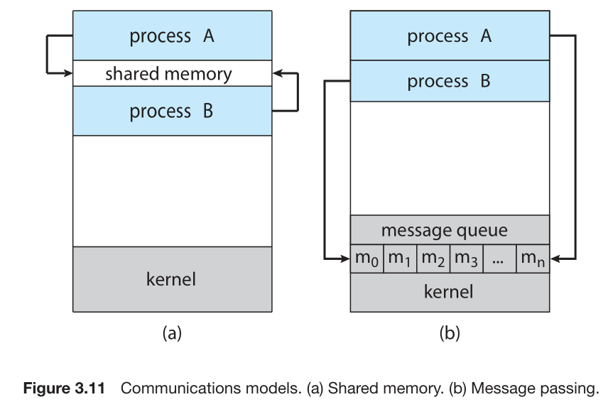
</div>

## IPC in Shared-Memory Systems
*Producer-Consumer Problem*:
<div align=center>
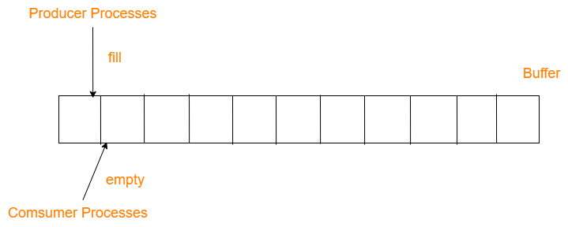
</div>

* **unbounded-buffer** places no practical limit on the size of the buffer
* **bounded-buffer** assumes that there is a fixed buffer size(实际情况)

```c
#define BUFFER_SIZE 10
typedef struct {
. . .
} item;
item buffer[BUFFER_SIZE];
int in = 0;
int out = 0;
```
The producer process:
```c
item next_produced;
while (true) {
    /* produce an item in next produced */
    while (((in + 1) % BUFFER_SIZE) == out)
        ; /* do nothing */
    buffer[in] = next_produced;
    in = (in + 1) % BUFFER_SIZE;
}
```
The consumer process:
```c
item next_consumed;
while (true) {
    while (in == out)
        ; /* do nothing */
    next_consumed = buffer[out];
    out = (out + 1) % BUFFER_SIZE;
    /* consume the item in next consumed */
}
```

One issue this illustration does not address concerns the situation in which both the producer process and the consumer process attempt to access the shared buffer concurrently. (但老师说的好像是多个producer同时access同一个buffer的情况？)

## IPC in Message-Passing Systems
（主流使用）
Mechanism for processes to communicate and to synchronize their actions

IPC facility provides two operations:
* send(message)
* receive(message)

If processes P and Q wish to communicate, they need to:
* Establish a *communication link* between them（通信的时候建立，不通信的时候回收）
* Exchange messages via send/receive

We are concerned here not with the link’s physical implementation but rather with its logical implementation. 
• Direct or indirect communication
• Synchronous(并发性好，但是资源消耗快) or asynchronous(大量用户并发时，只能一个个响应) communication
• Automatic or explicit buffering

### Naming

***direct communication***:
each process that wants to communicate must explicitly name the recipient or sender of the communication
In this scheme, the `send()` and `receive()` primitives are defined as:
• `send(P, message)`—Send a message to process P.
• `receive(Q, message)`—Receive a message from process Q.

Properties:
• A link is established automatically between every pair of processes that want to communicate. The processes **need to know only each other’s identity** to communicate.
• A link is associated with exactly two processes.
• Between each pair of processes, there **exists exactly one link**.

***indirect communication***:
the messages are sent to and received from ***mailboxes***, or ***ports***.Each mailbox has a unique identification.

The `send()` and `receive()` primitives are defined as follows:
• `send(A, message)`—Send a message to mailbox A.
• `receive(A, message)`—Receive a message from mailbox A.

Properties:
• A link is established between a pair of processes only if both members of the pair have a shared mailbox.
• A link may be associated with more than two processes.
• Between each pair of communicating processes, a number of different links may exist, with each link corresponding to one mailbox.
<div align=center>
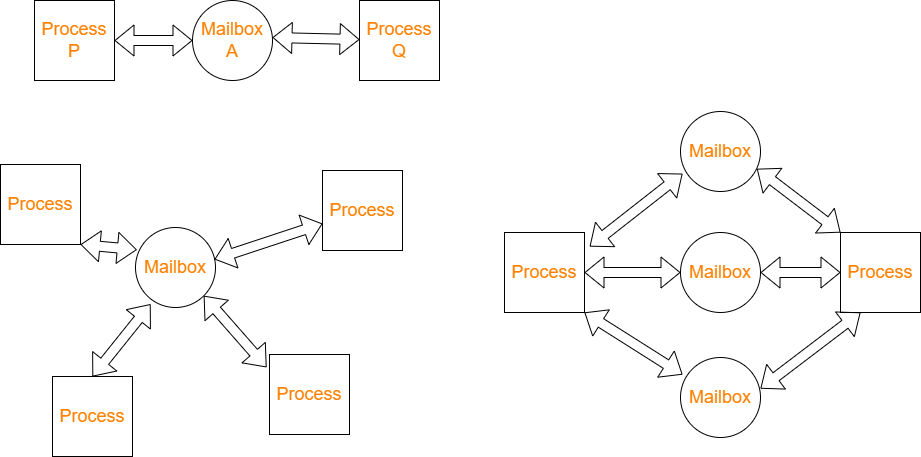
</div>

Now suppose that processes P1, P2, and P3 all share mailbox A. Process P1 sends a message to A, while both P2 and P3 execute a `receive()` from A. Which process will receive the message sent by P1?(通信间相互影响：谁来接受信息？)
• Allow a link to be associated with two processes at most.
• Allow at most one process at a time to execute a `receive()` operation.
• Allow the system to select arbitrarily which process will receive the message。

A mailbox may be owned either by a process or by the operating system.

### Synchronization
Message passing may be either *blocking* or *nonblocking*—also known as *synchronous* and *asynchronous*.
• **Blocking send**. The sending process is blocked until the message is received by the receiving process or by the mailbox.
• **Nonblocking send**. The sending process sends the message and resumes operation.
• **Blocking receive**. The receiver blocks until a message is available.
• **Nonblocking receive**. The receiver retrieves either a valid message or a null.
Blocking 能保证某个消息的实时性，但是会影响到其他消息的发送与接受。

## Examples of IPC Systems 
### Windows
Windows provides support for multiple operating environments, or *subsystems*.Application programs can be considered clients of a subsystem server.

The message-passing facility in Windows is called the ***advanced local procedure call (ALPC)*** facility.(本地通信)
Windows uses **a port object** to establish and maintain a connection between two processes. Windows uses two types of ports: ***connection ports*** and ***communication ports***.
<div align=center>
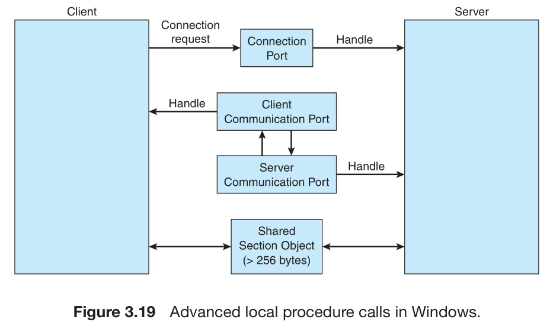
</div>

LPC和RPC主要用于处理message,更大的file和stream需要使用pipe传输。

### Pipes
#### Ordinary Pipes
Ordinary Pipes allow communication in standard **producer- consumer style**.Producer writes to one end (the write-end of the pipe).Consumer reads from the other end (the read-end of the pipe).Ordinary pipes are therefore unidirectional.

Typically, a parent process creates a pipe and uses it to communicate with a child process that it creates via `fork()`.

