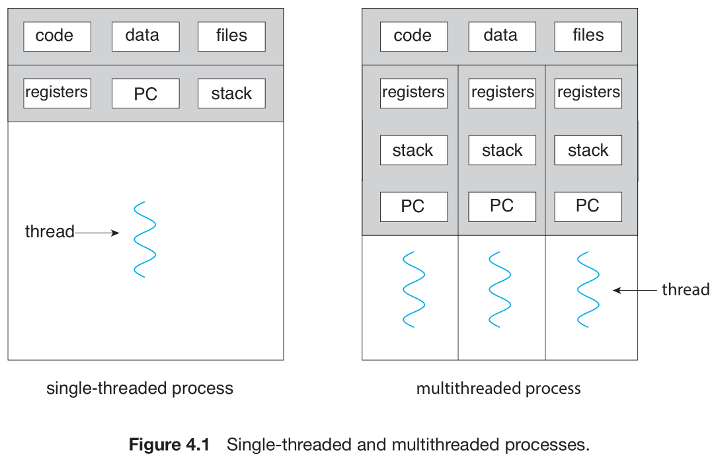
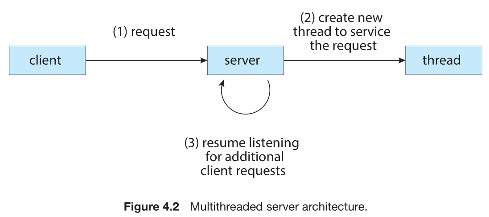
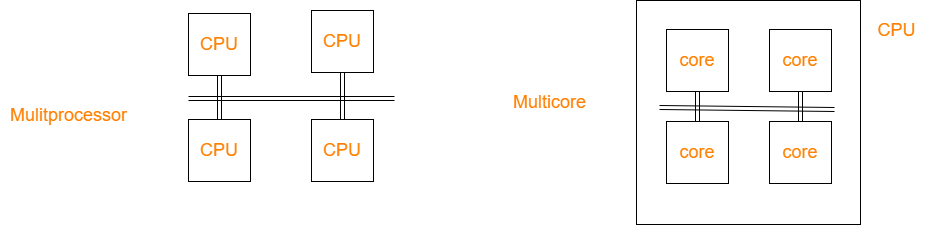
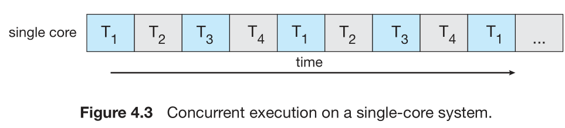
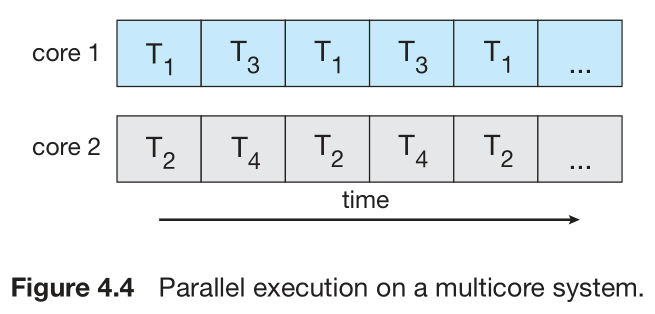
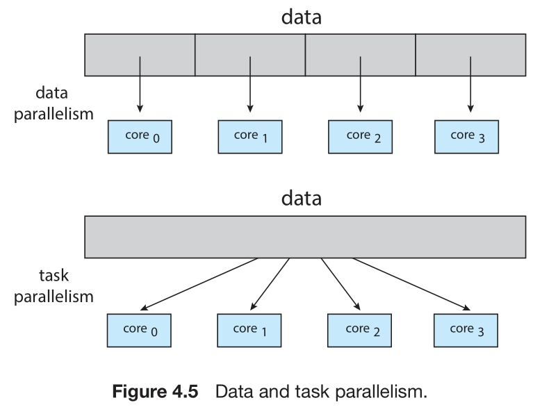
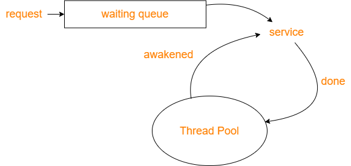
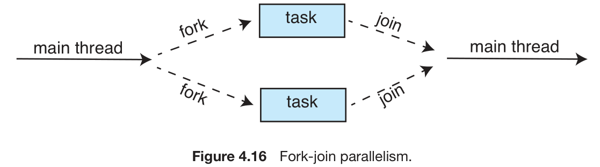
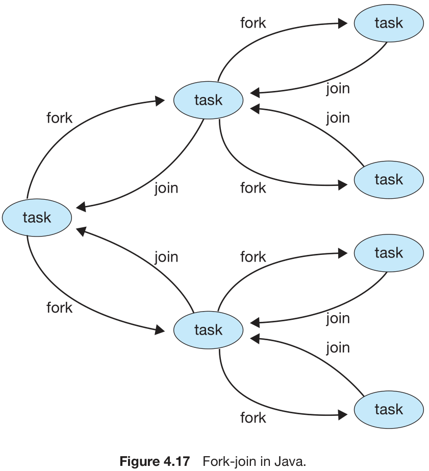

## Overview
### Motivation
Most software applications that run on modern computers and mobile devices are multithreaded.
Example:A word processor may have a thread for displaying graphics, another thread for responding to keystrokes from the user, and a third thread for performing spelling and grammar checking in the background.

<div align=center>

</div>

创建新的线程不用重新分配memory。

Application:
A busy web server may have several (perhaps thousands of) clients concurrently accessing it. Process creation is time consuming and resource intensive, however. It is generally more efficient to use one process that contains multiple threads.When a request is made, rather than creating another process, the server creates a new thread to service the request and resumes listening for additional requests.（就是说对于这种相同的task，使用thread来处理任务更加合理）
<div align=center>

</div>

Most operating system kernels are also typically multithreaded.

### Benifits
* **Responsiveness**.
* **Resource sharing**. threads share the memory and the resources of the process to which they belong by default.
* **Economy**.
* **Scalability**.The benefits of multithreading can be even greater in a multiprocessor architecture, where threads may be running in parallel on different processing cores. 

## Multicore Programming
Multicore and multiprocessor:
<div align=center>

</div>

The distinction between concurrency and parallelism:
<div align=center>


</div>

### Programming Challenges
* **Identifying tasks**. find areas that can be divided into separate, concurrent tasks.
* **Balance**. ensure that the tasks perform equal work of equal value.
* **Data splitting**.
* **Data dependency**.When one task depends on data from another, programmers must ensure that the execution of the tasks is synchronized to accommodate the data dependency. 
* **Testing and debugging**.

### Types of Parallelism
In general, there are two types of parallelism: ***data parallelism*** and ***task parallelism***.
<div align=center>

</div>

## Multithreading Models
However, support for threads may be provided either at the user level, for ***user threads***, or by the kernel, for ***kernel threads***. User threads are supported above the kernel and are managed without kernel support, whereas kernel threads are supported and managed directly by the operating system.
* **Many-to-One Model**: It's efficient. However, the entire process will block if a thread makes a blocking system call. And multiple threads are unable to run in parallel on multicore systems. 
* **One-to-One Model**: 
  * The only drawback to this model is that creating a user thread requires creating the corresponding kernel thread, and a large number of kernel threads may burden the performance of a system. 
  * Linux, along with the family of Windows operating systems, implement the one-to-one model.
* **Many-to-Many Model**
* **Two-level model**

## Thread Libraries
There are two primary ways of implementing a thread library.
* provide a library entirely in user space with no kernel support.
* implement a kernel-level library supported directly by the operating system.(Invoking a function in the API for the library typically results in a system call to the kernel.)

Three main thread libraries are in use today: POSIX Pthreads, Windows, and Java. 
Java: implemente using 
* Windows
  * kernel-level
* POSIX
  * user-level
  * kernel-level

Two general strategies for creating multiple threads: 
* **asynchronous threading**: the parent resumes its execution, typically little data sharing between parent and child.
* **synchronous threading**: occurs when the parent thread creates one or more children and then must wait for all of its children to terminate before it resumes. Typically, synchronous threading involves significant data sharing among threads.

### Pthreads
```c
#include <pthread.h> // thread library
#include <stdio.h>
#include <stdlib.h>
int sum; /* this data is shared by the thread(s) */
void *runner(void *param); /* threads call this function */
int main(int argc, char *argv[])
{
  pthread_t tid; /* the thread identifier */
  pthread_attr_t attr; /* set of thread attributes */
  /* set the default attributes of the thread */
  pthread_attr_init(&attr); // default attributes
  /* create the thread */
  pthread_create(&tid, &attr, runner, argv[1]); // pass the identifier, attributes, 
  // where new thread will begin, the parameter provieded by the command line.
  // only one thread is created there
  /* wait for the thread to exit */
  pthread_join(tid,NULL);
  printf("sum = %d∖n",sum);
}
/* The thread will execute in this function */
void *runner(void *param)
{
  int i, upper = atoi(param);
  sum = 0;
  for (i = 1; i <= upper; i++)
    sum += i;
  pthread exit(0);
}
```
This example program above creates only a single thread.

A simple method for waiting on several threads using the pthread join() function is to enclose the operation within a simple for loop. 
```c
#define NUM_THREADS 10

/* an array of threads to be joined upon */
pthread_t workers[NUM_THREADS];

for (int i = 0; i < NUM_THREADS; i++)
  pthread_join(workers[i], NULL);
```

## Implicit Threading
### Thread Pools
线程池
The general idea behind a thread pool is to create a number of threads at start-up and place them into a pool, where they sit and wait for work. 
<div align=center>

</div>

benefits:
1. often faster than waiting to create a thread.
2. limits the number of threads that exist at any one point. 
3. allows us to use different strategies for running the task. For example, the task could be scheduled to execute after a time delay or to execute periodically.

### Fork Join
Recall that with this method, the main parent thread creates (***forks***) one or more child threads and then waits for the children to terminate and ***join*** with it, at which point it can retrieve and combine their results. 

<div align=center>

</div>

Fork-join in java:
```java
Task(problem)
    if problem is small enough
      solve the problem directly
    else
        subtask1 = fork(new Task(subset of problem)
        subtask2 = fork(new Task(subset of problem)

        result1 = join(subtask1)
        result2 = join(subtask2)

        return combined results
```

<div align=center>

</div>