## Basic Concepts
In a system with a single CPU core, only one process can run at a time.

* Maximum CPU utilization obtained with multiprogramming
* CPU–I/O Burst Cycle -Process execution consists of a cycle of CPU execution and I/O wait
* CPU burst followed by I/O burst
* CPU burst distribution is of main concern

### CPU–I/O Burst Cycle
Process execution begins with a CPU burst. That is followed by an I/O burst, which is followed by another CPU burst, then another I/O burst, and so on.

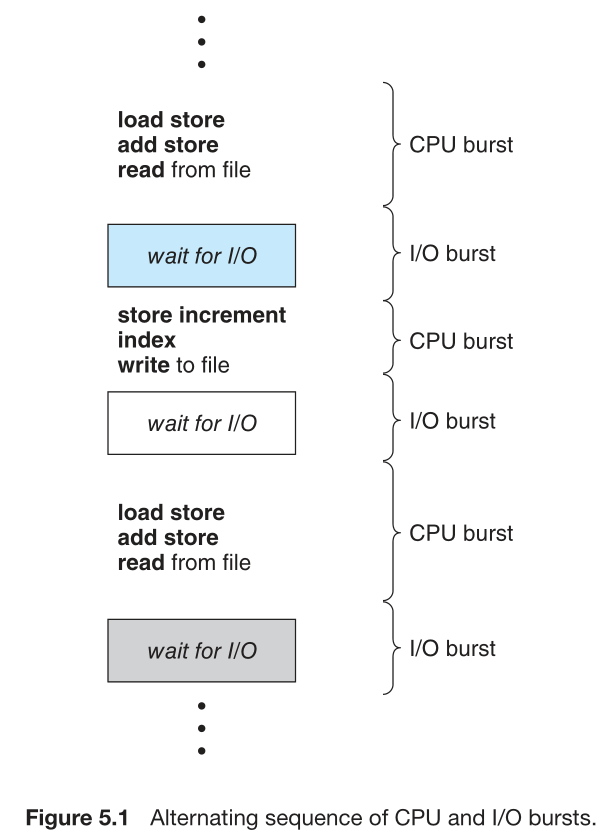

### CPU Scheduler
Whenever the CPU becomes idle, the operating system must select one of the processes in the ready queue to be executed. The selection process is carried out by the ***CPU scheduler***.

### Preemptive and Nonpreemptive Scheduling
CPU-scheduling decisions may take place under the following four circumstances:
1. When a process switches from the running state to the waiting state (for example, as the result of an I/O request or an invocation of `wait()` for the termination of a child process)
2. When a process switches from the running state to the ready state (for example, when an interrupt occurs)
3. When a process switches from the waiting state to the ready state (for example, at completion of I/O)
4. When a process terminates

When scheduling takes place only under circumstances 1 and 4, we say that the scheduling scheme is ***nonpreemptive***(非抢占式) or *cooperative*. Otherwise, it is ***preemptive***(抢占式). 

Virtually all modern operating systems including Windows, macOS, Linux, and UNIX use **preemptive** scheduling algorithms.

### Dispatcher
(调度程序)
The ***dispatcher*** is the module that gives control of the CPU’s core to the process selected by the CPU scheduler. This function involves the following:
• Switching context from one process to another
• Switching to user mode
• Jumping to the proper location in the user program to resume that program

The time it takes for the dispatcher to stop one process and start another running is known as the ***dispatch latency***.

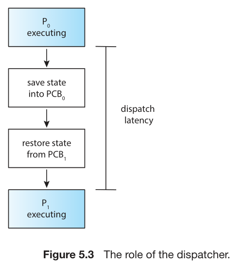

## Scheduling Criteria
* **CPU utilization.**
* **Throughput.**(吞吐率) One measure of work is the number of processes that are completed per time unit, called throughput.
* **Turnaround time.**（周转时间）The interval from the time of submission of a process to the time of completion is the turnaround time. 
* **Waiting time.**(等待时间) Waiting time is the sum of the periods spent waiting in the ready queue.
* **Response time.**(响应时间)This measure, called response time, is the time it takes to start responding, not the time it takes to output the response.

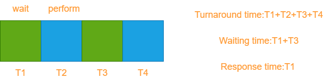

## Scheduling Algorithms
Although most modern CPU architectures have multiple processing cores, we describe these scheduling algorithms in the context of **only one processing core available.** 

### First-Come, First-Served Scheduling(FCFS)
Also fist-in, first-out.(FIFO)

优点：容易实现
缺点：长任务在前面会占用太多时间

### Shortest-Job-First Scheduling(SJF)
非抢占式
When the CPU is available, it is assigned to the process that has the smallest next CPU burst. 

Preemptive SJF scheduling is sometimes called ***shortest-remaining-time-first scheduling***.(SRTF,考虑剩余时间，抢占式)

### Round-Robin Scheduling(RR)
轮转/轮循；适用于前端应用，平均响应时间最短；类似CPU并发。
A small unit of time, called a ***time quantum*** or *time slice*, is defined. A time quantum is generally from 10 to 100 milliseconds in length.

The performance of the RR algorithm depends heavily on the size of the time quantum.

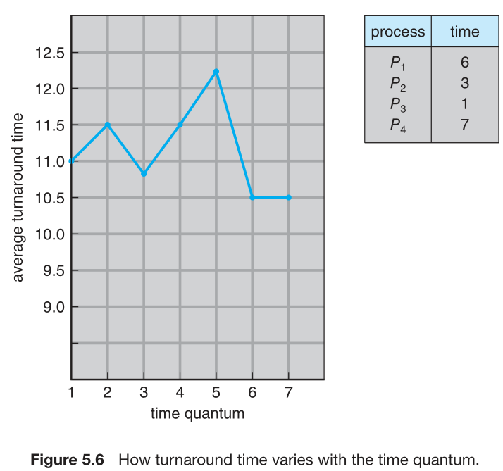

We want the time quantum to be large with respect to the context-switch time.A rule of thumb is that **80 percent** of the CPU bursts should be shorter than the time quantum.

### Priority Scheduling
A priority is associated with each process, and the CPU is allocated to the process with the highest priority.(The SJF algorithm is a *special* case of the general priority-scheduling algorithm.)

Priority scheduling can be either preemptive or nonpreemptive.(但大多数是抢占式)

A major problem with priority scheduling algorithms is indefinit blocking, or ***starvation***.(某些程序因为有限集过低而一直无法被执行)A solution to the problem of indefinite blockage of low-priority processes is ***aging***. Aging involves gradually increasing the priority of processes that wait in the system for a long time.(让优先级随着等待时间的延长而增加)

### Multilevel Queue Scheduling
使用多种算法
This approach—known as ***multilevel queue***—also works well when **priority scheduling** is combined with **round-robin**.

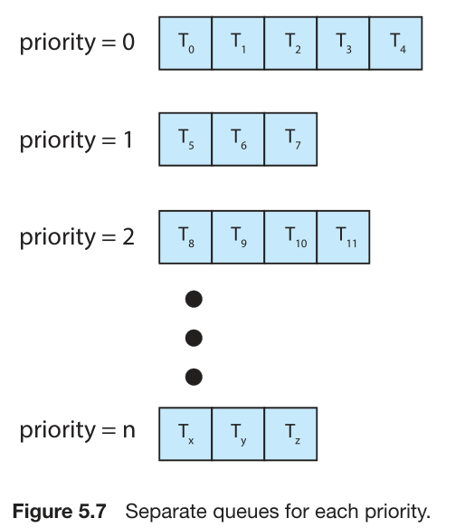

Prioritization based upon process type

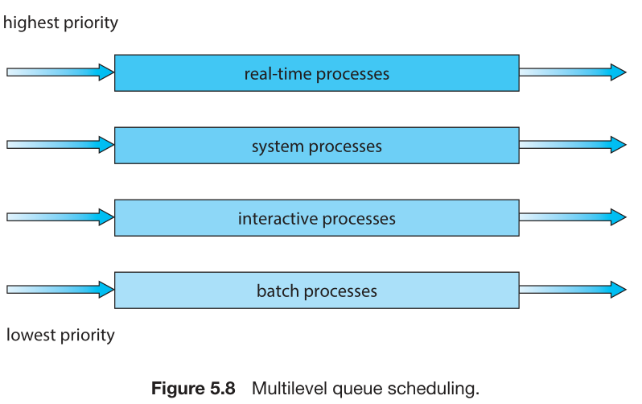

### Multilevel Feedback Queue Scheduling
Multilevel-feedback-queue scheduler defined by the following parameters:
* number of queues
* scheduling algorithms for each queue
* method used to determine when to upgrade a process
* method used to determine when to demote a process
* method used to determine which queue a process will enter when that process needs service

Example:

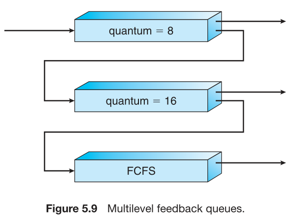

Scheduling
* A new job enters queue $Q_0$ which is served FCFS
  * When it gains CPU, job receives 8 milliseconds
  * If it does not finish in 8 milliseconds, job is moved to queue $Q_1$
* At $Q_1$ job is again served FCFS and receives 16 additional milliseconds
  * If it still does not complete, it is preempted and moved to queue $Q_2$

## Thread Scheduling
### Contention Scope
Known as ***process-contention scope (PCS)*** since scheduling competition is within the process

Kernel thread scheduled onto available CPU is ***system-contention scope (SCS)*** – competition among all threads in system

### Pthread Scheduling
(老师讲的太快了)

## Multi-Processor Scheduling
***asymmetric multiprocessing***:所有工作交给master server
***symmetric multiprocessing (SMP)*** :where each processor is self-scheduling.

two possible strategies for organizing the threads eligible to be scheduled:
1. All threads may be in a common ready queue.
2. Each processor may have its own private queue of threads.

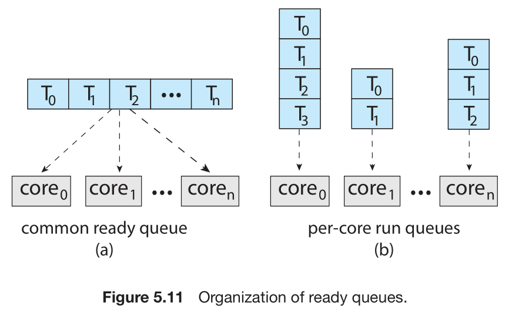

Virtually all modern operating systems support SMP

### Multicore Processors
Each core maintains its architectural state and thus appears to the operating system to be a separate **logical CPU**.

When a processor accesses memory, it spends a significant amount of time waiting for the data to become available. This situation, known as a ***memory stall***. (就是等数据要花很长时间)The processor can spend up to 50 percent of its time waiting for data to become available from memory.

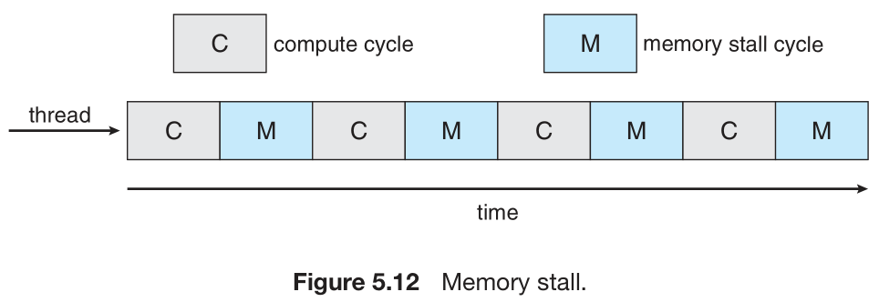

To remedy this situation, many recent hardware designs have implemented **multithreaded processing cores** in which two (or more) ***hardware threads*** are assigned to each core. That way, if one hardware thread stalls while waiting for memory, the core can switch to another thread.

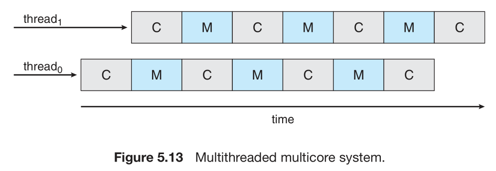

From an operating system perspective, each hardware thread  appears as a logical CPU that is available to run a software thread.This technique known as ***chip multithreading*** (CMT).

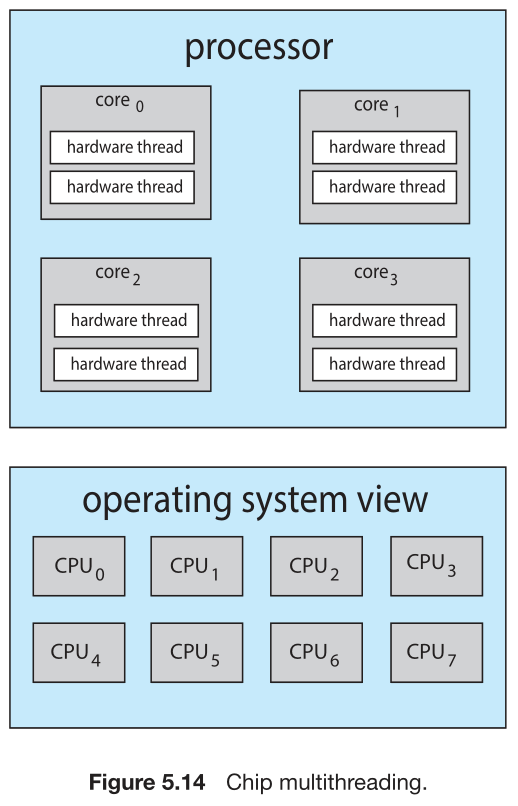

It is important to note that the resources of the physical core (such as caches and pipelines) must be shared among its hardware threads, and therefore a processing core can **only execute one hardware thread at a time**.

### Load Balancing
***push migration***
***Pull migration***

### Processor Affinity
(讲的很草率)

## Operating-System Examples
### Linux Scheduling
* Prior to Version 2.5:traditional UNIX scheduling algorithm. poor performance.
* With Version 2.5 of the kernel:scheduling algorithm—known as O(1),increased support for SMP systems,poor response times
for the interactive processes
* in release 2.6.23 of the kernel:***Completely Fair Scheduler (CFS)*** became the default Linux scheduling algorithm.

## Algorithm Evaluation
### Deterministic Modeling、Queueing Models
建模
### Simulations
仿真
### Implementation
实现