A ***cooperating process*** is one that can affect or be affected by other processes executing in the system. Cooperating processes can either directly share a logical address space (that is, both code and data) or be allowed to share data only through shared memory or message passing.(就是有些程序并行的时候会相互影响，感觉有点像data hazard?)

## Background
We illustrated this model with the producer–consumer problem

The code for the producer process can be modified as follows:
```c
while (true) {
    /* produce an item in next produced */

    while (count == BUFFER_SIZE)
        ; /* do nothing */

    buffer[in] = next_produced;
    in = (in + 1) % BUFFER_SIZE;
    count++;
}
```

The code for the consumer process can be modified as follows:
```c
while (true) {
    while (count == 0)
        ; /* do nothing */

    next_consumed = buffer[out];
    out = (out + 1) % BUFFER SIZE;
    count--;

    /* consume the item in next consumed */
}
```

<div align=center>
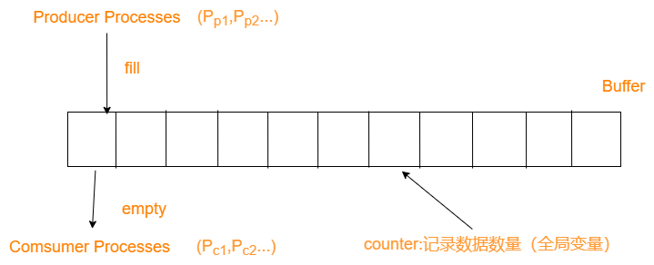
</div>

Note that the statement `count++` may be implemented in machine language (on a typical machine) as follows:
```
register1 = count
register1 = register1 + 1
count = register1
```
Similarly, the statement `count--` is implemented as follows:
```
register2 = count
register2 = register2 − 1
count = register2
```
The concurrent execution of “count++” and “count--” is equivalent to a sequential execution in which the lower-level statements presented previously are interleaved in some arbitrary order. One such interleaving is the following:

<div align=center>
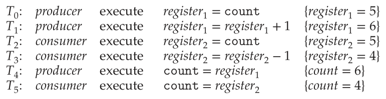
</div>

***race condition***(竞态):several processes access and manipulate the same data concurrently and the outcome of the execution depends on the particular order in which the access takes place.

总的来说，就是两段并行代码同时访问同一段内存，所以出bug了。

Because of the importance of this issue, we devote a major portion of this chapter to **process synchronization** and coordination among cooperating processes.

## The Critical-Section Problem
Consider a system consisting of n processes {P0, P1, ..., Pn−1}. Each process has a segment of code, called a ***critical section***(临界区), in which the process may be accessing — and updating — data that is shared with at least one other process. 

<div align=center>
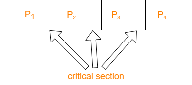
</div>

The general structure of a typical process：
<div align=center>
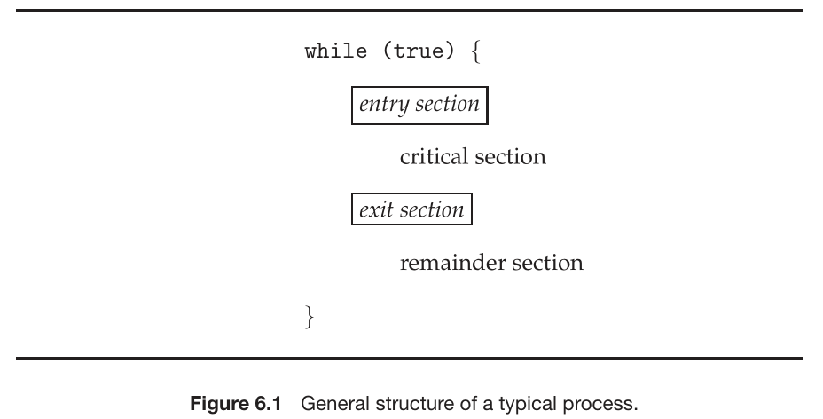
</div>

A solution to the critical-section problem must satisfy the following three requirements:
1. **Mutual exclusion**. If process Pi is executing in its critical section, then no other processes can be executing in their critical sections.
2. **Progress**. decide which will enter its critical section next, and this selection cannot be postponed indefinitely.(决定下一个执行critical section的程序)
3. **Bounded waiting**. There exists a bound, or limit, on the number of times that other processes are allowed to enter their critical sections after a process has made a request to enter its critical section and before that request is granted.(有限等待，防止 starving)

Another example:
In this example, there is a race condition on the variable kernel variable `next_available_pid`which represents the value of the next available process identifier. Unless mutual exclusion is provided, it is possible the same process identifier number could be assigned to two separate processes.

<div align=center>
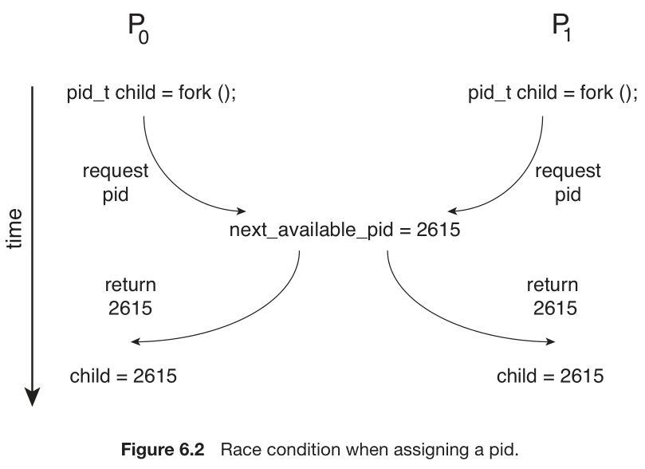
</div>

Two approaches depending on if kernel is preemptive or non-preemptive
* Preemptive – allows preemption of process when running in kernel mode
* Non-preemptive – runs until exits kernel mode, blocks, or voluntarily yields CPU
  * Essentially free of race conditions in kernel mode, as only one process is active in the kernel at a time.

A preemptive kernel may be more responsive. Furthermore, a preemptive kernel is more suitable for real-time programming.

## Peterson’s Solution
### Assumption
* Peterson’s solution is restricted to two processes that alternate execution between their critical sections and remainder sections.(两个进程)
* Assume that the load and store machine-language instructions are atomic; that is, cannot be interrupted.
* Peterson’s solution requires the two processes to share two data items:`int turn;`,`boolean flag[2];`

### Algorithm
The structure of process $P_i$ in Peterson’s solution.
```c
while (true) {
    flag[i] = true;
    turn = j;
    while (flag[j] && turn == j)
        ;

        /* critical section */
    flag[i] = false;

        /*remainder section */
}
```

We now prove that this solution is correct. We need to show that:
1. Mutual exclusion is preserved.`while (flag[j] && turn == j)`
2. The progress requirement is satisfied.`flag[i] = false;`
3. The bounded-waiting requirement is met.(一个进程的critical section只会执行一次)

### Bug
Processors and/or compilers may reorder read and write operations that have no dependencies. For a multithreaded application with shared data, the reordering of instructions may render inconsistent or unexpected results.(为了优化编译器的调换代码顺序的操作会导致问题)

Example:
Consider the following data that are shared between two threads:
```c
boolean flag = false;
int x = 0;
```

where Thread 1 performs the statements
```c
while (!flag)
;
print x;
```

and Thread 2 performs
```c
x = 100;
flag = true;
```

* It is possible that a processor may reorder the instructions for Thread 2 so that flag is assigned true before assignment of `x = 100`. In this situation, it is possible that Thread 1 would output 0 for variable `x`. 
* The processor may also reorder the statements issued by Thread 1 and load the variable `x` before loading the value of `flag`.

Consider what happens if the assignments of the first two statements that appear in the entry section of Peterson’s solution are reordered(`turn`和`flag`对应操作调换顺序); it is possible that **both threads may be active in their critical sections at the same time**, as shown in Figure 6.4.
<div align=center>
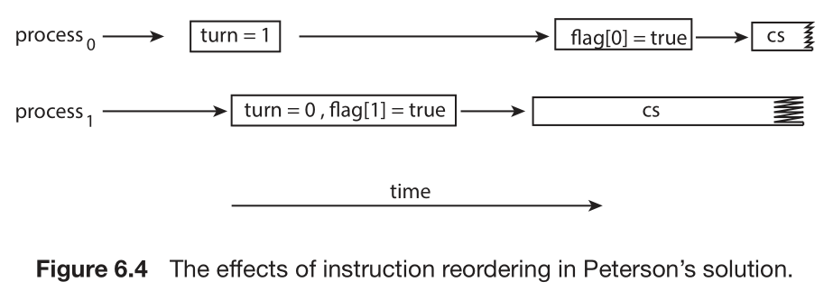
</div>

The only way to preserve mutual exclusion is by using proper synchronization tools.
<div align=center>
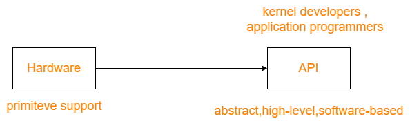
</div>

## Hardware Support for Synchronization
As discussed, software-based solutions are not guaranteed to work on modern computer architectures. In this section, we present three hardware instructions that provide support for solving the critical-section problem. (单独软件无法解决问题，需要硬件协同)

### Memory Barriers
***memory model***: How a computer architecture determines what memory guarantees it will provide to an application program.
1. **Strongly ordered**, where a memory modification on one processor is immediately visible to all other processors.
2. **Weakly ordered**, where modifications to memory on one processor may not be immediately visible to other processors.

***memory barriers***(memory fences): can force any changes in memory to be propagated to all other processors, thereby ensuring that memory modifications are visible to threads running on other processors. 

When a memory barrier instruction is performed, the system ensures that all loads and stores are completed before any subsequent load or store operations are performed.
<div align=center>

</div>

Example:
If we add a memory barrier operation to Thread 1
```c
while (!flag)
    memory_barrier();
print x;
```

we guarantee that the value of `flag` is loaded before the value of `x`.
Similarly, if we place a memory barrier between the assignments performed by Thread 2
```c
x = 100;
    memory_barrier();
flag = true;
```

we ensure that the assignment to `x` occurs before the assignment to `flag`.

Memory barriers are considered very low-level operations and are typically only used by kernel developers when writing specialized code that ensures mutual exclusion.(通常作为底层被调用)

### Hardware Instructions
Many modern computer systems provide *special hardware instructions* that allow us either to test and modify the content of a word or to swap the contents of two words ***atomically***—that is, as one **uninterruptible unit**.

The definition of the atomic `test_and_set()` instruction
```c
boolean test_and_set(boolean *target) {
    boolean rv = *target;
    *target = true;
    return rv;
}
```

If the machine supports the `test_and_set()` instruction, then we can implement mutual exclusion by declaring a boolean variable lock, initialized to `false`.
```c
do {
    while (test_and_set(&lock))
        ; /* do nothing */
        /* critical section */
    lock = false;
        /* remainder section */
} while (true);
```

**Another instruction**
The definition of the *atomic* `compare_and_swap()` instruction (CAS).
```c
int compare_and_swap(int *value, int expected, int new_value) {
    int temp = *value;

    if (*value == expected)
    *value = new_value;

    return temp;
}
```

Mutual exclusion with the `compare_and_swap()` instruction.
```c
while (true) {
    while (compare_and_swap(&lock, 0, 1) != 0)
        ; /* do nothing */
        /* critical section */
    lock = 0;
        /* remainder section */
}
```

**Bounded-waiting** mutual exclusion with `compare_and_swap()`, can satisfies *all the critical-section* requirements. 
```c
while (true) {
    waiting[i] = true;
    key = 1;
    while (waiting[i] && key == 1)
        key = compare_and_swap(&lock,0,1);
    waiting[i] = false;

        /* critical section */

    j = (i + 1) % n;
    while ((j != i) && !waiting[j])
        j = (j + 1) % n;

    if (j == i)
        lock = 0;
    else
        waiting[j] = false;

        /* remainder section */
}
```

### Atomic Variables
***atomic variable***: provides atomic operations on basic data types such as integers and booleans. 

Most systems that support atomic variables provide special atomic data types.(These functions are often implemented using `compare_and_swap()` operations.)

For example:`increment(&sequence);`
```c
void increment(atomic_int *v)
{
    int temp;

    do {
        temp = *v;
    }
    while (temp != compare_and_swap(v, temp, temp+1));
}
```

Do not entirely solve race conditions in all circumstances.

## Mutex Locks
Operating-system designers build higher-level software tools to solve the *critical-section problem*.The simplest of these tools is the ***mutex lock***. (In fact, the term mutex is short for mutual exclusion.)
<div align=center>
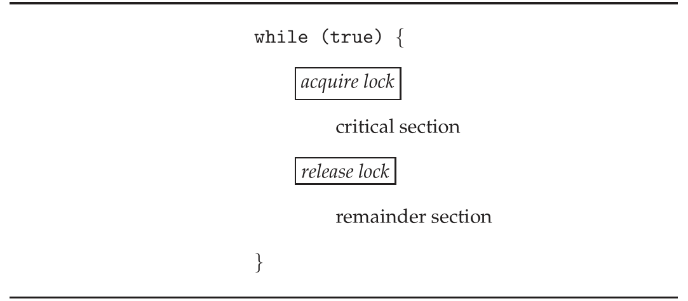
</div>

The definition of `acquire()` is as follows:
```c
acquire() {
    while (!available)
    ; /* busy wait */
    available = false;
}
```

The definition of `release()` is as follows:
```c
release() {
    available = true;
}
```

Calls to either `acquire()` or `release()` must be performed *atomically*.(Thus, mutex locks can be implemented using the CAS operation)

The main disadvantage:
***busy waiting***: While a process is in its critical section, any other process that tries to enter its critical section must loop continuously in the call to `acquire()`.(会导致其他CPU需要一直等待)

The type of mutex lock we have been describing is also called a ***spin-lock***(自旋锁) because the process “spins” while waiting for the lock to become available. 
<div align=center>
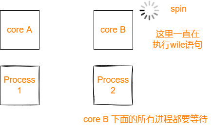
</div>

## Semaphores
A ***semaphore*** S is an integer variable that, apart from initialization, is accessed only through two standard atomic operations: `wait()` and `signal()`.

The definition of `wait()` is as follows:(相当于`acquire()`)
```c
wait(S) {
    while (S <= 0)
        ; // busy wait
    S--;
}
```

The definition of `signal()` is as follows:(相当于`release()`)
```c
signal(S) {
    S++;
}
```

All modifications to the integer value of the semaphore in the `wait()` and `signal()` operations must be executed *atomically*.

### Semaphore Usage
Operating systems often distinguish between counting and binary semaphores. 
***counting semaphore***: The value can range over an unrestricted domain. 
***binary semaphore***: The value can range only between 0 and 1. 

Counting semaphores can be used to control access to a given resource consisting of a finite number of instances.

### Semaphore Implementation
The definitions of the `wait()` and `signal()` semaphore operations just described suffers from busy waiting. To overcome this problem, we can modify the definition of the `wait()` and `signal()` operations as follows: Rather than engaging in busy waiting, the process can *suspend* itself when excuting `wait()`.
<div align=center>
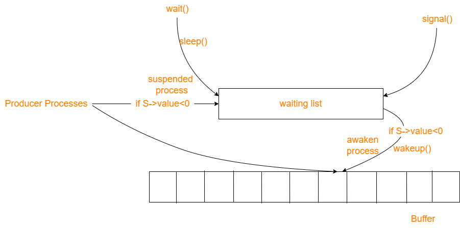
</div>

To implement semaphores under this definition, we define a semaphore as follows:
```c
typedef struct {
    int value;
    struct process *list;
} semaphore;
```

Now, the `wait()` semaphore operation can be defined as
```c
wait(semaphore *S) {
    S->value--;
    if (S->value < 0) {
        add this process to S->list;
        sleep();
    }
}
```

and the `signal()` semaphore operation can be defined as
```c
signal(semaphore *S) {
    S->value++;
    if (S->value <= 0) {
        remove a process P from S->list;
        wakeup(P);
    }
}
```

## Monitor

### Monitor Usage
The monitor construct:
```c
monitor monitor_name
{
    /* shared variable declarations */
    function P1 ( . . . ) {
        . . .
    }
    function P2 ( . . . ) {
        . . .
    }
        . . .
    function Pn ( . . . ) {
        . . .
    }
    initialization code ( . . . ) {
        . . .
    }
}
```

The monitor construct ensures that only one process at a time is active within the monitor. 
<div align=center>
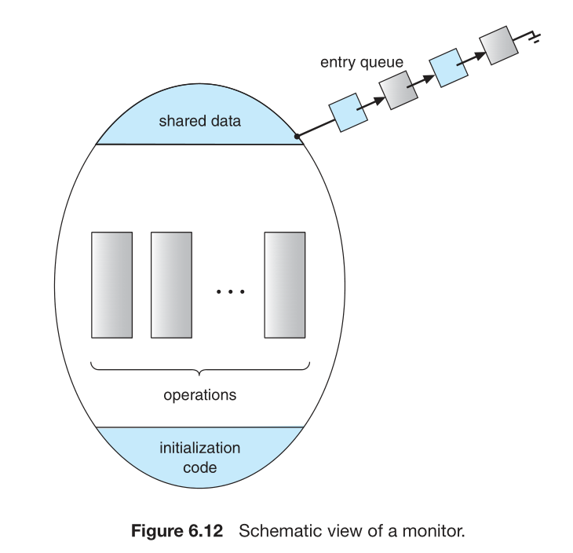
</div>

However, the monitor construct, as defined so far, is not sufficiently powerful for modeling some synchronization schemes.(一次只能执行一个进程)

For this purpose, we need to define additional synchronization mechanisms. These mechanisms are provided by the **condition** construct.

<div align=center>
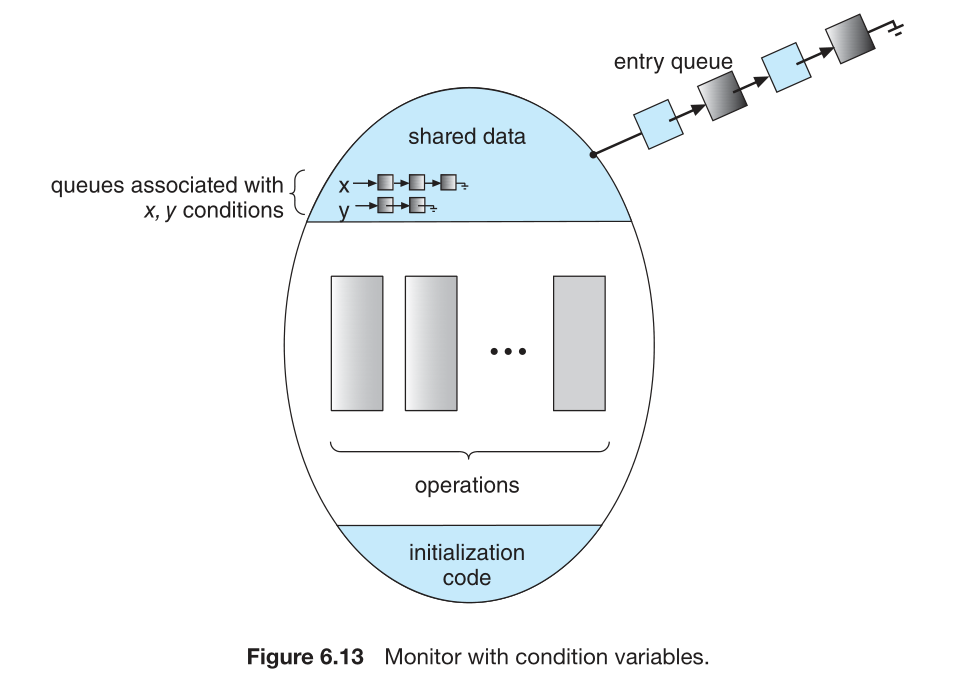
</div>

一个monitor中有
* 多个进程（线程），它们可能要访问相同的资源(shared data)。这些进程就是图中的entry queue。
* 一个或多个condition variable，每个condition variable会和一把锁相关联。

执行过程为：entry queue中的进程拿到锁（mutex），进入shared data，如果该进程需要等待某个条件成立 `x` 才能继续执行(比如生产者-消费者问题中，生产者需要buffer不为满，才能继续执行)，那么该进程就会释放锁，并执行 `x.wait()` 将自己挂在 `x` 对应的队列上。直到其他进程执行了 `x.signal()`，`x` 对应的队列才会逐个释放元素。

例子：
```python
import threading
import time

# 缓冲区大小
BUFFER_SIZE = 5

# 全局变量
buffer = []
lock = threading.Lock()
not_full = threading.Condition(lock)
not_empty = threading.Condition(lock)

# 生产者线程函数
def producer():
    global buffer
    while True:
        time.sleep(1)  # 模拟生产过程
        with not_full:
            while len(buffer) == BUFFER_SIZE:
                not_full.wait()
            buffer.append('item')
            print(f'Producer produces an item, buffer size: {len(buffer)}')
            not_empty.notify()  # 唤醒消费者线程

# 消费者线程函数
def consumer():
    global buffer
    while True:
        with not_empty:
            while len(buffer) == 0:
                not_empty.wait()
            buffer.pop()
            print(f'Consumer consumes an item, buffer size: {len(buffer)}')
            not_full.notify()  # 唤醒生产者线程
        time.sleep(2)  # 模拟消费过程

# 创建生产者和消费者线程
t1 = threading.Thread(target=producer)
t2 = threading.Thread(target=consumer)

# 启动线程
t1.start()
t2.start()

# 等待线程结束
t1.join()
t2.join()
```

这段代码中并没有显式地使用 monitor，而是使用了 Python 中提供的锁对象 `Lock` 和条件变量对象 `Condition`，通过这两个对象可以实现监视器模式的基本功能。
同时在这个例子中，`not_full` 是一个条件变量对象，使用 `with not_full`: 就可以保证在进入 `with` 代码块前调用 `not_full.acquire()` 进行获取锁，在代码块执行完毕后自动调用 `not_full.release()` 进行释放锁，无需手动编写这些代码。