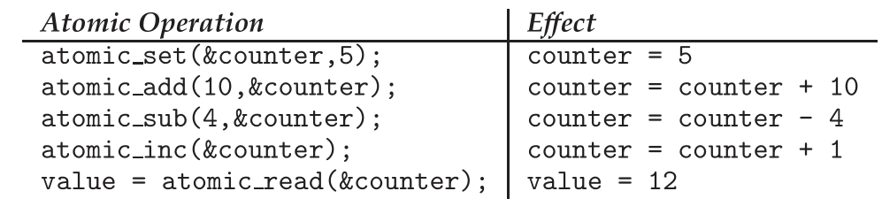

## Classic Problems of Synchronization
### The Bounded-Buffer Problem
In our problem, the producer and consumer processes share the following data structures:
```c
int n;
semaphore mutex = 1; // 用于保证互斥
semaphore empty = n; // 防空转（buffer中没有内容，但是消费者依然要消费）
semaphore full = 0; // 防溢出
```

The structure of the producer process.
```c
while (true) {
        . . .
    /* produce an item in next produced */
        . . .
    wait(empty);
    wait(mutex);
        . . .   
    /* add next produced to the buffer */
        . . .
    signal(mutex);
    signal(full); // signal to comsumer there has resource to comsume
}
```

The structure of the consumer process.
```c
while (true) {
        . . .
    /* produce an item in next produced */
        . . .
    wait(full);
    wait(mutex);
        . . .   
    /* add next produced to the buffer */
        . . .
    signal(mutex);
    signal(empty);
}
```

### The Readers–Writers Problem
readers and writers are not symmetric (read操作可以同时进行，但是write不行)
Obviously, if two readers access the shared data simultaneously, no adverse effects will result. However, if a writer and some other process (either a reader or a writer) access the database simultaneously, chaos may ensue.

In the solution to the first readers–writers problem, the reader processes share the following data structures:
```c
semaphore rw_mutex = 1; // mutex for read and write
semaphore mutex = 1; // mutex for read_count
int read_count = 0; // the number of reader
```

The structure of a writer process.
```c
while (true) {
    wait(rw_mutex);
        . . .
    /* writing is performed */
        . . .
    signal(rw_mutex);
}
```

The structure of a reader process.
```c
while (true) {
    wait(mutex); // avoid violation between readers when excuting read_count++
    read_count++;
    if (read_count == 1) // only the first reader should consider the rw_mutex
        wait(rw_mutex);
    signal(mutex);
        . . .
    /* reading is performed */
        . . .
    wait(mutex);
    read_count--;
    if (read_count == 0) // unclock when no reader left
        signal(rw_mutex);
    signal(mutex);
}
```

另一种处理readers—writers problem的方法：read copy update（RCU）
把数据复制多份，就不会产生冲突

### The Dining-Philosophers Problem
#### Semaphore Solution
One simple solution is to represent each chopstick with a semaphore. `semaphore chopstick[5];` are set as shared data, where all the elements of `chopstick` are initialized to 1.

The structure of philosopher i:
```c
while (true) {
    wait(chopstick[i]);
    wait(chopstick[(i+1) % 5]);
    . . .
    /* eat for a while */
    . . .
    signal(chopstick[i]);
    signal(chopstick[(i+1) % 5]);
    . . .
    /* think for a while */
    . . .
}
```

The solution could create a deadlock. When each philosopher tries to grab her right chopstick, she will be delayed forever.

#### Monitor Solution
This solution imposes the restriction that a philosopher may pick up her chopsticks only if *both of them are available*. To code this solution, we need to distinguish among three states: `enum {THINKING, HUNGRY, EATING} state[5];`

We also need to declare ` condition self[5]`. This allows philosopher i to *delay herself* when she is hungry but is unable to obtain the chopsticks she needs.

The distribution of the chopsticks is controlled by the **monitor** `DiningPhilosophers`:
```c
monitor DiningPhilosophers
{
    enum {THINKING, HUNGRY, EATING} state[5];
    condition self[5];
    void pickup(int i) {
        state[i] = HUNGRY;
        test(i);
        if (state[i] != EATING)
            self[i].wait(); // 说明旁边有人在吃饭，所以要 suspend,直到旁边的人吃完调用 test(i)，再尝试 EATING。
    }
    void putdown(int i) {
        state[i] = THINKING;
        test((i + 4) % 5);
        test((i + 1) % 5);
    }
    void test(int i) {
        if ((state[(i + 4) % 5] != EATING) &&(state[i] == HUNGRY) &&(state[(i + 1) % 5] != EATING)) {
            state[i] = EATING;
            self[i].signal();
        }
    }
    initialization code() {
        for (int i = 0; i < 5; i++)
            state[i] = THINKING;
    }
}
```

Each philosopher, before starting to eat, must invoke the operation `pickup()`. This act may result in the **suspension** of the philosopher process. The whole process:
```c
DiningPhilosophers.pickup(i);
    ...
    /* eat */
    ...
DiningPhilosophers.putdown(i);
```

## Synchronization within the Kernel
### Synchronization in Windows
When the Windows kernel accesses a global resource
* on a single-processor system: it temporarily *masks interrupts* for all interrupt handlers that may also access the global resource.
* On a multiprocessor system: *spinlock* (Furthermore, for reasons of efficiency, the kernel ensures that a thread will never be preempted while holding a spinlock.)

For thread synchronization outside the kernel, Windows provides ***dispatcher objects***. Using a dispatcher object, threads synchronize according to several different mechanisms, including **mutex locks**, **semaphores**, **events**, and **timers**. 

<!--TODO 还有一点没看 -->

### Synchronization in Linux
The *simplest* synchronization technique within the Linux kernel is an atomic integer, which is represented using the opaque data type `atomic_t`.
To illustrate, consider a program that consists of an atomic integer counter and an integer value.
```c
atomic_t counter;
int value;
```

The following code illustrates the effect of performing various atomic operations:
<div align=center>

</div>

Atomic integers are particularly *efficient* in situations where an integer variable—such as a counter—needs to be updated, since atomic operations **do not require the overhead of locking mechanisms**. However, their use is limited to these sorts of scenarios.

Mutex locks are available in Linux for protecting critical sections within the kernel.

Linux also provides spinlocks and semaphores (as well as reader–writer versions of these two locks) for locking in the kernel.

Spinlocks—along with enabling and disabling kernel preemption—are used in the kernel only when a lock (or disabling kernel preemption) is held for a **short duration**. When a lock must be held for a longer period, semaphores or mutex locks are appropriate for use.

## POSIX Synchronization
### POSIX Mutex Locks
Mutex locks represent the fundamental synchronization technique used with Pthreads.
```c
#include <pthread.h>

/* create and initialize the mutex lock */
pthread_mutex_t mutex;
pthread_mutex_init(&mutex,NULL);
/* acquire the mutex lock */
pthread_mutex_lock(&mutex);

/* critical section */

/* release the mutex lock */
pthread_mutex_unlock(&mutex);
```

### POSIX Semaphores
POSIX specifies two types of semaphores—**named** and **unnamed**.
#### POSIX Named Semaphores
```c
#include <semaphore.h>
sem_t *sem;

/* Create the semaphore and initialize it to 1 */
sem = sem_open("SEM", O_CREAT, 0666, 1);
```

In this instance, we are naming the semaphore `SEM`. 
* The `O_CREAT` flag indicates that the semaphore will be created if it does not already exist. 
* Additionally, the semaphore has read and write access for **other processes** (via the parameter 0666) 
* and is initialized to 1.

Advantage: multiple unrelated processes can easily use a common semaphore as a synchronization mechanism by simply referring to the semaphore’s name. (In the example above, once the semaphore SEM has been created, subsequent calls to `sem_open()` with the **same parameters** by **other processes** return a descriptor to the existing semaphore.)