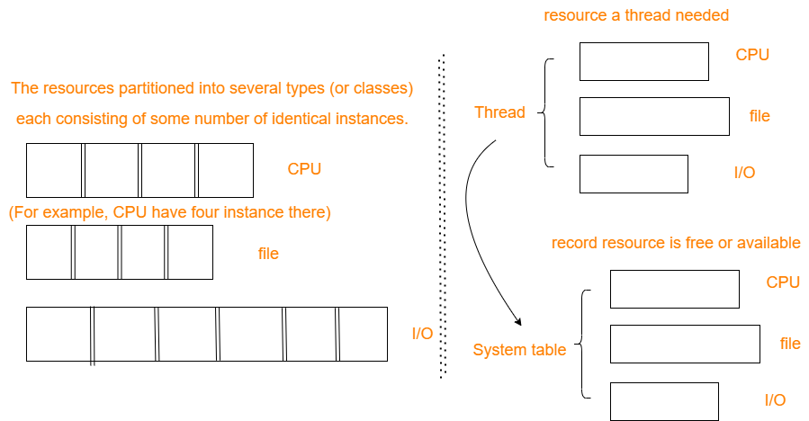
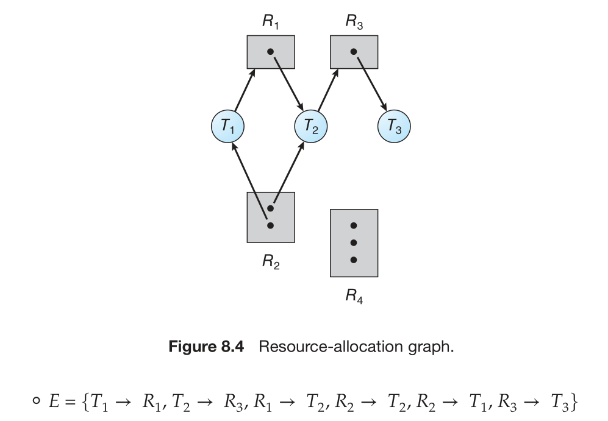
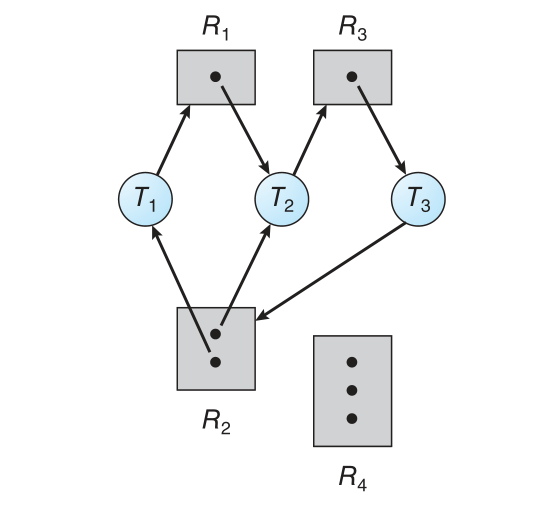
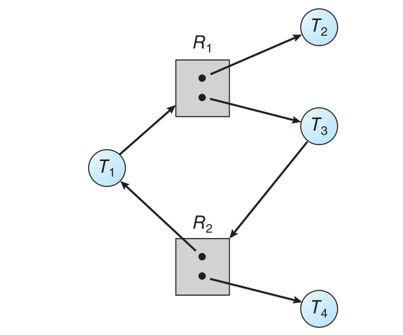
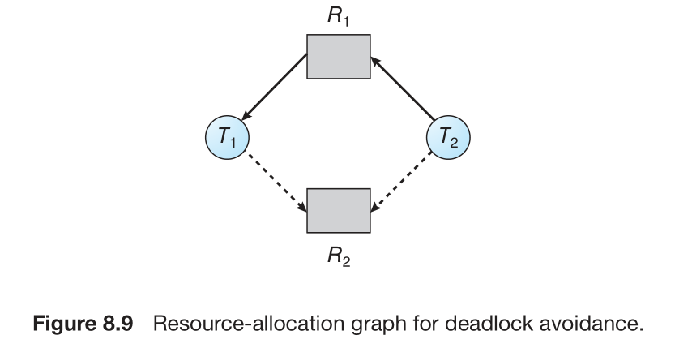
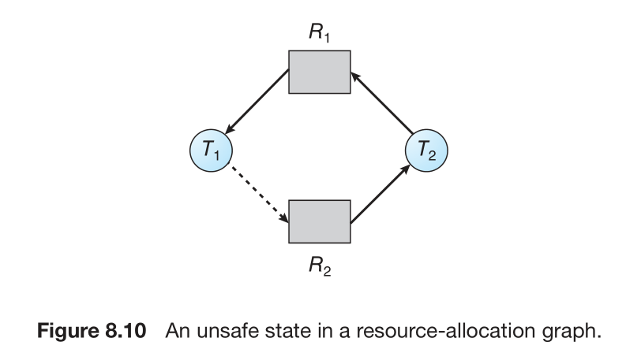
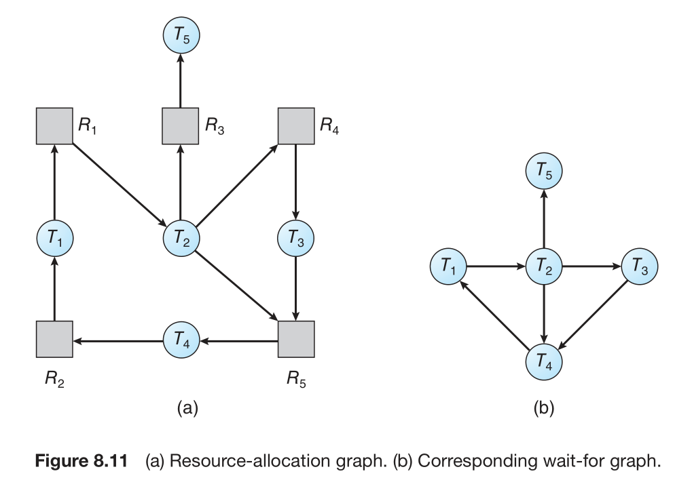
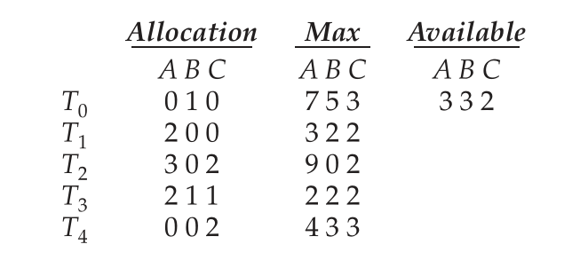
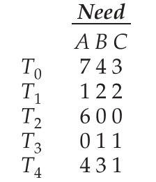

## System Model
A system consists of a finite number of resources to be distributed among a number of competing threads. If a thread requests an instance of a resource type, the allocation of *any* instance of the type should satisfy the request.
<div align=center>

</div>

A thread may utilize a resource in only the following sequence:
1. **Request**
2. **Use**:  The thread can operate on the resource (for example, if the resource is a mutex lock, the thread can access its critical section).
3. **Release**

A set of threads is in a deadlocked state when every thread in the set is waiting for an event that can be caused only by another thread in the set. 

## Deadlock Characterization
### Necessary Conditions
A deadlock situation can arise if the following four conditions hold *simultaneously* in a system:
1. **Mutual exclusion**
2. **Hold and wait**
   1. must be holding at least one resource
   2. waiting to acquire additional resources that are currently being held by other threads.
3. **No preemption**(优先级相同可能会导致这种情况)
4. **Circular wait**

### Resource-Allocation Graph
* Ti → Rj: it signifies that thread Ti has requested an instance of resource type Rj and is currently waiting for that resource. (***request edge***)
* Rj → Ti: it signifies that an instance of resource type Rj has been allocated to thread Ti.(***assignment edge***)
<div align=center>

</div>

图上圆点表示资源的实例（instance）

A basic fact: if a resource-allocation graph does not have a cycle, then the system is not in a deadlocked state. If there is a cycle, then the system may or may not be in a deadlocked state.(没有环（看成有向图）一定不会死锁，但有环也不一定会)

<div align=center>

</div>

有环有死锁
<div align=center>

</div>

有环但没有死锁

## Deadlock Prevention
### Mutual Exclusion
The mutual-exclusion condition must hold.(不能避免)
### Hold and Wait
Two **protocols**:
1. requires each thread to request and be allocated all its resources before it begins execution. (impractical, for most applications due to the dynamic nature of requesting resources.)
2. A thread to request resources only when it has none.That is, before it can request any additional resources, it must release all the resources that it is currently allocated.(请求资源之前先释放所有资源)

**disadvantages**：
* resource utilization may be low
* starvation is possible

### No Preemption
所以可以使用优先级可抢占式
A protocol:
如果某个线程请求不到资源无法执行，所有在等待的线程释放资源，然后按优先级排列。高优先级的先使用资源。

This protocol is often applied to resources whose state can be easily saved and restored later, such as CPU registers and database transactions.

### Circular Wait
presents an opportunity for a *practical* solution by invalidating one of the necessary conditions.

One way to ensure that this condition never holds is to impose a total ordering of all resource types and to require that each thread requests resources in an increasing order of enumeration.

Example:
Each thread can request resources only in an increasing order of enumeration.(如果有多个锁的话，一定要按顺序拿)。
```c
F(first_mutex) = 1
F(second_mutex) = 5
```

After that, the thread can request an instance of resource Rj if and only if F(Rj) > F(Ri). Using the function defined above, a thread that wants to use both `first_mutex` and `second_mutex` at the same time must first request `first_mutex` and then `second_mutex`.

## Deadlock Avoidance
Deadlock-prevention algorithms, as discussed before, are possibly low device utilization and reduced system throughput.

An alternative method for avoiding deadlocks is to require additional information about how resources are to be requested.(纵览全局)

### Safe State
A state is safe if the system can allocate resources to each thread (up to its maximum) in some order and still avoid a deadlock. More formally, a system is in a safe state **only if there exists a *safe sequence***.

### Resource-Allocation-Graph Algorithm
we introduce a new type of edge, called a ***claim edge***
<div align=center>

</div>
从图中可以看出加了申请边(claim edge)之后不会导致成环(cycle)，所以可以加入这两条边。
<div align=center>

</div>
从图中可以看出加了申请边(claim edge)之后会导致成环(cycle)，所以不能加入这两条边。
<div align=center>

</div>
从左到右表示对图的化简，看起来更清晰明了，方便看出有没有环。像这种情况导致成环，一般是将T2去掉（因为连了最多的边），然后让其他几个线程并行。

### Banker’s Algorithm
We need the following data structures, where n is the number of threads in the system and m is the number of resource types:
* **Available**. If Available[j] equals k, then k instances of resource type Rj are available.
* **Max**.If Max[i][j] equals k, then thread Ti may request at most k instances of resource type Rj.
* **Allocation**.If Allocation[i][j] equals k, then thread Ti is currently allocated k instances of resource type Rj.
* **Need**. Need[i][j] equals Max[i][j] − Allocation[i][j].

Available是对系统而言，而Max,Allocation,Need是对单个进程（线程）而言。

**Example**:
Consider a system with five threads T0 through T4 and three resource types A, B, and C.

Suppose that the following snapshot represents the current state of the system:
<div align=center>

</div>

The content of the matrix Need is defined to be Max − Allocation and is as follows:
<div align=center>

</div>

We claim that the system is currently in a safe state. Indeed, the sequence<T1, T3, T4, T2, T0> satisfies the safety criteria.(就是按照常规分析最后能执行完)

## Recovery from Deadlock
### Process and Thread Termination
To eliminate deadlocks by aborting a process or thread, we use one of *two methods*. 
* Abort all deadlocked processes.
* Abort one process at a time until the deadlock cycle is eliminated. 

If the partial termination method is used, then we must determine which deadlocked process (or processes) should be terminated. (*minimum cost*)
1. What the priority of the process is
2. How long the process has computed and how much longer the process will compute before completing its designated task
3. How many and what types of resources the process has used (for example, whether the resources are simple to preempt)
4. How many more resources the process needs in order to complete
5. How many processes will need to be terminated

## 总结
过程管理
* 并行性能
  * Chapter3 IPC/cooperative
  * Chapter4 multi-threading
  * Chapter5 CPU scheduling
* 安全可靠(Chapter6~8)
  * Synchronization
  * Deadlock