## Background
We are interested only in the sequence of memory addresses generated by the running program.

### Basic Hardware
We first need to make sure that each process has a separate memory space. Separate per-process memory space protects the processes from each other and is fundamental to having multiple processes loaded in memory for concurrent execution. (进程地址之间相互隔离，保护各个进程不产生冲突，即不会访问到其他进程的地址)

We can provide this protection by using two registers:
* **base register** holds the smallest legal physical memory address; 
* **limit register** specifies the size of the range.

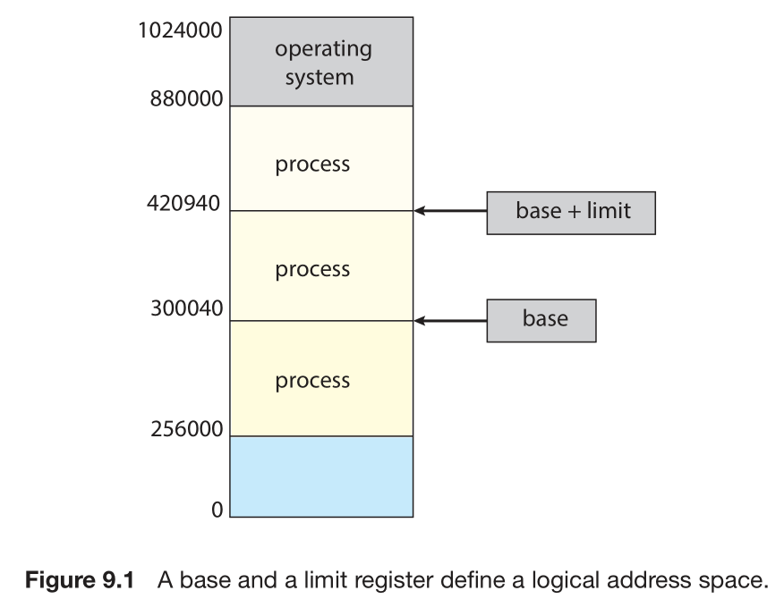

使用两个register是因为早期CPU只有32位，只能访问4GB空间，所以要用两个寄存器访问全部空间。

The base and limit registers can be loaded only by the operating system

### Address Binding
Most systems allow a user process to reside in any part of the physical memory.

Addresses in the source program are generally **symbolic** (such as the variable count). Acompiler typically ***binds*** these symbolic addresses to k addresses. Each binding is a mapping from one address space to another.

Classically, the binding of instructions and data to memory addresses can be done at *any* step along the way:
• Compile time
• Load time
• Execution time

### Logical Versus Physical Address Space
An address generated by the *CPU* is commonly referred to as a ***logical address***, whereas an address seen by the memory unit (the one loaded into the ***memory-address register*** 应该就是实际访问的) is commonly referred to as a ***physical address***.

The run-time mapping from virtual to physical addresses is done by a hardware device called the ***memory-management unit (MMU)*** .

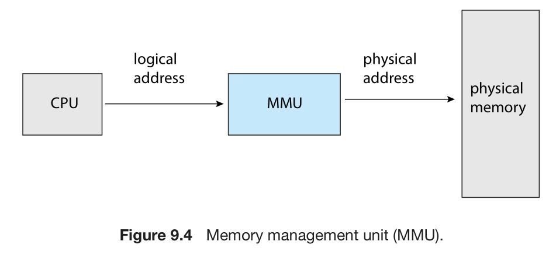

a simple MMU scheme:
Use ***relocation register*** (The value in the relocation register is added to every address generated by a user process at the time the address is sent to memory)

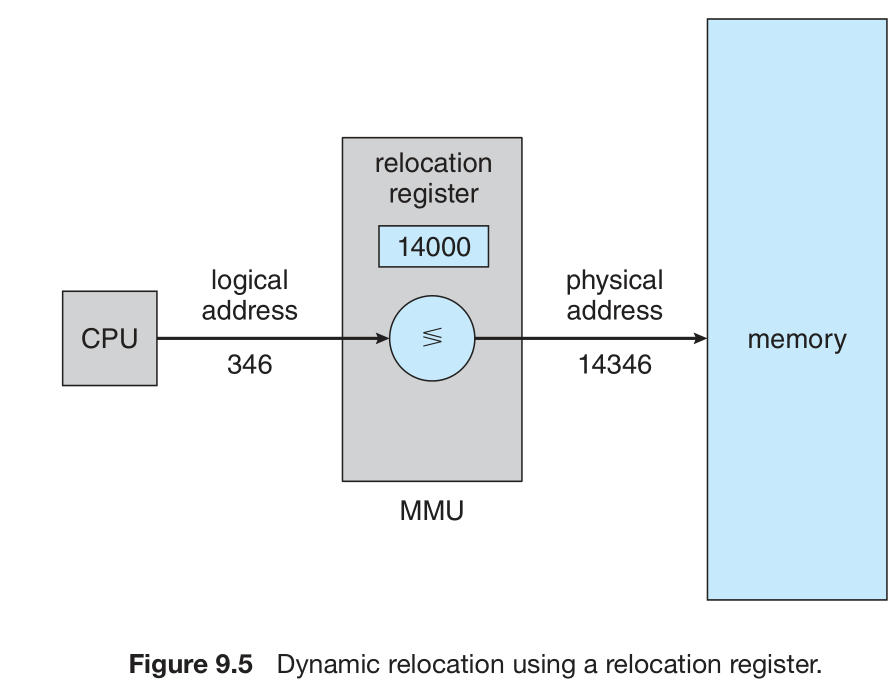

## Contiguous Memory Allocation
In ***contiguous memory allocation***, each process is contained in a single section of memory that is contiguous to the section containing the next process. 
### Memory Protection
使用 relocation register 和 limit register 就能实现。
### Memory Allocation
Initially, all memory is available for user processes and is considered one large block of available memory, a hole. Eventually, as you will see, memory contains a set of holes of various sizes.

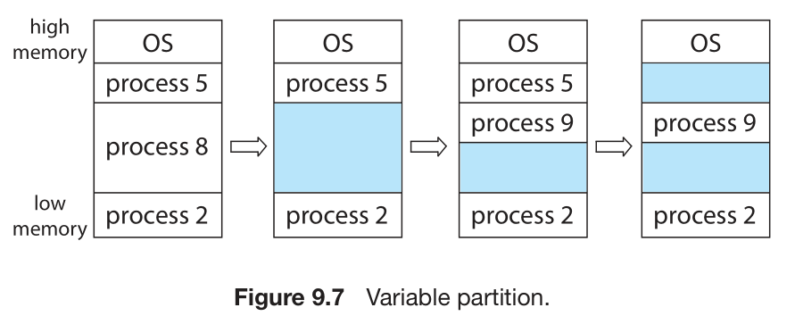

In general, as mentioned, the memory blocks available comprise a set of holes of various sizes scattered throughout memory. When a process arrives and needs memory, there are many solutions.
• First fit. (找到能用的就行)
• Best fi . (遍历全部，找大小恰好合适或者差别不大的)
• Worst fit. (找最大的hole)
### Fragmentation

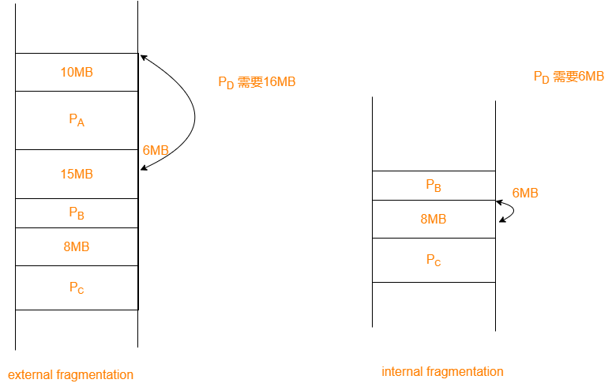

* 在external fragmentation的情况下，process 无法被正常加载运行
* 右面那幅图中没用到的2MB就是internal fragmentation.

## Paging
***Paging*** is a memory-management scheme that permits a process’s physical address space to be non-contiguous. 
One of advantages: Paging avoids *external fragmentation* .

### Basic Method
* breaking physical memory into fixed-sized blocks called ***frames***
* breaking logical memory into blocks of the same size called ***pages***

Every address generated by the CPU is divided into two parts: a ***page number (p)*** and a ***page offset (d)*** 

If the size of page is 4KB in a 32-bits system, then $n=12$, $m-n=20$

The page number is used as an index into a per-process ***page table***.

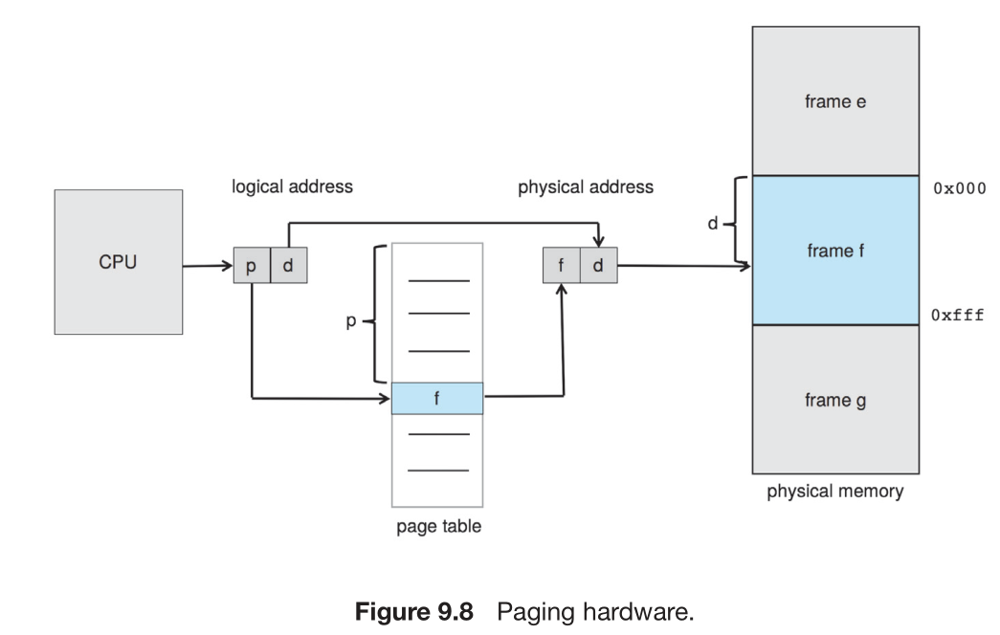

The following outlines the steps taken by the *MMU* to translate a *logical address* generated by the CPU to a *physical address*:(直接看图也能看出来) 
1. Extract the page number p and use it as an index into the page table.
2. Extract the corresponding frame number f from the page table.
3. Replace the page number p in the logical address with the frame number f.

The paging model of memory:

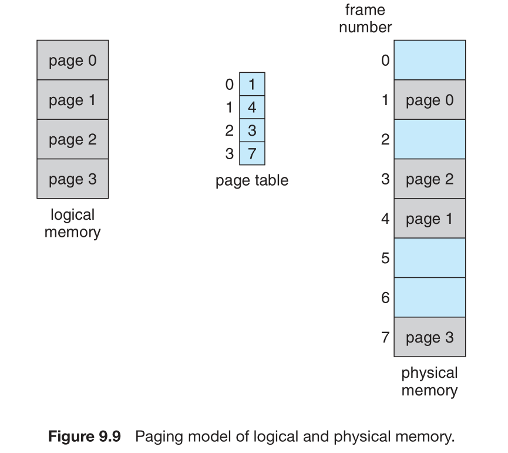

The size of page and frame is the same.

Paging scheme can't avoid *internal fragmentation*.

Linux supkports two page sizes: a default page size (typically 4 KB) and an architecture-dependent larger page size called ***huge pages***.(ususally 4KB-2MB)

An important aspect of paging is the clear separation between the programmer’s view of memory and the actual physical memory. (程序员看到的地址是连续的，但实际上可能是离散的).  This mapping is hidden from the programmer and is controlled by the operating system.
***frame table***: has one entry for each physical page frame, indicating whether the latter is free or allocated and, if it is allocated, to which page of which process (or processes).

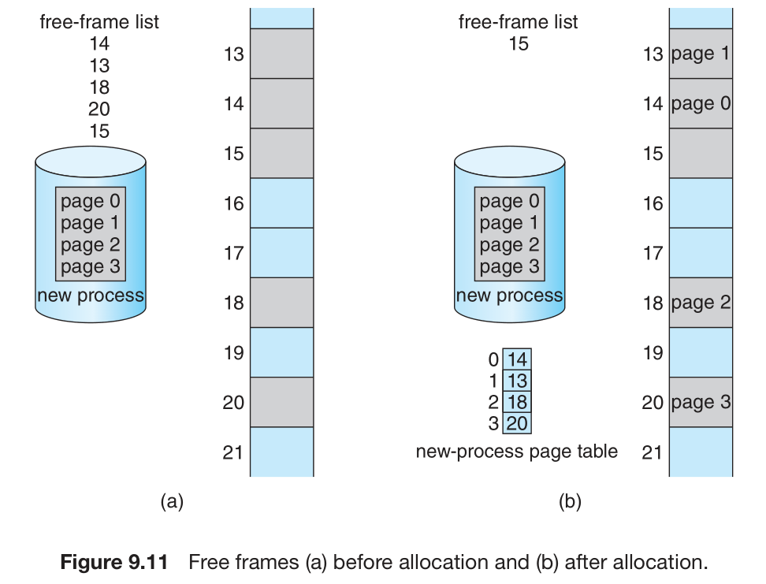

The operating system maintains a copy of the page table for each process, therefore increases the context-switch time.

### Hardware Support
A pointer to the page table is stored with the other register values (like the instruction pointer) in the process control block of each process.(PCB中保存了一个指向page table的指针，PTBR)

Most contemporary CPUs, however, support much larger page tables (for example, 220 entries). For these machines, the page table is kept in main memory, and a ***page-table base register (PTBR)*** points to the page table. (存在memory中的原因是page table 太大，cache放不下)。

#### Translation Look-Aside Buffer
With normal scheme, *two* memory accesses are needed to access data 
1. one for the page-table entry  
2. one for the actual data

***translation look-aside buffer (TLB)*** :a special, small, fast-lookup hardware cache to store some **page-frame pair**.(大概能存储1KB的数据)

A TLB lookup in modern hardware is part of the instruction pipeline, essentially adding no performance penalty.(时间可以忽略不计)

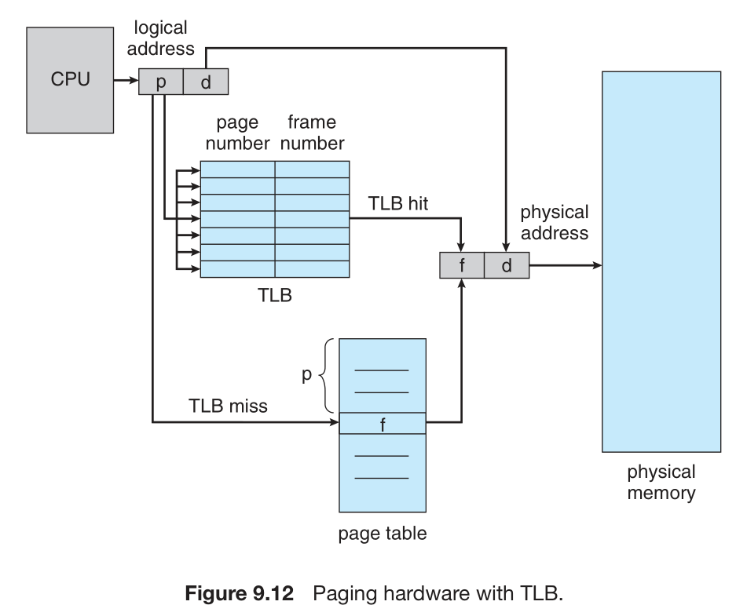

When a logical address is generated by the CPU, the MMU first checks if its page number is present in the TLB.
* If the page number is found, its frame number is immediately available and is used to access memory.
* If the page number is not in the TLB (known as a TLB miss),  a memory reference to the page table must be made. 
  * In addition, we add the page number and frame number to the TLB
  * If the TLB is already full of entries: Replacement policies range from least recently used (LRU) through round-robin to random. 

The percentage of times that the page number of interest is found in the TLB is called the ***hit ratio***. (An 80-percent hit ratio and 10 nanoseconds to access memory, for example) To find the ***effective memory-access time***, we weight the case by its probability:
effective access time = 0.80 × 10 + 0.20 × 20 = 12 nanoseconds

### Protection
One additional bit is generally attached to each entry in the page table: a ***valid–invalid*** bit. The operating system sets this bit for each page to allow or disallow access to the page.

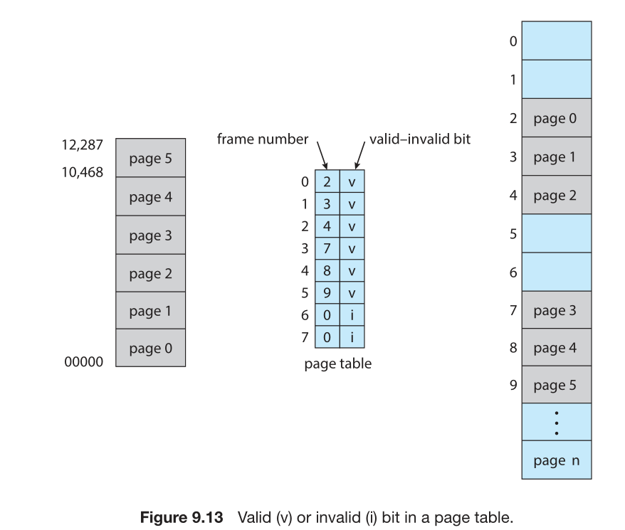

For example, in the figure above, addresses in pages 0, 1, 2, 3, 4, and 5 are mapped normally through the page table. Any attempt to generate an address in pages 6 or 7, however, will find that the valid–invalid bit is set to invalid, and the computer will trap to the operating system (invalid page reference).

valid-invalid bit 是因为有些逻辑内存和物理内存不能一一对应。这和虚拟内存相关。

### Shared Pages

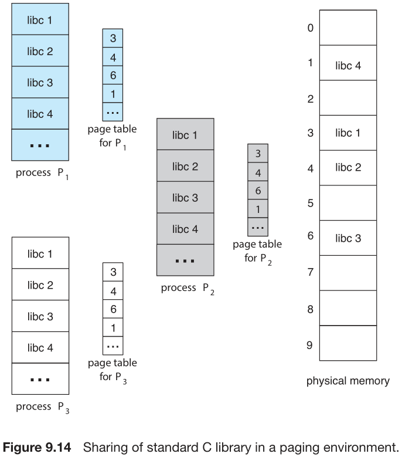

## Structure of the Page Table
### Hierarchical Paging
For example, consider a system with a 32-bit logical address space. If the page size in such a system is 4 KB ($2^{12}$), then a page table may consist of over 1 million entries ($2^{20}=2^{32}/ 2^{12}$). Clearly, we would not want to allocate the page table contiguously in main memory(太大了不方便查找). One simple solution to this problem is to **divide the page table** into smaller pieces.

One way is to use a two-level paging algorithm (also known as a ***forward-mapped*** page table), in which the page table itself is also paged.

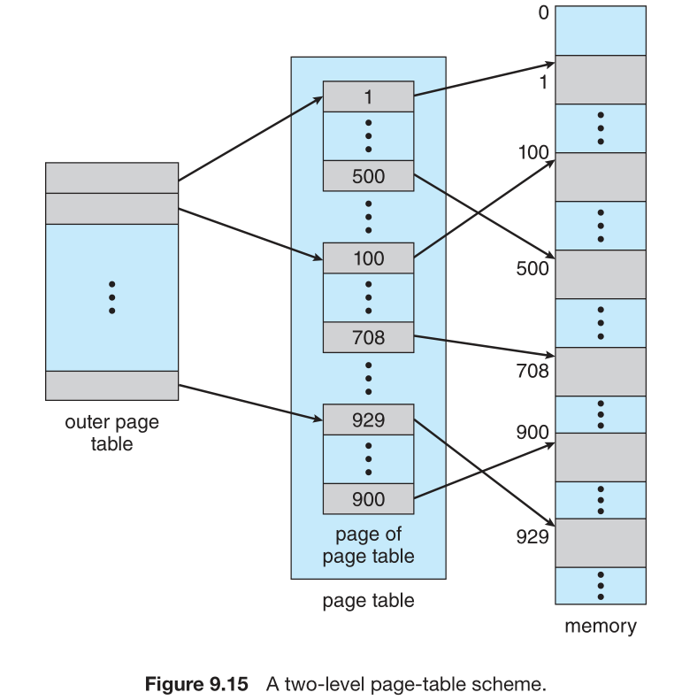

The logical address is as follows:

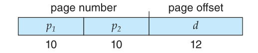

The address-translation method for this architecture:

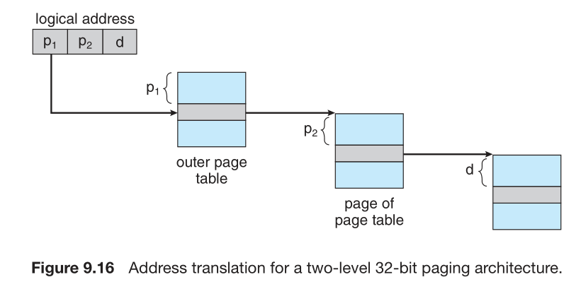

For a system with a 64-bit logical address space, a two-level paging scheme is no longer appropriate. (对于一般的台式机来说，切成3层已经足够了，因为前面有很多地址用不到，但是对于差不多用满64位的数据中心而言，可能要分到7层).(hierarchical page tables are generally considered inappropriate.)

### Hashed Page Tables
适合数据量比较大的情况

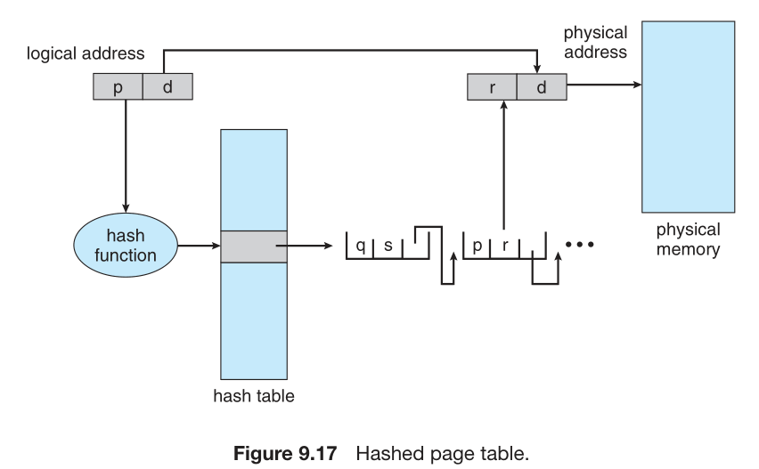

