## Feature Engineering
### Data to information
给定数据(data) $\rightarrow$ 提取特征(feature) $\rightarrow$ 得到信息(information)。
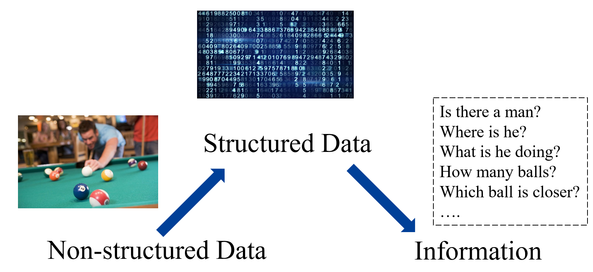

#### Traditional machine learning and deep learning
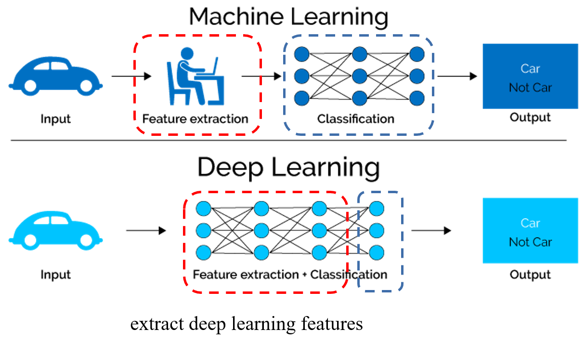

* Traditional machine learing
  * Hand-craft feature
  * Not end-to-end
* Deep learning
  * Learnable feature
  * End-to-end

### Extract key information as feature
* Q: What is feature?
* A: Key information

比如对于一张图片，初始的特征(naive feature)存在很多冗余，即对特定的任务来说没有用。因此需要做特征提取，抓住有用的信息。
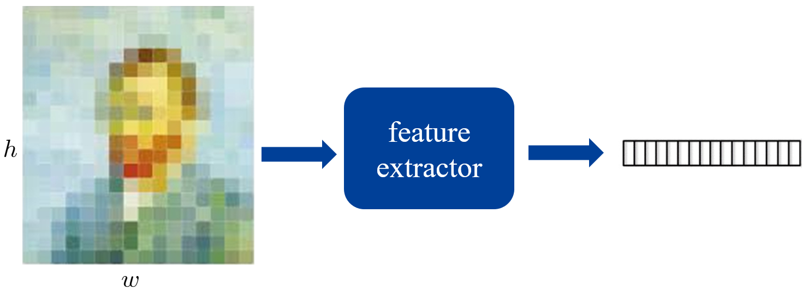

#### How to extract robust features
比如在图片中要识别一只猫，我们希望 feature extractor 对于大小、旋转角度等无关因素是鲁棒的。

* From data perspective
  * 数据增广，增加训练集的多样性
  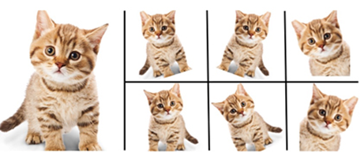
* From model perspective
  * 在传统的机器学习中，需要设置一个比较好的特征提取器。
  * 在深度学习中，特征提取是隐式的，那么就需要设计神经网络的层。

#### Scale-Invariant Feature Transform (SIFT)
在深度学习之前最流行的特征提取的方式。
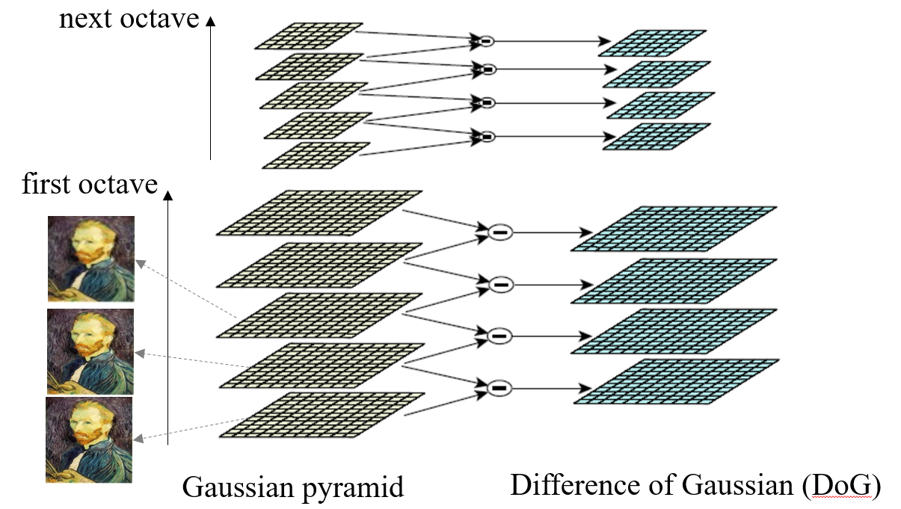

* 首先分成两个分组，表示大尺度和小尺度
* 然后对图片做高斯模糊，得到高斯金字塔(Gaussian pyramid)，比如图中从下到上图片依次更加模糊，那么也就就会依次丢失一些信息
* 让高斯金字塔的相邻两层做差，得到 Difference of Gaussian (**DoG**)。
* 不同层的 DoG 表示了不同层次的细节信息。同时结合不同尺度，我们就得到了不同层次，不同尺度的细节信息。

然后需要在 DoG 中检测出局部最大值和最小值，这些都是比较关键的点，对应图片中的 key point (如轮廓点、拐点等)。
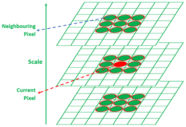

找到关键点之后，需要提取这些关键点的描述子(descriptor)。在 SIFT 中，找到关键点之后，会在关键点的邻域取一个 $16\times 16$ 像素的 patch，每一个 patch 中又分出 $16$ 个 subpatch。在每个 subpatch 中有 $16$ 个像素，对每个像素求梯度(gradient)，定义 $8$ 个梯度方向，从而每个 subpatch 都能得到一个梯度直方图(gradient histogram)。
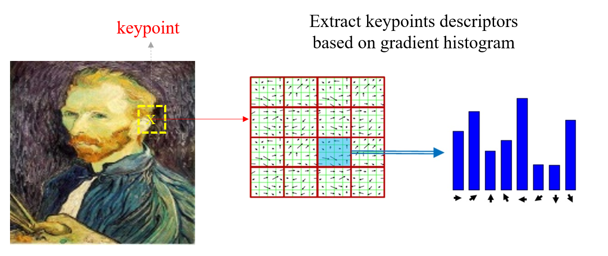

一个直方图对应一个 $8$ 维的向量，因为共有 $16$ 个直方图，因此拼接之后能够得到 $16\times 8$ 维的特征向量，作为整个 patch 的描述。即该关键点的描述子。

* 梯度方向：便于分辨拐点、边缘等比较重要的地方
* 分 subpatch：保持了空间上的信息。假如只有一个 patch，那么就无法保持某个像素邻域的空间信息。

SIFT 方法可以通过某些拓展来解决图像偏转的问题。在获得 key point 的 descriptor 之后，可以找到一个像素梯度最多的方向，即寻找图片的主导方向(dominant direction)。然后可以通过 dominant direction 让图片转回来。
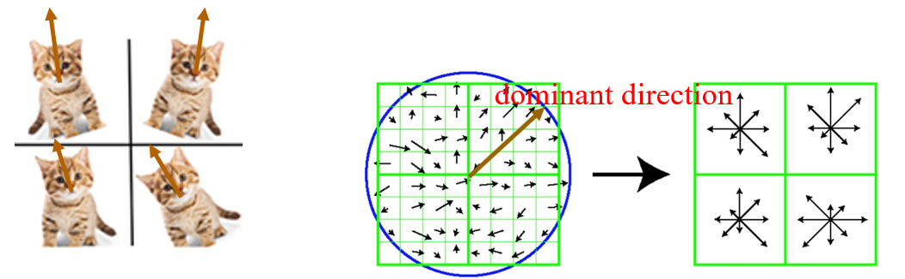

#### Feature extraction in deep learning
涉及较多数学原理，略。

### Post-processing on features
即提取完特征之后，在分类器进行分类之前，可以对特征进行处理。

#### $L_{p}$ normalization
对于一个向量 $\bm{x}=(x_1, x_2, \ldots ,x_n)$

* $L_p$ norm: $(\sum_{i}\left\vert x_i \right\vert^{p} )^{\frac{1}{p}}$
* $L_p$ normalization: $\displaystyle \bm{\tilde{x}} = \frac{\bm{x}}{(\sum_{i}\left\vert x_i \right\vert ^{p})^{\frac{1}{p}}}$

$\bm{\tilde{x}}$ 就是进行了 $L_p$ normalization 之后的特征。

下图是 $p$ 取不同值时二维的 $\bm{\tilde{x}}$ 的形状：
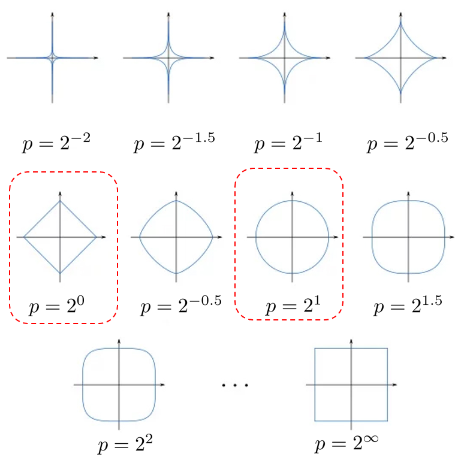

#### Z-score normalization
还是拿二维的特征向量 $\bm{x}=(x_1,x_2)$ 举例。假如有很多特征向量，那么我们可以得到这些特征向量 $\bm{x}$ 的分布，以及分量 $x_1$ 和 $x_2$ 的分布 $p(x_1)$ 和 $p(x_2)$。
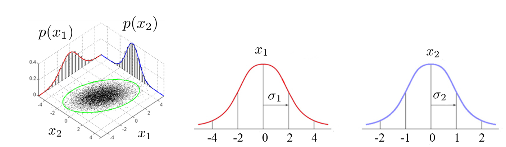

假如 $p(x_1)$ 和 $p(x_2)$ 相差过大，可能会影响分类器的性能，因此我们希望拉近两个维度的分布。此时可以使用 z-score normalization。记 $x_1,x_2$ 的均值，标准差分别为 $\mu_1,\mu_2$ 和 $\sigma_1,\sigma_2$，在 z-score normalization 后，有：
$$
\tilde{x_1} = \frac{x_1-\mu_1}{\sigma_1}， \quad \tilde{x_2} = \frac{x_2-\mu_2}{\sigma_2}
$$

Z-score normalization 和 $L_p$ normalization 可以叠加使用。

### How to preserve spatial information
时间信息和空间信息的保留方式类似。

对于之前提到的 SIFT，如果最后对所有关键点的特征向量做平均；或者在卷积神经网络中做全局池化(Global Average Pooling, GAP)，那么将会损失很多空间信息。

#### Spatial pyramid
保留空间信息一个常见的方式是空间金字塔(Spatial pyramid)，即将整张图片分为不同的层级，每个层级有不同的 scale。
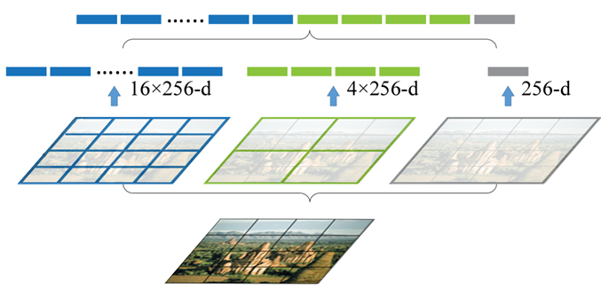

比如首先将图片等分为 $16$ 个 patch，每个 patch 得到一个 $256$ 维的特征，共有 $16\times 256$ 维的特征；然后如果分为 $4$ 个 patch，有 $4\times 256$ 维的特征；最后考虑整张图片，有 $256$ 维的特征。最终将所有得到的特征按顺序拼接起来，拼接的顺序就能够保持图片的空间信息。

#### Position embedding
embedding 同样也指的是表征某种信息的意思，比如 feature vector 也称为 feature embedding。feature embedding 保留的是内容的信息；而 position embedding 保留的则是空间位置的信息。
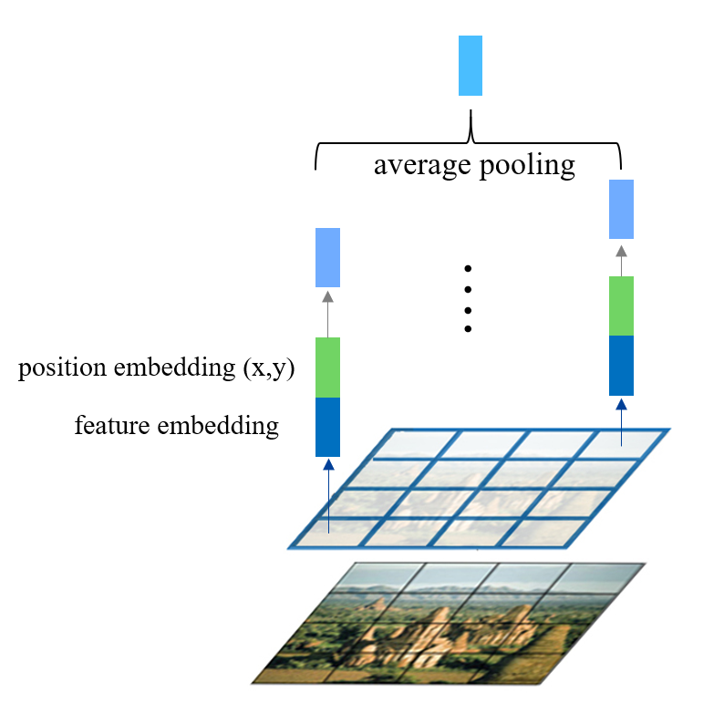

比如上图把一张图划分成若干 patch，每个 patch 都能通过特征提取得到 feature embedding，同时也可以按照位置得到一个 position embedding，这里采用的是最简单的 $(x,y)$ 的形式。然后将两个向量进行拼接，形成总的向量之后再进行 post-processing。最后如果再做 average pooling，空间信息就不会被丢失。

当然 position embedding 可以根据实际情况有更加复杂的编码方式。

## Curse of High-dimension
在处理数据的特征时，特征的维度可能会非常高，而高维的特征则会带来很多弊端。

* 空间和时间复杂度非常大，增加空间和时间上的开销
* 需要更多的数据覆盖整个空间
    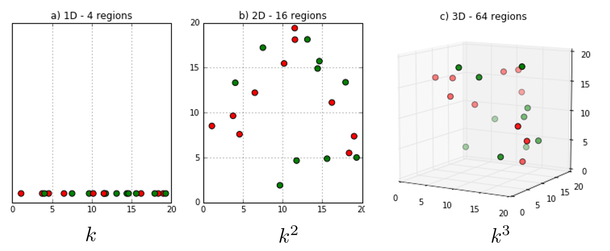
* 模型的复杂度会很高($f(\bm{x})=\bm{w}^{\mathrm{T}}\bm{x}+\bm{b}$)
  * 过高的模型复杂度容易导致过拟合
* 对于一个高维的物体，它的体积主要集中在表面上
  * 比如对于一个 $d$ 维超立方体，体积为 $V_{d}(r)=r^{d}$，$\displaystyle \lim_{d \to \infty}\frac{V_{d}(1-\varepsilon)}{V_{d}(1)}=\lim_{d \to \infty}(1-\varepsilon)^{d}=0$
* 对于高维空间中均匀分布的点，每两个点之间的距离变大，但是方差变小，即两点之间距离的差异越来越小。
    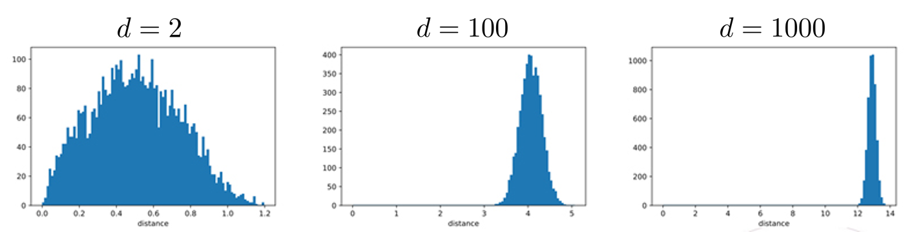
  * 这会导致距离度量(distance metric)逐渐失效，但是有很多分类器是基于距离度量的。比如 KNN 分类器，在维度很高的情况下，新的测试样本(五角星)就不容易归类。
  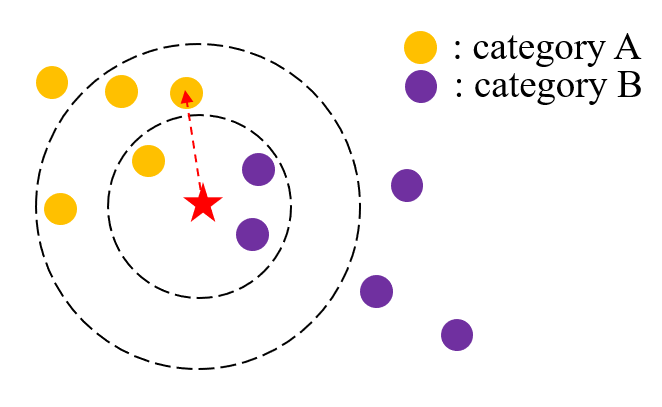

## Dimensionality Reduction
考虑到高维特征的种种弊端，因此需要知道如何对特征进行有效的降维。记原本的特征为 $\bm{f}$，降维之后的特征为 $\bm{f}'$。特征降维的方法主要如下：
* 特征选择(feature selection): $\bm{f}'=\bm{m} \circ \bm{f}$，其中 $\bm{m}$ 是一个掩码(mask)，表示选择某些特征
* 特征投影(feature projection): $\bm{f}'=\bm{P}\bm{f}$，关键在于学习投影的矩阵 $\bm{P}$。比如 $\bm{f}$ 的维度为 $d_1$，投影矩阵 $\bm{P}$ 的形状为 $d_2\times d_1$，并且 $d_2<d_1$，那么就能实现特征降维。
* 特征学习(feature learning): $\bm{f}'=\min_{\bm{f}'}L(\bm{f},\bm{f}')$。这里 $L$ 是一个损失函数，这里的优化可以理解为希望 $\bm{f}'$ 能够保留尽量多的 $\bm{f}$ 的信息。

### Feature selection
比如希望预测肺病的可能性，然后有以下一系列数据。我们希望选取一些最有用的特征。
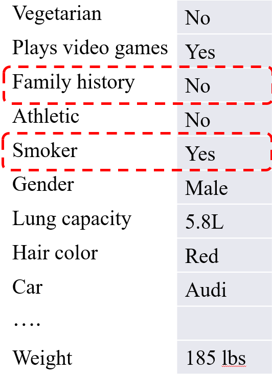

这里我们可以把选择的掩码 $\bm{m}$ 看成一系列二值变量组成的向量，比如 $\bm{m}=(1, 0, 1, 1, \ldots , 0)$，假如 $\bm{m}$ 是 $k$ 维的，那么 $\bm{m}$ 共有 $2^{k}$ 种可能性，搜索空间非常大，不可能一个个枚举。

特征选择的流程如下：
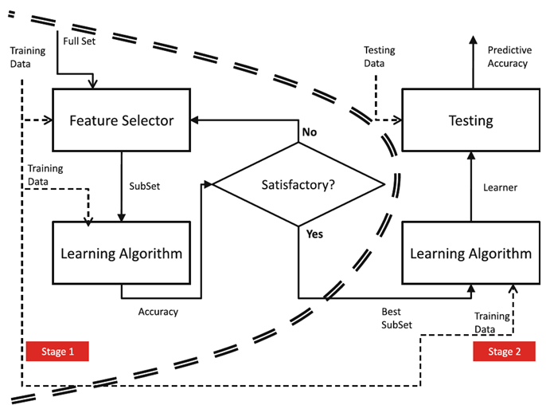

此处需要研究的重点在于应当使用怎样的 Feature Selector。

#### Forward selection
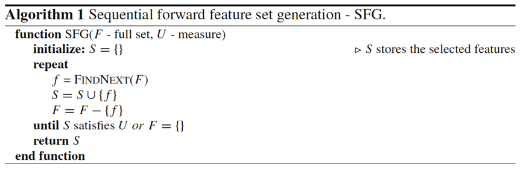

Forward selection 也只是一个框架，其中的 `FINDNEXT` 会对算法的性能有不小的影响。

#### Backward selection
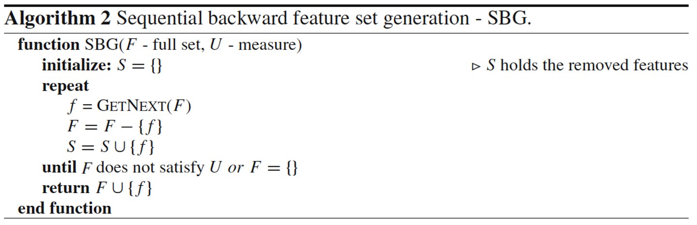

#### Genetic algorithm
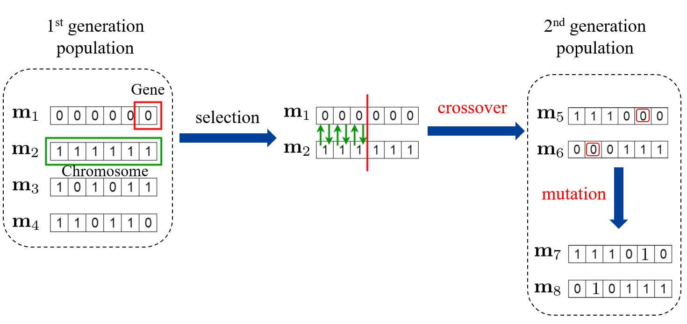

### Feature Projection
* Linear projection $\bm{f}'=\bm{P}\bm{f}$
  * Principle Component Analysis (PCA)
  * Linear Discriminative Analysis (LDA)
* Nonlinear projection $\bm{f}'=p(\bm{f})$
  * Kernel PCA
  * Auto-encoder

#### PCA
假如有一系列样本，每一个样本都是一个二维的特征向量，可以画出一个散点图。在下图中，直观上可以看出这些特征有一个主导的方向。接下来需要从数学上来定义这个主导的方向。(主导方向两两之间正交)
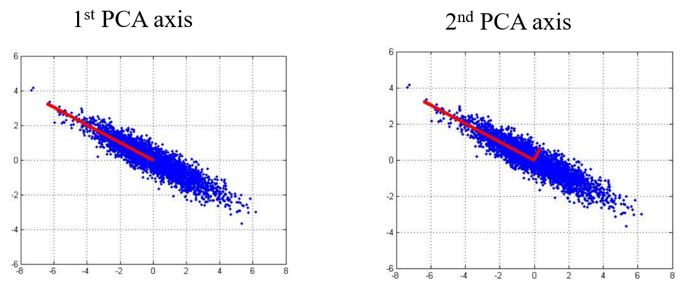

PCA在数学上有两种等价的描述
* Maximum variance direction: when $\bm{X}$ is decentralized. (decentralized:让所有样本的每个维度的均值为 $0$)
  * $\displaystyle \frac{1}{n}\sum_{i=1}^{n}(\bm{v}^{\mathrm{T}}\bm{x_i})^{2}=\frac{1}{n}\bm{v}^{\mathrm{T}}\bm{X}\bm{X}^{\mathrm{T}}\bm{v}$
* Minimum reconstruction error
  * $\displaystyle \frac{1}{n}\sum_{i=1}^{n}\left\| \bm{x_i}-(\bm{v}^{\mathrm{T}}\bm{x_i})\bm{v} \right\|_{}^{2}$

从最大方差的角度出发，此时的主导方向 $\bm{v}$ 可以通过拉格朗日乘子法来求：
$$
\begin{aligned}
\max_{\bm{v}}\quad &\bm{v}^{\mathrm{T}}\bm{X}\bm{X}^{\mathrm{T}}\bm{v} \\
s.t.\quad &\bm{v}^{\mathrm{T}}\bm{v}=1
\end{aligned}
$$

得到拉格朗日形式
$$
\mathcal{L}_\mathbf{v}=\mathbf{v}^T\mathbf{X}\mathbf{X}^T\mathbf{v}+\lambda(1-\mathbf{v}^T\mathbf{v})
$$

$$
\frac{\partial\mathcal{L}_\mathbf{v}}{\partial\mathbf{v}}=\mathbf{X}\mathbf{X}^T\mathbf{v}-\lambda\mathbf{v}=\mathbf{0} \\
\Rightarrow \mathbf{X}\mathbf{X}^T\mathbf{v}=\lambda\mathbf{v}
$$

最后的结果可以联想到特征分解。
那么对情况进行拓展，假如希望将 $d$ 维的数据降到 $k$ 维，可以看出直接取矩阵 $\bm{X}\bm{X}^{\mathrm{T}}$ 特征值最大的几个特征向量即可。

#### Kernel PCA
$$
\begin{aligned}&\phi(\mathbf{X})=[\phi(\mathbf{x}_1),\phi(\mathbf{x}_2),\ldots,\phi(\mathbf{x}_n)]\\&\mathbf{v}=\phi(\mathbf{X})\alpha\end{aligned}
$$

$$
\begin{aligned}
&&&\mathbf{X}\mathbf{X}^{T}\mathbf{v}=\lambda\mathbf{v} \\
&\Longrightarrow && \phi(\mathbf{X})\phi(\mathbf{X})^{T}\phi(\mathbf{X})\boldsymbol{\alpha}=\lambda\phi(\mathbf{X})\boldsymbol{\alpha}  \\
&\Longrightarrow && \phi(\mathbf{X})^{T}\phi(\mathbf{X})\phi(\mathbf{X})^{T}\phi(\mathbf{X})\boldsymbol{\alpha}=\lambda\phi(\mathbf{X})^{T}\phi(\mathbf{X})\boldsymbol{\alpha}  \\
&\Longrightarrow && \mathbf{K}\mathbf{K}\boldsymbol{\alpha}=\lambda\mathbf{K}\boldsymbol{\alpha}  \\
&\Longrightarrow  &&\mathbf{K}\boldsymbol{\alpha}=\lambda\boldsymbol{\alpha}
\end{aligned}
$$

#### Linear Discriminative Analysis (LDA)
和 PCA 不同，LDA 利用了类别的信息。LDA 希望找到一个投影方向，能够让类内的距离最小化，类间的距离最大化。比如在下图中，假如投影到纵坐标上，那么会导致两个类无法区分；但是如果把类投影到横坐标上，那么就能够得到很好的区分。
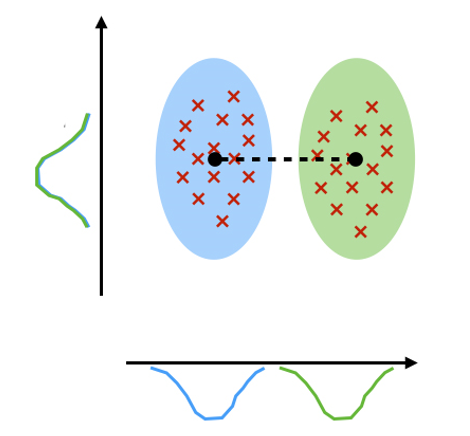

假设两个类的均值分别为 $\bm{\mu_1},\bm{\mu_2}$，方差为 $\bm{\sigma_1}^{2},\bm{\sigma_2}^{2}$

$$
\begin{aligned}
J(\mathbf{v})& =\frac{(\mathbf{v}^{T}\boldsymbol{\mu}_{1}-\mathbf{v}^{T}\boldsymbol{\mu}_{2})^{2}}{\boldsymbol{\sigma}_{1}^{2}+\boldsymbol{\sigma}_{2}^{2}}  \\
&=\frac{(\mathbf{v}^T\boldsymbol{\mu}_1-\mathbf{v}^T\boldsymbol{\mu}_2)^2}{\sum_{i=1}^{C_1}(\mathbf{v}^T\mathbf{x}_{1,i}-\mathbf{v}^T\boldsymbol{\mu}_1)^2+\sum_{i=1}^{C_2}(\mathbf{v}^T\mathbf{x}_{2,i}-\mathbf{v}^T\boldsymbol{\mu}_2)^2} \\
&=\frac{\mathbf{v}^T(\boldsymbol{\mu}_1-\boldsymbol{\mu}_2)(\boldsymbol{\mu}_1-\boldsymbol{\mu}_2)^T\mathbf{v}}{\mathbf{v}^T\left(\sum_{i=1}^{C_1}(\mathbf{x}_{1,i}-\boldsymbol{\mu}_1)(\mathbf{x}_{1,i}-\boldsymbol{\mu}_1)^T+\sum_{i=1}^{C_2}(\mathbf{x}_{2,i}-\boldsymbol{\mu}_2)(\mathbf{x}_{2,i}-\boldsymbol{\mu}_2)^T\right)\mathbf{v}} \\
&=\frac{\mathbf{v}^T\mathbf{S}_B\mathbf{v}}{\mathbf{v}^T\mathbf{S}_W\mathbf{v}}
\end{aligned}
$$

对上式求极值
$$
J(\mathbf{v})={\frac{\mathbf{v}^{T}\mathbf{S}_{B}\mathbf{v}}{\mathbf{v}^{T}\mathbf{S}_{W}\mathbf{v}}},\quad{\frac{\partial J(\mathbf{v})}{\partial\mathbf{v}}}=0 \Rightarrow (\mathbf{v}^T\mathbf{S}_B\mathbf{v})\mathbf{S}_W\mathbf{v}=(\mathbf{v}^T\mathbf{S}_W\mathbf{v})\mathbf{S}_B\mathbf{v}
$$

又因为 $\mathbf{S}_{B}=(\boldsymbol{\mu}_{1}-\boldsymbol{\mu}_{2})\left(\boldsymbol{\mu}_{1}-\boldsymbol{\mu}_{2}\right)^{T}$，因此 $\bm{S}_{B}\bm{v}$ 的方向和 $\bm{\mu_1}-\bm{\mu_2}$ 相同。除去常数项 $\mathbf{v}^T\mathbf{S}_B\mathbf{v}$ 和 $\mathbf{v}^T\mathbf{S}_W\mathbf{v}$，最终得到投影向量的方向为
$$
\mathbf{v}\propto\mathbf{S}_W^{-1}(\boldsymbol{\mu}_1-\boldsymbol{\mu}_2)
$$

#### Auto-encoder
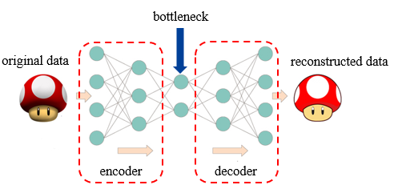

图中的 bottleneck 就是降维之后的特征。

### Feature learning
前两种函数优化的是投影函数，feature leaning 需要优化的是特征本身。

#### Stochastic Neighborhood Embedding (SNE)
这种方法基于希望降维之后的特征能够保持样本之间的关系(如距离关系)。

$\bm{x}\rightarrow \tilde{\bm{x}}$：希望保持第 $i$ 个样本和第 $j$ 个样本的转移概率(transition probability，可以理解为相似度)。
$$
\begin{gathered}
p(j|i)=\frac{\exp(-\|\mathbf{x}_i-\mathbf{x}_j\|^2)}{\sum_{k\neq i}\exp(-\|\mathbf{x}_i-\mathbf{x}_k\|^2)} \\
q(j|i)=\frac{\exp(-\|\tilde{\mathbf{x}}_i-\tilde{\mathbf{x}}_j\|^2)}{\sum_{k\neq i}\exp(-\|\tilde{\mathbf{x}}_i-\tilde{\mathbf{x}}_k\|^2)} 
\end{gathered}
$$

希望 $p(j|i)$ 和 $q(j|i)$ 比较接近。定义
$$
L=\sum_iKL(P_i||Q_i)=\sum_i\sum_jp(j|i)\log\frac{p(j|i)}{q(j|i)}
$$

* 其中 $P_{i}$ 表示任意样本转移到第 $i$ 个样本的概率，可以写为 $P_{i}=[p(1|i),p(2|i), \ldots ,p(n|i)]$，$Q_i$ 同理。
* $KL$ 即 KL divergence，是一种常用的距离度量的方法。

对于表达式 $L$
* 我们的目标是最小化 $L$
* 我们的优化对象为 $\tilde{\bm{x}}$

t-SNE 是 SNE 的一种拓展，将 $L$ 的表达式中的高斯分布换为 student-t 分布。student-t 分布的优点在于其函数图像是 heavy tail，对于 outlier，即两边的数据容忍度比较高。
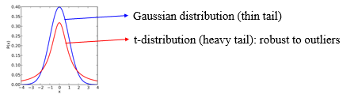

在研究中，t-SNE 通常用于做数据的可视化。即将一个高维的数据降到二维，然后就可以在图上画出来。

#### Local Linear Embedding (LLE)
选择一个样本点 $x_i$，考虑其邻域 $N(i)$。Linear 表示的就是这个样本点可以通过邻域点的线性组合得到。
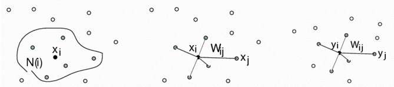

首先希望能够通过 $w_{ij}$ 得到样本之间的关系，此时需要优化来得到 $w_{ij}$：
$$
\begin{aligned}\min_{\mathbf{W}}&\quad\|\mathbf{x}_i-\sum_{j\in N(i)}w_{ij}\mathbf{x}_j\|^2\\\text{s.t.}&\quad\sum_jw_{ij}=1\end{aligned}
$$

然后将样本 $\bm{x}_i$ transfer 之后得到 $\bm{y}_i$，希望所有样本 $\bm{Y}$ 也能保持 $\bm{X}$ 之间的关系。因此需要优化 $\bm{Y}$：
$$
\begin{aligned}
\min_{\mathbf{Y}}~&\|\mathbf{y}_i-\sum_{j\in N(i)}w_{ij}\mathbf{y}_j\|^2\\
\mathrm{s.t.}~&\mathbf{Y}^T\mathbf{Y}=\mathbf{I}
\end{aligned}
$$

#### Sparse Coding
希望得到 $\bm{Y}$ 的稀疏表征 $\bm{X}$：$\min_{\mathbf{X},\mathbf{D}}\|\mathbf{Y}-\mathbf{D}\mathbf{X}\|_{F}^{2}+\lambda[\mathbf{\bar{X}}]_{1}$
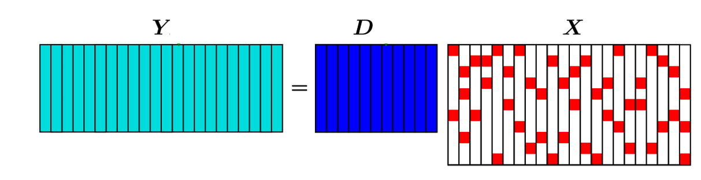

上式中矩阵的 F norm 类似于向量的 L2 norm。矩阵的 L1 norm 类似于向量的 L1 norm。

* $$\left\| X \right\|_{F} = \sqrt{\sum_{i}\sum_{j}x_{ij}^{2}}$$
* 通常 L1 norm 的加入可以使得矩阵变得更加系数，因此 L1 norm 也被称为 sparse norm。

为了优化目标，可以采取交替优化：先固定 $\bm{X}$，优化 $\bm{D}$；再固定 $\bm{D}$，优化 $\bm{X}$。

