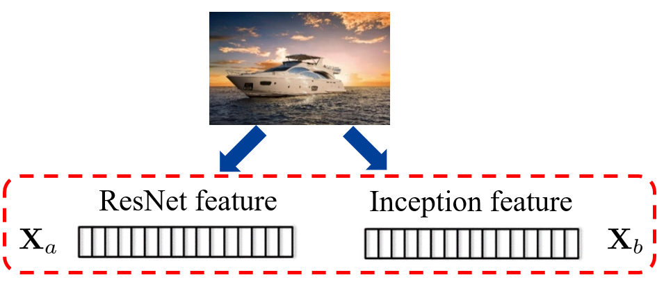
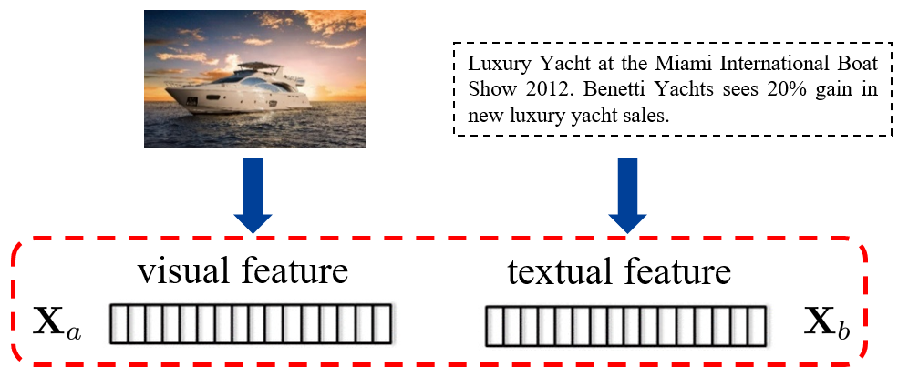
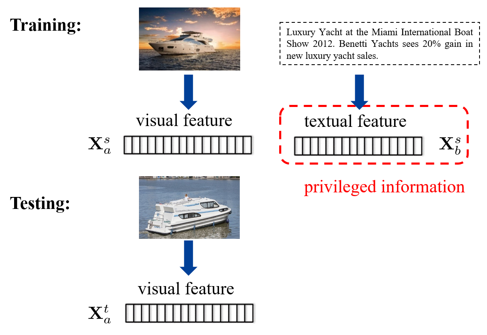
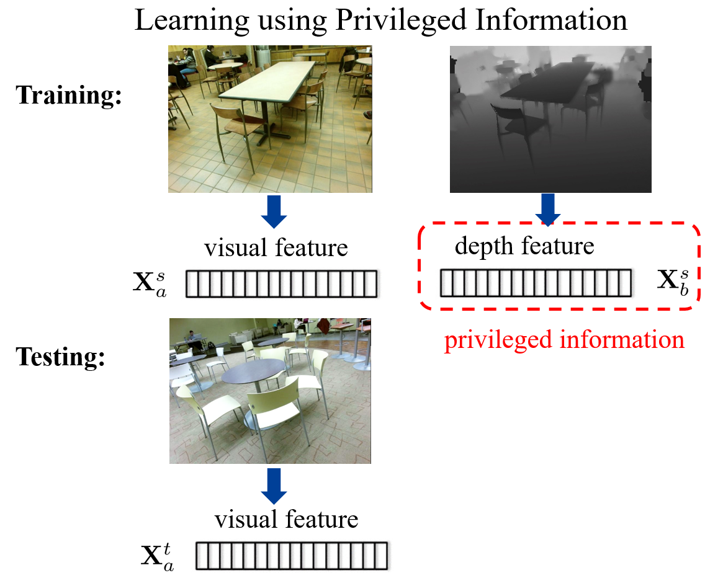
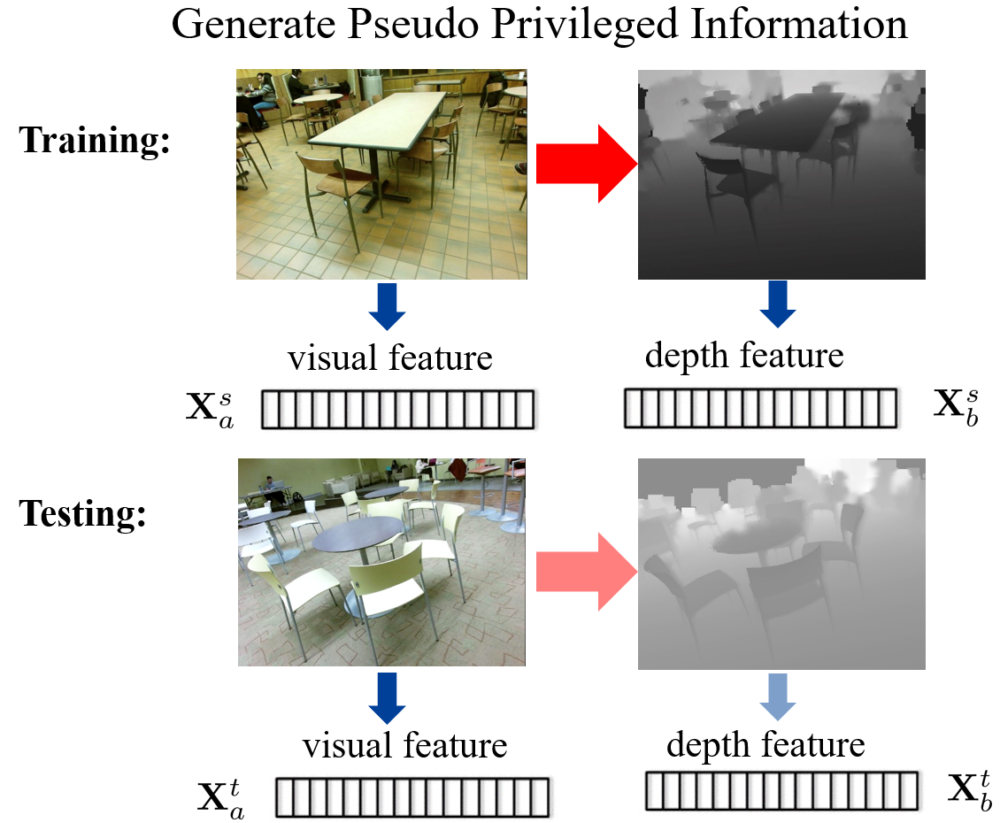
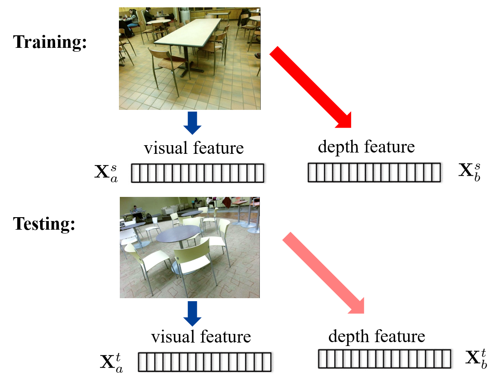
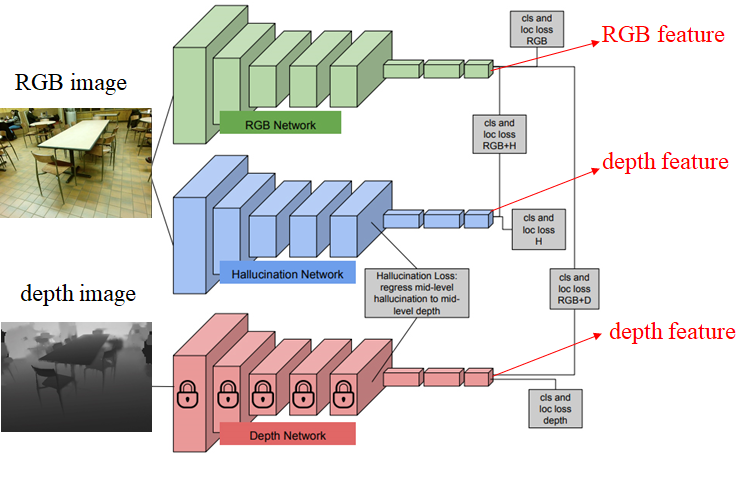
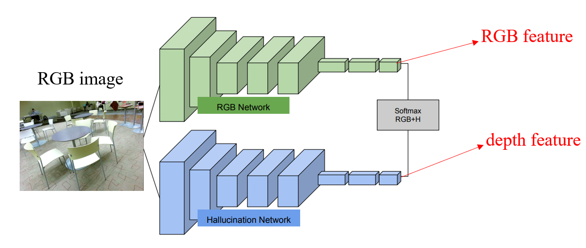
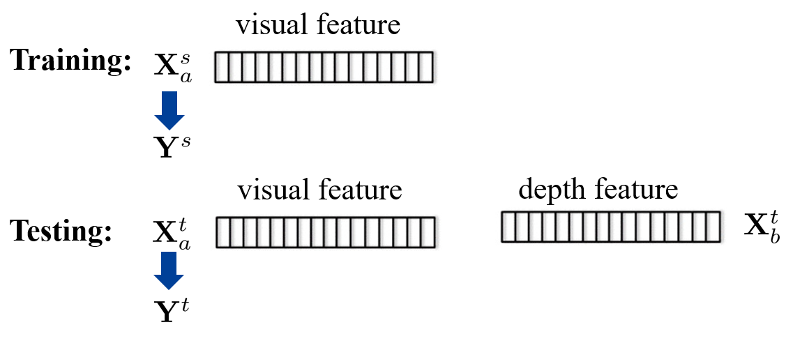

## Multi-view learning
在之前的学习中，每个样本都只有一个特征。训练样本特征即为 $\mathbf{X}_{a}^{s}$，测试样本特征为 $\mathbf{X}_a^{t}$。

在这里，我们则考虑一个样本可能会有多个特征，即训练样本可能为 $\mathbf{X}_a^s\quad\mathbf{X}_b^s$，而测试样本为 $\mathbf{X}_{a}^{t}\quad\mathbf{X}_{b}^{t}$。此处样本特征产生的方式较为多样，可能是同一个模态使用不同方式提取出的特征；也有可能是多模态各自提取不同的特征。

$$
\begin{aligned}
&\text{Single-view learning}&&\text{Multi-view learning}\\\\
&\mathrm{Training~feature~X}_{a}^{s}&&\text{Training feature }&&\mathrm{X}_{a}^{s}&&\mathrm{X}_{b}^{s}&&\mathrm{X}_{c}^{s}&&\cdots\\
&\mathrm{Testing~feature~X}_{a}^{t}&&\text{Testing feature }&&\mathrm{X}_{a}^{t}&&\mathrm{X}_{b}^{t}&&\mathrm{X}_{c}^{t}&&\cdots
\end{aligned}
$$

下面将介绍一些 multi-view learning 的方法，这些方法都是在解决如何使用多种特征的问题。

### Consensus principle
一致性原则：不同的特征存在一些一致性的信息。
模型特征的信息可以考虑两个方面，一个是输入的特征(feature)，另一个是输出的数(decision value)。

#### Canonical Correlation Analysis(CCA)
CCA 从输入特征出发。即给每种特征学习一个投影，使得投影后的特征相似性较大。

1. 首先对 $\mathbf{X}_{a}^{s}$， $\mathbf{X}_{b}^{s}$ 做去中心化(decentralization)。
2. 学习投影矩阵 $\mathbf{w}_a, \mathbf{w}_{b}$，分别对两个特征做投影。$\bar{\mathbf{X}}_a^s=\mathbf{w}_a^T\mathbf{X}_a^s\quad\bar{\mathbf{X}}_b^s=\mathbf{w}_b^T\mathbf{X}_b^s$
   $$
   \max_{\bar{\mathbf{X}}_a^s,\bar{\mathbf{X}}_b^s}\frac{\bar{\mathbf{X}}_a^s\bar{\mathbf{X}}_b^{sT}}{\sqrt{(\bar{\mathbf{X}}_a^s\bar{\mathbf{X}}_a^{sT})(\bar{\mathbf{X}}_b^s\bar{\mathbf{X}}_b^{sT})}}\longrightarrow\max_{\mathbf{w}_a,\mathbf{w}_b}\frac{\mathbf{w}_a^T\mathbf{X}_a^s\mathbf{X}_b^{sT}\mathbf{w}_b}{\sqrt{(\mathbf{w}_a^T\mathbf{X}_a^s\mathbf{X}_a^{sT}\mathbf{w}_a)(\mathbf{w}_b^T\mathbf{X}_b^s\mathbf{X}_b^{sT}\mathbf{w}_b)}}
   $$

最后使用投影之后的特征做训练和测试。训练特征：$\bar{\mathbf{X}}_a^s=\mathbf{w}_a^T\mathbf{X}_a^s\quad\bar{\mathbf{X}}_b^s=\mathbf{w}_b^T\mathbf{X}_b^s$，测试特征：$\bar{\mathbf{X}}_a^t=\mathbf{w}_a^T\mathbf{X}_a^t\quad\bar{\mathbf{X}}_b^t=\mathbf{w}_b^T\mathbf{X}_b^t$。

#### SVM-2K
该方法是从 decision value 的层面做一致性约束。

对于传统的 SVM：
$$
\begin{aligned}
\min_{\mathbf{w},b,\xi_i}&\frac{1}{2}\|\mathbf{w}\|^2+C\sum_{i=1}^N\xi_i\\\text{s.t.}&y_i(\mathbf{w}^T\mathbf{x}_i+b)\geq1-\xi_i,\quad\forall i,\\&\xi_i\geq0,\quad\forall i.
\end{aligned}
$$

而对于 SVM-2K，需要考虑两个特征：
$$
\begin{aligned}
\min_{\mathbf{w}^{a},b^{a},\xi_{i}^{a},\eta_{i}
        \atop
        \mathbf{w}^{b},b^{b},\xi_{i}^{b}}
&\frac{1}{2}\|\mathbf{w}^{a}\|^{2}+\frac{1}{2}\|\mathbf{w}^{b}\|^{2}+C\sum_{i=1}^{N}(\xi_{i}^{a}+\xi_{i}^{b})+\gamma\sum_{i=1}^{N}\eta_{i}\\
\text{s.t. }&y_i(\mathbf{w}^{aT}\mathbf{x}_i^a+b^a)\geq1-\xi_i^a,\quad\forall i\\
&y_i(\mathbf{w}^{bT}\mathbf{x}_i^b+b^b)\geq1-\xi_i^b,\quad\forall i \\
&\xi_i^a\geq0,\xi_i^b\geq0,\eta_i\geq0,\quad\forall i
\end{aligned}
$$

其中 $\eta_i$ 是为了使得两个 decision value 接近，会有
$$
\begin{aligned}
&|\mathbf{w}^{aT}\mathbf{x}_i^a+b^a-\mathbf{w}^{bT}\mathbf{x}_i^b-b^b|\leq\eta_i,\quad\forall i,\\
\end{aligned}
$$

最终对测试样本做预测，则使用
$$
\frac12[(\mathbf{w}^{aT}\mathbf{x}_i^a+b^a)+(\mathbf{w}^{bT}\mathbf{x}_i^b+b^b)]
$$

### Complementary principle
互补原则：不同的特征存在可以互补的信息。

#### Early fusion
先对几个 feature 进行拼接，得到一个 feature，然后再用这个 feature 进行训练和测试。
训练特征：$[\mathbf{X}_a^s;\mathbf{X}_b^s]$
测试特征：$[\mathbf{X}_a^t;\mathbf{X}_b^t]$

#### Late fusion
在训练时对几个 feature 分别训练分类器，在测试时对几个分类器的结果做平均。比如：
$$
\frac12[(\mathbf{w}^{aT}\mathbf{x}_i^a+b^a)+(\mathbf{w}^{bT}\mathbf{x}_i^b+b^b)]
$$

#### View selection
为不同的 feature 赋予不同的权重。

**Example: Multiple-Kernel Learning (MKL)**
为简单，这里只考虑 hard margin 的 svm。此时传统的 SVM 为：
$$
\begin{aligned}&\operatorname*{min}_{\mathbf{w}}&&\frac{1}{2}\|\mathbf{w}\|^{2}\\&\mathrm{s.t.}&&y_{i}\mathbf{w}^{T}\mathbf{x}_{i}\geq1,\quad\forall i.\end{aligned}
$$

而 MKL 为：
$$
\begin{aligned}
\min_{\mathbf{w}^{v},\mathbf{d}}&\frac{1}{2}\sum_{v=1}^{V}\frac{\|\mathbf{w}^{v}\|^{2}}{d^{v}}\\
\text{s.t. }&y_i\sum_{v=1}\mathbf{w}^{vT}\mathbf{x}_i^v\geq1,\quad\forall i,\\
&\mathbf{1}^T\mathbf{d}=1,\quad\mathbf{d}\geq\mathbf{0}.
\end{aligned}
$$

保留最后一个约束，使用拉格朗日乘子法
$$
\mathcal{L}_{\mathbf{w}^{v},\boldsymbol{\alpha}}=\frac{1}{2}\sum_{v}\frac{\|\mathbf{w}^{v}\|^{2}}{d^{v}}-\sum_{i}\alpha_{i}(y_{i}\sum_{v}\mathbf{w}^{vT}\mathbf{x}_{i}^{v}-1)\\
\frac{\partial\mathcal{L}_{\mathbf{w}^{v},\mathbf{\alpha}}}{\partial\mathbf{w}^{v}}=0\Longrightarrow\mathbf{w}^{v}=d^{v}\mathbf{X}^{v}(\boldsymbol{\alpha}\circ\mathbf{y})
$$

此时可以得到对偶问题：
$$
\begin{aligned}
\min_{\mathbf{d}}\max_{\mathbf{\alpha}}&-\frac12\sum_{v=1}^Vd^v\boldsymbol{\alpha}^T\left(\mathbf{K}^v\circ(\mathbf{y}\mathbf{y}^T)\right)\boldsymbol{\alpha}+\mathbf{1}^T\boldsymbol{\alpha}\\
\mathrm{s.t.}\quad&\boldsymbol{\alpha}\geq\boldsymbol{0},\\
&\mathbf{1}^T\mathbf{d}=1,\quad\mathrm{d}\geq0.
\end{aligned}
$$

可以看出这里的系数 $d^{v}$ 就是对不同特征的选择。对偶问题为 minmax 问题，可以通过交替更新的方式解决。

## Privileged Information
这里考虑的是有些信息只有训练样本有，但是测试样本没有。训练样本独有的信息称为 privilege information，而两者共有的信息称为 primary information。

比如从网上爬取图片的时候，可能还会得到文字信息；但是测试的样本没有。

或者拍摄采集图片时，可以获得包含深度信息的样本；但是测试样本没有。

### Learning using Privileged Information (PI)
* The same as multi-view learning, but not use PI for test images
* Generate pseudo PI for test images
* Use PI to control the training process

### Multi-view Learning
#### CCA & SVM-2K
使用的方法和 multi-view 中相同，在训练时同时使用 primary information 和 privilege information，但是在测试的时候只使用 primary information。

### Generate Pseudo Privileged Information
以 RGB 图片和深度图为例：

此时可以学习一个从 RGB 图片到深度图的映射(比如使用 conditional GAN)，给测试样本也生成深度图。此时就可以变成一个常规的 multi-view learning。

#### Hallucination network
或者先从深度图中提取 feature，此时就可以考虑学习从 RGB 图片到深度的 feature 的映射，然后给测试样本生成深度的 feature。

Hallucination network 解决的就是这个问题。

上图中的三个网络分别是
* 从 RGB 图片中提取 RGB feature
* 从 RGB 图片中提取深度 feature
* 从深度图中提取深度 feature

然后对这三个网络都计算了分类损失。除此之外，这里还加入了 Hallucination Loss，这个损失是两个深度 feature 之间的距离，目的是让从 RGB 和深度图片中提取的深度 feature 尽可能相似。

在测试阶段，就可以从 RGB 图片中分别提取 RGB 和深度 feature 了。

### Use PI to control the training process
#### SVM+
$$
\begin{aligned}
\min_{\mathbf{w},b,\tilde{\mathbf{w}},\tilde{b}}&\frac12\|\mathbf{w}\|^2+\frac\gamma2\|\tilde{\mathbf{w}}\|^2+C\sum_{i=1}^N(\tilde{\mathbf{w}}^T\tilde{\mathbf{x}}_i+\tilde{b})\\
\text{s.t.}&y_i(\mathbf{w}^T\mathbf{x}_i+b)\geq1-(\tilde{\mathbf{w}}^T\tilde{\mathbf{x}}_i+\tilde{b}),\quad\forall i,\\
&\tilde{\mathbf{w}}^T\tilde{\mathbf{x}}_i+\tilde{b}\geq0,\quad\forall i.
\end{aligned}
$$

原本的 slack variable $\xi_{i}$ 被替换成了这里的 slack function $(\tilde{\mathbf{w}}^T\tilde{\mathbf{x}}_i+\tilde{b})$，而这个 slack function 则是由 privilege information 判断样本是否为 outlier。

想要求解，先列出拉格朗日展开式
$$
\begin{aligned}
\mathcal{L}_{\mathbf{w},b,\tilde{\mathbf{w}},\tilde{b}}=&\frac12\|\mathbf{w}\|^2+\frac\gamma2\|\tilde{\mathbf{w}}\|^2+C\sum_{i=1}^N(\tilde{\mathbf{w}}^T\tilde{\mathbf{x}}_i+\tilde{b})\\
&-\sum_{i=1}^N\alpha_i\left[y_i(\mathbf{w}^T\mathbf{x}_i+b)-1+(\tilde{\mathbf{w}}^T\tilde{\mathbf{x}}_i+\tilde{b})\right]-\sum_{i=1}^N\beta_i(\tilde{\mathbf{w}}^T\tilde{\mathbf{x}}_i+\tilde{b})
\end{aligned}
$$

再对拉格朗日展开式进行求导：
$$
\begin{aligned}
&\frac{\partial\mathcal{L}}{\partial\mathbf{w}}=\mathbf{w}-\sum_i\alpha_iy_i\mathbf{x}_i=\mathbf{0}\quad\longrightarrow\quad\mathbf{w}=\sum_i\alpha_iy_i\mathbf{x}_i \\
&\frac{\partial\mathcal{L}}{\partial b}=-\sum_i\alpha_iy_i=0\longrightarrow\sum_i\alpha_iy_i=0 \\
&\frac{\partial\mathcal{L}}{\partial\tilde{\mathbf{w}}}=\gamma\tilde{\mathbf{w}}+\sum_{i=1}^N(C-\alpha_i-\beta_i)\tilde{\mathbf{x}}_i=\mathbf{0} \longrightarrow  \tilde{\mathbf{w}}=\frac1\gamma\sum_i(\alpha_i+\beta_i-C)\tilde{\mathbf{x}}_i\\
& \frac{\partial\mathcal{L}}{\tilde{b}}=\sum_{i=1}^N(C-\alpha_i-\beta_i)=0 \longrightarrow \sum_{i}(\alpha_i + \beta_i) = NC
\end{aligned}
$$

将求导得到的信息带入拉格朗日展开式，得到 dual form：
$$
\begin{aligned}
\max_{\boldsymbol\alpha,\boldsymbol\beta}\quad & -\frac12\boldsymbol{\alpha}^T(\mathbf{K}\circ(\mathbf{y}\mathbf{y}^T))\boldsymbol{\alpha}-\frac1{2\gamma}(\boldsymbol{\alpha}+\boldsymbol{\beta}-C\boldsymbol{1})^T\tilde{\mathbf{K}}(\boldsymbol{\alpha}+\boldsymbol{\beta}-C\boldsymbol{1})+\boldsymbol{1}^T\boldsymbol{\alpha}  \\
\mathrm{s.t.}\quad & \alpha\geq0,\quad\beta\geq0,  \\
&\boldsymbol{\alpha}^T\mathbf{y}=0, \\
&(\boldsymbol{\alpha}+\boldsymbol{\beta})^T\boldsymbol{1}=NC.
\end{aligned}
$$

### If unlabeled test images are available in the training stage
在测试阶段反而信息更多。此时一种方法是类似方面，创造 Pseudo PI。

或者使用 $\mathbf{X}_{b}^{t}$ 创造相似度矩阵 $\mathbf{D}$

然后对测试集上的映射做约束
$$
\begin{aligned}
&\tilde{y}_{a,i}^t=\mathbf{w}_a^T\mathbf{x}_{a,i}^t+b_a\\
&\min\sum_{i<j}D_{ij}(\tilde{y}_{a,i}^t-\tilde{y}_{a,j}^t)^2
\end{aligned}
$$

第一个式子中 $\mathbf{w}_{a}^{\mathrm{T}}$ 和 $b_a$ 是使用 training data 训练出来的分类器；第二个式子为 Laplace loss，用于表示分类器预测出来的结果和 privilege information 相似度矩阵的符合程度，这个 loss 可以和训练分类器时标准的分类损失同时使用。即：
$$
L_{total} = L_{cls} + L_{lap}
$$

这个 Laplace loss 在实际使用的时候可以化简成矩阵形式。令对角阵 $\mathbf{A}$ 满足 $A_{i,i} = \sum_{j}D_{ij}$，则可以写出 Laplace 矩阵 $\mathbf{L} = \mathbf{A} - \mathbf{D}$，则 Laplace loss 有：
$$
\min\sum_{i<j}D_{ij}(\tilde{y}_{a,i}^t-\tilde{y}_{a,j}^t)^2 \longrightarrow \min_{} \operatorname{tr}(\mathbf{\tilde{Y}}_a^{t}\mathbf{L} \mathbf{\tilde{Y}}_{a}^{t\mathrm{T}})
$$