## Multi-label Learning
一般的 single-label learning，一个输入对应一系列标签中的一个标签；而 multi-label learning，一个输入则可以对应多个标签。比如下图就是一个 multi-label 的例子。
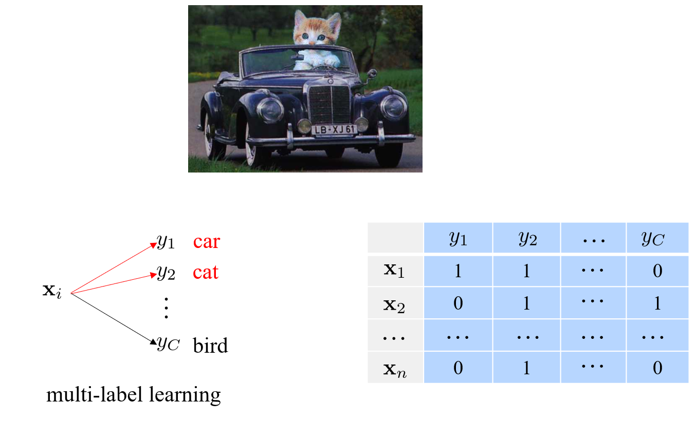

### Convert to binary classification
可以将多标签问题转化为一系列二分类问题，即考虑每个标签是否为真。

#### Label independent
在每个标签都相互独立的情况下
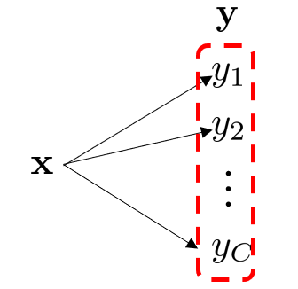
有
$$
p(\mathbf{y}|\mathbf{x})=\prod_{c=1}^Cp(y_c|\mathbf{x})
$$

#### Label dependent
但如果标签之间存在依存关系，使得标签之间能够构建出有向无环图：
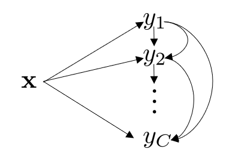
有
$$
p(\mathbf{y}|\mathbf{x})=\prod_{c=1}^Cp(y_c|\mathbf{x},y_1,\ldots,y_{c-1})
$$

或者可以写成
$$
p(\mathbf{y}|\mathbf{x})=\prod_{c=1}^Cp(y_c|\mathbf{x},\text{pa}(y_c))
$$

其中 $\text{pa}(y_c)$ 为 $y_c$ 标签的父节点的集合。

具体每一个标签训练过程参照如下：
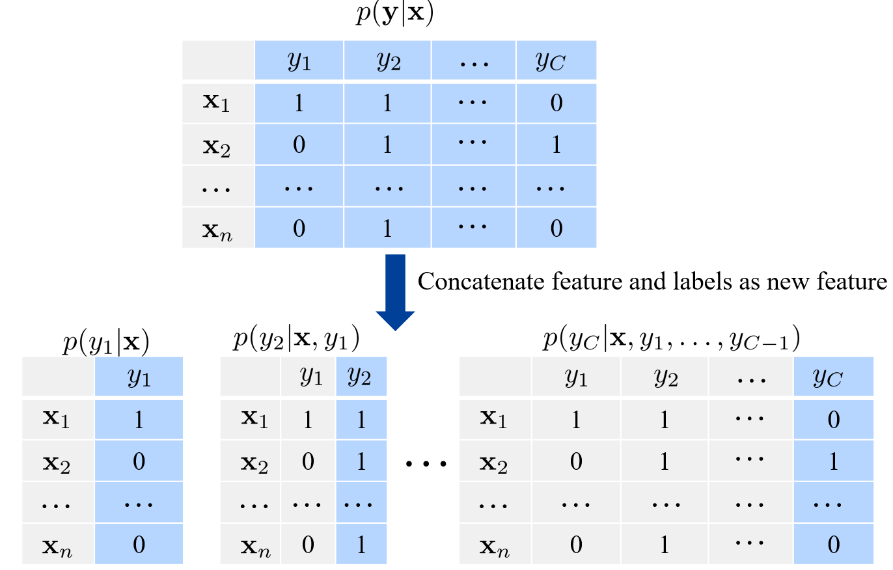

### Convert to multi-class classification
假如共有 $C$ 个标签，那么标签的组合共有 $2^{C}$ 种可能性，将每一种可能作为一个新的标签，那么就重新变成 single-label 问题。
$$
\begin{aligned}
&p(\mathbf{y}|\mathbf{x})&&\mathbf{y}=[y_1,y_2,\ldots,y_C]\in\{0,1\}^C\\
&\Downarrow \\
&p(\hat{y}|\mathbf{x})&&\hat{y}\in\{0,1,\ldots,2^C-1\}
\end{aligned}
$$

但是考虑到 $2^{C}$ 可能过大，因此这种方法不好用。

那么可以考虑对所有标签进行分组，分组之间可以有重合。假设一组中有 $L$ 个标签，那么这一组可以使用上面提到的方式变成 single-label 的问题，同时新的 single-label 问题的标签数为 $2^{L}$。只要控制 $L$，那么就能控制问题的规模。

总体流程为：
* 将原标签分成 $K$ 个 group，每个 group 中有 $L$ 个标签。
  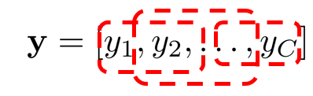
* 然后对每组训练分类器，进行分类
  $$
  p(\hat{y}_1|\mathbf{x})p(\hat{y}_2|\mathbf{x})\cdots p(\hat{y}_K|\mathbf{x}) \quad
  \hat{y}_i\in\{0,1,\ldots,2^L-1\}
  $$
* 最后聚合(ensemble voting)每组的答案，得到
  $$
  p(y_1|\mathbf{x})p(y_2|\mathbf{x})\cdots p(y_C|\mathbf{x})
  $$

#### Example
下面是一个分组与预测的例子：
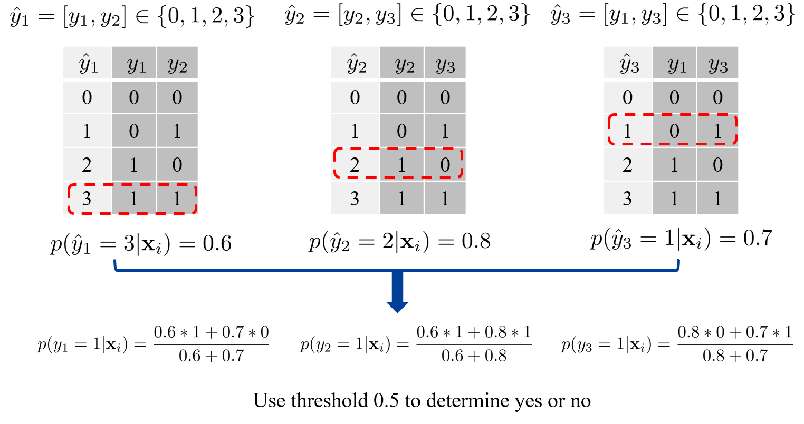

### Multi-label evaluation
single-label 的分类问题的评测较为简单，正确和错误一目了然；但是在 multi-label 中，可能存在有些预测正确，有些不正确的情况。一次 multi-label 中有多种评测方法。

假如实际标签与预测结果如下
Ground-truth label vector: $\mathbf{y} = [1, 0, 0, 0]$
Predicted label vector: $\mathbf{\tilde{y}} = [1, 0 , 0, 1]$

Loss 计算：
* 0/1 loss: $\delta(\mathbf{y}\neq \mathbf{\tilde{y}}) = 1$，即必须所有都正确
* Hamming loss: $\frac{1}{C} \sum_{c=1}^{C}\delta(y_c\neq \tilde{y}_c)=\frac{1}{4}$，即考虑预测对了几个标签

Evaluation 方法：
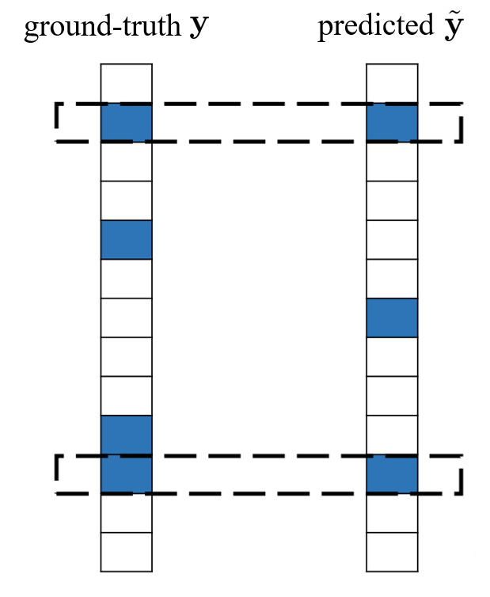

* precision: 预测为真的结果有多少个是对的 $\displaystyle \frac{|\mathbf{y}\cap\tilde{\mathbf{y}}|}{|\tilde{\mathbf{y}}|}=0.66$
* recall(召回率): 原本为真的结果有多少被预测出来了 $\displaystyle \frac{|\mathbf{y}\cap\tilde{\mathbf{y}}|}{|\mathbf{y}|}=0.5$
* F1: 综合考虑上两者 $\displaystyle \frac{2|\mathbf{y}\cap\tilde{\mathbf{y}}|}{|\mathbf{y}|+|\tilde{\mathbf{y}}|}=0.57$，相当于 $\displaystyle F_1=\frac{2}{\frac{1}{precision}+\frac{1}{recall}}$
* Jaccard distance: 交并集 $\displaystyle \frac{|\mathbf{y}\cap\tilde{\mathbf{y}}|}{|\mathbf{y}\cup\tilde{\mathbf{y}}|}=0.4$

## Multi-task Learning
multi-task 和 single-task 的对比：
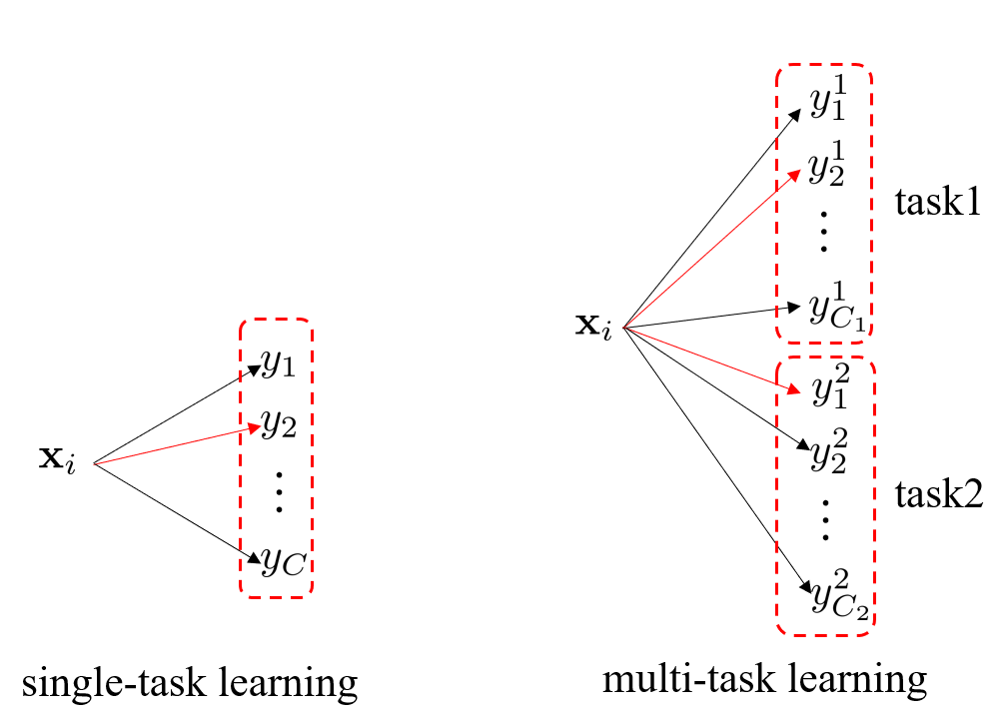

以人脸识别任务为例：
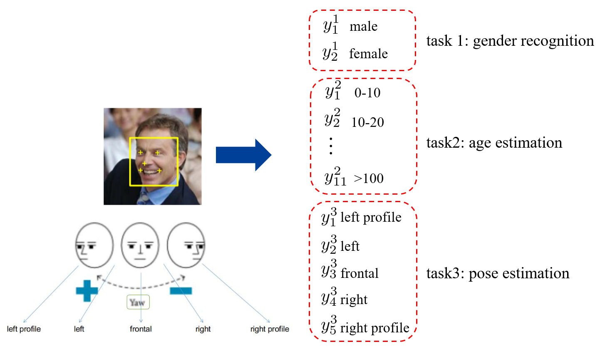

比如给一张人脸，需要同时做识别性别、识别年龄以及分辨姿势三个 task。

* multi-task learning 将一些相关的任务综合考虑，是为了提升模型的泛化能力
* multi-task 的几个 task 通常共享一些表征或者知识
* 我们需要去建模这些任务的相关性。比如考虑任务之间的相关度，或者使用同一个 backbone。

multi-task learning 的训练过程为：
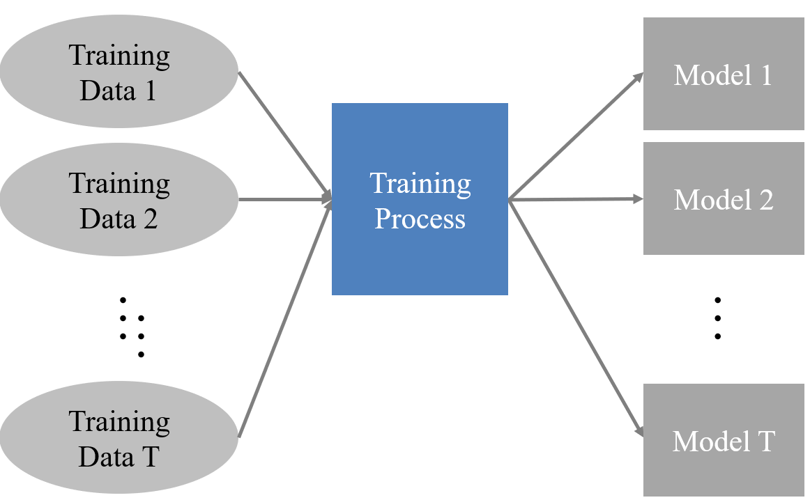

### Traditional Methods
传统方法通常聚焦于二分类任务。比如前面人脸识别的多任务问题，可以化简成一系列二分类问题：
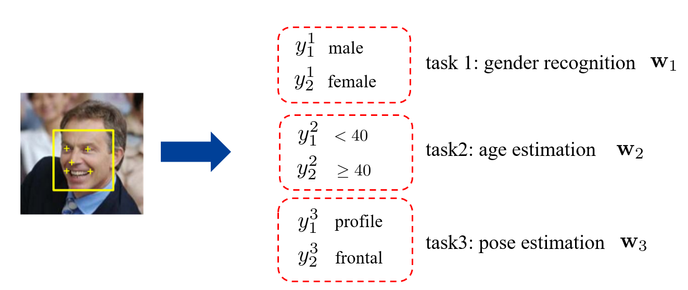

此时在原有方法上做一定改进即可
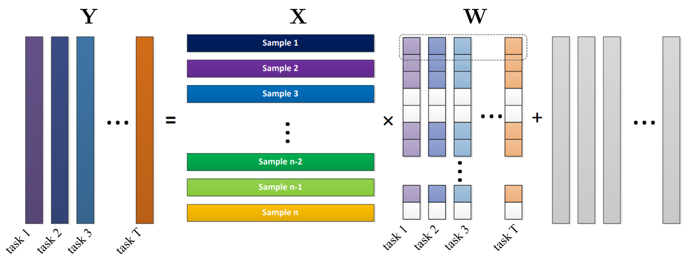

* single-task learning: $\displaystyle \min_{\mathbf{w}}\left\| \mathbf{w}^{\mathrm{T}}\mathbf{X}-\mathbf{y} \right\|_{}^{2}$
* multi-task learning: $\displaystyle \min_{\mathbf{w}_t} \sum_{t=1}^{T}\left\| \mathbf{w}_t^{\mathrm{T}}\mathbf{X}-\mathbf{y}_t \right\|_{}^{2}$

#### Regularization
在上面的基础上，可以对各个 task 之间的关系进行约束
* coherence regularizer。此时相当于认为各个任务都较为相近
  $$
  \begin{aligned}\min_{\mathbf{w}_t}\sum_{t=1}^T\|\mathbf{w}_t^T\mathbf{X}-\mathbf{y}_t\|^2+\sum_{t=1}^T\|\mathbf{w}_t-\frac1T\sum_{i=1}^T\mathbf{w}_i\|^2\end{aligned}
  $$
* low-rank regularizer。$\left\| \cdot  \right\|_{*}$ 称为 nuclear norm，是对矩阵秩的估计。将矩阵 $\mathbf{W}$ 变得低秩，直观上来说各个 task 可以分成若干组相似的。
  $$
  \min_{\mathbf{w}_t}\sum_{t=1}^T\|\mathbf{w}_t^T\mathbf{X}-\mathbf{y}_t\|^2+\|\mathbf{W}\|_*
  $$
* consider task similarity。式中 $s_{ij}$ 是由先验知识得到的任务 $i,j$ 之间的相似度，如果相似度大，那么 $s_{ij}$ 较大。
  $$
  \min_{\mathbf{w}_t}\sum_{t=1}^T\|\mathbf{w}_t^T\mathbf{X}-\mathbf{y}_t\|^2+\sum_{i\neq j}s_{ij}\|\mathbf{w}_i-\mathbf{w}_j\|^2
  $$

### Deep learning Methods
#### shared feature space (hard sharing)
即前面若干层完全相同。
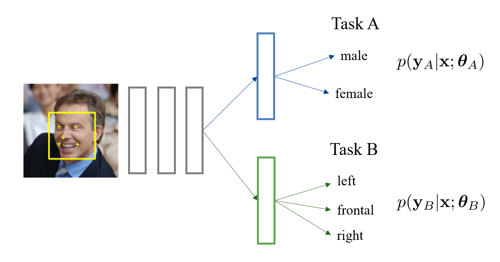

#### shared feature space (soft sharing)
通过损失限制前面几层的参数更加相似。同时可以通过控制 $\mathcal{L}$ 的系数，来控制两个 task 前面几层的相似度。
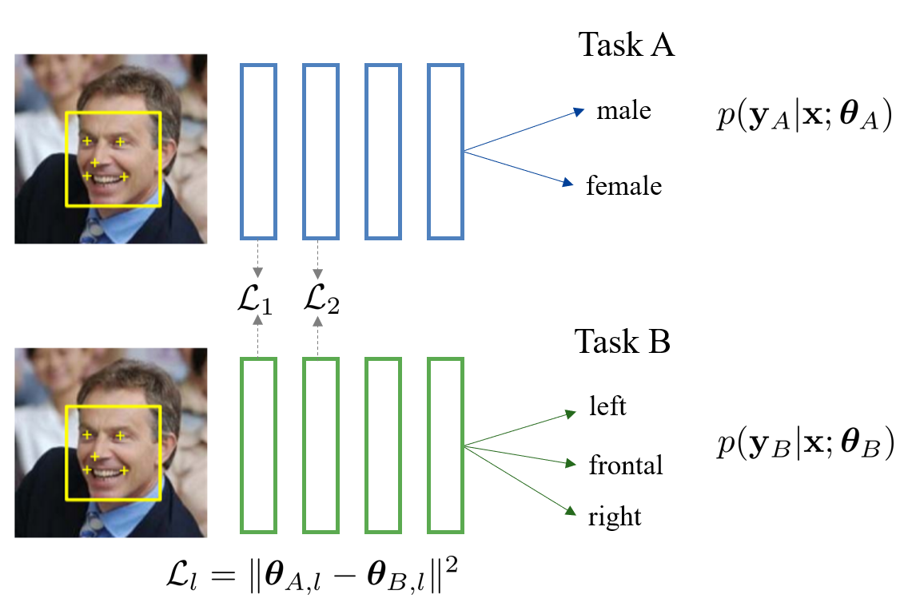

还有一种 **Cross-stitch** 方法。这种方法考虑的是实现上下两路信息的交互，也就是让两个 task 的层做线性组合。系数 $\alpha$ 可学习。
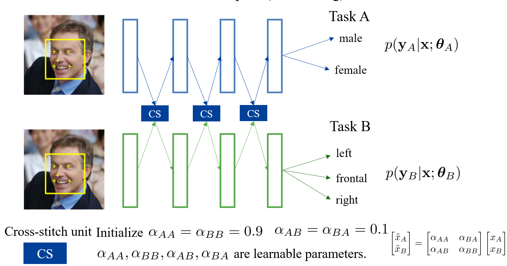

#### conditional variable
每个 task 对应一个变量，记为 $\mathbf{z}_{A}$ 和 $\mathbf{z}_{B}$，称为 task embedding，该变量可以被指定，也可以设置成可学习的。task embedding 可以结合到模型的某些层中。
* injection
  * position，即考虑结合到哪些层中
  * method，即结合的方式
    * cross-attention, dynamic-kernel, modulation, concatenation

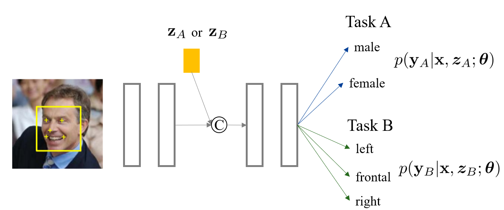

#### one encoder and multiple decoders
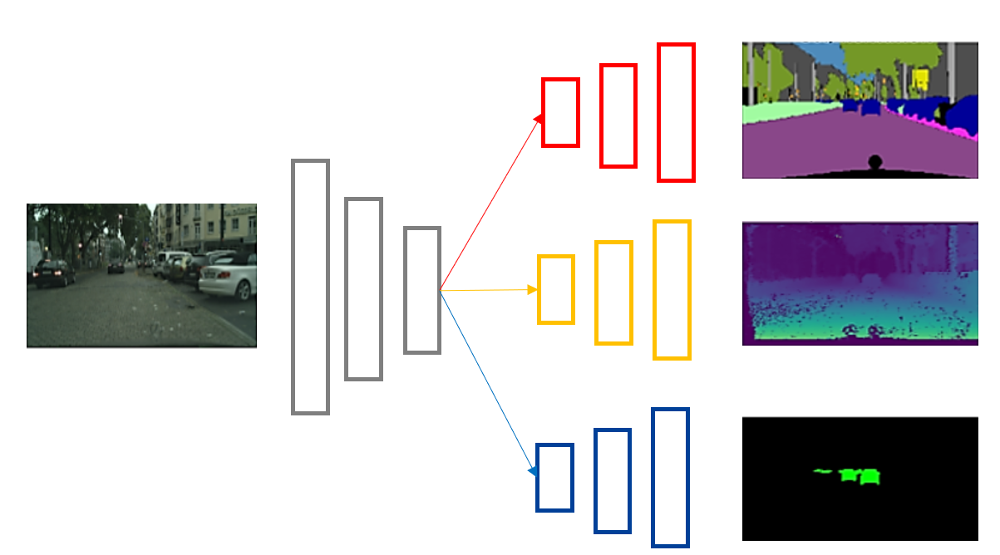

