## Zero-shot Learning
主要解决训练集和测试集在种类上的差异。在之前的机器学中，训练集和测试集的种类总是相同的；而在这里，则需要考虑训练集、测试集种类不完全一样的问题。

### Training/testing categories
记
* Training categories: $\mathcal{C}^{s}$
* Testing categories: $\mathcal{C}^{t}$

传统机器学习中，$\mathcal{C}^{s}= \mathcal{C}^{t}$
$$
\begin{array}{l}
\mathcal{C}^s=\{c_1,\dots,c_{l-1},c_l,\dots,c_m\}\\
\mathcal{C}^t=\{c_1,\dots,c_{l-1},c_l,\dots,c_m\}
\end{array}
$$

在这里，需要考虑 $\mathcal{C}^{s}\neq \mathcal{C}^{t}$，即
$$
\begin{aligned}
\mathcal{C}^{s}=\{c_{1},\ldots,c_{l-1},&c_{l},\ldots,c_{m}\}\\
\mathcal{C}^{t}=\{&c_{l},\ldots,c_{m},c_{m+1}\ldots,c_{n}\}
\end{aligned}
$$

例如在下图展现的例子中，测试集就出现了训练集没有的斑马
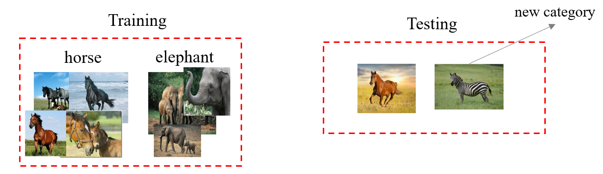

首先考虑测试集中同样被训练集包含的部分，即：$\{ c_l, \ldots c_m \}$。此时处理较为简单，如果是训练多个二分类器，那么测试集中不存在的类对应的二分类器直接不使用：
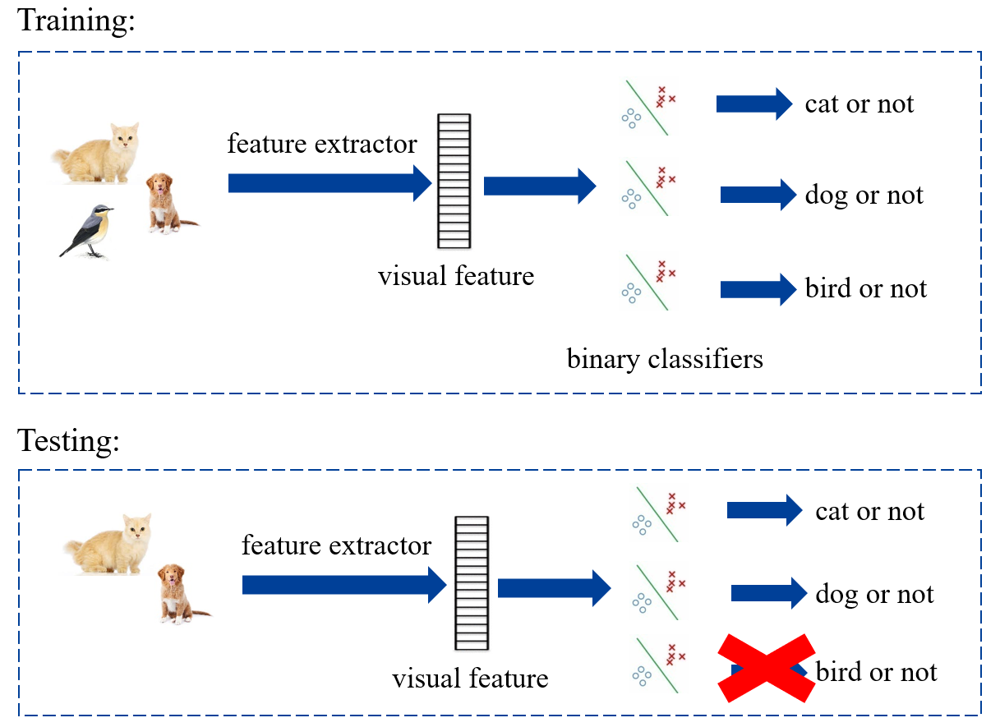

如果是训练一个多分类器，那么舍弃测试集中不存在的类别：

但是如果需要考虑训练集中不存在的部分，即：$\{ c_{m+1}, \ldots c_n \}$，则需要使用 Zero-shot Learning 方法。

### Zero-shot Learning
Zero-shot Learning 的现实意义是，从网络上收集数据时，根据长尾效应，有些数据非常多，但有些数据会很少甚至没有；或者说有些事物是新出现的，因此已有的数据很少。
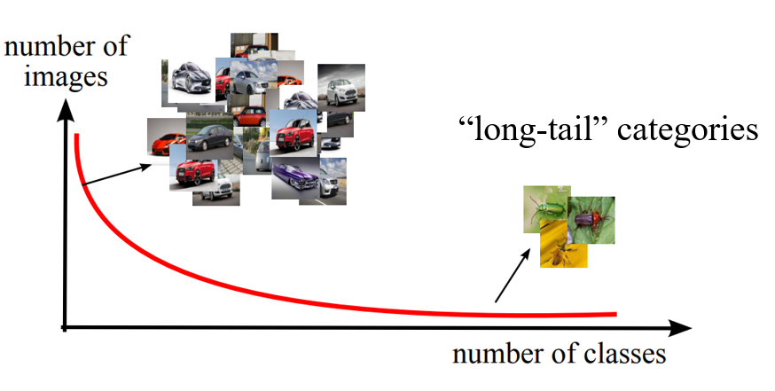

zero-shot learning 的核心是知识迁移。同时在 zero-shot learning 中，训练集的样本种类称为 seen categories，测试集中的种类称为 unseen categories。
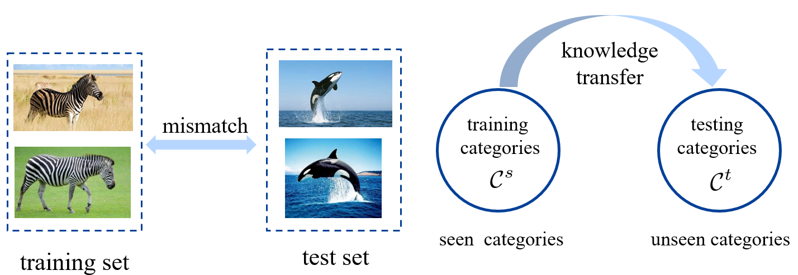

seen categories 和 unseen categories 之间利用 category-level 的语义信息(semantic information)进行连接，语义信息包括属性(attributes)或者描述(category descriptions)。对于一张图片，我们会将其从视觉空间(visual space)映射到语义空间(semantic space)。
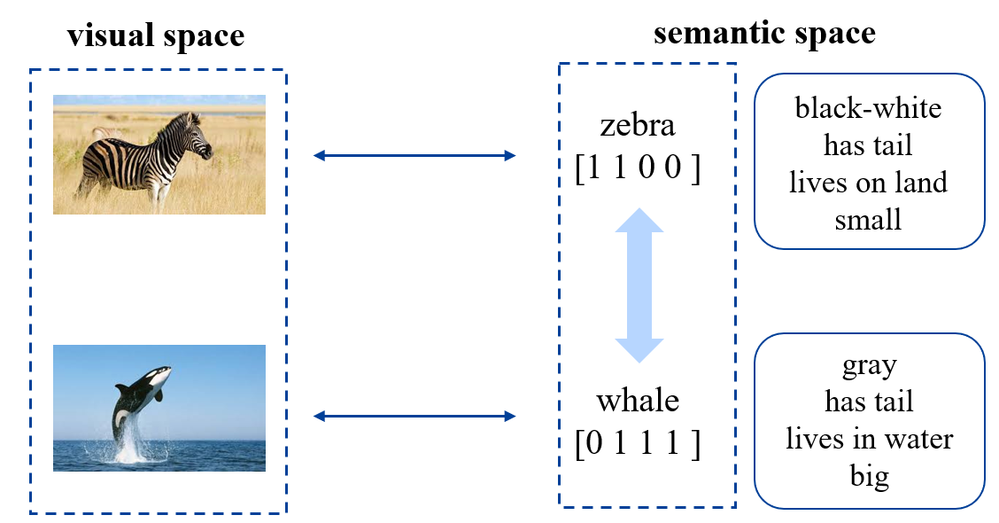

#### manually annotated attribute vector
首先考虑将 attribute vector 作为语义信息。比如下方右图中，每行为一个 category，每列则为一个 attribute。那么每个 category 都有一个 attribute vector。
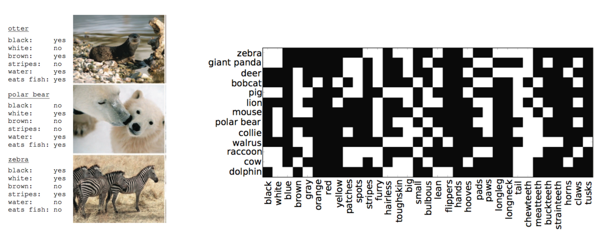

* 优点：准确，信息丰富。
* 缺点：标注的成本非常高。对于两个相近的种类，比如两种鸟，想要区分，就需要考虑非常细节的信息。

下面展示根据 attribute vector 如何预测一个新的种类。其核心思想就是从 seen categories 里学习不同的 attributes，然后应用于 unseen categories。
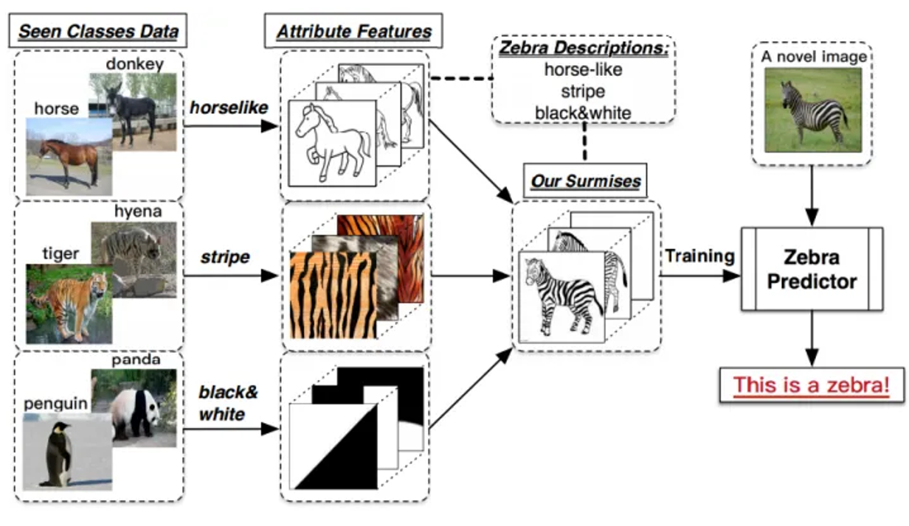

#### free category-level information
即通过一些免费的方法
* textual feature of wiki page: 比如说可以通过维基百科中对一个种类的文本描述，可以进行爬取并且提取文本特征，作为语义信息。
* word vector of category name: 使用一个大型的语言学模型(linguistic model)进行训练，为每一个单词获得一个 word vector，这个 vector 中含有很强的语义信息，比如可以加减。
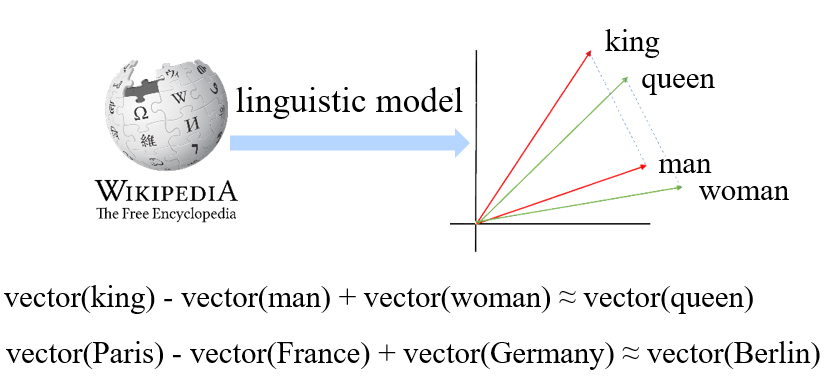

* 优点：成本低，基本免费
* 缺点：获取信息噪音大，且信息量相比 attribute vector 更少。

### Zero-shot learning methods
传统机器学习需要学的是从 visual space 到 category space 的映射，而 zero-shot 则需要多考虑一个 semantic space。
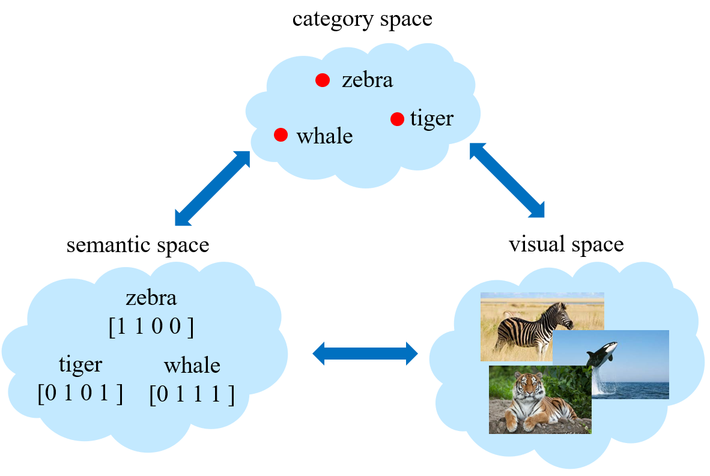

#### semantic relatedness methods
第一步计算所有 categories 两两之间的相似度，得到一个相似度矩阵(similarity matrix)；第二步则可以进行从 visual space 到 category space 的映射。
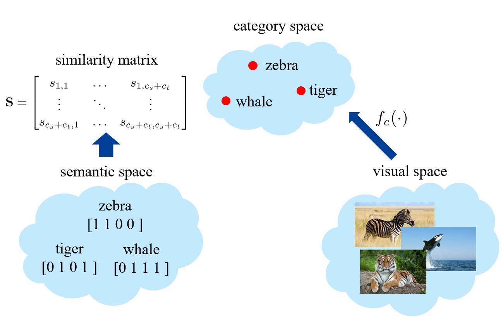

映射的方式为：
1. 首先能够训练得到 seen categories 的二分类器 $\{f_1(\cdot),\ldots,f_{c_s}(\cdot)\}$
2. 然后将这些分类器按照相似度矩阵生成 unseen categories 的二分类器 $\displaystyle f_{c_s+k}(\cdot)=\sum_{i=1}^{c_s}(s_{c_s+k,i})f_i(\cdot)$。其中相似度矩阵的参数需要进行一些归一化操作。

这种方法较为粗糙，性能也比较差。

#### semantic embedding methods
方法1：学习从 visual space 到 semantic space 的映射，这里考虑的是矩阵的映射。
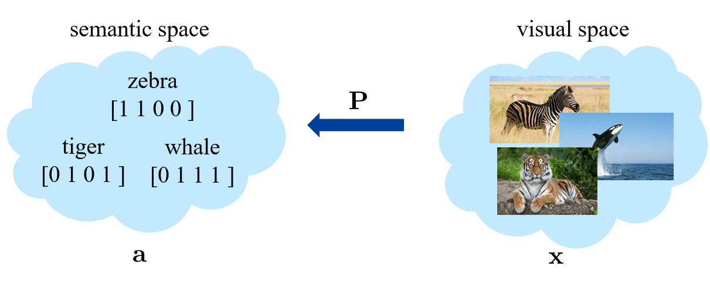

* 训练过程: $\displaystyle \min_{\mathbf{P}}\sum_{i=1}^{n_s}\|\mathbf{P}\mathbf{x}_i-\mathbf{a}_{c(i)}\|^2$，其中 $c(i)$ 指的就是样本 $i$ 对应的 category。
* 测试过程: $\displaystyle y_j=\arg\min_{c\in\mathcal{C}^t}\|\mathbf{P}\mathbf{x}_j-\mathbf{a}_c\|^2$

方法2：相当于是将 visual space 和 semantic space 投影到一起。
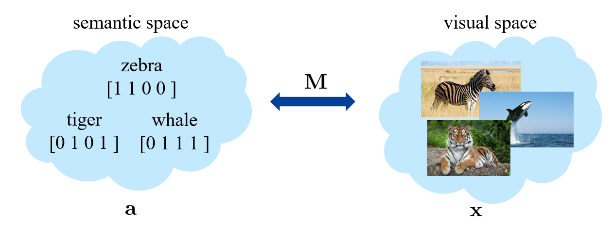

* 训练过程：$\displaystyle \min_{\mathbf{M}}\sum_{i=1}^{n_s}\sum_{c'=1}^{c_s}\max\left[0,\delta(c'\neq c(i))+\mathbf{x}_i^T\mathbf{M}\mathbf{a}_{c'}-\mathbf{x}_i^T\mathbf{M}\mathbf{a}_{c(i)}\right]$，式中 $\mathbf{x}^{\mathrm{T}}\mathbf{M}\mathbf{a}$ 称为 compatibility score。训练过程就是希望当 $c'\neq c(i)$ 时，让 $\mathbf{x}_i^{\mathrm{T}}\mathbf{M}\mathbf{a}_{c'}$ 比 $\mathbf{x}_i^T\mathbf{M}\mathbf{a}_{c(i)}$ 尽量小。
* 测试过程：$\displaystyle y_j=\arg\max_{c\in\mathcal{C}^t}\mathbf{x}_j^T\text{Ma}_c$。

方法3：和方法2类似，同样是学习一个矩阵 $\mathbf{M}$。记 $\mathbf{X}=[\mathbf{x}_1,\ldots,\mathbf{x}_{n_s}]\quad\mathbf{A}=[\mathbf{a}_1,\ldots,\mathbf{a}_{c_s}]$。

* 训练过程：$\displaystyle \min_{\mathbf{M}}\|\mathbf{X}^T\mathbf{M}\mathbf{A}-\mathbf{Y}\|_F^2+\lambda_1\|\mathbf{M}\mathbf{A}\|_F^2+\lambda_2\|\mathbf{X}^T\mathbf{M}\|_F^2+\lambda_1\lambda_2\|\mathbf{M}\|_F^2$。这里最关键的是第一项，后面几项为约束项，不太重要。
* 测试过程: $\displaystyle y_j=\arg\max_{c\in\mathcal{C}^t}\mathbf{x}_j^T\mathbf{M}\mathbf{a}_c$

#### synthetic methods
希望能够生成训练集中不存在的样本。因此需要学习从 semantic space 到 visual space 的映射 $G$，输出可以为图片，也可以是一个 visual feature。下面为一个示例方法：
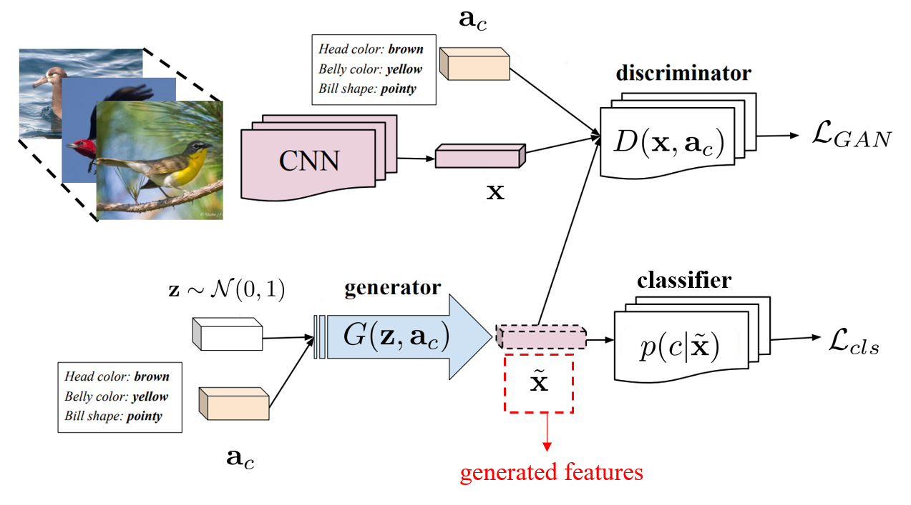

* 左上角为图片的特征提取器，可以从真实的图片中提取 visual feature $x$。
* 左下角用于从 semantic vector 生成 visual feature。同时这里还使用高斯分布随机生成了 $z$，用于给一个 category 生成多个 visual feature $\tilde{x}$。
* 右上角为判别器 $D$，希望将 $x$ 判别为真，将 $\tilde{x}$ 判别为假。这里利用 GAN 的训练方法，就能是的生成的 $\tilde{x}$ 比较真实。
* 右下角希望生成的 $\tilde{x}$ 能够符合 category。

训练阶段使用 seen categories，在测试阶段使用 unseen categories。

### Problems in Zero-shot learning
#### Projection domain shift
对于同一个属性，在不同的类别中，差别可能非常大。比如斑马和虎鲸都有尾巴，这两个 categories 虽然都有这一属性，但是在图片上差别非常大。

解决思路：使用无标签的数据将 visual space 到 semantic space 的映射迁移到 unseen categories 上。

#### Hubness problem
比如学习到一个映射，并且将这个映射作用于测试样本，发现可能大多数的样本都被映射到同一个或少量几个 unseen categories 上。原因可能是距离度量学习的不是很合理。
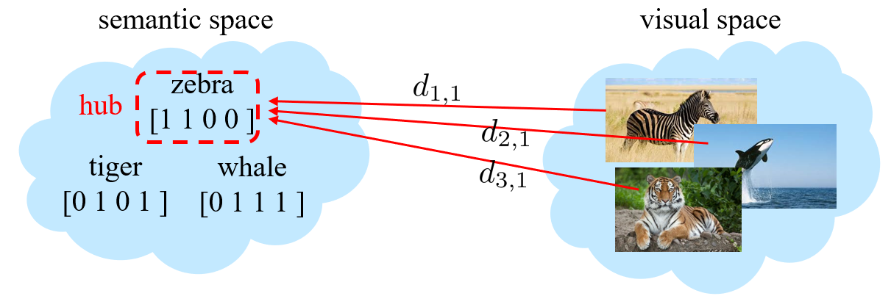

解决思路：
* 对 distance 做 normalize。$\displaystyle \tilde{d}_{kc}=\frac{d_{kc}}{\sqrt{\sum_id_{ic}^2}}$，$\tilde{y}_k=\arg\min_c\tilde{d}_{kc}$。分母是对不同测试样本求和，这使得每个 category 的 distance 都得到了约束。
* 用排序代替 distance，看样本 $x_k$ 在哪个种类 $c$ 中排名最靠前。$\operatorname{rank}(c,\mathbf{x}_k)=\sum_i\delta(d_{ic}<d_{kc})$，$\tilde{y}_k=\arg\min_c\operatorname{rank}(c,\mathbf{x}_k)$

#### Semantic gap
有些属性和视觉信息不相关，此时无法学到这个属性到视觉空间的映射。比如北极熊会吃鱼，这一点就通常无法从图片中看出来。
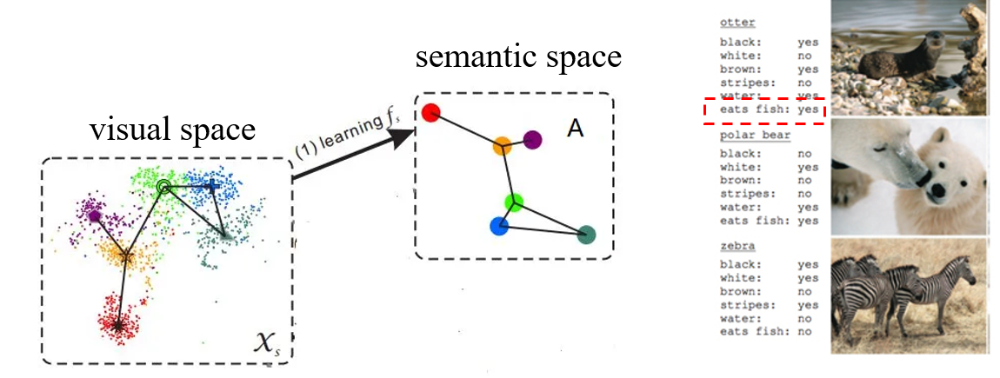

解决方案：重新 align 一下 attribute vector。首先仍然需要学习从 visual space 到 semantic space 的映射 $f_s$，使用之后得到一系列的 categories 的 semantic vector $\mathbf{a}_{c}'$。对于真实的 $\mathbf{a}_c$，则使用K近邻算法，搜索到最近的 $K$ 个 $f_s(\mathbf{x}_i)$，将这 $K$ 个 $f_s(\mathbf{x}_i)$ 的平均值作为新的 $\mathbf{a}_c$。新的 $\mathbf{a}_c$ 离原来的比较近，但是效果更好。

### Generalized zero-shot learning
$$
\begin{aligned}
&\text{standard zero-shot learning}&&\text{generalized zero-shot learning}\\
&\mathcal{C}^s=\{1,\ldots,c_s\}&&\mathcal{C}^s=\{1,\ldots,c_s\}\\
&\mathcal{C}^t=\{c_s+1\ldots,c_s+c_t\}&&\mathcal{C}^t=\{1,\ldots,c_s,c_s+1,\ldots,c_s+c_t\}
\end{aligned}
$$

对于 generalized zero-shot learning，之前的方法也都完全适用。但是在测试集上进行预测时，会出现 seen bias，也就是 seen categories 的得分会普遍高于 unseen categories。
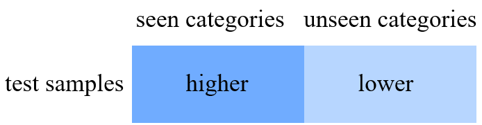

解决方案：
* 对于 seen categories 的 score，直接减去一个常数
* hierarchical prediction。首先对于一个 test sample，先判断其为 seen 和 unseen，然后再在 seen categories 和 unseen categories 中选择。

### Modern (Pseudo) zero-shot learning
改变了 zero-shot learning 的范式，让训练集不受限制。

* 训练：收集大量的图片-文本对进行训练，得到 Text Encoder 和 Image Encoder。
* 推理：对大量文本试用 Text Encoder 得到文本特征，然后与 Image Encoder 提取得到的图片特征进行匹配。

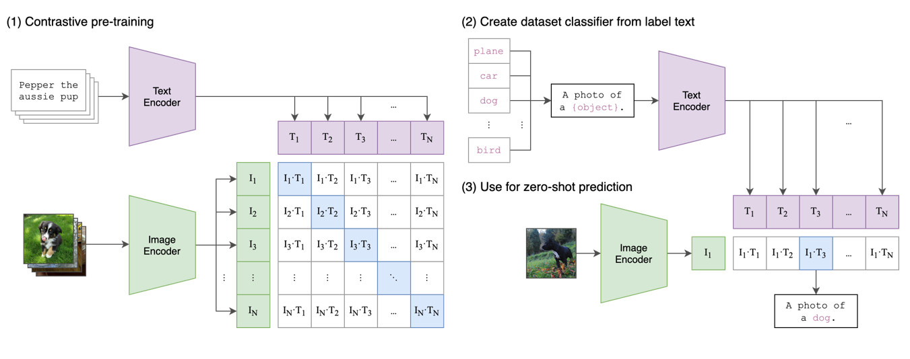

## Few-shot Learning
和 zero-shot 类似，但是并非测试集中包含训练集中不存在的 categories，而是某些种类在训练集中只有少量。

在 few-shot learning 中，不同的种类可以分为 base categories $\mathcal{C}^{b}$ 和 novel categories $\mathcal{C}^{n}$，划分依据为训练集数量。base categories 有充足的数量，而 novel categories 只有少量样本。$\mathcal{C}^{b} \cap \mathcal{C}^{n} = \empty$

下图展示 zero-shot 和 few-shot 的不同。zero-shot 需要 semantic 的信息，而 few-shot 通常不用。
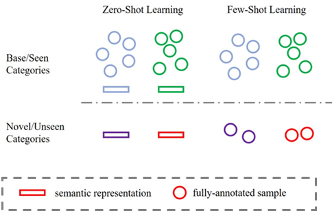

few-shot learning 希望提升 novel categories 的分类性能。

### Meta-learning
Learn a learning strategy to adjust well to a new few-shot learning task。即学习学习的方法。

由于 meta-learning 比 learning 更高一层，所以引入 meta-training 和 meta-testing。在 meta-training 阶段，会学习很多 task；而在 meta-testing 阶段，则会有新的 task，希望将原来学习的经验迁移到新的 task 上。比如之前学过滑雪，那么在学习滑冰这个新的任务时，应该能学的更快。
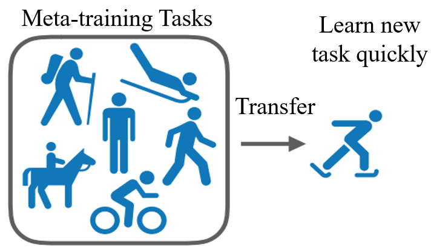

* 在 meta-learning 阶段
  * 从 meta-training set 中提取 training/support set 作为训练数据，数据为 N-way K-shot，也就是有 $N$ 个 categories，每个 category 分别有 $K$ 个 training samples。
  * 从 meta-training set 中提取 test/query set 作为测试数据。
  * 上述两步合称为一个 task。总共需要构建很多个 task。
  * 在这个阶段可以学到很多先验知识。
* 在 meta-testing 阶段，同样选择 N-way K-shot 的 training set，以及选择 test/query set。

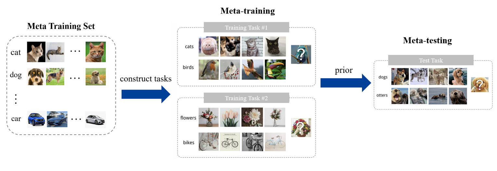

#### MAML
一个具体的 meta-learnin 的方法。

MAML 的目标是，优化模型初始化参数，使得在新的 task 中，只需要很少几步就能完成训练。即 fast adaptation to a new task。
* 假设模型参数为 $\theta$，想要将其迁移到一个新的 task $\mathcal{T}_i$ 上，那么将其更新为 $\theta_i'$
    $$
    \theta_i^{\prime}=\theta-\alpha\Delta_\theta\mathcal{L}_{\mathcal{T}_i}(f_\theta)
    $$
* meta-learning 的目标为：
    $$
    \min_\theta\sum_{\mathcal{T}_i\sim p(\mathcal{T})}\mathcal{L}_{\mathcal{T}_i}(f_{\theta_i^{\prime}})
    $$
* 因此对 $\theta$ 进行优化
  $$
  \theta\leftarrow\theta-\beta\Delta_\theta\sum_{\mathcal{T}_i\sim p(\mathcal{T})}\mathcal{L}_{\mathcal{T}_i}(f_{\theta_i^{\prime}})
  $$

下图展示了 MAML 在模型初始化参数优化方面的作用，图中蓝色的 $\phi$ 表示的就是通过 MAML 选取的初始化参数，该参数在不同的任务中（两条不同的绿色曲线）更容易达到最小值点，而不是像 Multi-task Learning 那样只能达到极小值点。
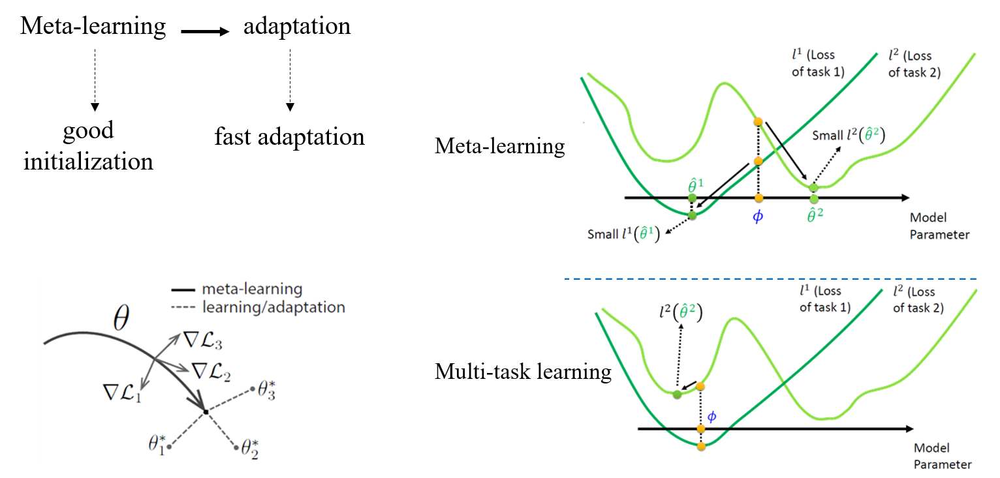

### Metric learning 
Learn a semantic embedding space using a distance loss function。总体思路是计算 query sample 和 support set 中每个 sample 的相似度，通过比较相似度来预测标签。

#### Relation Network
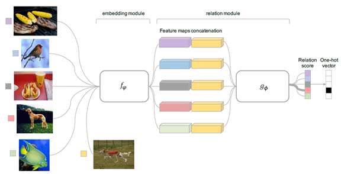

提取所有图片的 feature，然后通过 relation model 判断两个 feature 是否为同一个种类。

#### Prototypical Network
* 首先学习一个从样本到 feature 的 mapping function $f_{\phi}$
* 为每个 class 生成 prototype。这里的 prototype 相当于 K-means 算法中的 centroid，就是用于代表一个类。最简单的生成方法就是取平均。
  $$
  \mathbf{c}_k=\frac{1}{|S_k|}\sum_{(\mathbf{x}_i,y_i)\in S_k}f_\phi(\mathbf{x}_i)
  $$
* 对于测试数据，则试用 softmax 选取最近的 class。
  $$
  p_{\boldsymbol{\phi}}(y=k\mid\mathbf{x})=\frac{\exp(-d(f_{\boldsymbol{\phi}}(\mathbf{x}),\mathbf{c}_k))}{\sum_{k'}\exp(-d(f_{\boldsymbol{\phi}}(\mathbf{x}),\mathbf{c}_{k'}))}
  $$

### Synthetic method
Synthesize more data from the novel classes to facilitate the regular learning。和 zero-shot learning 中生成数据相似，只是这里是从少量的样本生成大量的样本。

总体流程包含两块：
* 从 base class 得到生成模型(synthesizer model)。
* 使用生成模型，基于少量的 novel class 的样本，生成大量同类样本。

方法1：左侧是生成器，右侧是分类器，两者共同训练。

方法2：
* 首先使用 encoder 捕捉同种类差异(intra-class difference)
* 然后捕捉到的差异迁移到新的种类上

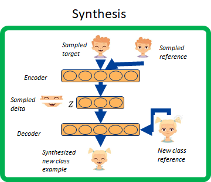

