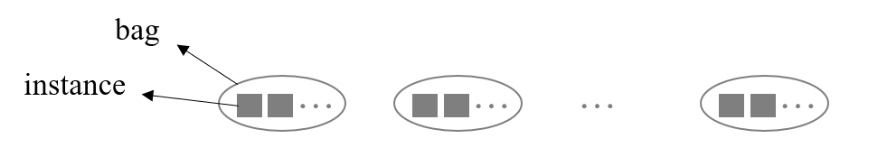
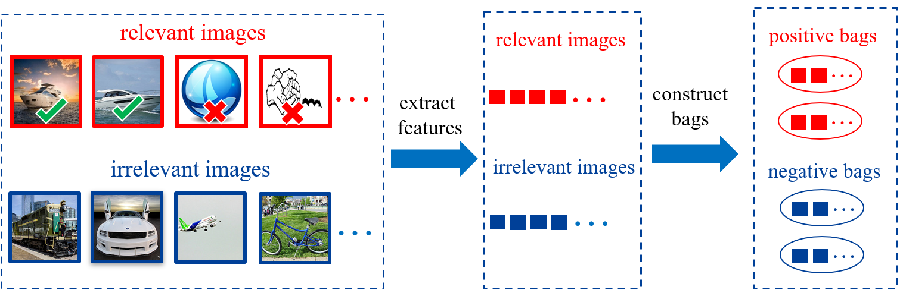

## Multi-instance Learning(MLT)
* 是为了解决数据标签噪音的问题。标签噪音指的是标签数据不可靠的问题。Weakly supervised learning 用于解决这个问题，而 multi-instance learning 是 weakly supervised learning 中一种常用的方法。
* 将数据分为很多个 bag，每个 bag 里有很多 instance
* 每个 bag 都有一个标签

首先为简单，我们考虑二分类问题。那么 bag 可以分为 positive bag 和 negative bag。
* negative bag：只包含 negative instance，不包含 positive instance
* positive bag：包含至少一个 positive instance。

$$
\mathcal{B}_l = \{\mathbf{x}_{l,1},\ldots,\mathbf{x}_{l,|\mathcal{B}_l|}\}
$$

$\mathcal{B}_l$ 的标签记为 $Y_l$，$x_{l,i}$ 的标签记为 $y_{l,i}$，那么形式化地描述 negative 和 positive bag 的性质：
$$
y_{l,i} = 
\begin{cases}
\displaystyle \sum_{i\in\{1,\ldots,|\mathcal{B}_l|\}}\frac{y_{l,i}+1}{2}\geq1,\quad\forall Y_l=1\\
y_{l,i}=-1,\quad\forall Y_l=-1
\end{cases}
$$

但是标准的 multi-instance learning 的假设过于严格，因此可以进行适当放松：
$$
\begin{cases}
\displaystyle \sum_{i\in\{1,\ldots,|\mathcal{B}_l|\}}\frac{y_{l,i}+1}{2}\geq\sigma_p|\mathcal{B}_l|,\quad\forall Y_l=1,\\
\displaystyle \sum_{i\in\{1,\ldots,|\mathcal{B}_l|\}}\frac{y_{l,i}+1}{2}\leq\sigma_n|\mathcal{B}_l|,\quad\forall Y_l=-1.
\end{cases}
$$

其中 $\sigma_p$ 和 $\sigma_n$ 都为超参数。

### Application
比如从网上收集数据，搜索船的图片，那么能得到一些真的船的图片，但也会得到一些模型图或相关图片，这部分内容可以放到 positive bag 中；同时搜索如汽车、飞机等图片，此时得到的图片和船无关，那么可以作为 negative bag。

接下来考虑使用松弛版本的分类方法
$$
\begin{cases}\displaystyle\sum_{i\in\{1,...,|\mathcal{B}_l|\}}\frac{y_{l,i}+1}{2}\geq\sigma|\mathcal{B}_l|,\quad\forall Y_l=1,\\[2ex]y_{l,i}=-1,\quad Y_l=-1.\end{cases}
$$

### Bag-level method
* 优点：
  * 可以建模 instance 的分布与关系
  * 可以处理无法被分类的 instance
  * 处理起来更快
* 缺点：
  * 无法直接对 instance 做分类

#### sMIL
$$
\begin{aligned}
\min_{\mathbf{w},b,\xi_l,\xi_{l,i}}&\frac{1}{2}\|\mathbf{w}\|^2+C\sum_{Y_l=1}\xi_l+C\sum_{Y_l=-1}\sum_{i=1}^{|\mathcal{B}_l|}\xi_{l,i}\\
\text{s.t.}\quad &Y_l(\mathbf{w}^T\phi(\mathbf{z}_l)+b)\geq\rho-\xi_l,\quad\forall Y_l=1,\\
&y_{l,i}(\mathbf{w}^T\phi(\mathbf{x}_{l,i})+b)\geq1-\xi_{l,i},\quad\forall Y_l=-1,\forall i,\\
&\xi_l\geq0,\quad\forall Y_l=1.\\&\xi_{l,i}\geq0,\quad\forall Y_l=-1,\forall i.
\end{aligned}
$$

* 约束条件中，第一条式子考虑的是 positive bag
  * $\displaystyle \mathbf{z}_l=\frac1{|\mathcal{B}_l|}\sum_{i=1}^{|\mathcal{B}_l|}\mathbf{x}_{l,i}$，表示包的中心位置
  * $\rho=\sigma-(1-\sigma)=2\sigma-1$，表示对边界条件的松弛。因为 positive bag 中不全是 positive instance，所以 $\rho$ 可以适当小于 $1$，同时设置为与 positive instance 比例 $\sigma$ 相关。
* 目标函数与标准的 SVM 基本相同

### Instance-level method
需要设法推断出 positive bag 中 instance 的标签。
* 优点：
  * 可以直接对 instance 进行分类
* 缺点：
  * 当正负 instance 难以区分时无法使用

#### mi-SVM
$$
\begin{aligned}
\operatorname*{min}_{\mathbf{w},b,\xi_{l,i}}&\frac{1}{2}\|\mathbf{w}\|^{2}+C\sum_{l=1}^{L}\sum_{i=1}^{|\mathcal{B}_{l}|}\xi_{l,i}\\
\mathrm{s.t.}\quad&y_{l,i}(\mathbf{w}^{T}\phi(\mathbf{x}_{l,i})+b)\geq1-\xi_{l,i},\quad\forall l,\forall i,\\
&\xi_{l,i}\geq0,\quad\forall l,\forall i.
\end{aligned}
$$

式中 $y_{l,i}$ 也是待优化变量，即我们想要预测正包中 instance 种类。在优化时，需要将 $\{ \mathbf{w},b \}$, $y_{l,i}$ 作为两组参数交替更新。
1. 固定 $\{ \mathbf{w}, b \}$，更新 $y_{l,i}$：
   1. $\begin{aligned}\tilde{y}_{l,i}=\mathbf{w}^T\phi(\mathbf{x}_{l,i})+b\end{aligned}$
   2. 将 $\tilde{y}_{l,i}$ 转为满足约束条件的 $y_{l,i}$：$\begin{cases}\sum_{i\in\{1,\ldots,|\mathcal{B}_l|\}}\frac{y_{l,i}+1}{2}\geq\sigma|\mathcal{B}_l|,\quad\forall Y_l=1\\y_{l,i}=-1,\quad\forall Y_l=-1,\forall i.\end{cases}$。(比如当得到的 $\tilde{y}_{l,i}$ 没有达到 positive instance 要求的比例，那么就需要将某些 $\tilde{y}_{l,i}$ 强制转为 $1$)。
2. 固定 $y_{l,i}$，更新 $\{ \mathbf{w}, b \}$，这里使用标准 SVM 的更新方法。

当预测出的 $y_{l,i}$ 不再变化，则算法收敛，终止训练。

#### MI-SVM
在一个正包中，只考虑最靠近 positive 的 instance。不需要交替优化。
$$
\begin{aligned}
\min_{\mathbf{w},b,\xi_{l},\xi_{l,i}}& \frac12\|\mathbf{w}\|^2+C\sum_{Y_l=1}\xi_l+C\sum_{Y_l=-1}\sum_{i=1}^{|\mathcal{B}_l|}\xi_{l,i}  \\
\text{s.t.} \quad& Y_l\max_{i\in\mathcal{B}_l}(\mathbf{w}^T\phi(\mathbf{x}_{l,i})+b)\geq1-\xi_l,\quad\forall Y_l=1 \\
&y_{l,i}(\mathbf{w}^T\phi(\mathbf{x}_{l,i})+b)\geq1-\xi_{l,i},\quad\forall Y_l=-1,\forall i,\\
&\xi_l\geq0,\quad\forall Y_l=1.\\
&\xi_{l,i}\geq0,\quad\forall Y_l=-1,\forall i.
\end{aligned}
$$

