## Distance between two samples
### Minkowski distance
即 $L_p$ distance。
$$\begin{gathered}
d(\mathbf{x},\mathbf{y}) =\left(\sum_i|x_i-y_i|^p\right)^{\frac1p} \\
=(\sum_{i}|d_{i}|^{p})^{\frac1p} 
\end{gathered}$$

以下是几个比较重要的 $p$
* $p=\infty$，切比雪夫距离。$d(\bm{x},\bm{y})=\max_{i}\left\vert x_i-y_i \right\vert$
* $p=2$，欧氏距离。$d(\bm{x},\bm{y})=\sqrt{\sum_{i}(x_i-y_i)^{2}}$
* $p=1$，曼哈顿距离。$d(\bm{x},\bm{y})=\sum_{i}\left\vert x_i-y_i \right\vert$

### Cosine distance
通常和 cosine similarity 一起出现。

比较最常见的欧氏距离和余弦距离：
$$
\begin{aligned}
&d_{euc}(\mathbf{x},\mathbf{y})=\|\mathbf{x}-\mathbf{y}\|=\sqrt{\|\mathbf{x}\|^2+\|\mathbf{y}\|^2-2\mathbf{x}^T\mathbf{y}} \\
&Sim_{cos}(\mathbf{x},\mathbf{y})=\frac{\mathbf{x}^T\mathbf{y}}{\|\mathbf{x}\|\|\mathbf{y}\|}
\end{aligned}
$$

当 $\left\| x \right\|_{}=\left\| y \right\|_{}=1$，有
$$
d_{euc}(\mathbf{x},\mathbf{y})=\sqrt{2-2\mathbf{x}^T\mathbf{y}}=\sqrt{2-2sim_{cos}(\mathbf{x},\mathbf{y})}
$$

### Metric learning
* What if different dimension are heterogeneous?
比如有向量 $\bm{u}$，一个维度为身高，另一个维度为体重。那么直接计算距离 $\left\| \bm{u}_{1}-\bm{u}_{2} \right\|_{}$ 是不合理的。此时可以考虑使用 Z-score normalization。
* What if different dimension are heterogeneous?

此时可以考虑将两个不同样本的特征从不同空间投影到相同的空间: $d(\bm{x},\bm{y}) \Rightarrow d(\bm{P}\bm{x},\bm{P}\bm{y})$
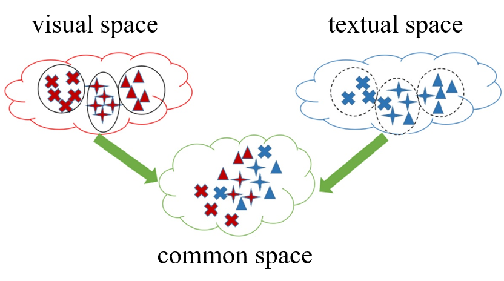

#### Mahalanobis distance
首先引入欧氏距离的拓展：马氏距离。
* 欧氏距离：
$$
d(\mathbf{x},\mathbf{y})=\|\mathbf{x}-\mathbf{y}\|=\sqrt{(\mathbf{x}^T-\mathbf{y}^T)(\mathbf{x}-\mathbf{y})}
$$
* 马氏距离：
$$
d(\mathbf{P}\mathbf{x},\mathbf{P}\mathbf{y})=\|\mathbf{P}\mathbf{x}-\mathbf{P}\mathbf{y}\|=\sqrt{(\mathbf{x}^T-\mathbf{y}^T)\mathbf{P}^T\mathbf{P}(\mathbf{x}-\mathbf{y})}=\sqrt{(\mathbf{x}^T-\mathbf{y}^T)\mathbf{M}(\mathbf{x}-\mathbf{y})}
$$

#### Metric learning
即学习 $M$，得到更好地距离度量。
$$
\begin{aligned}
\max_{\mathbf{M}}&\sum_{(\mathbf{x}_i,\mathbf{x}_j)\in\mathcal{D}}d_M^2(\mathbf{x}_i,\mathbf{x}_j)\\
\mathrm{s.t.}&\sum_{(\mathbf{x}_i,\mathbf{x}_j)\in\mathcal{S}}d_M^2(\mathbf{x}_i,\mathbf{x}_j)\leq1,\\
&\mathbf{M}\succeq\mathbf{0}.
\end{aligned}
$$

式中 $\mathcal{D}$ 意为 different，表示 $\bm{x}_i,\bm{x}_j$ 属于不同种类；$\mathcal{S}$ 意为 same，表示 $\bm{x}_i,\bm{x}_j$ 属于相同种类。$\mathbf{M}\succeq\mathbf{0}$ 表示 $\mathbf{M}$ 为半正定矩阵。
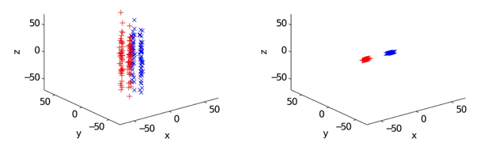

### Earth Mover's Distance (EMD)
首先把两个样本转化为两个集合
$$
\begin{aligned}\mathcal{S}&=\{(\mathbf{x}_1^s,w_1^s),(\mathbf{x}_2^s,w_2^s),\ldots,(\mathbf{x}_m^s,w_m^s)\}\\[1ex]\mathcal{T}&=\{(\mathbf{x}_1^t,w_1^t),\ldots,(\mathbf{x}_n^t,w_n^t)\}\end{aligned}
$$

式中 $(\bm{x}^{s}_{1},w_1^{s})$ 是一个 pair，可以理解为一个属性和这个属性的占比。

比如考虑两张图片的距离，集合中的 pair 可以理解为颜色以及颜色在图片中的占比。
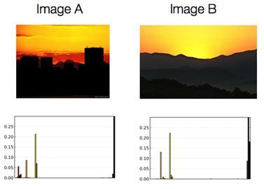

算法可以按照如下图片理解：
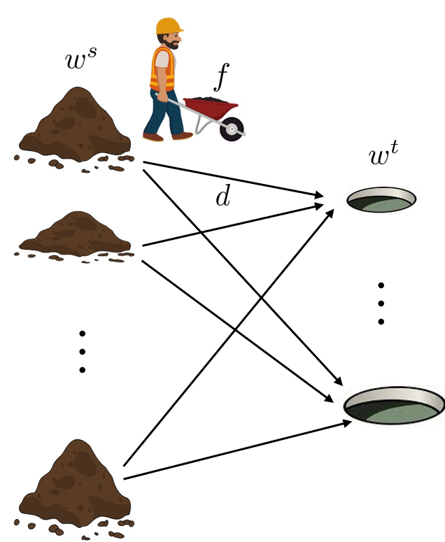

我们需要将左侧的土堆推到右边的坑中。左侧每个土堆的即某种属性的占比；右侧每个坑的容量则是另一个样本中的某个属性的占比。一个土堆到一个坑之间的距离可以理解为两个属性的特征向量的距离。总的距离就是最小的运输代价：
$$
\begin{aligned}
\begin{aligned}\min_{f_{ij}}\end{aligned}& \begin{aligned}\sum_{i=1}^m\sum_{j=1}^nf_{ij}d_{ij}\end{aligned}  \\
\text{s.t.}& \begin{aligned}f_{ij}\geq0,\quad1\leq i\leq m,1\leq j\leq n,\end{aligned}  \\
&\begin{aligned}\sum_{j=1}^nf_{ij}\le w_i^s,\quad1\le i\le m,\end{aligned} \\
&\begin{aligned}\sum_{i=1}^mf_{ij}\leq w_j^t,\quad1\leq j\leq n,\end{aligned} \\
&\begin{aligned}\sum_{i=1}^m\sum_{j=1}^nf_{ij}=\min(\sum_{i=1}^mw_i^s,\sum_{j=1}^nw_j^t).\end{aligned}
\end{aligned}
$$

## Application of distance
### Retrieval
检索问题，在以图搜图等应用中会用到。比如下面的图希望找到最接近五角星的一个样本。
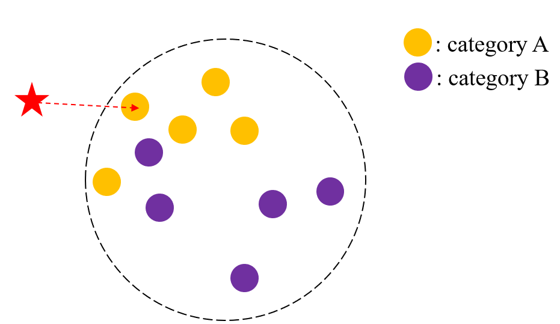

### Classification: KNN
KNN 即找到离目标样本点最近的 $k$ 个样本点，然后判断目标样本点属于哪一类。
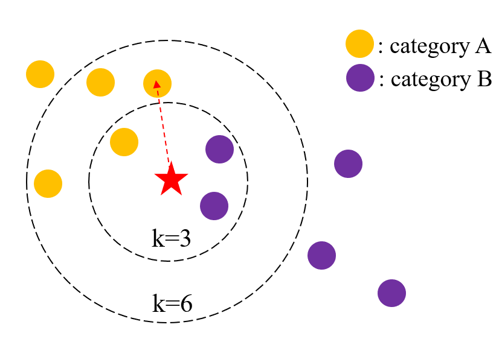

### Verification
判断两个样本点是否属于同一个种类。可以应用于人脸识别，比如判断两个样本点之间的距离是否会大于某个阈值。
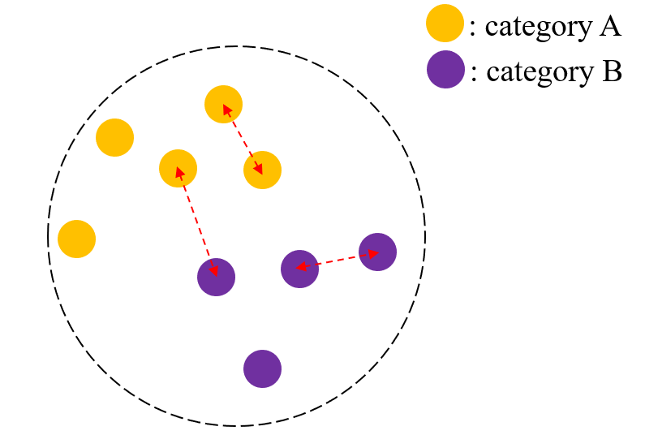

### Outlier detection
找到 outlier。可以对于每个样本，计算离它最近的其他样本的距离。
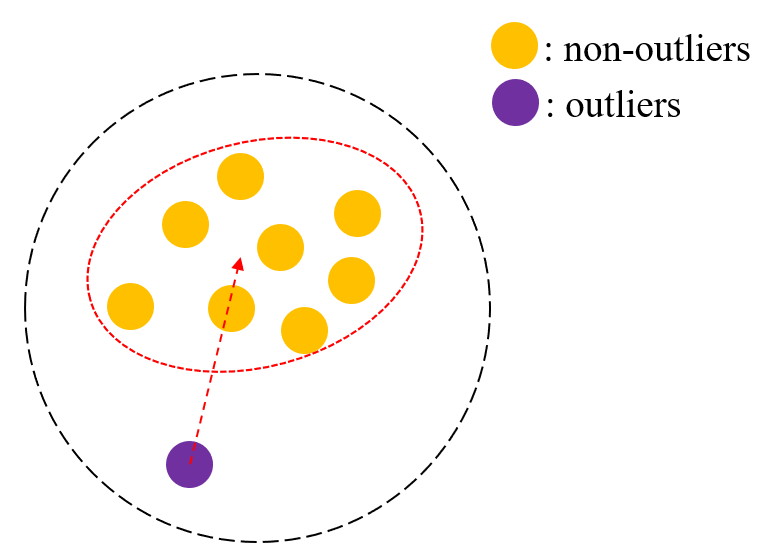

## Distance between two distributions
想要计算两个分布之间的距离，可以先得到概率分布，然后计算概率分布的距离。
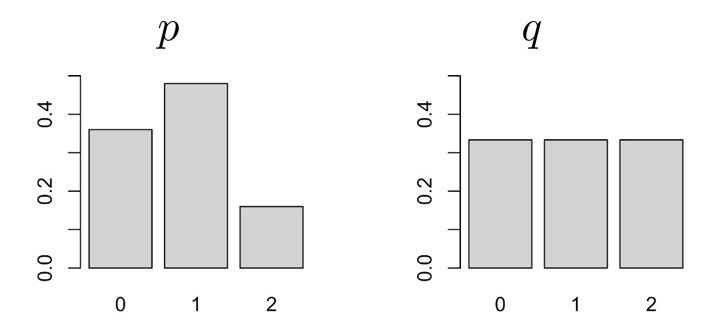

* Canberra distance: $d(\mathbf{p},\mathbf{q})=\sum_{i=1}^d\frac{|p_i-q_i|}{p_i+q_i}$
* Chi-Square distance: $d(\mathbf{p},\mathbf{q})=\sum_{i=1}^d\frac{(p_i-q_i)^2}{p_i}$
* Intersection between two histograms: $d(\mathbf{p},\mathbf{q})=\sum_{i=1}^d\min(p_i,q_i)$

但是使用概率分布进行距离度量是比较粗糙的度量方式，忽略了 $x_i,x_j$ 两两样本之间的关系。

### Maximum Mean Discrepancy (MMD)
计算两个数据分布中心的欧氏距离。同样是比较粗糙的距离度量方式。
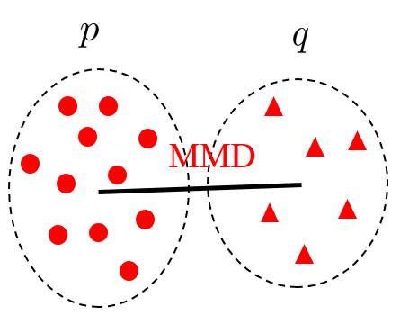

$$
D_{MMD}=[\sum_{i}x_{i}p(x_{i})-\sum_{i}x_{i}q(x_{i})]^{2}
$$

### Kullback-Leibler(KL) divergence
$$
\begin{aligned}
D_{KL}(p|q)& =\sum_ip(x_i)\log\frac{p(x_i)}{q(x_i)}  \\
&\begin{aligned}&=-\sum_ip(x_i)\log q(y_i)+\sum_ip(x_i)\log p(x_i)\end{aligned} \\
&=H(p,q)-H(p)
\end{aligned}
$$

上式中 $H(p,q)$ 表示 $p,q$ 之间的交叉熵，$H(p)$ 为样本 $p$ 的熵。

但是 KL divergence 是不对称的，即 $d(p,q)\neq d(p,q)$，因此衍生出了一些解决不对称问题的度量方式。

* Jeffrey divergence
$$
\begin{aligned}
D_{JD}& \begin{aligned}=D_{KL}(p||q)+D_{KL}(q||p)\end{aligned}  \\
&\begin{aligned}=\sum_ip(x_i)\log\frac{p(x_i)}{q(x_i)}+\sum_iq(x_i)\log\frac{q(x_i)}{p(x_i)}\end{aligned}
\end{aligned}
$$
* Jensen-Shannon(JS) divergence
$$
\begin{aligned}
D_{JD}& \begin{aligned}=\frac{1}{2}D_{KL}\left(p||\frac{1}{2}(p+q)\right)+\frac{1}{2}D_{KL}\left(q||\frac{1}{2}(p+q)\right)\end{aligned}  \\
&\begin{aligned}&=\sum_i\frac{1}{2}p(x_i)\log\frac{p(x_i)}{\frac{1}{2}(p(x_i)+q(x_i))}+\frac{1}{2}\sum_iq(x_i)\log\frac{q(x_i)}{\frac{1}{2}(p(x_i)+q(x_i))}\end{aligned}
\end{aligned}
$$

### Bregman divergence
这是一个广义的距离度量方式，可以通过修改参数 $\varphi$ 来变成其他的距离度量方式。
$$
\begin{aligned}
&\mathbf{p}=[p(x_{1}),p(x_{2}),\ldots,p(x_{n})] \\
&\mathbf{q}=[q(x_1),q(x_2),\ldots,q(x_n)] \\
&D_\varphi(p,q)=\varphi(\mathbf{p})-\varphi(\mathbf{q})-(\mathbf{p}-\mathbf{q})^T\nabla\varphi(\mathbf{q}) \\
\end{aligned}
$$

#### Example
比如 $\varphi(\mathbf{z})=\frac{1}{2}\mathbf{z}^{\mathrm{T}}\mathbf{z}$ 时，
$$
\begin{aligned}
D_\varphi(\mathbf{p},\mathbf{q})~&=\varphi(\mathbf{p})-\varphi(\mathbf{q})-(\mathbf{p}-\mathbf{q})^T\nabla\varphi(\mathbf{q}) \\
&= \frac{1}{2} \left\| \mathbf{p}-\mathbf{q} \right\|_{}^{2}
\end{aligned}
$$

变成欧式距离。
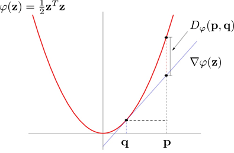

当 $\varphi(\mathbf{z})=\mathbf{z}^T\log\mathbf{z}$ 时，
$$
\begin{aligned}
D_\varphi(\mathbf{p},\mathbf{q})& =\varphi(\mathbf{p})-\varphi(\mathbf{q})-(\mathbf{p}-\mathbf{q})^T\nabla\varphi(\mathbf{q})  \\
&\begin{aligned}&=\sum_ip(x_i)\log\frac{p(x_i)}{q(x_i)}-\sum_ip(x_i)+\sum_iq(x_i)\end{aligned}
\end{aligned}
$$

得到的就是标准的 KL divergence。
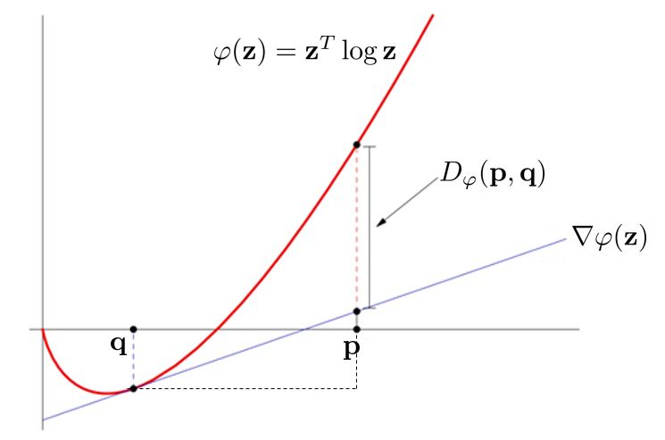

