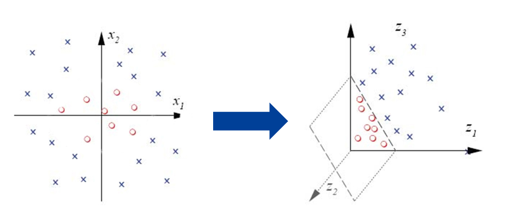
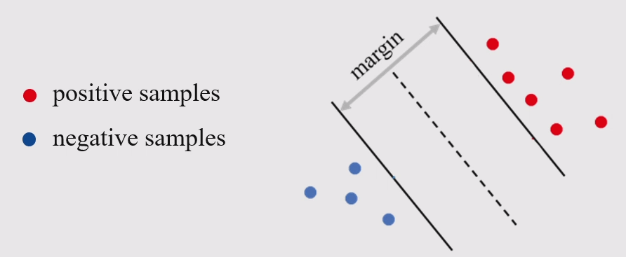
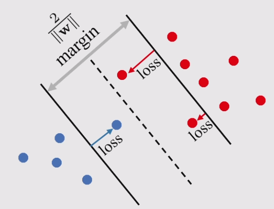
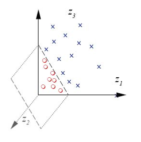

前面的特征降维是为了解决 overfitting 的问题，而 kernel trick 是为了提升维度，解决 underfitting 的问题。

比如下图中左侧，数据分布在二维空间中，此时无法使用线性分类器将数据分开；但是如果升维至右图所示三维空间，就能很容易的进行分类。

## Kernel SVM
### Linear SVM
#### Hard margin
$$
\begin{aligned}\min_{\mathbf{w},b}\quad&\frac{1}{2}\|\mathbf{w}\|^2\\\mathrm{s.t.}\quad&y_i(\mathbf{w}^T\mathbf{x}_i+b)\geq1,\quad\forall i.\end{aligned}
$$

下图中三条线的方程为：$\mathbf{w}^T\mathbf{x}+b=-1, \mathbf{w}^T\mathbf{x}+b=0, \mathbf{w}^T\mathbf{x}+b=1$。优化的目标是希望图中 margin 最大化。

#### Soft margin
有些时候数据并不适合或者并不能被完美的分开，此时就需要引入 soft margin。
$$
\begin{aligned}
\min_{\mathbf{w},b,\xi_i}\quad &\frac12\|\mathbf{w}\|^2+C\sum_i\xi_i\\
\mathrm{s.t.}\quad &y_i(\mathbf{w}^T\mathbf{x}_i+b)\geq1-\xi_i,\quad\forall i,\\
&\xi_i\geq0,\quad\forall i.
\end{aligned}
$$

如果式子中 $C\rightarrow \infty$，soft margin 就会重新退化到 hard margin。

### Non-linear SVM
使用升维函数 $\phi$，将样本 $\mathbf{x}_i$ 替换为 $\phi(\mathbf{x}_i)$。
$$
\begin{aligned}\min_{\mathbf{w},b,\xi_i}\quad&\frac12\|\mathbf{w}\|^2+C\sum_i\xi_i\\\mathrm{s.t.}\quad&y_i(\mathbf{w}^T\phi(\mathbf{x}_i)+b)\geq1-\xi_i,\quad\forall i,\\&\xi_i\geq0,\quad\forall i.\end{aligned}
$$

#### Elevate to finite dimension
可以手工设计升维函数，比如：
$$
\phi(\mathbf{x})=\phi([x_1,x_2])=[1, x_1, x_2, x_1x_2, x_1^{2}, x_2^{2}]
$$

可以看出转换后的式子中含有 $0$ 阶项，$1$ 阶项，$2$ 阶项，所以升维函数设计的自由度是非常高的。

#### Elevate to infinite dimension
在应用中用的都是一些常见的转换函数。同时很多 $\phi(\mathbf{x})$ 没有显示的形式，而是使用 $K(\mathbf{x},\mathbf{y})=\phi(\mathbf{x})^{\mathrm{T}}\phi(\mathbf{y})$ 来表示。
* Linear Kernel: $K(\mathbf{x},\mathbf{y})=\mathbf{x}^{\mathrm{T}}\mathbf{y}$ (即没有变化)
* Polynomial kernel: $K(\mathbf{x},\mathbf{y})=(\mathbf{x}^T\mathbf{y}+c)^d$
* Gaussian kernel (RBF kernel): $K(\mathbf{x},\mathbf{y})=\exp(\displaystyle -\frac{\|\mathbf{x}-\mathbf{y}\|^2}{2\sigma^2})$
* Sigmoid kernel: $K(\mathbf{x},\mathbf{y})=\tanh(\alpha \mathbf{x}^{\mathrm{T}}\mathbf{y}+c)$
* Inverse multi-quadratic kernel: $K(\mathbf{x},\mathbf{y})=\displaystyle \frac{1}{\sqrt{\left\| \mathbf{x}-\mathbf{y} \right\|_{} 2 \sigma^{2}+c^{2}}}$

### Dual form of SVM
支持向量机的具体推导可以参考[文章](https://zhuxz0299.github.io/posts/5f9d1835.html)，此处仅做求解。

Primal form：
$$
\begin{aligned}\min_{\mathbf{w},b,\xi_i}\quad&\frac12\|\mathbf{w}\|^2+C\sum_i\xi_i\\\mathrm{s.t.}\quad&y_i(\mathbf{w}^T\phi(\mathbf{x}_i)+b)\geq1-\xi_i,\quad\forall i,\\&\xi_i\geq0,\quad\forall i.\end{aligned}
$$

写出拉格朗日方程
$$
\mathcal{L}_{\mathbf{w},b,\xi_i}=\frac12\|\mathbf{w}\|^2+C\sum_i\xi_i-\sum_i\alpha_i\left(y_i(\mathbf{w}^T\phi(\mathbf{x}_i)+b)-1+\xi_i\right)-\sum_i\beta_i\xi_i
$$

对自变量求导并带入
$$
\begin{aligned}\frac{\partial\mathcal{L}}{\partial\mathbf{w}}&=\mathbf{w}-\sum_i\alpha_iy_i\phi(\mathbf{x}_i)=\mathbf{0}\quad\Rightarrow\quad\mathbf{w}=\sum_i\alpha_iy_i\phi(\mathbf{x}_i)\\
\frac{\partial\mathcal{L}}{\partial b}&=-\sum_i\alpha_iy_i=0\quad \Rightarrow \quad\sum_i\alpha_iy_i=0\\
\frac{\partial\mathcal{L}}{\partial\xi_i}&=C-\alpha_i-\beta_i=0\quad \Rightarrow \quad\alpha_i+\beta_i=C\end{aligned}
$$

得到对偶问题
$$
\begin{aligned}\min_{\alpha_i}&\quad\frac{1}{2}\sum_i\sum_j\alpha_i\alpha_jy_iy_jK(\mathbf{x}_i,\mathbf{x}_j)-\sum_i\alpha_i \quad(K(\mathbf{x}_i,\mathbf{x}_j)=\phi(\mathbf{x}_i)^T\phi(\mathbf{x}_j))\\
\text{s.t.}&\quad\sum_i\alpha_iy_i=0,\\
&\quad0\leq\alpha_i\leq C,\quad\forall i.\end{aligned}
$$

## Kernel trick for other machine learning models
Kernel in logistic regression:
$$
\min_{\mathbf{w},b}\sum_j\frac1{1+\exp^{y_j(\mathbf{w}^T\phi(\mathbf{x}_j)+b)}}
$$

利用 representation theorem $\mathbf{w}=\sum_{i}\alpha_i \phi(\mathbf{x}_i)$，得到
$$
\begin{aligned}
\min_{\alpha_i}\sum_j\frac1{1+\exp^{y_j(\sum_i\alpha_i{K(\mathbf{x}_i,\mathbf{x_j})}+b)}}
\end{aligned}
$$

上面的 representation theorem 指的是分类器 $\mathbf{w}$ 是可以由一组向量 $\phi(x_i)$ 作为基底线性组合而成。对于很多不使用拉格朗日展开式进行计算的机器学习模型，为简单起见，可以直接用 representation theorem，把线性变成非线性。

## Kernel properties
* Symmetry
    $$
    K(\mathbf{x},\mathbf{y})=K(\mathbf{y},\mathbf{x})
    $$

* Cauchy-Schwarz Inequality
    $$
    K(\mathbf{x},\mathbf{y})^2\leq K(\mathbf{x},\mathbf{x})K(\mathbf{y},\mathbf{y})
    $$

    $$
    K(\mathbf x,\mathbf y)^2=(\mathbf x^T\mathbf y)^2\leq\|\mathbf x\|^2\|\mathbf y\|^2=(\mathbf x^T\mathbf x)(\mathbf y^T\mathbf y)=K(\mathbf x,\mathbf x)K(\mathbf y,\mathbf y)
    $$

* Closure property
    $$
    K(\mathbf{x},\mathbf{y})=c\cdot K_1(\mathbf{x},\mathbf{y})
    $$

    $$
    K(\mathbf{x},\mathbf{y})=c+K_1(\mathbf{x},\mathbf{y})
    $$

    $$
    K(\mathbf{x},\mathbf{y})=K_1(\mathbf{x},\mathbf{y})+K_2(\mathbf{x},\mathbf{y})
    $$

    $$
    K(\mathbf{x},\mathbf{y})=K_1(\mathbf{x},\mathbf{y})\cdot K_2(\mathbf{x},\mathbf{y})
    $$
