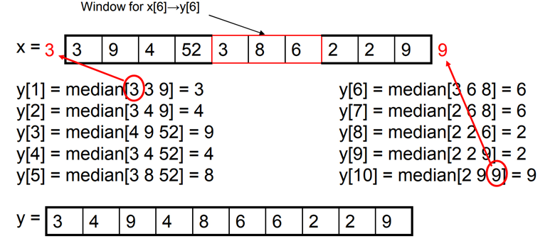
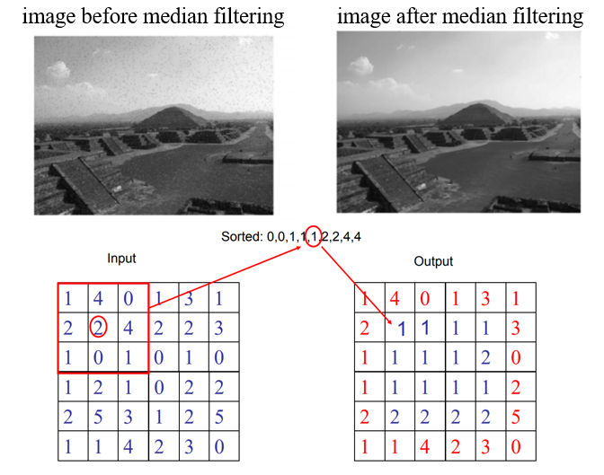
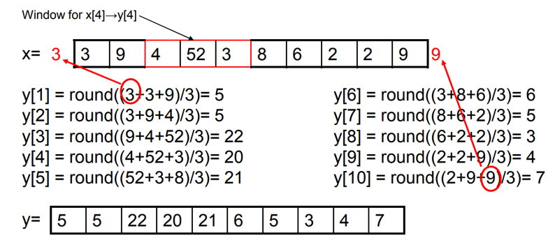
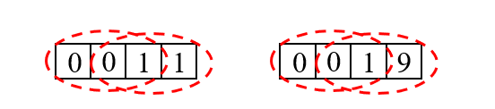
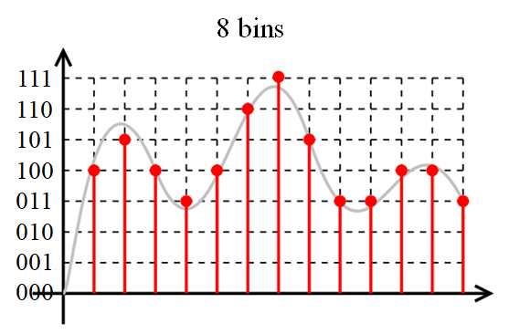
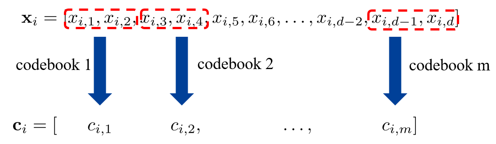
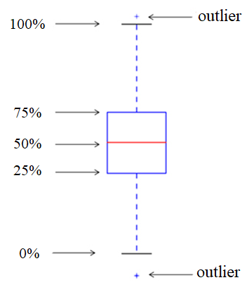
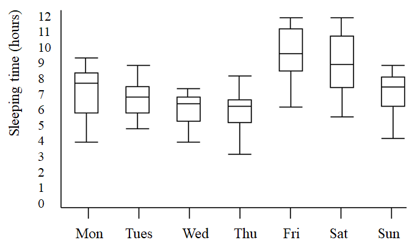
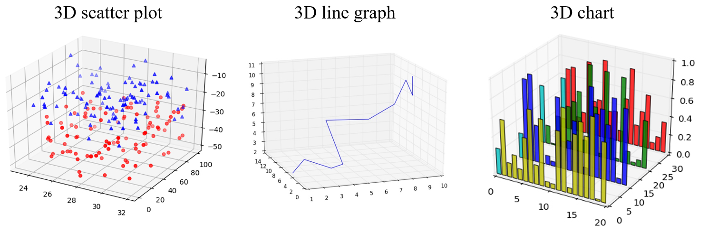

## Data Preprocessing
### Smooth data
数据平滑，来去除一些噪音。首先考虑序列，然后再考虑二维情况。
#### Median filter
在序列中取一个滑动窗口，让窗口中间的数字取中值。对于边界窗口可能会越出序列边界的问题，这个时候可以做填充(padding)，可以直接取 $0$ 或者复制边界的数字。

下图为图片的 median filter，这里没有做 padding，而是直接保留了边界的数值。

#### Mean filter
和 median filter 类似，只是取均值。同样也有 padding 的操作。

Mean filter 还可以拓展为 Gaussian filter。一个点的计算写成一般形式，为：
$$
\sum_{i=1}^{K} \lambda_i x_i
$$

在 Mean filter 中 $\displaystyle \lambda_i=\frac{1}{K}$，而如果 $\lambda_i$ 满足高斯分布，那就可以成为 Gaussian filter。

#### Pros and Cons
* Median filter
  * 优点：能比较好的保存边缘(指图片中的边缘)；同时对 outlier 不太敏感
  * 缺点：计算速度慢；不平滑(unsmooth)，和保存边缘是一体两面
* Mean filter
  * 优点：快速，平滑
  * 缺点：边缘模糊；对 outlier 敏感

比如对于下图，使用 median filter 之后，第一个序列中间的 $0, 1$ 处理完之后还是 $0, 1$，保留了中间的分界线，因此称为能够保存边缘。

### Remove outliers
两种情况：一种是只有一堆数据，需要自行判断哪些是 outlier；还有一种是已经标出了 outlier，然后需要判断新的点是否是 outlier
* 基于统计的方法(Statistical method)
  * 使用一个模型来拟合所有的数据(比如说使用高斯分布)
  * 使用两个模型，分别来拟合 non-outlier 和 outlier，然后判断新的点更加符合哪个分布
* 基于距离度量的方法(Distance based methods)
  * 对于一个样本，考虑它的 neighborhood，如果由很多个样本，那么应该是 non-outlier，反之应该是 outlier。
  * 对一个样本，找到最近的 neighbor
* 基于学习的方法(Learning based method)
  * 做聚类，最小的 cluster 可能就是 outlier
  * 训练 one-class classifier (比如 one-class SVM，学习一个超平面，看能否把数据都包起来)
  * 二分类器(binary classifier)，这种情况是基于有标签的。但是这种情况下样本是不均衡的(outlier 的数量会小于 one-outlier)，所以可以考虑做一些平衡，比如 weighted binary SVM，对不同的样本赋不同的权重，即在优化 $\displaystyle \frac{1}{2}\left\| \mathbf{w} \right\|_{}^{2} + C \sum_{i}p_{i} \xi_{i}$ 时，对于比较少的类可以赋予比较大的权重 $p_{i}$。

### Fill in missing data
* 使用常数(比如说平均数)填充
* 使用其他已知的数据预测，需要拟合。

### Quantize data
可以理解为把连续的数据变成离散的数据，离散数据的离散程度就是量化的程度。

比如想要把一个连续的序列量化到 8 bins 的离散数据，如图所示：

随着 bins 的数量增大，量化的精度就越高。

这里形式化地表达 quantization：
* 有一系列数据 $\mathcal{X}= \left\{ \mathbf{x}_1,\mathbf{x}_2, \ldots ,\mathbf{x}_n \right\}$，其中每个数据都是 $d$ 维的：$\mathbf{x}_i=[ x_{i1},x_{i 2}, \ldots x_{id} ]$
* 接下来需要学习一个大小为 $k$ 的 codebook，这个 codebook 可以将样本 $\mathbf{x}_i$ 映射到量化之后的数据 ${c}_i \in [1, \ldots ,k]$。
* codebook 中有 $k$ 个 word，即为映射之后的值；每个 word 对应一个取值区间 (相当于一个 bin)，如果原数据在某个区间内，那么映射之后就会到对应的 word

codebook 可以直接对 $d$ 维空间做均匀切分，也可以通过聚类的方式得到。比如对数据做聚类之后得到 $k$ 个 cluster，这些 cluster 的中心作为 word；然后对于数据，离哪个中心最近，就可以映射到对应的 word。比如 $x_i$ 离第 $3$ 个中心最近，那么 $c_i=3$。编码长度 $L=\log_2 k$。

比如将 $n$ 个样本聚类分成 $8$ 个 cluster，那么就需要 $8$ 个离散的数值，使用二进制编码，则需要 $3$ 位。

#### Product Quantization
把特征向量切分成若干段，对每一段都学习一个 codebook。比如切分成 $m$ 段，那么就会有 $m$ 个 codebook，此时 $\mathbf{x}_i$ 映射得到的 $\mathbf{c}_i$ 就不是标量，而是一个长度为 $m$ 的向量。在极端情况下，$m=d$。

那么此时对于向量 $\mathbf{x}_i$，编码之后的编码长度就是 $L=\log_2 k \times m$

## Data Visualization
* Scatter plot (散点图，反映数量关系)
* Line graph (折线图，反应变化趋势)
* Chart 
  * Bar chart (柱状图)
  * Stacked bar chart
  * Pie chart (饼图)
  * Radial chart
* Box plot
* High-dimension

### Box plot

图中标注的数字相当于数据在排序之后的百分位点。

比如说下图就可以直观地展示一周中每天学生地睡眠时间

### High dimension
#### 3D visualization

#### Beyond 3D Visualization
需要做数据降维，比如使用 t-SNE。 