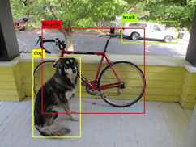
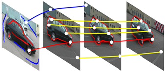
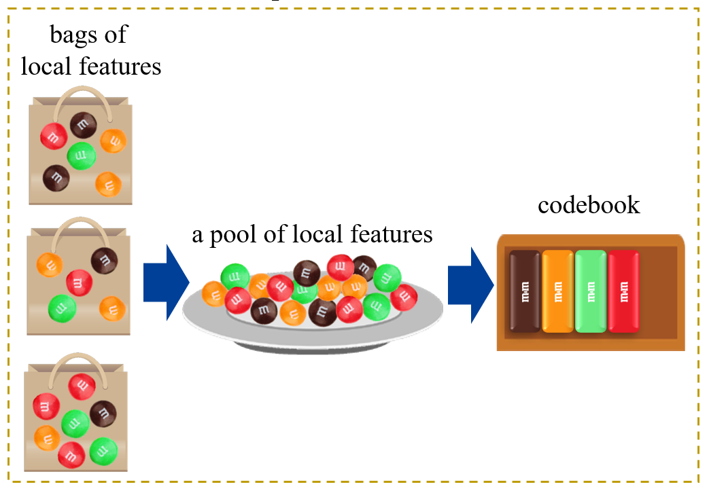
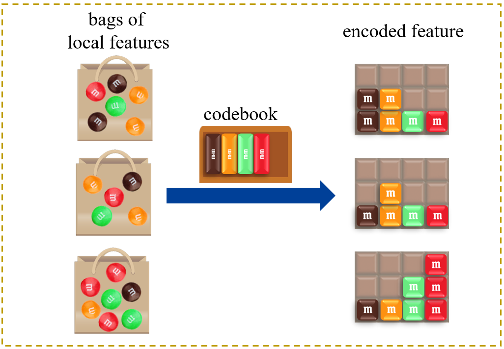
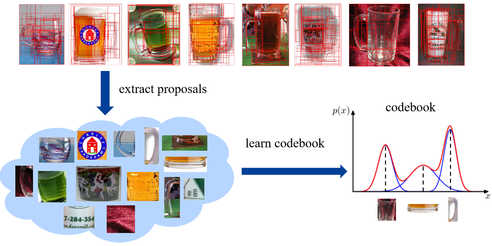
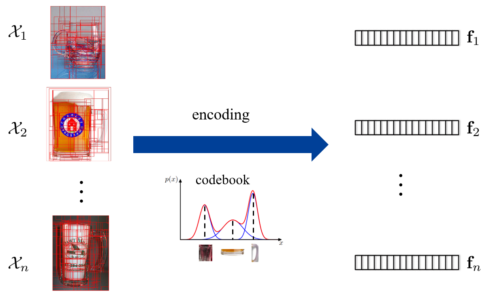
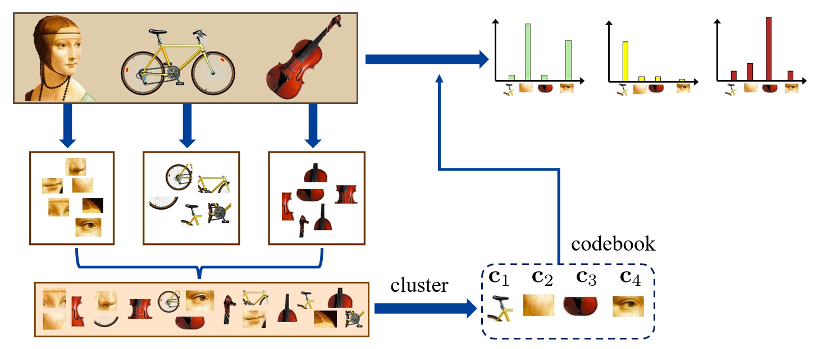
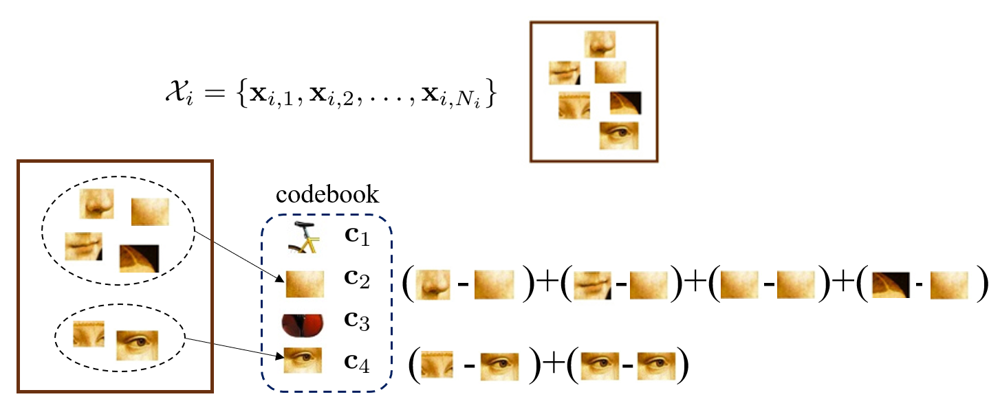

## Local Descriptor
在[之前的课程](https://zhuxz0299.github.io/posts/20a3e8df.html)中提到，每个图片都可以使用 SIFT 找到若干 key point，每个 key point 都有一个 local descriptor (feature)，表示邻域的特征。这里需要考虑如何把多个 local feature 聚合称为整张图片的 feature。

Local descriptor 的形式也较为多样。在下图中，一张图片可以识别出很多 object proposal，即一个个可能包含有物体的框。每一个 object proposal 的 feature 都可以作为一个 local descriptor。

或者一个视频可能会有很多轨迹 (trajectories)，即一个点从一个位置移动到另一个位置经过的路线。对于图片的一帧，可以找到很多关键点，那么我们通过追踪这些关键点，就能得到很多 trajectory。每个 trajectory 可以提取一个特征 (对一个点时间邻域内的像素做信息提取)。

## Feature Encoding
### Feature Encoding Step
需要使用一个 codebook，将一堆 local feature 整合成一个 feature vector。步骤为：
* 学习得到一个 codebook
  * 直观的理解，codebook 其实就是一些有代表性的 local feature
  * 比如使用 k-means 聚类，就能得到很多 cluster center，每个 cluster center 就可以作为 codebook 中的一个 word

* 基于学到的 codebook 将局部特征进行编码
  * 下图展现最简单的方法：统计一个 bag 的某一种 local feature 出现了多少次

#### Example 
比如说有一堆杯子，我们提取 object proposals，然后每个 proposal 得到一个 feature，最后学习到一个 codebook。在本例子中，可以认为是通过聚类得到了三个 cluster center，分别是被子的杯身、杯底和把手这三个有代表性的特征。

然后使用 codebook 对每张杯子图片的 local feature 进行 encoding。

### Feature Encoding Methods
* Encode 0-order information 
  * e.g, bag-of-word (BOW)
* Encode 1-order information
  * e.g., Vector of Locally Aggregated Descriptors (VLAD)
* Encode 2-order information
  * e.g., Fisher vector

以上分别是编码零阶、一阶、二阶信息的方法。信息越高价，方式越复杂，但是效果也越好。

#### Bag-of-word (BOW)
以图片为例。
* 每张图片得到一些 local descriptor
* 然后将所有图片的 local descriptor 放到一起，做 cluster，cluster center 的数量即为 codebook 中 word 的数量。在下图中，共有 $\mathbf{c}_1,\mathbf{c}_2,\mathbf{c}_3,\mathbf{c}_4$ 这四个 word。
* 最后是统计 word 在图片的 local descriptor 中的频率。

形式化地，有
$$
\begin{aligned}
\mathcal{X}_i=\{\mathbf{x}_{i,1},\mathbf{x}_{i,2},\ldots,\mathbf{x}_{i,N_i}\}&\xrightarrow{\mathcal{C}=\{\mathbf{c}_1,\mathbf{c}_2,\ldots,\mathbf{c}_K\}}&\mathbf{h}_i=[h_{i,1};h_{i,2};\ldots;h_{i,K}]
\end{aligned}
$$

$\mathcal{X}_i$ 代表了第 $i$ 张图片，$\mathbf{x}_{i,1}$ 代表了第 $i$ 张图片的第 $1$ 个 local descriptor，$\mathbf{c}_1$ 为 codebook 的第一个 word，$h_{i,1}$ 为第 $i$ 张图片第一个 word 的频率。

#### Vector of Locally Aggregated Descriptors (VLAD)
该方法得到 codebook 的方式和 BOW 相同，但是在 feature encoding 的部分还编码了一阶信息
* 每张图片得到一些 local descriptor
* 然后将所有图片的 local descriptor 放到一起，做 cluster，cluster center 的数量即为 codebook 中 word 的数量。在下图中，共有 $\mathbf{c}_1,\mathbf{c}_2,\mathbf{c}_3,\mathbf{c}_4$ 这四个 word。
* 对于某个 local descriptor $\mathbf{x}_{i,j}$，将其归类到第 $k$ 个 word 中，用 $c(\mathbf{x}_{i,j})=k$ 表示
* 归类完成后，将 $\mathbf{x}_{i,j}$ 与 $\mathbf{c}_{k}$ 做差。从而第 $k$ 个单词可以得到
$$
\mathbf{v}_{i,k} = \sum_{j=1}^{N_i} \delta(c(\mathbf{x}_{i,j})=k)(\mathbf{x}_{i,j}-c_{k})
$$
* 最后得到 $\mathbf{v}_i=[\mathbf{v}_{i,1}; \mathbf{v}_{i,2};\cdots; \mathbf{v}_{i,K}]$，即为总的特征向量。

VLAD 是一种比较实用的方法，效果比 BOW 好，同时又不会比 Fisher vector 差太多。

#### Fisher Vector
引入二阶信息(标准差，方差等)

首先引入高斯混合模型 (GMM)：
$\boldsymbol{\theta}=\{\pi_1,\boldsymbol{\mu}_1,\boldsymbol{\sigma}_1;\ldots;\pi_K,\boldsymbol{\mu}_K,\boldsymbol{\sigma}_K\}$ 为 GMM 的参数。然后可以得到
$$
p(x_1,x_2,\ldots,x_N|\theta)=\prod_{i=1}^Np(x_i|\boldsymbol{\theta})
$$

其中
$$
p(x_{i}|\boldsymbol{\theta}) =\sum_{k=1}^{K}p(x_{i}|\theta_{k})p(\theta_{k}) =\sum_{k=1}^{K}p(x_{i}|\mu_{k},\sigma_{k})\pi_{k}
$$

Fisher vector 的形式化描述为：
$$
\mathcal{F}_{\boldsymbol{\theta}}^{\mathcal{X}_i}=\frac1{N_i}\sum_{j=1}^{N_i}\nabla_{\boldsymbol{\theta}}\log p(\mathbf{x}_{i,j};\boldsymbol{\theta})
$$

其中 $\mathbf{x}_{i,j}$ 就是第 $i$ 个样本的第 $j$ 个 local descriptor。然后将 $p()$ 函数带入，求导得到：
$$
\begin{aligned}
&\mathcal{F}_{\boldsymbol{\mu},k}^{\mathcal{X}_i}=\frac{1}{N_i\sqrt{\pi_k}}\sum_{j=1}^{N_i}\gamma_{i,j}(k)(\frac{\mathbf{x}_{i,j}-\boldsymbol{\mu}_k}{\boldsymbol{\sigma}_k})\\
&\mathcal{F}_{\boldsymbol{\sigma},k}^{\mathcal{X}_i}=\frac{1}{N_i\sqrt{2\pi_k}}\sum_{j=1}^{N_i}\gamma_{i,j}(k)[(\frac{(\mathbf{x}_{i,j}-\boldsymbol{\mu}_k)^2}{\boldsymbol{\sigma}_k^2})-1]
\end{aligned}
$$

其中 
$$
\gamma_{i,j}(k)=\frac{\pi_k\mathcal{N}(\mathbf{x}_{i,j};\boldsymbol{\mu}_k,\boldsymbol{\sigma}_k)}{\sum_{\tilde{k}=1}^K\pi_{\tilde{k}}\mathcal{N}(\mathbf{x}_{i,j};\boldsymbol{\mu}_{\tilde{k}},\boldsymbol{\sigma}_{\tilde{k}})}
$$

最后得到 $2Kd$ 维 ($d$ 为 local descriptor 的维度) 的 Fihser vector：
$$
[\mathcal{F}_{\boldsymbol{\mu},1},\mathcal{F}_{\boldsymbol{\sigma},1};\mathcal{F}_{\boldsymbol{\mu},2},\mathcal{F}_{\boldsymbol{\sigma},2};\ldots;\mathcal{F}_{\boldsymbol{\mu},K},\mathcal{F}_{\boldsymbol{\sigma},K}]
$$

式中 $\mathcal{F}_{\boldsymbol{\mu},i}$ 为一阶信息，$\mathcal{F}_{\boldsymbol{\sigma},i}$ 为二阶信息。

